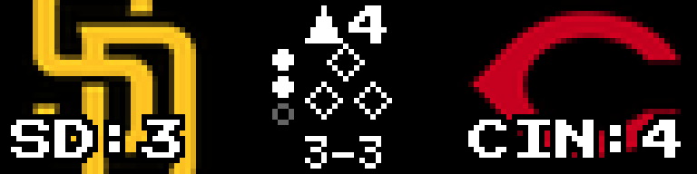
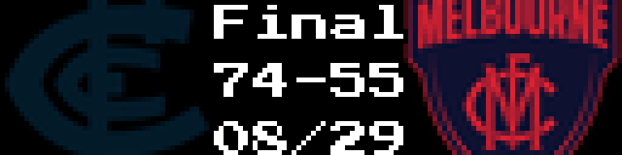
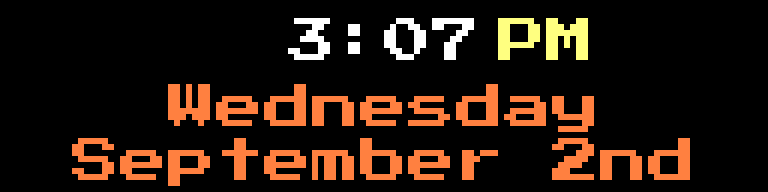
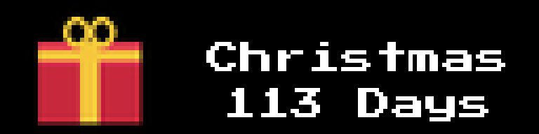

# LEDMatrix Official Plugins

[](./plugins.json)
[](LICENSE)
[](https://discord.gg/RdrC37rEag)
[](https://github.com/ChuckBuilds/ledmatrix-plugins)

> Official plugin repository for [LEDMatrix](https://github.com/ChuckBuilds/LEDMatrix) &middot; [Installation](#quick-install) &middot; [Plugins](#available-plugins) &middot; [Development](#3rd-party-plugin-development) &middot; [Support](#support--community)

---

## See it in action

<table>
  <tr>
    <td align="center">
      <a href="./plugins/football-scoreboard/">
        
        <br /><sub><b>Football</b></sub>
      </a>
    </td>
    <td align="center">
      <a href="./plugins/hockey-scoreboard/">
        
        <br /><sub><b>Hockey</b></sub>
      </a>
    </td>
  </tr>
  <tr>
    <td align="center">
      <a href="./plugins/ledmatrix-weather/">
        
        <br /><sub><b>Weather</b></sub>
      </a>
    </td>
    <td align="center">
      <a href="./plugins/ledmatrix-music/">
        
        <br /><sub><b>Music</b></sub>
      </a>
    </td>
  </tr>
  <tr>
    <td align="center">
      <a href="./plugins/christmas-countdown/">
        
        <br /><sub><b>Christmas Countdown</b></sub>
      </a>
    </td>
    <td align="center">
      <a href="./plugins/football-scoreboard/">
        
        <br /><sub><b>Football Scoreboard</b></sub>
      </a>
    </td>
  </tr>
</table>

> Each plugin links to its own README with more screenshots and configuration details.

---

## Quick Install

**Web Interface (Recommended):**
1. Open `http://your-pi-ip:5000`
2. Open the **Plugin Manager** tab
3. Find the plugin you want in the **Plugin Store** section and click
   **Install**

**API:**
```bash
curl -X POST http://your-pi-ip:5000/api/v3/plugins/install \
  -H "Content-Type: application/json" \
  -d '{"plugin_id": "football-scoreboard"}'
```

---

## Available Plugins

### Sports (17)

| Plugin | Description | Preview |
|--------|-------------|---------|
| [Football Scoreboard](./plugins/football-scoreboard/) | NFL & NCAA Football live scores, down/distance, possession | |
| [Hockey Scoreboard](./plugins/hockey-scoreboard/) | NHL & NCAA Hockey live scores and schedules | |
| [Basketball Scoreboard](./plugins/basketball-scoreboard/) | NBA, NCAA & WNBA live scores and schedules | |
| [Baseball Scoreboard](./plugins/baseball-scoreboard/) | MLB, MiLB & NCAA Baseball live scores | <a href="./plugins/baseball-scoreboard/"></a> |
| [Soccer Scoreboard](./plugins/soccer-scoreboard/) | Premier League, La Liga, Bundesliga, Serie A, Ligue 1, MLS | |
| [Lacrosse Scoreboard](./plugins/lacrosse-scoreboard/) | NCAA lacrosse live scores and schedules | |
| [Cricket Scoreboard](./plugins/cricket-scoreboard/) | Live, recent & upcoming international (Test/ODI/T20I) and major domestic cricket | |
| [AFL Scoreboard](./plugins/afl-scoreboard/) | Australian Football League live, recent & upcoming games | <a href="./plugins/afl-scoreboard/"></a> |
| [NRL Scoreboard](./plugins/nrl-scoreboard/) | National Rugby League live, recent & upcoming games | |
| [F1 Scoreboard](./plugins/f1-scoreboard/) | Formula 1 race results, schedules, and standings | |
| [UFC Scoreboard](./plugins/ufc-scoreboard/) | UFC/MMA live fights, fighter headshots, records, odds & results &mdash; *by [LegoGuy1000](https://github.com/legoguy1000)* | |
| [Masters Tournament](./plugins/masters-tournament/) | Live Masters golf leaderboard, hole tracking, player cards | |
| [March Madness](./plugins/march-madness/) | NCAA tournament bracket tracker with round branding and live scores | |
| [NFL Draft](./plugins/nfl-draft/) | Projected & live NFL draft picks from ESPN | |
| [Odds Ticker](./plugins/odds-ticker/) | Betting odds & lines across NFL, NBA, MLB, NHL, NCAA | |
| [Sports Leaderboard](./plugins/ledmatrix-leaderboard/) | League standings, rankings, conference records | |
| [Olympics Countdown](./plugins/olympics/) | Countdown to next Olympics with live medal counts | |

### Financial (2)

| Plugin | Description | Preview |
|--------|-------------|---------|
| [Stocks Ticker](./plugins/ledmatrix-stocks/) | Real-time stock & crypto prices with charts | |
| [Stock News](./plugins/stock-news/) | Financial headlines from RSS feeds | |

### Time & Calendar (4)

| Plugin | Description | Preview |
|--------|-------------|---------|
| [Simple Clock](./plugins/clock-simple/) | Time and date display | <a href="./plugins/clock-simple/"></a> |
| [7-Segment Clock](./plugins/7-segment-clock/) | Retro-style 7-segment clock with customizable colors | <a href="./plugins/7-segment-clock/"></a> |
| [Google Calendar](./plugins/calendar/) | Upcoming events from Google Calendar | |
| [Geochron World Clock](./plugins/geochron/) | World map with the real-time day/night terminator | |

### Weather (2)

| Plugin | Description | Preview |
|--------|-------------|---------|
| [Weather Display](./plugins/ledmatrix-weather/) | Current conditions, hourly & daily forecasts (Open-Meteo) | |
| [Tide Display](./plugins/tide-display/) | Coastal tides with animated wave level, schedule & 24-hour chart (NOAA) | |

### Media (2)

| Plugin | Description | Preview |
|--------|-------------|---------|
| [Music Player](./plugins/ledmatrix-music/) | Now playing with album art (Spotify & YouTube Music) | |
| [Static Image Display](./plugins/static-image/) | Image display with scaling and transparency | |

### Content (2)

| Plugin | Description | Preview |
|--------|-------------|---------|
| [News Ticker](./plugins/news/) | RSS news headlines from ESPN, NCAA, custom sources | <a href="./plugins/news/"></a> |
| [Of The Day](./plugins/of-the-day/) | Daily quotes, Bible verses, word of the day | |

### Integrations (2)

| Plugin | Description | Preview |
|--------|-------------|---------|
| [MQTT Notifications](./plugins/mqtt-notifications/) | HomeAssistant notifications via MQTT | |
| [On Air Light](./plugins/on-air/) | Broadcast ON AIR tally light, triggered remotely via MQTT / Home Assistant | |

### Custom (3)

| Plugin | Description | Preview |
|--------|-------------|---------|
| [Flight Tracker](./plugins/ledmatrix-flights/) | Real-time ADS-B aircraft tracking with map display | |
| [Countdown Display](./plugins/countdown/) | Customizable countdowns for birthdays, events, holidays | <a href="./plugins/countdown/"></a> |
| [Election Results](./plugins/ledmatrix-elections/) | Live election results ticker with full-screen race interrupts | |

### Holiday (1)

| Plugin | Description | Preview |
|--------|-------------|---------|
| [Christmas Countdown](./plugins/christmas-countdown/) | Festive countdown with Christmas tree display | |

### Social (1)

| Plugin | Description | Preview |
|--------|-------------|---------|
| [YouTube Stats](./plugins/youtube-stats/) | Channel subscriber count, total views | |

### Text (1)

| Plugin | Description | Preview |
|--------|-------------|---------|
| [Scrolling Text](./plugins/text-display/) | Custom scrolling/static text with configurable fonts and colors | <a href="./plugins/text-display/"></a> |

### System (1)

| Plugin | Description | Preview |
|--------|-------------|---------|
| [Web UI Info](./plugins/web-ui-info/) | Displays web UI URL for device access | |

### Development (1)

| Plugin | Description | Preview |
|--------|-------------|---------|
| [Hello World](./plugins/hello-world/) | Plugin development example and starter template | |

---

## Community Contributors

LEDMatrix is open to community plugin contributions! The following plugins were built or contributed by community members:

| Plugin | Contributor | Contribution |
|--------|-------------|--------------|
| [UFC Scoreboard](./plugins/ufc-scoreboard/) | [@LegoGuy1000](https://github.com/legoguy1000) | Original UFC/MMA implementation ([PR #137](https://github.com/ChuckBuilds/LEDMatrix/pull/137)) |

### Third-party plugins in the registry

The plugin store also aggregates plugins hosted in their own repositories. These
carry a **Custom** badge in the web UI and are installed the same way. They live
outside this monorepo, so review their source before installing.

| Plugin | Author | Repository |
|--------|--------|------------|
| GIF Player | [@ant456](https://github.com/ant456) | [ledmatrix-gif-player](https://github.com/ant456/ledmatrix-gif-player) — animated GIFs with an upload portal |
| PGA Tour Leaderboard | [@sarjent](https://github.com/sarjent) | [ledmatrix-golf](https://github.com/sarjent/ledmatrix-golf) — PGA Tour leaderboard via ESPN |
| Plex Marquee | [@ant456](https://github.com/ant456) | [ledmatrix-plex-marquee](https://github.com/ant456/ledmatrix-plex-marquee) — cinema marquee art via Fanart.tv |
| Dresden Departures | [@ryug0](https://github.com/ryug0) | [ledmatrix-dresden-departures](https://github.com/ryug0/ledmatrix-dresden-departures) — Dresden VVO departure board |
| Tidbyt Baseball Scoreboard | [@trsadler](https://github.com/trsadler) | [MLB-Scoreboard-LEDMatrix](https://github.com/trsadler/MLB-Scoreboard-LEDMatrix) — split team-color MLB live scoreboard |

Want to see your plugin here? Check out [3rd Party Plugin Development](#3rd-party-plugin-development) below or submit a plugin via [Discord](https://discord.gg/RdrC37rEag).

---

## Installation & Usage

### Plugin Store (Recommended)

The **Plugin Store** in the LEDMatrix web interface automatically fetches the latest plugins from this registry:
- Browse and search plugins
- One-click installation
- Automatic updates
- Configuration management

### Manual Installation

Clone this repository and copy the plugin you want into your LEDMatrix
installation's configured plugins directory (default `plugin-repos/`):

```bash
git clone https://github.com/ChuckBuilds/ledmatrix-plugins.git
cp -r ledmatrix-plugins/plugins/football-scoreboard /path/to/LEDMatrix/plugin-repos/
```

The directory name on the destination must match the plugin's `id` in
its `manifest.json`. Restart the LEDMatrix display service afterward
so the loader picks up the new plugin.

> **Note:** See individual plugin README files for detailed setup
> instructions and configuration.

---

## Installing 3rd Party Plugins

LEDMatrix supports installing plugins from any GitHub repository, not just this registry.

### Via Plugin Manager Tab

1. Open the LEDMatrix web interface (`http://your-pi-ip:5000`)
2. Navigate to **Plugin Manager** tab
3. Scroll to **"Install from GitHub"** section

### Single Plugin Installation

1. Enter the GitHub repository URL (e.g., `https://github.com/user/ledmatrix-my-plugin`)
2. Optionally specify a branch
3. Click **Install**

### Registry/Monorepo Installation

1. Enter a registry repository URL (e.g., `https://github.com/user/their-plugins`)
2. Click **Load Registry** to browse available plugins
3. Click **Install** on any plugin

### Important Notes

- 3rd party plugins show a **Custom** badge in the web UI
- Review plugin code before installing from untrusted sources
- Manual updates required unless the repository is saved

---

## For Maintainers

### Repository Structure

```
ledmatrix-plugins/
  plugins.json           # Plugin registry (auto-updated from manifests)
  update_registry.py     # Sync registry versions from local manifests
  plugins/
    football-scoreboard/ # Each plugin has its own directory
      manifest.json
      manager.py
      config_schema.json
      requirements.txt
      README.md
    hockey-scoreboard/
    ...
```

### Setup

Install the git pre-commit hook so `plugins.json` stays in sync automatically:

```bash
cp scripts/pre-commit .git/hooks/pre-commit
```

### Updating Plugin Versions

After making changes to a plugin:

1. Bump `version` in the plugin's `manifest.json`
2. Commit — the pre-commit hook automatically syncs `plugins.json`

```bash
# Manual alternative (if hook isn't installed):
python update_registry.py           # Update plugins.json
python update_registry.py --dry-run # Preview changes
```

---

## 3rd Party Plugin Development

### Required Files

Your plugin repository must contain:
- **`manifest.json`** — Plugin metadata (required)
- **Entry point file** — Python file with your plugin class (default: `manager.py`)
- **Plugin class** — Must inherit from `BasePlugin` and implement `update()` and `display()`

Optional but recommended:
- `requirements.txt` — Python dependencies
- `config_schema.json` — Configuration validation schema (JSON Schema Draft-7)
- `README.md` — User documentation

### Manifest Requirements

| Field | Type | Description |
|-------|------|-------------|
| `id` | string | Unique plugin identifier |
| `name` | string | Human-readable name |
| `class_name` | string | Plugin class name (must match class in entry point) |
| `display_modes` | array | Display mode names |

See the [manifest schema](https://github.com/ChuckBuilds/LEDMatrix/blob/main/schema/manifest_schema.json) for complete field reference.

### Getting Started

1. Read the [Plugin Development Guide](./docs/plugin-development/) in this repo —
   anatomy, the core API, advanced features (live priority, dynamic duration,
   high-FPS scrolling, Vegas mode), styling/skins, adaptive layout, and the
   testing/CI workflow
2. Start with the [Hello World plugin](./plugins/hello-world/) as a template
3. Test without hardware: run the LEDMatrix dev preview server
   (`python3 scripts/dev_server.py` from the LEDMatrix repo, then open
   `http://localhost:5001`) — see
   [`docs/DEV_PREVIEW.md`](https://github.com/ChuckBuilds/LEDMatrix/blob/main/docs/DEV_PREVIEW.md).
   Or run the full display in emulator mode with
   `EMULATOR=true python3 run.py`.

### Submitting a Plugin

To add your plugin to the official registry:

1. Open an issue on this repository or reach out on [Discord](https://discord.gg/RdrC37rEag)
2. Include: repository URL, description, screenshots/video
3. After review, your plugin will be added to the registry

See [SUBMISSION.md](SUBMISSION.md) for full guidelines.

---

## License

GNU General Public License v3.0 — see [LICENSE](LICENSE) for details.

---

## Support & Community

- **Discord**: [Join the community](https://discord.gg/RdrC37rEag)
- **Issues**: [Report plugin issues](https://github.com/ChuckBuilds/ledmatrix-plugins/issues)
- **Security**: see [SECURITY.md](SECURITY.md) — please don't open
  public issues for vulnerabilities
- **Contributing**: see [CONTRIBUTING.md](CONTRIBUTING.md) for the dev
  setup and PR flow, or [SUBMISSION.md](SUBMISSION.md) for adding a
  brand-new plugin
- **LEDMatrix**: [Main repository](https://github.com/ChuckBuilds/LEDMatrix)

### Connect with ChuckBuilds

- **YouTube**: [@ChuckBuilds](https://www.youtube.com/@ChuckBuilds)
- **Instagram**: [@ChuckBuilds](https://www.instagram.com/ChuckBuilds/)
- **Support the Project**:
  - [GitHub Sponsorship](https://github.com/sponsors/ChuckBuilds)
  - [Buy Me a Coffee](https://buymeacoffee.com/chuckbuilds)
  - [Ko-fi](https://ko-fi.com/chuckbuilds/)

---

> **Note**: Plugins are actively developed. Report bugs or feature requests on the [issues page](https://github.com/ChuckBuilds/ledmatrix-plugins/issues).
