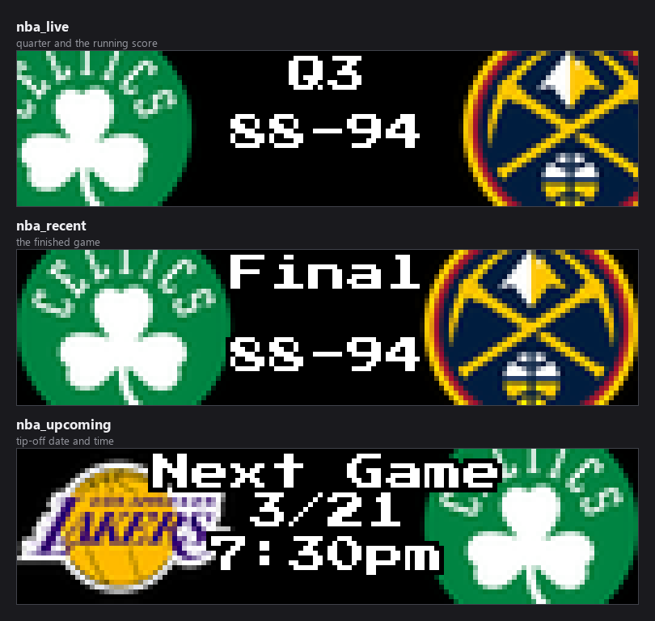
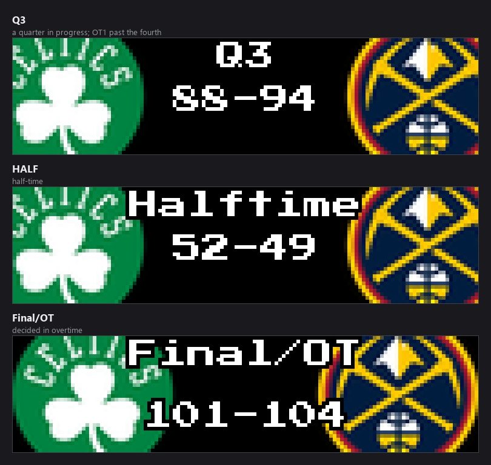
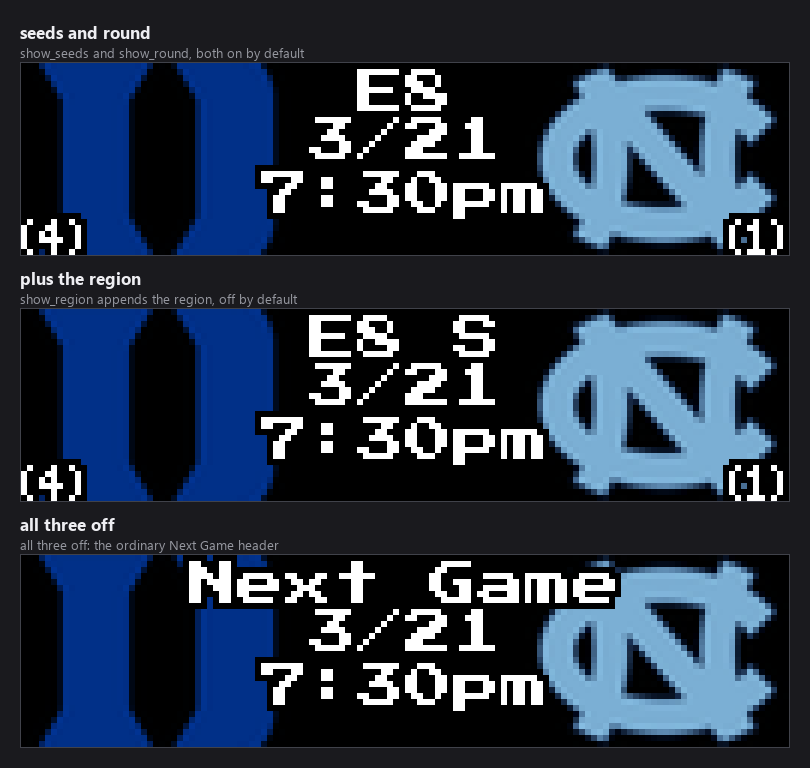
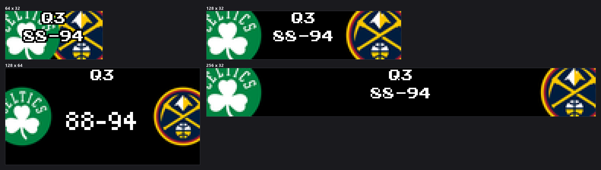
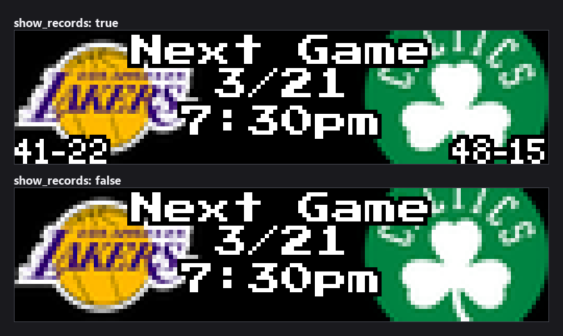

### Connect with ChuckBuilds

- Show support on YouTube: https://www.youtube.com/@ChuckBuilds
- Stay in touch on Instagram: https://www.instagram.com/ChuckBuilds/
- Want to chat or need support? Reach out on the ChuckBuilds Discord: https://discord.com/invite/uW36dVAtcT
- Feeling generous? Support the project:
  - GitHub Sponsors: https://github.com/sponsors/ChuckBuilds
  - Buy Me a Coffee: https://buymeacoffee.com/chuckbuilds
  - Ko-fi: https://ko-fi.com/chuckbuilds/

---

# Basketball Scoreboard

Live, recent, and upcoming games across the **NBA**, **WNBA**, **NCAA Men's**,
and **NCAA Women's** basketball on your LEDMatrix display, from ESPN's public
API. No API key required.


## Contents

- [Quick start](#quick-start)
- [Display modes](#display-modes)
- [The four leagues](#the-four-leagues)
- [March Madness](#march-madness)
- [How games are chosen](#how-games-are-chosen)
- [NCAA season data](#ncaa-season-data)
- [Panel sizes](#panel-sizes)
- [Settings reference](#settings-reference)
- [Per-league settings](#per-league-settings)
- [Matchup separator and the upcoming card middle](#matchup-separator-and-the-upcoming-card-middle)
- [Fonts, colours and layout](#fonts-colours-and-layout)
- [Favorite team result colours](#favorite-team-result-colours)
- [Vegas ticker: seeing live games more often](#vegas-ticker-seeing-live-games-more-often)
- [Team abbreviations](#team-abbreviations)
- [Installation](#installation)
- [Troubleshooting](#troubleshooting)

## Quick start

1. Install **Basketball Scoreboard** from the LEDMatrix Plugin Store.
2. Turn on `enabled`, then the leagues you want — `nba` is on by default; WNBA
   and both NCAA leagues are off.
3. Add your teams under each league's **Favorite Teams**.

```json
{
  "basketball-scoreboard": {
    "enabled": true,
    "nba": {
      "enabled": true,
      "favorite_teams": ["BOS", "DEN"],
      "filtering": { "show_favorite_teams_only": false },
      "game_limits": {
        "recent_games_to_show": 2,
        "upcoming_games_to_show": 3
      }
    },
    "ncaam": {
      "enabled": true,
      "favorite_teams": ["DUKE", "UNC"]
    }
  }
}
```

## Display modes

Twelve modes — three per league — that the LEDMatrix host rotation cycles
through independently.



| Mode | Shows | Top line |
|---|---|---|
| `nba_live` | NBA games in progress | `Q1`–`Q4`, `OT1` past the fourth, or `HALF` |
| `nba_recent` | Finished NBA games | `Final`, or `Final/OT` |
| `nba_upcoming` | Scheduled NBA games | `Next Game`, then the date and tip-off |
| `wnba_*`, `ncaam_*`, `ncaaw_*` | The same three per league | As above |

The three period states:



Each mode renders as **switch** (one game at a time, timed) or **scroll** (all
games scroll horizontally at high FPS), set per league and per mode with
`<league>.display_modes.<mode>_display_mode`.

> **The mode toggles are named `show_live`, `show_recent`, `show_upcoming`**,
> not `live` / `recent` / `upcoming` as in the hockey and lacrosse scoreboards.
> A `display_modes` block copied from one of those silently leaves every mode at
> its default.

The rotation follows the order in `manifest.json` — `nba_recent`,
`nba_upcoming`, `nba_live`, then the same three for `wnba`, `ncaam`, and
`ncaaw`. Reorder them there to change the sequence. A league or mode disabled in
the config makes the plugin return `False` for that mode and the controller
skips it, so the rotation closes up around it.

## The four leagues

Each league has its own managers, its own favorites, and its own config block.
The blocks are near-identical; only two defaults differ, plus one extra section:

| Key | NBA | WNBA | NCAA M | NCAA W |
|---|---|---|---|---|
| `<league>.enabled` | `true` | `false` | `false` | `false` |
| `<league>.display_options.show_ranking` | `false` | `false` | `true` | `true` |

Rankings default on for the college leagues because, as the schema puts it,
they matter a great deal there.

**The two NCAA blocks additionally carry a `march_madness` section** that the
NBA and WNBA blocks do not have. Everything else under
[Per-league settings](#per-league-settings) is identical across all four, with
the prefix `nba.`, `wnba.`, `ncaam.`, or `ncaaw.`.

## March Madness

During the NCAA tournament the college cards change: seeds replace AP rankings,
and the round — optionally with the bracket region — replaces the "Next Game"
header.



| Key | Type | Default | What it does |
|---|---|---|---|
| `<ncaa league>.march_madness.tournament_mode` | boolean | unset | Show **all** tournament games regardless of favorite teams. Left unset, the plugin turns this on automatically during the tournament window and off outside it. |
| `<ncaa league>.march_madness.show_seeds` | boolean | `true` | Draw tournament seeds (1–16) in place of AP rankings for tournament games. |
| `<ncaa league>.march_madness.show_round` | boolean | `true` | Draw the round abbreviation — `R64`, `R32`, `S16`, `E8`, `F4`, `NCG` — in the status area. |
| `<ncaa league>.march_madness.show_region` | boolean | `false` | Append the bracket region (`E`, `W`, `S`, `MW`) after the round. |
| `<ncaa league>.march_madness.tournament_games_limit` | 1–32 | `10` | Cap on non-favorite tournament games in the Recent and Upcoming pools. |

All five are **Advanced**, and all five exist only under `ncaam` and `ncaaw`.

The round and region replace the **"Next Game"** header, so they appear on the
Upcoming card; seeds are drawn wherever records would be, on any tournament
card. The label text comes from the feed — the abbreviations above are what
ESPN publishes.

## How games are chosen

**`upcoming_games_to_show` is not "how many cards you see".** It is the size of
a *pool*. The panel cycles through that pool one card at a time and keeps its
place between visits, so a pool of 3 means the board rotates through the same 3
games until the schedule moves on. A bigger number gives you a *longer lap*, so
any one game comes round **less** often.

Which regime you are in depends on that league's `favorite_teams` and
`filtering.show_favorite_teams_only`:

| `favorite_teams` | `show_favorite_teams_only` | What you get |
|---|---|---|
| empty | either | The next N games league-wide, chronologically. Every game is a non-favorite game, so the `other_*` filters apply to all of them. |
| set | **on** (default) | Only your teams. The limit is a budget **per team** — `2` with three favorites is up to six games. |
| set | **off** | **Your teams first, then other games to fill.** Both limits are **totals**. |

### The selection settings

Per league, under `game_limits`, all **Advanced**:

| Option | Default | Description |
|---|---|---|
| `recent_games_to_show` | `1` | Pool size for finished games. |
| `upcoming_games_to_show` | `1` | The same for scheduled games. |
| `other_recent_games_to_show` | `1` | How many **non-favorite** finished games to add. `0` gives favorites only. |
| `other_upcoming_games_to_show` | `1` | The same for scheduled games. |
| `other_rotation_interval_seconds` | `1800` | How often the non-favorite slice advances. `0` pins it. |
| `other_games_min_quality` | `ranked` | Which non-favorite games qualify: `any` or `ranked`. |
| `other_games_divisions` | `["fbs"]` | Which divisions non-favorite games may come from. |

**Your favorite teams are never filtered by the last two.** Those settings only
decide what fills the *remaining* slots.

> `other_games_min_quality` works in the two **college** leagues, which have a
> national poll to rank against; in the NBA and WNBA there is no poll, so every
> game passes and the setting costs nothing. `other_games_divisions` is inert in
> all four — FBS/FCS is a college *football* taxonomy and no lookup is
> attempted. The schema's help text for `other_games_min_quality` also mentions
> a `broadcast` option the enum does not offer; it was retired.

Within the other-games pool the better matchup leads and each team appears once,
ordered by the best poll position of either side with ties falling back to
tip-off order. A league with no poll keeps chronological order. Your favorite
teams are ordered by when they play, not by rank.

### Variety comes from turnover

Rather than widening the pool, the non-favorite slice **moves**: the window
advances by its own width every `other_rotation_interval_seconds`, so
consecutive windows do not overlap and the board works through the schedule
instead of resampling the front of it. Your favorites are not rotated.

Both filters **fail open**: if the data behind them cannot be fetched, the game
is allowed through. They fail open a second time as a set — if the filters
between them leave nothing at all, the unfiltered list is used instead. Setting
`other_upcoming_games_to_show` or `other_recent_games_to_show` to `0` is the one
way to ask for an empty slate, and that is honoured.

### Live rotation

When several games are live at once the rotation is weighted: a game involving
one of your teams gets `filtering.favorite_live_boost` turns for every one turn
other live games get, and is queued first whenever the rotation refreshes. It
never interrupts a game already on screen. Set it to `1` for even rotation, and
note it is independent of `live_priority`, which controls whether live games
preempt the recent/upcoming rotation at all.

A live game the API stops reporting for `stale_game_timeout` seconds is dropped,
so an abandoned game does not sit on the board forever.

### Shorter dwell for non-favorite live games

`non_favorite_live_game_duration` (0–120, default `0` = off) gives live games
involving **none** of your teams a shorter turn. It only takes effect when
favorite teams are configured **and** non-favorite live games are being shown —
`filtering.show_favorite_teams_only` off, or `filtering.show_all_live` on:

| Favorites set? | Non-favorite games shown? | Game has a favorite? | Duration used |
|---|---|---|---|
| No | — | — | `live_game_duration` |
| Yes | No | favorite | `live_game_duration` |
| Yes | Yes | favorite | `live_game_duration` |
| Yes | Yes | none | `non_favorite_live_game_duration`, when above `0` |

### Excluding teams

`exclude_teams` hides teams from **both** the live rotation and the recent/final
scores — useful when you plan to watch a game delayed. It uses the same
abbreviations as `favorite_teams` and always wins when a team appears in both
lists.

## NCAA season data

**For the two college leagues, full season data is only fetched for teams in
`favorite_teams`.** ESPN does not support date-range queries for college
basketball schedules, so the plugin uses the per-team endpoint
(`/teams/{id}/schedule`) for each favorite instead.

| Mode | With favorites | Without favorites |
|---|---|---|
| Live | All current games | All current games |
| Recent / Upcoming | Each favorite's full season | Only what the current scoreboard returns, which is a narrow window |

**The NBA and WNBA are unaffected** — both support date-range queries, so full
season data is available whether or not favorites are set.

## Panel sizes



The plugin passes the render-safety harness on all eight supported sizes. At
64x32 the two crests and the centre column share very little room; 128x32 or
wider is a much better fit.

## Settings reference

Settings marked **Advanced** sit behind the *Advanced* toggle in the web UI.
Defaults are the schema defaults, which is what the web UI writes.

### Plugin level

| Key | Type | Default | What it does |
|---|---|---|---|
| `enabled` | boolean | `true` | Master on/off switch for the whole plugin. |
| `display_duration` | 5–300 s | `30` | How long the display controller shows this plugin's mode before rotating to the next plugin. |
| `game_display_duration` | 3–60 s | `15` | **Advanced.** Per-game time within a mode, where the league does not override it. |
| `update_interval` | 30–86400 s | `3600` | **Advanced.** Base data refresh cadence. |
| `timezone` | string | `""` | **Advanced.** IANA zone for tip-off times, e.g. `America/Chicago`. Blank follows the LEDMatrix global timezone, then the host system's, then UTC. |
| `schedule_lookback_days` | 1–60 | `14` | **Advanced.** How far back to fetch for the Recent screens. |
| `schedule_lookahead_days` | 1–60 | `7` | **Advanced.** How far ahead to fetch for Upcoming. A game beyond this horizon is never fetched. |
| `no_data_interval_seconds` | 5–86400 s | `300` | **Advanced.** Wait between live checks when nothing is live. Backs off further the longer nothing is found. |
| `live_idle_max_interval_seconds` | 5–86400 s | `900` | **Advanced.** Ceiling for that back-off. Useful out of season. |

### Background service

All **Advanced**; the defaults suit a Pi and rarely want changing.

| Key | Type | Default | What it does |
|---|---|---|---|
| `background_service.request_timeout` | 1–300 s | `30` | API call timeout. |
| `background_service.max_retries` | 0–10 | `3` | Retries for a failed request. |
| `background_service.priority` | 1–5 | `2` | Request priority; 1 is highest. |

## Per-league settings

Every table below exists four times — under `nba`, `wnba`, `ncaam`, and
`ncaaw` — with the same keys and defaults, except the two noted in
[The four leagues](#the-four-leagues) and the `march_madness` block, which the
NBA and WNBA do not have. `<league>` stands for any of them.

### Teams and priority

| Key | Type | Default | What it does |
|---|---|---|---|
| `<league>.enabled` | boolean | `true` for `nba`, `false` for the rest | Build this league's managers at all. |
| `<league>.favorite_teams` | array | `[]` | Teams to prioritise, by abbreviation. |
| `<league>.exclude_teams` | array | `[]` | **Advanced.** Teams to always hide, from the live rotation and from finals alike. Takes precedence over `favorite_teams` and `show_all_live`. |
| `<league>.live_priority` | boolean | `true` | Let this league's live games interrupt the rotation and display immediately. |

### Display modes

| Key | Type | Default |
|---|---|---|
| `<league>.display_modes.show_live` | boolean | `true` |
| `<league>.display_modes.show_recent` | boolean | `true` |
| `<league>.display_modes.show_upcoming` | boolean | `true` |
| `<league>.display_modes.live_display_mode` | `switch` \| `scroll` | `switch` (**Advanced**) |
| `<league>.display_modes.recent_display_mode` | `switch` \| `scroll` | `switch` (**Advanced**) |
| `<league>.display_modes.upcoming_display_mode` | `switch` \| `scroll` | `switch` (**Advanced**) |

### Filtering

| Key | Type | Default | What it does |
|---|---|---|---|
| `<league>.filtering.show_favorite_teams_only` | boolean | `true` | Show only your teams' games. |
| `<league>.filtering.show_all_live` | boolean | `false` | Show every live game regardless of favorites. `exclude_teams` still applies. |
| `<league>.filtering.favorite_live_boost` | 1–5 | `2` | **Advanced.** Turns a favorite's live game gets per one turn for other live games. `1` is even rotation. |

### Game limits

All **Advanced**. See [The selection settings](#the-selection-settings).

| Key | Type | Default |
|---|---|---|
| `<league>.game_limits.recent_games_to_show` | 1–25 | `1` |
| `<league>.game_limits.upcoming_games_to_show` | 1–25 | `1` |
| `<league>.game_limits.other_recent_games_to_show` | 0–20 | `1` |
| `<league>.game_limits.other_upcoming_games_to_show` | 0–20 | `1` |
| `<league>.game_limits.other_rotation_interval_seconds` | 0–86400 s | `1800` |
| `<league>.game_limits.other_games_min_quality` | `any` \| `ranked` | `ranked` |
| `<league>.game_limits.other_games_divisions` | array | `["fbs"]` |

### Durations

All **Advanced**.

| Key | Type | Default | What it does |
|---|---|---|---|
| `<league>.live_game_duration` | 10–120 s | `20` | Per-game time for live games. Applies to games with a favorite when a non-favorite duration is set. |
| `<league>.non_favorite_live_game_duration` | 0–120 s | `0` | Shorter turn for live games with no favorite. `0` means use `live_game_duration` for everything. |
| `<league>.display_durations.base` | 1–120 s | `15` | Fallback per-game time. |
| `<league>.display_durations.live` | 1–120 s | `20` | Per-game time for live games. |
| `<league>.display_durations.recent` | 1–120 s | `15` | Per-game time on the Recent screen. |
| `<league>.display_durations.upcoming` | 1–120 s | `15` | Per-game time on the Upcoming screen. |

### Update intervals

All **Advanced**.

| Key | Type | Default | What it does |
|---|---|---|---|
| `<league>.update_interval_seconds` | 30–86400 s | `3600` | This league's base fetch cadence. |
| `<league>.live_update_interval` | 5–300 s | `30` | How often live game data refreshes. |
| `<league>.recent_update_interval` | 60–86400 s | `3600` | How often the finished-games list is rebuilt. This also sets how soon a game that has just ended can appear — lower it if you want results sooner. |
| `<league>.upcoming_update_interval` | 60–86400 s | `3600` | How often the upcoming-games list is rebuilt. Selection and the non-favorite rotation both run on the display side, so this governs only the fetch. |
| `<league>.stale_game_timeout` | 60–3600 s | `300` | Drop a live game the API has stopped updating. |

### Display options

| Key | Type | Default | What it does |
|---|---|---|---|
| `<league>.display_options.show_records` | boolean | `false` | Draw win-loss records in the bottom corners. |
| `<league>.display_options.show_ranking` | boolean | `false` NBA/WNBA, `true` college | Draw poll rank badges. Replaced by seeds on tournament cards when `march_madness.show_seeds` is on. |
| `<league>.display_options.show_odds` | boolean | `true` | Draw betting odds. |



### Mode durations

How long the *whole mode* holds the board before the core rotates on. `null`
uses the dynamic calculation. Both **Advanced**, and read by the LEDMatrix core
rather than by this plugin, which is why they do not appear in the plugin's own
source.

| Key | Type | Default |
|---|---|---|
| `<league>.mode_durations.recent_mode_duration` | 10–600 s or `null` | `null` |
| `<league>.mode_durations.upcoming_mode_duration` | 10–600 s or `null` | `null` |

> There is **no `live_mode_duration`** here, unlike the football, hockey and
> lacrosse scoreboards. Live mode's total is governed by dynamic duration or by
> `display_durations.live` per game.

### Dynamic duration

Sizes each mode's total time from how much there is to show. All **Advanced**.

| Key | Type | Default |
|---|---|---|
| `<league>.dynamic_duration.enabled` | boolean | `false` |
| `<league>.dynamic_duration.max_duration_seconds` | 60–600 s | — |
| `<league>.dynamic_duration.modes.live.enabled` | boolean | `false` |
| `<league>.dynamic_duration.modes.live.max_duration_seconds` | 60–600 s | — |
| `<league>.dynamic_duration.modes.recent.enabled` | boolean | `false` |
| `<league>.dynamic_duration.modes.recent.max_duration_seconds` | 60–600 s | — |
| `<league>.dynamic_duration.modes.upcoming.enabled` | boolean | `false` |
| `<league>.dynamic_duration.modes.upcoming.max_duration_seconds` | 60–600 s | — |

### Scroll settings

All **Advanced**, and per league.

| Key | Type | Default | What it does |
|---|---|---|---|
| `<league>.scroll_settings.scroll_speed` | 1.0–200.0 px/s | `50.0` | Higher scrolls faster. |
| `<league>.scroll_settings.scroll_delay` | 0.001–0.1 s | `0.01` | Frame delay; `0.01` is 100 FPS. Lower is smoother. |
| `<league>.scroll_settings.gap_between_games` | 8–128 px | `48` | Gap between game cards. |
| `<league>.scroll_settings.show_league_separators` | boolean | `true` | Draw league icons between leagues. |
| `<league>.scroll_settings.dynamic_duration` | boolean | `true` | Size the scroll duration from the content width. |
| `<league>.scroll_settings.game_card_width` | 32–512 px | `128` | Card width. Lower it on a multi-panel chain to fit more games on screen at once. |

## Matchup separator and the upcoming card middle

The **Matchup Card Layout** section (`scroll_card`) controls what sits between
the two crests before a game starts, and how the date and time are written.
Plugin-wide, not per league.

| Setting | Key | Default | What it does |
|---|---|---|---|
| Matchup Separator | `scroll_card.vs_text` | `VS` | Text between the teams: `VS`, `@`, `at`, `v`. The away side is always on the left, so `@` and `at` read as "away at home". Blank draws nothing. |
| Middle of an Upcoming Card | `scroll_card.upcoming_center` | `vs` | Scroll and Vegas cards: `vs`, `date_time`, or `none`. |
| Middle of a Full-Screen Upcoming Scoreboard | `scroll_card.switch_upcoming_center` | `date_time` | The same choice for the full-screen scoreboard, plus `inherit` to follow the row above. |
| Date Format | `scroll_card.date_format` | `abbrev` | Scroll and Vegas cards: `Sep 19`, `9/19`, `19 Sep`, `19/9`, or `Fri Sep 19`. |
| Full-Screen Date Format | `scroll_card.switch_date_format` | `numeric` | **Advanced.** The same for the full-screen scoreboard, plus `inherit`. It has its own default because the two displays disagree about what is normal. |
| Time Format | `scroll_card.time_format` | `12h` | 12- or 24-hour clock. |
| Show Date / Show Time | `scroll_card.show_date`, `scroll_card.show_time` | `true` | Drop either line. |
| Swap Date and Time | `scroll_card.swap_date_time` | `false` | Flip the two lines. Each display starts from its own order, so this flips rather than forces. |

The centre-gap settings size the scroll and Vegas card's middle strip only — the
full-screen scoreboard pins its crests to the panel edges and is unaffected.

| Key | Type | Default | What it does |
|---|---|---|---|
| `scroll_card.center_gap` | 0–64 px | unset | Pixels kept clear down the middle. Unset scales with card width; `0` restores edge-to-edge logos. |
| `scroll_card.center_gap_ratio` | 0.0–0.6 | `0.28` | **Advanced.** Fraction of card width used when the gap is not pinned. |
| `scroll_card.center_gap_min` | 0–64 px | `22` | **Advanced.** Floor for the scaled gap. |
| `scroll_card.center_gap_max` | 0–96 px | `40` | **Advanced.** Ceiling for the scaled gap. |

## Fonts, colours and layout

Seven text elements, each with `font`, `font_size`, and `text_color`, under
`customization.<element>`. All **Advanced**.

| Element | Default font | Default size | Draws |
|---|---|---|---|
| `score_text` | `PressStart2P-Regular.ttf` | `10` | The score, and the matchup separator on an upcoming card |
| `period_text` | `PressStart2P-Regular.ttf` | `8` | The quarter, and the date/time on an upcoming scoreboard |
| `team_name` | `PressStart2P-Regular.ttf` | `8` | Team names and abbreviations |
| `status_text` | `4x6-font.ttf` | `6` | Status lines such as "Next Game" and the tournament round |
| `detail_text` | `4x6-font.ttf` | `6` | Small detail lines |
| `rank_text` | `PressStart2P-Regular.ttf` | `10` | Rank badges and tournament seeds |
| `odds_text` | `4x6-font.ttf` | `6` | Betting odds (defaults to green, `[0, 255, 0]`) |

Colours are `[r, g, b]` or `"#RRGGBB"`. Every default is white except
`odds_text`. Odds sizes snap to the face's pixel grid to stay crisp:
`4x6-font.ttf` to 7, 14, 21; press_start to 8, 16. Every
`customization.<element>` object sets `additionalProperties: false`.

```json
{
  "customization": {
    "score_text": { "text_color": [255, 200, 0] },
    "status_text": { "text_color": "#00A0FF" }
  }
}
```

### Layout offsets

Nudge any element in pixels. All default to `0`, all **Advanced**, all under
`customization.layout.<element>`, and all set `additionalProperties: false`.

| Element | Keys | Measured from |
|---|---|---|
| `home_logo`, `away_logo` | `x_offset`, `y_offset` | Default logo position |
| `score` | `x_offset`, `y_offset` | Panel centre |
| `status_text` | `x_offset`, `y_offset` | Centre horizontally, top vertically |
| `date` | `x_offset`, `y_offset` | Centre horizontally, default position vertically |
| `time` | `x_offset`, `y_offset` | Centre horizontally, the date's position vertically |
| `records` | `away_x_offset`, `home_x_offset`, `y_offset` | Away from the left, home from the right, both from the bottom |
| `odds` | `x_offset`, `y_offset` | Default odds position |

## Favorite team result colours

A run of games against the same opponent is hard to read at a glance: in scroll
and Vegas mode the same two crests go past several times and only the digits
change. Turn this on to colour a finished game's score by how your team did.

| Key | Type | Default |
|---|---|---|
| `customization.favorite_result_colors.enabled` | boolean | `false` |
| `customization.favorite_result_colors.win_color` | `[r, g, b]` | `[0, 255, 0]` |
| `customization.favorite_result_colors.loss_color` | `[r, g, b]` | `[255, 0, 0]` |
| `customization.favorite_result_colors.tie_color` | `[r, g, b]` | `[255, 200, 0]` |

```json
{
  "customization": {
    "favorite_result_colors": {
      "enabled": true,
      "win_color": [0, 255, 0],
      "loss_color": [255, 0, 0],
      "tie_color": [255, 200, 0]
    }
  }
}
```

- Only finished games are coloured; live and upcoming cards are untouched.
- A game needs **exactly one** favorite team. Neither side or both, and the score
  keeps its normal colour.
- The three colours are Advanced settings.

This tint is applied by the LEDMatrix core rather than by the plugin, which is
why the keys do not appear in this plugin's source.

## Vegas ticker: seeing live games more often

By default a live game **takes over** the display. To keep the marquee scrolling
and still see scores, set this in the **core** config — not in this plugin's
settings:

```json
{
  "display": {
    "vegas_scroll": {
      "live_in_ticker": true,
      "live_weight": 3,
      "favorite_live_weight": 5
    }
  }
}
```

The ticker is otherwise a strict round robin — every plugin appears once per
cycle. These weights let this plugin claim several slots per cycle, spaced
evenly through it. `live_weight` applies whenever this scoreboard has a live
game; `favorite_live_weight` when one of your teams is playing. That distinction
has to be made here rather than in the core, which can tell *that* a game is
live but not *whose*.

- The weight is per **plugin**, not per game. With four games live this
  scoreboard still occupies one slot at a time and picks between its own games
  using `favorite_live_boost`.
- More slots make the cycle **longer**, not faster.

## Team abbreviations

**NBA:** `LAL`, `BOS`, `GSW`, `MIL`, `PHI`, `DEN`, `MIA`, `BKN`, `ATL`, `CHA`,
`NYK`, `IND`, `DET`, `TOR`, `CHI`, `CLE`, `ORL`, `WAS`, `HOU`, `SAS`, `MIN`,
`POR`, `SAC`, `LAC`, `MEM`, `DAL`, `PHX`, `UTA`, `OKC`, `NOP`.

**WNBA:** `LVA` (Las Vegas Aces), `NYL` (New York Liberty), `CHI` (Chicago Sky),
`CONN` (Connecticut Sun), `DAL` (Dallas Wings), `ATL` (Atlanta Dream), `IND`
(Indiana Fever), `MIN` (Minnesota Lynx), `PHX` (Phoenix Mercury), `SEA` (Seattle
Storm), `WAS` (Washington Mystics), `LAC` (Los Angeles Sparks).

**NCAA Men's:** `DUKE`, `UNC`, `KANSAS`, `KENTUCKY`, `UCLA`, `ARIZONA`,
`GONZAGA`, `BAYLOR`, `VILLANOVA`, `MICHIGAN`, `OHIOST`, `FLORIDA`, `WISCONSIN`,
`MARYLAND`, `VIRGINIA`, `LOUISVILLE`, `SYRACUSE`, `INDIANA`, `PURDUE`, `IOWA`.

**NCAA Women's:** `UCONN`, `SCAR` (South Carolina), `STAN` (Stanford), `BAYLOR`,
`LOUISVILLE`, `OREGON`, `MISSST` (Mississippi State), `NDAME` (Notre Dame),
`DUKE`, `MARYLAND`, `UCLA`, `ARIZONA`, `OREGONST` (Oregon State), `FLORIDA`,
`TENNESSEE`, `TEXAS`, `OKLAHOMA`, `IOWA`.

To check any team, read `events[].competitions[].competitors[].team.abbreviation`
from the ESPN scoreboard endpoint for that league.

## Installation

From the Plugin Store in the LEDMatrix web UI: open `http://your-pi-ip:5000`, go
to **Plugin Manager**, find **Basketball Scoreboard** under **Plugin Store**,
and click **Install**. Then open the plugin's tab to pick your leagues and
teams.

The plugin requires the main LEDMatrix installation and inherits from its
basketball base classes. Crests download on first sight and cache under
`assets/sports/nba_logos/`, `assets/sports/wnba_logos/`, and
`assets/sports/ncaa_logos/`.

The documentation images come from `docs/assets/basketball-scoreboard/shots.json`
and re-render with `python scripts/render_docs_assets.py --plugin
basketball-scoreboard --check`.

## Troubleshooting

**Nothing appears.** Check that `enabled` is on, and that the league's own
`enabled` is on — only the NBA is on by default.

**I disabled a mode and it still shows.** The keys here are `show_live`,
`show_recent`, and `show_upcoming` — not `live`, `recent`, `upcoming`. A
`display_modes` block copied from the hockey or lacrosse scoreboard sets
nothing.

**College Recent and Upcoming are nearly empty.** That is expected without
favorites — see [NCAA season data](#ncaa-season-data). Add favorite teams and
their full season schedules are fetched.

**Tournament seeds or rounds do not show.** They only appear on games ESPN marks
as tournament games, and `march_madness.tournament_mode` is decided from the
calendar unless you set it explicitly. The round replaces the "Next Game" header,
so it shows on Upcoming cards.

**The same few games keep repeating.** That is the pool cycling. Lower
`other_rotation_interval_seconds` for faster turnover rather than raising the
pool size — a larger pool makes the lap longer, so each game appears less often,
not more.

**Start times look like UTC.** The plugin could not read your global timezone.
Set `timezone` under Advanced Settings to your IANA zone.

**A finished game disappeared too soon.** Raise `schedule_lookback_days`
(default 14), or lower `recent_update_interval` if results are slow to appear.

**A game I know about never appears.** It may be beyond
`schedule_lookahead_days` (default 7). A game outside that horizon is never
fetched.

## License

See `LICENSE`.
