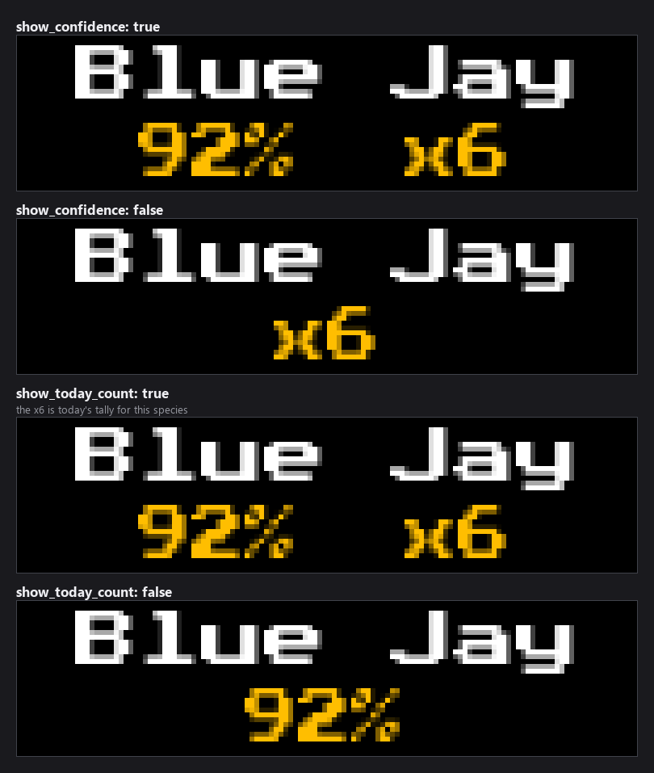
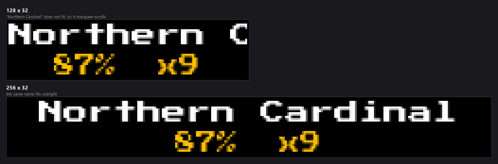
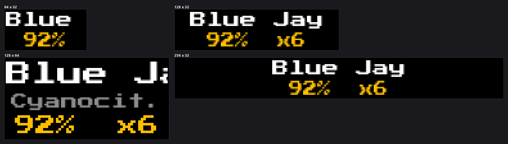

# BirdNET-Go Plugin


*Every image in this README is real plugin output, rendered at the true panel
size from a recorded detection so it reproduces exactly.*

Show what [BirdNET-Go](https://github.com/tphakala/birdnet-go) is hearing on your LED matrix, across two screens:

- **`birdnet_go`** — the latest identified bird: common name, scientific name, confidence, time since detection, and a species photo
- **`birdnet_stats`** — today's totals: species count, detection count, and the most-heard species with their counts

Everything comes from BirdNET-Go's REST API by polling. MQTT is optional and only buys sub-second pop-ups.

## Features

- No broker required — point it at your BirdNET-Go URL and it works
- Cycles a different species each turn, so a loud yard doesn't show the same bird every slot
- Size-adaptive layouts: a third line and larger type on tall panels, graceful degradation down to 64x32
- Species photos pulled on demand and cached for 30 days
- Three detection behaviours: `rotation`, `interrupt`, or `both`
- Configurable confidence threshold to filter noisy detections
- Optional MQTT push with auto-reconnect and exponential backoff
- Defensive payload parsing — tolerates `CommonName` / `commonName` / `common_name` and decimal-or-percent confidence
- Optional field mapping for unusual BirdNET-Go forks

## Quick start

The only setting that matters is your BirdNET-Go address:

```json
"birdnet-go": {
  "enabled": true,
  "birdnet_api": {
    "base_url": "http://birdnet-go.local:8080"
  },
  "display": {
    "mode": "rotation",
    "min_confidence": 0.6
  }
}
```

Then `sudo systemctl restart ledmatrix`. Both screens join the rotation.

Find your base URL by opening the BirdNET-Go web UI and copying scheme, host and port — no path. Verify it from the LED matrix host:

```bash
curl "http://<birdnet-host>:<port>/api/v2/health"
```

A healthy instance returns JSON containing `"status":"healthy"`.

Full option reference: see `config_schema.json`.

## Display modes

Two rotation entries, enabled independently.

`birdnet_go` shows the latest bird. Its behaviour is set by `display.mode`:

- **`rotation`** — renders the last detected bird during its rotation slot; nothing pops up mid-rotation
- **`interrupt`** — stays silent during rotation; new detections interrupt the current display for `interrupt_duration` seconds
- **`both`** (default) — rotation slot *and* interrupt on new detections

If more than `stale_after_minutes` pass without a detection, the slot shows "No recent birds".

`birdnet_stats` shows today's numbers. Turn it off with `"stats": {"enabled": false}` and its rotation slot is skipped. `stats.top_n` caps how many species are kept; the panel renders as many as physically fit, so a short panel shows fewer without any config change.

Interrupts only fire for a bird heard within the last couple of poll intervals. Polling surfaces old detections at startup, and popping those over the rotation is just noise.

### What the detection card shows

The species name leads, with the confidence and today's tally for that species
below. Both of those can be turned off:



A name too wide for the panel marquee-scrolls rather than truncating, so the
whole species is readable on any size:





## Species cycling

Showing "the latest bird" sounds right until you look at a real feed. A yard with 200 Fish Crow and 260 Blue Jay calls a day is one of those two almost every time you glance at the panel, and the other nine species never appear.

So by default the `birdnet_go` screen cycles: one distinct species per rotation slot, moving to the next species on the next slot. Each card carries that species' count for the day, so you get the frequency ranking as you watch rather than only on the stats screen.

```json
"display": {
  "unique_species": true,
  "max_species": 8,
  "species_order": "recent",
  "show_today_count": true
}
```

- **`species_order: "recent"`** (default) — most recently heard species first, so the panel reflects what's outside now
- **`species_order: "frequency"`** — most-heard species first, a running top-N countdown
- **`unique_species: false`** — the old behaviour: always show whatever called last

The cycle is built from today's per-species analytics, not the raw detection stream — `/detections/recent` caps at ten rows, which on a busy feed is often a single species. That does mean the cycle only covers species heard *today*; early in the morning it's short, and it grows as the day goes on.

Interrupt pop-ups always show the bird that just called, never the cycle's current card — an interrupt that showed some other species would defeat the point.

## How data is fetched

Every `birdnet_api.poll_interval` seconds (default 60) the plugin calls:

| Endpoint | Used for |
| --- | --- |
| `/api/v2/detections/recent` | the latest bird above `min_confidence` |
| `/api/v2/analytics/species/daily` | today's per-species counts |
| `/api/v2/media/species-image?name=<scientific_name>` | the species photo |

Photos are cached in memory and on disk for 30 days, keyed by scientific name; failed lookups are remembered for the session so we don't hammer the API. If the image endpoint is unreachable the layout falls back to text-only.

Polling keeps running even when MQTT is enabled, so a broker outage can't freeze the display.

## Optional: MQTT for instant pop-ups

Polling means a new bird appears within one `poll_interval`. If you want it on screen the moment it's heard, and BirdNET-Go is already publishing to a broker, enable MQTT. It supplements polling rather than replacing it.

Most people running BirdNET-Go alongside Home Assistant already have the **Mosquitto broker** add-on installed.

### 1. Create a dedicated MQTT user in Home Assistant

1. **Settings → People → Users → Add User**
2. Name it something like `ledmatrix` (not an admin, just a regular user)
3. Set a password — you'll paste this into the plugin config

The Mosquitto add-on authenticates against HA's user list by default, so no extra broker config is needed.

### 2. Find your broker's address and port

- **Host**: the LAN IP or hostname of the machine running Home Assistant (e.g. `192.168.1.10`). Don't use `localhost` unless the LED matrix runs on the HA host itself.
- **Port**: `1883` (plain) is the default. TLS on 8883 is not supported, so stick with 1883 on your LAN.

### 3. Configure BirdNET-Go to publish

In BirdNET-Go's web UI (**Settings → Integrations → MQTT**):
- Broker URL: `tcp://<ha-ip>:1883`
- Username / Password: the user you just made
- Topic: `birdnet` (any topic works, it just has to match the plugin)
- Enable the integration and restart BirdNET-Go

Verify from any machine on the LAN:
```bash
mosquitto_sub -h <ha-ip> -p 1883 -u ledmatrix -P <password> -t 'birdnet/#' -v
```

### 4. Turn it on in the plugin

```json
"mqtt": {
  "enabled": true,
  "host": "192.168.1.10",
  "port": 1883,
  "username": "ledmatrix",
  "password": "REPLACE_ME",
  "topic": "birdnet"
}
```

`paho-mqtt` must be installed (it's in `requirements.txt`). If it's missing, the plugin logs an error and falls back to polling rather than failing to load.

### 5. Confirm it connected

```bash
sudo journalctl -u ledmatrix -f | grep -i birdnet
```

You should see `Connected to MQTT broker` and `Subscribed to topic: birdnet`.

## Configuration reference

Settings live in the plugin's tab in the web UI and in `config/config.json`
under `birdnet-go`. The full schema is [`config_schema.json`](config_schema.json).


### Top level

| Key | Default | Notes |
|---|---|---|
| `enabled` | `false` | Enable or disable the BirdNET-Go plugin |
| `update_interval` | `30` | How often (seconds) to run background update tasks (image warmup, connection health) (min 1) |


### BirdNET-Go API

| Key | Default | Notes |
|---|---|---|
| `birdnet_api.base_url` | *(blank)* | Base URL of the BirdNET-Go web server, e.g. http://birdnet-go.local:8080 or http://192.168.1.20:8084. Required: a self-hosted service has no useful default, and a placeholder host would just produce repeated connection warnings. |
| `birdnet_api.request_timeout` | `5.0` | HTTP timeout in seconds for API requests (1–30) |
| `birdnet_api.poll_interval` | `60` | How often (seconds) to poll for new detections and refresh daily stats (min 5) |


### Detection display

| Key | Default | Notes |
|---|---|---|
| `display.mode` | `both` | rotation: always shows most recent bird during plugin's rotation slot. interrupt: pops up only on new detections. both: rotation slot plus interrupt on new detections. `rotation`, `interrupt`, `both` |
| `display.interrupt_duration` | `10` | Seconds to show a pop-up detection in interrupt mode (1–300) |
| `display.rotation_duration` | `15` | Seconds to show the bird during the plugin's rotation slot (1–300) |
| `display.min_confidence` | `0.5` | Ignore detections with confidence below this threshold (0.0-1.0) (0–1) |
| `display.stale_after_minutes` | `120` | If no detection arrives within this many minutes, show a 'no recent detection' frame instead (min 1) |
| `display.show_image` | `true` | Fetch and display the species image |
| `display.show_confidence` | `true` | Show the confidence percentage |
| `display.show_time` | `true` | Show how long ago the bird was detected |
| `display.unique_species` | `true` | Show a different species each rotation slot instead of repeating whatever called last. On a busy feed one or two loud species would otherwise fill nearly every slot. |
| `display.max_species` | `8` | How many of today's species to cycle through (1–50) |
| `display.species_order` | `recent` | recent: most recently heard species first. frequency: most-heard species first. `recent`, `frequency` |
| `display.show_today_count` | `true` | Show how many times the species has been heard today (e.g. x203) |


### Stats screen

| Key | Default | Notes |
|---|---|---|
| `stats.enabled` | `true` | Show the stats screen. When off, the plugin's stats rotation slot is skipped. |
| `stats.top_n` | `5` | How many of the most-heard species to keep. The panel shows as many as fit. (1–20) |
| `stats.rotation_duration` | `15` | Seconds to show the stats screen during its rotation slot (1–300) |


### Text and colours

| Key | Default | Notes |
|---|---|---|
| `text.font_path` | `assets/fonts/PressStart2P-Regular.ttf` | Path to font file (TTF). Relative to project root or absolute path. |
| `text.font_size` | `8` | Font size in pixels (4–32) |
| `text.text_color` | `[255, 255, 255]` | RGB text color [R, G, B] |
| `text.background_color` | `[0, 0, 0]` | RGB background color [R, G, B] |
| `text.accent_color` | `[255, 190, 0]` | RGB accent color [R, G, B] for the stats header and per-species counts |
| `text.scroll_speed` | `30` | Scroll speed in pixels per second for long bird names (1–200) |
| `text.scroll_gap_width` | `32` | Gap width in pixels between scroll loops (min 0) |


### MQTT push (optional)

| Key | Default | Notes |
|---|---|---|
| `mqtt.enabled` | `false` | Subscribe to an MQTT broker for pushed detections. Leave off to rely on REST polling alone. |
| `mqtt.host` | *(blank)* | MQTT broker hostname or IP address |
| `mqtt.port` | `1883` | MQTT broker port (1–65535) |
| `mqtt.username` | *(blank)* | MQTT broker username (optional) |
| `mqtt.password` | *(blank)* | MQTT broker password (optional) |
| `mqtt.client_id` | `ledmatrix-birdnet-go` | MQTT client ID |
| `mqtt.keepalive` | `60` | MQTT keepalive interval in seconds (10–300) |
| `mqtt.topic` | `birdnet/detections` | MQTT topic BirdNET-Go publishes detections to. Supports wildcards (+ and #). |


### Field mapping

| Key | Default | Notes |
|---|---|---|
| `field_mapping.common_name` | `CommonName` |  |
| `field_mapping.scientific_name` | `ScientificName` |  |
| `field_mapping.confidence` | `Confidence` |  |
| `field_mapping.time` | `Time` |  |


## Troubleshooting

- **Nothing appears** — check `curl "<base_url>/api/v2/health"` from the LED matrix host, and that `min_confidence` isn't set too high. Detections below it are logged at debug as "Dropping low-confidence detection".
- **"No bird stats"** — the daily analytics call failed or returned nothing. Check `curl "<base_url>/api/v2/analytics/species/daily"`; an empty array is normal before the first detection of the day.
- **Name but no photo** — `curl "<base_url>/api/v2/media/species-image?name=Cardinalis%20cardinalis"` should return an image.
- **Time-ago looks wrong** — the plugin uses the detection's own timestamp when BirdNET-Go supplies a full ISO-8601 one, and falls back to arrival time otherwise.
- **MQTT connects but nothing shows** — enable debug logging to see the raw payload, then override the relevant key under `field_mapping`.

## Display modes supported

`birdnet_go`, `birdnet_stats`
