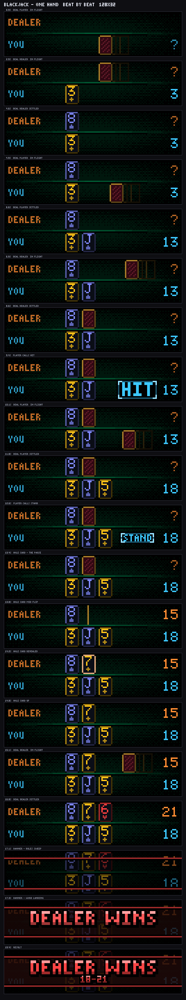
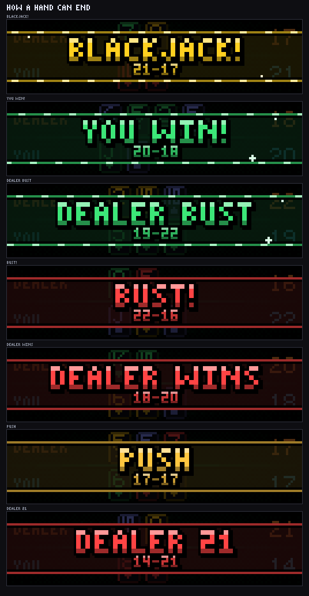
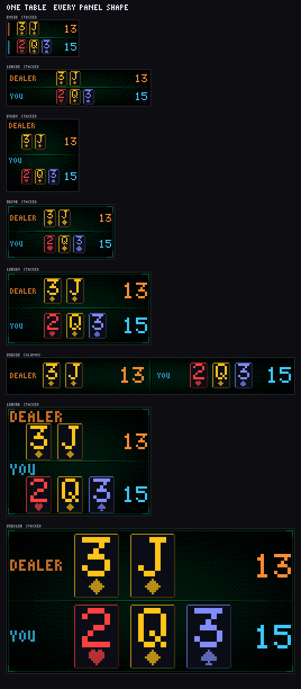
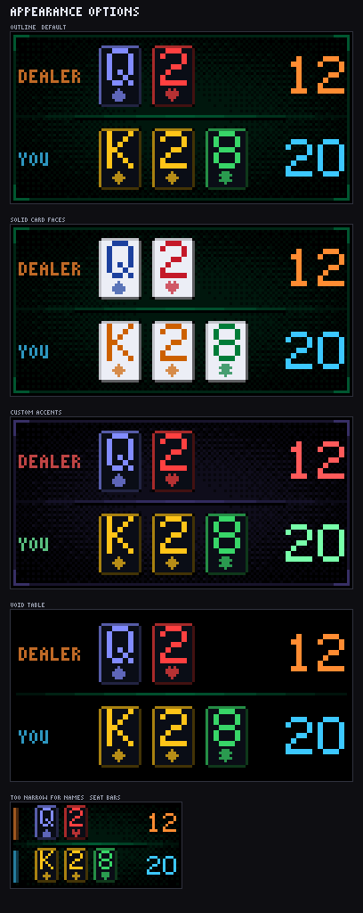

# Blackjack

One hand of Las Vegas blackjack, dealt on the matrix, once per rotation.

Cards slide in off the shoe and flip face up a few seconds apart. The player
follows basic strategy and announces the call — HIT, STAND, DOUBLE. A hand that
goes over, or a two-card 21, is called out where it happens. The dealer
turns the hole card over, plays the house rules, and the hand closes on a
**BLACKJACK!** / **BUST!** / **PUSH** banner over the dimmed table before the
rotation moves on.

Every hand comes off a real shuffled multi-deck shoe seeded from system
entropy, so no two rotations are the same and nothing in the process can make
the sequence predictable.

**[Install](#install) · [Settings](#settings) · [The rules it plays](#the-rules-it-plays)** — or read on for how it is drawn.


*A full hand at 128x32, in real time. Every frame is the plugin's own renderer
at the true panel size, scaled up with nearest-neighbour.*



## How a hand can end



## Every panel shape

The table lays itself out from the panel it is given rather than from a list of
supported sizes — an RGB matrix build can be any rectangle. Seats stack
normally; on a strip wider than 5:1 they sit side by side instead, which turns
a 256×32 build's 14px cards into 23px ones.



Each seat is one line running the width of the table — name, hand, total — with
the two seats measured against the longer name and the longer hand so they come
out congruent: same card size, same left edge, one column of totals down the
right. Where the panel is too narrow to set a name beside the hand the name
moves above it, and where it is too narrow for that as well the seat is marked
with a two-pixel bar in its own colour.

Type is drawn as integer-scaled blocks from bitmap faces rather than from a
rasterised TTF, so a glyph is the same crisp shape at every scale — no
anti-aliased grey fringe, and no dependence on which Pillow layout engine the
host happens to have.

Nothing on the panel is anti-aliased, and that is enforced rather than
intended: there is no TTF face, no `draw.text`, and no curve primitive in the
renderer at all. On an emissive panel a half-lit edge pixel is not a soft edge,
it is a dim lamp — it reads as a stuck LED, and under a mono rasteriser it can
close the counter of an 8. A settled 128×32 frame holds 22 distinct colours,
every one of them a colour something meant to draw; the tests assert the count,
assert that a glyph's pixels are exactly the ink or exactly the ground, and
grep the source for the primitives that would break it.

The one smooth thing in the pipeline is the radial falloff behind the felt, and
it never reaches the panel: it is a *threshold* source for the ordered dither,
so its output is three tones and nothing between them.

There are two faces, and the split is deliberate. Labels and the result banner
are **words**, read by shape and forgiving of a cramped face, so they use a
compact 3×5 set. Hand totals and card indices are **single characters with no
context to disambiguate them**, so they use a 5×7 face: at 3×5 there are only
fifteen pixels to tell 2, 3, 5, 8 and 9 apart, and the closest pair differs by
a *single lit pixel*. At 5×7 the closest pair is six pixels apart.

## The cards

A playing card states its rank as a **count of pips**, not as a numeral — a
seven of diamonds is seven diamonds in the classic two-column arrangement, and
that one fact is most of the difference between a card and a number in a box.
So it is drawn that way wherever the card is big enough to hold it, on the real
arrangements rather than a tidy grid: a seven is six pips in two columns with
the seventh raised into the upper gap, and on the biggest cards the pips below
the midline are turned over, as they are in a real deck.

**Court cards are figures and the ace is a single outsized pip**, because those
are the four ranks a real deck does not set in type either. The figures are
11×17 pixel sprites, integer-scaled up, drawn to separate by silhouette before
any detail resolves: the king is a spiked crown over a beard that tapers to a
point, the queen is three coronet points over hair that falls square to the
shoulders, the jack is a bare head over a collar wider than he is. At scale 1
the face inside one of them is five pixels across, so the outline is all there
is to read.

What a card can carry depends entirely on how much interior it has, so the art
is a ladder:

| Card interior | What it draws | Which panels |
|---|---|---|
| 17×17 and up | pips and figures, with a **single** top-left index — rank over a suit mark | 128×96 |
| 23×24 and up | the same, with the index repeated **rotated** in the opposite corner | 256×128 |
| below 17×17 | the centred 5×7 rank over a suit mark | 64×32, 128×32, 96×48, 128×64, 256×32 |
| under 7×9 | a lit face, no rank at all | panels narrower than about 48px |

The pip size rides on top of that ladder rather than alongside it: 5×5 marks
need a 23×27 interior and 7×7 need 29×35, so a 128×96 card draws 3×3 pips with
one index and a 256×128 card draws 7×7 pips with two.

**A pip field is never drawn without an index.** An earlier version bought the
index only where it cost the pips nothing, which meant the two middle tiers
drew a rank as an uncounted field of specks and nothing else: on a 128×64 panel
a five, a six and a seven were three small blobs, four, and five, with no
numeral anywhere on the card. Counting blobs is not reading, and the hand's
value is the one thing on this screen anybody needs. A real deck does not do it
either — the index in the corner is exactly what makes a fanned hand readable,
and pips without one is a half-drawn card rather than a purer one.

So the index is bought first and the pips take what is left; where even a single
index leaves no room to lay a ten out classically, the card gives up on pips and
falls back to the centred rank. The second, rotated index is a luxury on top of
that: cards here are fanned left to right, so the top-left index is the one that
stays visible when a hand overlaps, and spending a second gutter on the hidden
corner is what pushed a 23×33 card off pips entirely.

It is still not first-fit. Taking the first arrangement that fits put a
double-size index on the largest card and paid for it with the pips, dropping a
38×55 face from 7×7 marks to 3×3 — the index is mandatory, but it is not worth
more than the thing it labels. Every affordable arrangement is costed and the
best one wins: bigger pips first, then the second index, then a bigger index.

The turned lower pips are restricted by measurement rather than taste: an
inverted 3×3 spade *is* the 3×3 club, pixel for pixel, and spade against club is
the one pair ink colour cannot separate.

### The back

Face-down cards are a crimson ground with a lighter crimson weave, a gold
frame, and a lozenge in the middle. The frame is what makes a back read as a
*back* rather than as an empty slot — a full-bleed texture has no silhouette of
its own, and at a glance it is a rectangle of pattern the same size as a card,
which is also what an unfilled slot looks like. The lozenge is what stops the
panel inside it being a swatch.

The gold is deliberately short of full. At its natural brightness the back's lit
edge measured 172 in luminance against 69–129 for a face card's border, which
made the one card nobody can read the brightest object on the table. It sits at
127 now — visible, and behind the hand rather than in front of it.

### Colour

The default deck is a **four-colour deck** — red hearts, gold diamonds, green
clubs, indigo spades — which is what a card room hands out rather than what a
physical pack ships with. The reason is the same in both places: two
same-coloured suits are separated by shape alone, and at a glance, on a dark
surface, colour resolves before shape does. `deck_colors: classic` puts back
the two-colour pack.

The four inks are checked against each other *and* against the rest of the
table, at 1x on a 128x32 rather than by eye on a magnified crop. Diamonds
started orange and sat 24 units from the dealer's own accent — the same colour
for practical purposes, with only position telling them apart — so they are
gold. Spades started a true blue one step from the player's cyan, and are
indigo for the same reason.

## The table

The felt is a **lit table**, not a flat field. An ordered 4×4 Bayer pattern is
dithered against a radial falloff, so the weave is densest under the middle —
where the cards are — and thins to bare black at the edges. Two thresholds
against the same falloff give three tones out of two colours, which is the only
way to get a gradient out of a palette this small, and it is the same trick a
16-bit console used for the same reason.

An even scatter over the whole panel was the version that read as unfinished:
a texture swatch rather than a surface under a light. The falloff is a circle
stretched to the panel, so a 512×64 strip gets a long ellipse of light instead
of a spot in the middle with two dead ends.

The tones are a tenth and a fifth of the felt colour — about a twentieth of the
light a card puts out, so the hand stays the brightest thing on the panel,
which is the one property the whole dark-card style depends on. It is built
once per hand and copied per frame.

Around it, where the seats leave the room, is a **rail**: a dim rule at the
panel's inset with brighter corner pieces, the way a status screen frames
itself. Between the seats the rule is **bevelled** — a lit edge over a dark one
— so it reads as the lip of the table rather than as a line drawn on it. A
panel whose seats need every pixel (a 128×32, say) gets the felt and the rule
and no rail; that is measured from the layout, not from a list of sizes.

The seat's name and its hand total are set as bare type. Bevelled plates were
tried around both and removed: at 128×32 the totals column has one spare pixel
either side of two digits, so a box drawn that tight crowds the number instead
of framing it, and the same box around a 3×5 name reads as a solid tile at
arm's length.

Set `table_style` to `void` for the bare black table — no felt, no rail, and
the rule back to a single line. It is the most negative space a blackjack table
can have, and the least current draw.

## Appearance



Cards default to **outline** style: a dark face with a lit border and a lit
rank. On an emissive panel that keeps the table dark and lets the cards be the
picture — ivory card faces light about 70% of the panel and wash out into a
glare. **Solid** is there if you want the literal look.

## The moments

A hand ends the way an arcade round ends, not the way a caption appears.

The result band still **tints** the table rather than painting over it — a
blackjack is only a blackjack because of the cards still sitting there, so they
stay readable as shapes under coloured glass. What happens on top of that band
is a sequence of hits:

1. **A flash frame.** Two frames of near-white over the whole panel, tinted to
   the outcome, so a bust blows out hot red and a natural blows out gold. The
   eye is told *which* thing happened before it can read the word.
2. **A rattle.** The finished frame is knocked off its axis and settles — up to
   three pixels on a big panel for a loss, one for a win. A hand that busts
   mid-deal gets the same knock when its **BUST** chip lands.
3. **A burst.** On a win, a dozen sparks erupt from the middle of the table on
   parabolic arcs, twice over on a wide panel. They are deliberately timed to
   live in the moment *before* the band has finished opening: a 32-row panel
   has about nine free rows once the band is up, and while the band is still a
   few pixels tall the whole table is empty and dark.
4. **The sign.** The table dims, the two rules spring apart past their mark and
   settle back, the tone washes into the gap, and the word lands *whole* and
   white-hot rather than assembling itself. It is set as arcade knockout type —
   a 1px black keyline, a 1px hard shadow down and right, and a three-step
   ramp from a lit top row to a shaded bottom one — and a gleam sweeps across
   it every couple of seconds. On a natural, sparkle stars blink in the band's
   margins; on a panel with ten free rows above the band, chips keep arcing up
   off the top of it.
5. **The score.** The two totals count up from zero over half a second and pop
   white when they land, each right-aligned to the position it will finish in
   so the line does not jitter while it counts.

A loss gets none of that celebration and one thing of its own: the sign it lit
is a dud, and every couple of seconds a tube in it drops out for a quarter of a
second. Four seconds of a perfectly still red word was the other half of the
problem; a marquee chase on a bust would be the table cheering.

**Every one of these is a pure function of elapsed time.** There is no particle
list and no animation state anywhere in the plugin. A spark's position is
evaluated from a constant launch table and the clock — `p = p0 + vt + gt²/2`,
closed form — and the fountain is a phase modulo one. Render the same instant
twice and you get the same pixels; drop ten frames and the sparks are further
along rather than behind.

Marquee lights still chase along a winning band's two rules, mirrored, faster
for a natural. That chase replaced a 15% brightness sine over the whole banner:
the pulse moved the fill, the rules and the *type* together, which on a matrix
is the signature of a sagging power supply rather than of a celebration.

Four other things get a beat of their own:

| Moment | What it does |
|---|---|
| A card is dealt | Runs in from beyond the edge of the felt, decelerating, with two dim outlines trailing it — the motion blur a panel with no persistence cannot supply — then rocks a little past its slot and settles |
| The hole card | The dealer holds still for a third of a second before the turn, and the card that lands keeps a bright edge for half a second afterwards |
| A call | **HIT** / **STAND** / **DOUBLE** snaps open from a slit beside the hand, in a bordered chip with four brighter corner brackets — the grammar every menu of the era used for a choice that has just been taken |
| A hand busts | A **BUST** plate on the seat that went over, the moment the card that killed it settles: the word punched out of a lit chip with a top highlight, a dithered step and a shaded bottom row. The running total quietly passing 21 was the only sign before |
| A natural | **21** on the player's first two cards, and on the dealer's when the hole card turns it over |

### Hands worth pointing at

Seven words is every way a hand can end, and after a while that is all you see.
So a hand that is *rare* says so: the banner's second line carries a short
label for a beat before the score takes it back.

| Label | What happened | Roughly |
|---|---|---|
| `777` | The first three cards are all sevens | 1 hand in 4,000 |
| `21 IN 3` | Twenty-one reached on the third card | 1 in 24 |
| `DEALER 6` | The dealer drew that many and still went over | 1 in 53 |
| `CHARLIE` | Five or more cards without busting | 1 in 83 |
| `BOTH 21` | Two naturals at once | 1 in 420 |
| `RUN OF 4` | That many player wins in a row this session | — |

None of them change what the hand pays. A five-card Charlie is an ordinary win
here, because paying it would be a house rule this table does not advertise —
the labels exist so a rare hand *looks* rare, not so it scores differently.
The flourish takes the line first and the score takes it back, because the
band has one line to spend and the surprising half should not read as a
footnote to the reference half.

## The rules it plays

Las Vegas Strip rules, out of the box:

| | |
|---|---|
| Shoe | 6 decks, reshuffled at the cut card (75% penetration), carried over between hands |
| Dealer | Stands on all 17s (`dealer_hits_soft_17` switches to downtown rules) |
| Dealer peek | A ten or an ace up ends the hand immediately on a natural |
| Player | Basic strategy for a multi-deck, peek, double-on-any-two game |
| Double | First two cards only; the strategy adjusts when doubling is off |
| Blackjack | Pays 3:2 |

The player's play is a real basic-strategy table, not a heuristic: hard 12
stands against 4–6 and hits everything else, soft 18 doubles against 3–6 and
stands against 7–8, hard 11 doubles against everything but an ace under S17 and
against the ace too under H17. Over 4000 simulated hands the table runs about
half a percent against the player, which is where 6-deck S17 basic strategy
belongs.

**Pairs are played by their total — hands are never split.** A split turns one
hand into two, which doubles both the rotation length and the layout problem
(two player rows on a 32px-tall panel is not a layout, it is a compromise).
Playing the total is exactly what basic strategy prescribes for a game that
does not offer the split, so the play stays correct; it just never branches.
Insurance and surrender are likewise absent — basic strategy never takes
insurance, and a surrender ends a hand with nothing to watch.

## In the Vegas marquee

The marquee is a continuous scroll and a hand is a twenty-second animation, so
the animation cannot be the ticker item. The **outcome** can be: the hand is
simulated to completion before the first card is dealt, so the finished table
and its result are known at any instant — even while the panel is still
mid-deal.

So the ticker gets a still of the hand as it ended: the final cards, with the
result **beside** them.

Where the panel is too narrow to split, the result goes *over* the cards
instead, using the hand's own final-frame treatment — which already composes
both into one panel. The threshold is a measurement, not a size: the ticker's
width budget is at most one panel and anything wider is cropped to its start,
so a two-panel arrangement would show the cards and lose the result, which is
the half that matters.

`vegas_mode: static` pauses the marquee and plays the whole hand out instead,
for anyone who would rather watch than skim. SCROLL is not offered — it is for
plugins with a list of interchangeable items, and a hand is one thing.

## How long a rotation lasts

As long as the hand does. The whole hand is simulated before the first pixel is
drawn, so the plugin can tell the display controller exactly how many seconds
it needs (`get_cycle_duration`) — roughly 18s for a hand that stands on two
cards, 30s or more for a long draw. That is what `dynamic_duration.enabled`
buys, and it is **on by default**: a fixed slot either cuts the result banner
off or holds a finished table on screen.

With dynamic duration turned off the plugin falls back to `display_duration`
and deals a fresh hand whenever the last one finishes inside the slot.

## Settings

Web UI label on the left, `config.json` key on the right.

| Setting | Key | Default | What it does |
|---|---|---|---|
| Enabled | `enabled` | `false` | Show blackjack in the rotation |
| Decks in the Shoe | `decks` | `6` | Decks shuffled together, 1–8 |
| Dealer Hits Soft 17 | `dealer_hits_soft_17` | `false` | Off is Strip rules, on is downtown; the player's strategy follows |
| Allow Doubling Down | `allow_double` | `true` | Off keeps the hand to hit and stand |
| Card Style | `card_style` | `outline` | `outline` or `solid` |
| Deck Colours | `deck_colors` | `four` | `four` gives every suit its own colour; `classic` is the two-colour pack |
| Table Background | `table_style` | `felt` | `felt` is a dithered field with a rail and a bevelled rule; `void` is bare black |
| Show DEALER / YOU Labels | `show_labels` | `true` | Names beside each hand where they fit, above it where they do not; a coloured seat bar on panels too narrow for either |
| Show Hand Totals | `show_totals` | `true` | Running totals beside the cards; the dealer's is `?` until the reveal |
| Dealer Accent Colour | `dealer_color` | `[255, 140, 50]` | Dealer label, total and seat bar |
| Player Accent Colour | `player_color` | `[60, 200, 255]` | Your label, total, seat bar and the call tag |
| Felt Colour | `felt_color` | `[0, 110, 62]` | The one colour the whole table is built from — the felt field, the rail and the rule are all steps down from it |
| Seconds Between Cards | `card_interval` | `2.0` | The main pacing control |
| Result Banner Seconds | `result_seconds` | `4.0` | How long the banner is held |

### Advanced

| Setting | Key | Default | What it does |
|---|---|---|---|
| Player Call Seconds | `action_seconds` | `1.2` | How long HIT / STAND / DOUBLE shows |
| Hole Card Reveal Seconds | `reveal_seconds` | `1.8` | The beat where the hole card turns over. The pause before the turn comes out of whatever slack this leaves over `flip_seconds`, up to a third of a second — there is no separate knob, because a hold settable longer than its own beat would break the flip rather than tune it |
| Opening Pause Seconds | `intro_seconds` | `0.8` | Empty table before the first card |
| Deal Animation Seconds | `deal_animation` | `0.45` | Slide plus flip, capped at `card_interval` |
| Hole Card Flip Seconds | `flip_seconds` | `0.55` | Capped at `reveal_seconds` |
| Render Frame Rate | `render_fps` | `40` | Frames drawn per second; lower it if the display loop is struggling |
| Random Seed | `random_seed` | `0` | `0` means real randomness. Any other value repeats the same hands every restart — for tests and screenshots only |
| Display Duration | `display_duration` | `22` | Fallback slot length, used only with dynamic duration off |
| Dynamic Duration | `dynamic_duration` | `{ "enabled": true, "max_duration_seconds": 75 }` | Let the hand decide how long the rotation lasts. `enabled` holds the screen until the hand finishes; `max_duration_seconds` is the upper bound on one hand |

## Install

Plugin Store → **Blackjack** → Install, then enable it. Or by hand:

```json
"blackjack": {
  "enabled": true,
  "decks": 6,
  "card_interval": 2.0,
  "dynamic_duration": { "enabled": true, "max_duration_seconds": 75 }
}
```

See [`example_config.json`](example_config.json).

## How it is put together

Three files, split so that each one has a single problem:

- **`blackjack_engine.py`** — the shoe, basic strategy, the house rules, and a
  replayable *script* of the hand. No Pillow, no core imports.
- **`manager.py`** — gives each beat of the script a duration from config and
  turns `elapsed` into a view state.
- **`blackjack_render.py`** — turns a view state into an image. Card slots are
  positioned from the *final* card count, so nothing slides sideways when a
  fifth card arrives.

Simulating the hand up front is what makes the rest simple: the rotation length
is known before the deal, and every frame is a pure function of elapsed time
with no animation state to fall out of step.

## Testing

```bash
# engine: totals, shoe, strategy tables, 4000-hand invariants and house edge
python plugins/blackjack/test_blackjack_engine.py

# render: every beat on 20 panel shapes, layout invariants, plugin lifecycle
python plugins/blackjack/test_blackjack_render.py

# the core safety harness, including the committed golden images
python scripts/check_plugin.py --plugin blackjack \
  --plugin-dir /path/to/ledmatrix-plugins/plugins --out-dir /tmp/preview

# after an intentional visual change, refresh the goldens and review the diff
python scripts/check_plugin.py --plugin blackjack --update-golden \
  --plugin-dir /path/to/ledmatrix-plugins/plugins --out-dir /tmp/preview

# regenerate the contact sheets in assets/
python plugins/blackjack/test/render_examples.py

# regenerate the animated preview and the store hero image
python plugins/blackjack/test/render_preview.py
```

`test/golden/` holds a committed frame for each of the eight harness sizes, so
a visual change that nobody intended fails CI instead of turning up on a panel.
They are reproducible because `test/harness.json` pins the shoe's seed — an
unseeded plugin deals a different hand every run, which is the whole point of
it and the enemy of a golden image.

What the harness renders is one frame per mode, and it lands during the opening
pause, so those goldens are really a regression test on the table: the felt,
the rail, the rule, the seat names and the totals column at every shape. The
cards are covered by `test_blackjack_render.py`, which drives the whole hand
beat by beat across twenty shapes from 8×16 to 384×32 and checks the layout
invariants a screenshot would not catch.

## License

GPL-3.0. See [LICENSE](LICENSE).
