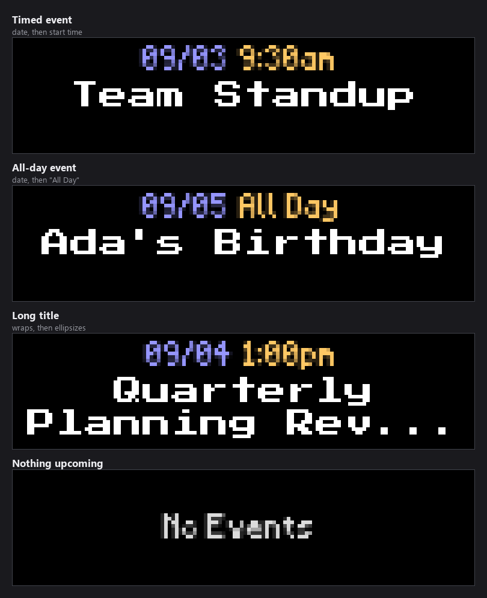
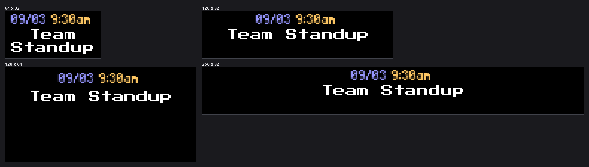

-----------------------------------------------------------------------------------
### Connect with ChuckBuilds

- Show support on Youtube: https://www.youtube.com/@ChuckBuilds
- Stay in touch on Instagram: https://www.instagram.com/ChuckBuilds/
- Want to chat or need support? Reach out on the ChuckBuilds Discord: https://discord.com/invite/uW36dVAtcT
- Feeling Generous? Support the project:
  - Github Sponsorship: https://github.com/sponsors/ChuckBuilds
  - Buy Me a Coffee: https://buymeacoffee.com/chuckbuilds
  - Ko-fi: https://ko-fi.com/chuckbuilds/ 

-----------------------------------------------------------------------------------

# Google Calendar Plugin

Display upcoming events from Google Calendar with automatic updates, event rotation, and timezone support.


*Every image in this README is real plugin output, rendered at the true panel
size and scaled up so the pixels stay pixels.*

## Features

- **Google Calendar Integration**: OAuth2 authentication
- **Multiple Calendar Support**: Display events from multiple calendars
- **Event Rotation**: Automatically cycles through upcoming events
- **All-Day Events**: Shows both timed and all-day events
- **Timezone Support**: Displays times in your local timezone
- **Text Wrapping**: Handles long event titles gracefully
- **Auto-Updates**: Fetches new events periodically

## Requirements

- Google Calendar API credentials
- Python 3.9+
- Internet connection for API access

## Setup Instructions

### 1. Create Google Cloud Project

1. Go to [Google Cloud Console](https://console.cloud.google.com/)
2. Create a new project or select an existing one
3. Enable the **Google Calendar API**

### 2. Create OAuth credentials and download them

1. In Cloud Console, go to **APIs & Services → Credentials**
2. Click **Create Credentials → OAuth client ID**
3. Choose **Desktop application**. The sign-in flow in
   `calendar_registration.py` redirects to a loopback address
   (`http://127.0.0.1`), which Google only allows for this client type.
   "TV and Limited Input Device" will not work.
4. Download the JSON file
5. Save it as `credentials.json` in the calendar plugin directory
   (typically `plugin-repos/calendar/credentials.json`)

### 3. First-Time Authentication

**Option A: Use Web Interface (Recommended)**
1. Open the LEDMatrix web interface (`http://your-pi-ip:5000`)
2. Open the **Calendar** tab in the second nav row (added once the
   plugin is installed)
3. Click the **Authenticate Google Calendar** button
4. Open the link it gives you and approve access. Google then redirects your
   browser to a `http://127.0.0.1/...` page that fails to load -- that is
   expected. Copy that page's full address and paste it back into the web UI
5. The token is saved automatically into the plugin directory as `token.pickle`

**Option B: Use Registration Script**
```bash
cd plugin-repos/calendar
python calendar_registration.py
```

Run from a terminal, the script opens a local browser for the consent screen,
so it needs a machine with a desktop browser. On a headless Pi use Option A.

**The plugin never signs in by itself.** If it has no usable token (none yet, or
a refresh fails because access was revoked or the token expired), it logs the
problem and the panel shows **Auth needed / See web UI** instead of events.
Complete Option A or B, then restart LEDMatrix so the plugin loads the new
token.

All authentication files (`credentials.json` and `token.pickle`) are stored in the plugin directory for complete isolation.

## Configuration

### Example Configuration

```json
{
  "enabled": true,
  "credentials_file": "credentials.json",
  "token_file": "token.pickle",
  "max_events": 3,
  "calendars": ["primary"],
  "update_interval": 300,
  "show_all_day_events": true,
  "event_rotation_interval": 10,
  "display_duration": 30
}
```

### Configuration Options

The web UI form is generated from `config_schema.json` (the source of truth).
`credentials_file` and `token_file` are handled by the setup flow above (the upload
widget and first-time authentication) and rarely need editing by hand.

| Key | Default | Notes |
|-----|---------|-------|
| `enabled` | `false` | Enable or disable the plugin |
| `credentials_file` | `"credentials.json"` | Google OAuth credentials file (uploaded via the config UI) |
| `google_auth` | `""` | Not a setting you type into. It is the **Step 2: Connect Your Google Account** button in the web UI (`x-widget: google-oauth`), which runs the consent flow described above. Google redirects to a page that fails to load — that is expected; copy the address back into the field to finish. |
| `token_file` | `"token.pickle"` | Token file the plugin reads, relative to the plugin directory. Not in the web form. The sign-in flow always writes `token.pickle`, so leave this at the default |
| `calendars` | `["primary"]` | Calendar IDs to display — use the calendar picker after authenticating, or `"primary"` for your default |
| `max_events` | `3` | Maximum upcoming events to show (1–10) |
| `show_all_day_events` | `true` | Include all-day events |
| `event_rotation_interval` | `10` | Seconds between rotating displayed events (min 5) |
| `display_duration` | `30` | Total seconds on screen before moving to the next plugin (min 5) |
| `update_interval` | `3600` | Seconds between refreshes from Google (60–86400) |
| `customization.datetime_text.font` | `PressStart2P-Regular.ttf` | Font for the date/time line |
| `customization.datetime_text.font_size` | `8` | Size of the date/time line in pixels (4–16) |
| `customization.title_text.font` | `PressStart2P-Regular.ttf` | Font for the event title |
| `customization.title_text.font_size` | `8` | Size of the event title in pixels (4–16) |

## Display Format

The date sits on the top line with the start time beside it, and the event title
fills the space below, wrapped across as many lines as fit.



- A **timed** event shows its start time next to the date.
- An **all-day** event shows `All Day` in place of the time. Set
  `show_all_day_events` to `false` to leave these out.
- A **long title** wraps, and the last visible line is ellipsized rather than
  simply stopping, so a title that did not fit is recognisable as truncated.
- When nothing upcoming is left, the panel shows `No Events`.

The layout is the same on every panel; the taller the panel, the more lines of
title fit before ellipsis.



## Multiple Calendars

To display events from multiple calendars:

```json
{
  "calendars": [
    "primary",
    "family@group.calendar.google.com",
    "work@company.com"
  ]
}
```

Events from all calendars are merged and sorted by start time.

## Usage Tips

### Event Rotation

- Events automatically rotate every `event_rotation_interval` seconds
- Shows up to `max_events` at a time
- Sorted by start time (soonest first)

### Update Frequency

- Set `update_interval` to balance freshness vs. API usage
- The default is 3600 seconds (hourly); 300 (5 minutes) suits a calendar that
  changes during the day
- Each refresh makes one request per configured calendar

### Timezone

Plugin uses timezone from main LEDMatrix config:
```json
{
  "timezone": "America/New_York"
}
```

See [List of timezones](https://en.wikipedia.org/wiki/List_of_tz_database_time_zones)

## Troubleshooting

**No events displayed:**
- Check that calendars have upcoming events
- Verify calendar IDs are correct
- Check authentication is valid
- Review logs for API errors

**The panel says "Auth needed":**
- The plugin has no usable token. Run **Authenticate Google Calendar** in the
  web interface (or `calendar_registration.py`), then restart LEDMatrix.

**Authentication failed:**
- Delete `token.pickle` and re-authenticate
- Verify `credentials.json` is valid
- Ensure OAuth consent screen is configured
- Check API is enabled in Cloud Console

**Wrong timezone:**
- Set correct timezone in main config
- Verify timezone string is valid
- Restart after changing timezone

**Events not updating:**
- Check `update_interval` isn't too high
- Verify internet connection
- Check API quota hasn't been exceeded
- Review logs for errors

**Long titles cut off:**
- Titles wrap onto as many lines as fit below the date (two on a 32-pixel-tall
  panel with the default fonts, four at 64 pixels)
- When the title needs more lines than fit, the last visible line ends in `...`
- Use a smaller `customization.title_text` font, or shorten event names in
  Google Calendar

## Calendar IDs

### Finding Calendar IDs

1. Open Google Calendar in browser
2. Click settings gear → "Settings"
3. Select calendar from left sidebar
4. Scroll to "Integrate calendar"
5. Copy "Calendar ID"

### Common Calendar Types

- **Primary**: `"primary"` (your main calendar)
- **Shared**: `"name@group.calendar.google.com"`
- **Other Google**: `"email@gmail.com"`

## API Limits

Google Calendar API has rate limits:
- **Free tier**: 1,000,000 queries per day
- **Per user**: 10 requests per second

With the default 3600s interval: 24 requests per calendar per day. At 300s:
288 per calendar per day. Both are well within the limits.

## Security Notes

- `credentials.json`: Contains OAuth client credentials (stored in plugin directory)
- `token.pickle`: Contains access token (stored in plugin directory)
- Keep both files secure and don't commit to git
- The plugin automatically stores these in its own directory
- If you delete the plugin, all authentication data is removed
- The plugin's own `.gitignore` excludes `credentials.json`, `token.pickle` and
  `.pkce_code_verifier` (the one-use PKCE verifier saved between the two web-UI
  auth steps). The repository's root `.gitignore` does not cover them.

## Advanced Configuration

### Custom Display Duration

Match event length:
```json
{
  "display_duration": 60,
  "event_rotation_interval": 20
}
```

### Quick Rotation

Cycle through many events quickly:
```json
{
  "max_events": 10,
  "event_rotation_interval": 5
}
```

### Minimal Updates

Reduce API calls:
```json
{
  "update_interval": 900,
  "max_events": 1
}
```

## Integration with Other Plugins

Calendar works well alongside:
- **Clock**: Shows time, calendar shows events
- **Weather**: Schedule awareness for outdoor events
- **Static Image**: Display event-related images

## Examples

### Home Calendar
```json
{
  "enabled": true,
  "calendars": ["primary", "family@group.calendar.google.com"],
  "max_events": 5,
  "event_rotation_interval": 10
}
```

### Work Calendar
```json
{
  "enabled": true,
  "calendars": ["work@company.com"],
  "max_events": 3,
  "show_all_day_events": false
}
```

### Birthday Reminders
```json
{
  "enabled": true,
  "calendars": ["birthdays@group.calendar.google.com"],
  "max_events": 1,
  "event_rotation_interval": 30
}
```

## License

GPL-3.0 License - see main LEDMatrix repository for details.

