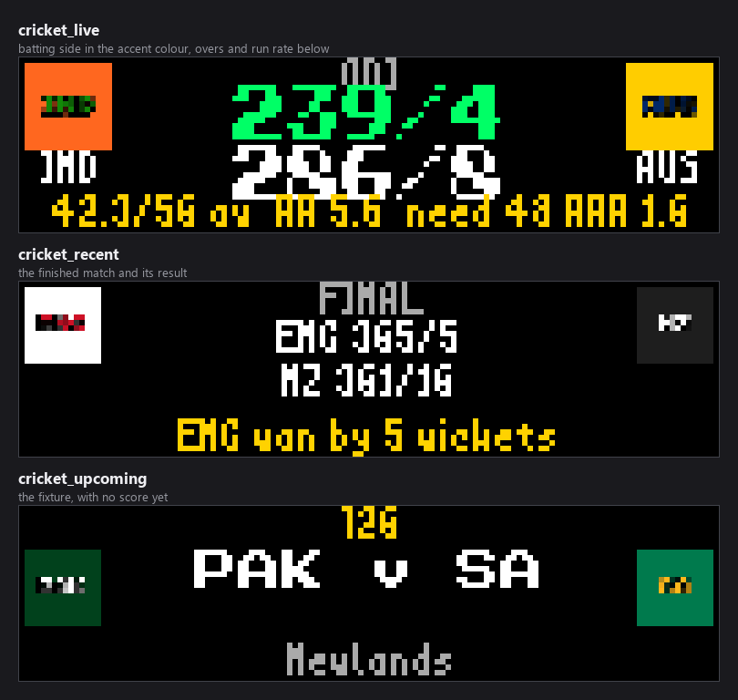
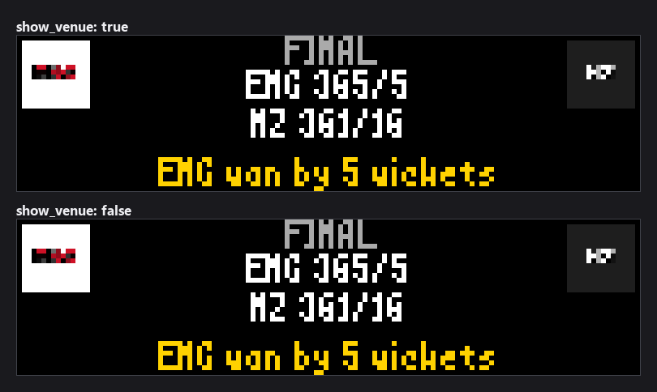
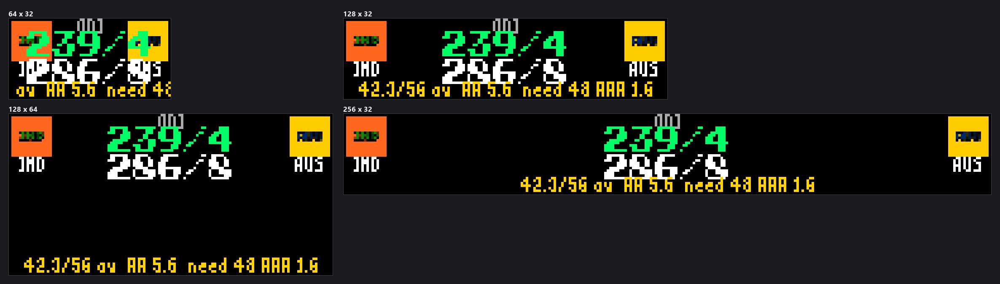

# Cricket Scoreboard


*Every image in this README is real plugin output, rendered at the true panel
size from seeded matches so it reproduces exactly. Teams, scores and venues are
invented.*

Live, recent, and upcoming cricket for the LEDMatrix display — covering both
**international** matches (Test / ODI / T20I) and the **major domestic T20
leagues** (IPL, Big Bash, The Hundred, PSL, CPL, SA20, ILT20, MLC, and more).

Data comes from ESPN's public cricket API (no API key required).

## Display modes

| Mode | Shows |
|------|-------|
| `cricket_live` | In-progress matches. Limited-overs matches show `runs/wickets (overs/max ov)`, current run rate, and — when a side is chasing — the target, runs still needed, and required run rate. Test matches show the day + session (Stumps / Lunch / Tea …) and both innings, with no clock. |
| `cricket_recent` | Completed matches: final scores + ESPN's result summary (e.g. `"RCB won by 5 wkts (12b rem)"`). |
| `cricket_upcoming` | Scheduled matches: date/time, teams, venue, and a format badge. |

Live matches take priority in the rotation when `live_priority` is on.

## How series discovery works

Unlike most sports, cricket has **no single stable league id** on ESPN — it is
organised as dozens of concurrent, per-tour / per-season numeric *series* ids
(e.g. a given season of the IPL might be `8048`, Major League Cricket `21266`,
the Vitality Blast `8053`). Those ids change every season.

So instead of hardcoding ids, the plugin **discovers them periodically**:

1. It reads a curated seed list, [`competitions.json`](competitions.json), that
   maps human competition keys (`ipl`, `bbl`, `the-hundred`, …) to stable
   **search terms** (competition *names* are far more stable than their ids).
2. Every `series_discovery_interval` seconds (default 24h) it queries ESPN's
   cricket header endpoint, lists every active series, and resolves them:
   - **domestic** competitions are matched by name against your
     `favorite_competitions` search terms;
   - **international** series are matched by your `favorite_teams` national-team
     names appearing in the series/event names (e.g. *"India tour of England
     2026"*).
3. Each resolved numeric id's `/scoreboard` is then fetched and parsed.

Resolved ids are cached (via the host `cache_manager`) so discovery is cheap.

## Overs math (base-6)

Cricket overs are **base-6 in the fractional part**: `18.4` overs means 18
completed overs **plus 4 balls** = `18 + 4/6 = 18.667` decimal overs, *not*
18.4. The plugin converts `overs → decimal overs` before any run-rate division:

- current run rate = `runs / decimal_overs`
- required run rate = `runs_needed / (balls_remaining / 6)`

This conversion is unit-tested (`test_cricket_plugin.py::TestOversMath`).

## Configuration

Configured under the `cricket-scoreboard` key in `config/config.json`. See
[`config_schema.json`](config_schema.json) for the full schema; key fields:

| Key | Default | Purpose |
|-----|---------|---------|
| `enabled` | `false` | Master on/off |
| `favorite_teams` | `[]` | National teams (name or abbr, e.g. `"India"`, `"IND"`) whose international series are followed |
| `favorite_competitions` | `["international","ipl","bbl"]` | Domestic competition keys from `competitions.json` (`international` follows Test/ODI/T20I tours for your favorite teams) |
| `exclude_teams` | `[]` | Teams to always hide (spoiler protection) |
| `show_favorite_teams_only` | `false` | Restrict *international* matches to those featuring a favorite team |
| `live_game_duration` / `recent_game_duration` / `upcoming_game_duration` | 20 / 15 / 15 | Per-match on-screen seconds |
| `non_favorite_live_game_duration` | `0` | Shorter turn for live matches without a favorite (0 = same as `live_game_duration`) |
| `update_interval_seconds` / `live_update_interval` | 3600 / 30 | Data refresh cadence |
| `series_discovery_interval` | `86400` | How often numeric series ids are re-resolved |
| `recent_games_to_show` / `upcoming_games_to_show` | 5 / 5 | Match counts per mode |
| `live_priority` | `true` | Live matches interrupt the normal rotation |
| `display_modes` | all on | Toggle live / recent / upcoming |
| `dynamic_duration`, `mode_durations` | off / null | Auto-size or cap each mode's total time |
| `celebration_enabled`, `celebration_duration` | true / 8 | Win-celebration takeover |
| `background_service` | enabled | Worker/timeout/retry tuning |
| `customization` | — | Fonts + colors for score / overs / team / status / detail text |

### Every setting

The table above groups the ones you are most likely to touch. This is the
complete list, at the exact paths the schema expects — the schema sets
`additionalProperties: false`, so a key at the wrong depth is rejected.

| Key | Default | Notes |
|---|---|---|
| `enabled` | `false` | Enable or disable the cricket scoreboard plugin. |
| `favorite_teams` | *(empty)* | Favorite national teams. Any international series (tour, World Cup, bilateral) featuring one of these teams is discovered and shown. Matches on team name appearing in the series/match name. |
| `favorite_competitions` | `["international", "ipl", "bbl"]` | Domestic competitions (keys from competitions.json) to follow. Include 'international' to follow Test/ODI/T20I tours for your favorite_teams. |
| `exclude_teams` | *(empty)* | Teams to always hide from live rotation and recent/final scores (spoiler protection). Takes precedence over favorite_teams. |
| `show_favorite_teams_only` | `false` | Only show matches involving a favorite national team. Domestic-league matches are always governed by favorite_competitions. |
| `display_duration` | `15` | Duration in seconds to display each match (5–60). |
| `live_game_duration` | `20` | Duration in seconds to display each live match before rotating to the next (10–120). |
| `non_favorite_live_game_duration` | `0` | Duration in seconds for live matches that do NOT involve a favorite team. 0 (default) = use live_game_duration for every live match (0–120). |
| `recent_game_duration` | `15` | Duration in seconds to display each recent match (5–60). |
| `upcoming_game_duration` | `15` | Duration in seconds to display each upcoming match (5–60). |
| `update_interval_seconds` | `3600` | How often to fetch new match data (seconds) (30–86400). |
| `live_update_interval` | `30` | Update interval for live matches (seconds) (10–300). |
| `recent_update_interval` | `3600` | Update interval for recent matches (seconds) (60–86400). |
| `upcoming_update_interval` | `3600` | Update interval for upcoming matches (seconds) (60–86400). |
| `series_discovery_interval` | `86400` | How often to re-resolve numeric ESPN series IDs from the header endpoint (seconds). Series IDs change per tour/season, so they are re-discovered periodically rather than hardcoded. Default 24h (3600–604800). |
| `recent_games_to_show` | `5` | Maximum number of recent (completed) matches to show (1–20). |
| `upcoming_games_to_show` | `5` | Maximum number of upcoming (scheduled) matches to show (1–20). |
| `live_priority` | `true` | Give live matches priority over other modes. Live matches interrupt normal rotation and are displayed immediately when available. |
| `show_records` | `false` | Show team records (played-won) when available. |
| `show_venue` | `true` | Show the venue/ground on upcoming match cards. |
| `celebration_enabled` | `true` | Show a celebratory takeover screen when a favorite team wins a live match. |
| `celebration_duration` | `8` | How long the win celebration stays on screen (seconds) (3–30). |
| `dynamic_duration.enabled` | `false` | Enable dynamic duration (total_matches x per_match_duration). |
| `dynamic_duration.min_duration_seconds` | `30` | Minimum total duration in seconds for a mode, even if few matches are available (10–300). |
| `dynamic_duration.max_duration_seconds` | `300` | Maximum total duration in seconds for a mode (60–600). |
| `mode_durations.live_mode_duration` | — | Total duration in seconds for Live mode before rotating to next mode. Default: null (dynamic) (10–600). |
| `mode_durations.recent_mode_duration` | — | Total duration in seconds for Recent mode before rotating to next mode. Default: null (dynamic) (10–600). |
| `mode_durations.upcoming_mode_duration` | — | Total duration in seconds for Upcoming mode before rotating to next mode. Default: null (dynamic) (10–600). |
| `display_modes.live` | `true` | Show live matches. |
| `display_modes.recent` | `true` | Show recently completed matches. |
| `display_modes.upcoming` | `true` | Show upcoming matches. |
| `background_service.enabled` | `true` | Enable background service for data fetching. |
| `background_service.max_workers` | `3` | Maximum number of worker threads (1–10). |
| `background_service.request_timeout` | `30` | Request timeout in seconds (5–120). |
| `background_service.max_retries` | `3` | Maximum number of retries for failed requests (1–10). |
| `background_service.priority` | `2` | Background service priority (1–5). |
| `customization.score_text.font` | `"PressStart2P-Regular.ttf"` | one of `PressStart2P-Regular.ttf`, `4x6-font.ttf`, `5by7.regular.ttf`. |
| `customization.score_text.font_size` | `10` | (4–16). |
| `customization.period_text.font` | `"PressStart2P-Regular.ttf"` | one of `PressStart2P-Regular.ttf`, `4x6-font.ttf`, `5by7.regular.ttf`. |
| `customization.period_text.font_size` | `8` | (4–16). |
| `customization.team_name.font` | `"PressStart2P-Regular.ttf"` | one of `PressStart2P-Regular.ttf`, `4x6-font.ttf`, `5by7.regular.ttf`. |
| `customization.team_name.font_size` | `8` | (4–16). |
| `customization.status_text.font` | `"4x6-font.ttf"` | one of `PressStart2P-Regular.ttf`, `4x6-font.ttf`, `5by7.regular.ttf`. |
| `customization.status_text.font_size` | `6` | (4–16). |
| `customization.detail_text.font` | `"4x6-font.ttf"` | one of `PressStart2P-Regular.ttf`, `4x6-font.ttf`, `5by7.regular.ttf`. |
| `customization.detail_text.font_size` | `6` | (4–16). |
| `customization.colors.score_color` | `"#FFFFFF"` | Color for the runs/wickets score. |
| `customization.colors.batting_color` | `"#00FF66"` | Highlight color for the team currently batting. |
| `customization.colors.detail_color` | `"#FFD200"` | Color for run rate / target detail text. |
| `customization.colors.status_color` | `"#AAAAAA"` | Color for status / result text. |

`mode_durations.*` is read through a key built at runtime —
`f"{mode}_mode_duration"` — so it does not show up in a plain search for the
key name, but it is live: set one to cap that mode's total time on screen,
or leave it `null` to use the per-match durations instead.


### What each mode looks like







## Logos and flags

- **Franchise** teams (IPL/BBL/etc.) auto-download their logo from ESPN
  (`team.logos[0].href`) into `assets/logos/` on first sight, with a
  text-abbreviation placeholder on failure — the same pattern the other sports
  scoreboards use.
- **National** teams use bundled flag PNGs in
  [`assets/flags/`](assets/flags/) (keyed by both abbreviation and lowercase
  name), because national-team abbreviations can collide with franchise codes.

> **Note:** the bundled flags are **simple generated placeholders** (solid
> national colors + abbreviation) so the wiring is complete and functional out
> of the box. Replace them with real 48×48 flag art (same filenames) for a nicer
> display.

## v1 limitations

- **No per-ball / per-player detail** (current striker, bowler figures, economy
  rate). ESPN's cricket scoreboard response carries no `rosters`/`lineups`; that
  would require a separate boxscore endpoint and is a possible fast-follow.
- **The Hundred** counts balls (100) rather than overs; run rates for it are
  best-effort.
- Flag art is placeholder (see above).

## Testing

```bash
python -m unittest test_cricket_plugin   # needs Pillow + requests
```

Covers the base-6 overs conversion, run-rate math, format normalization, all
four renderer branches at every matrix size, and a manager update/display
smoke test driven by the mocked responses in [`test/harness.json`](test/harness.json).

## Vegas ticker: seeing live games more often

By default a live game **takes over** the display: the Vegas ticker stops and
this scoreboard shows full screen until the game ends. If you would rather keep
the marquee scrolling and still see scores, set this in the core config:

```json
{
  "display": {
    "vegas_scroll": {
      "live_in_ticker": true,
      "live_weight": 3,
      "favorite_live_weight": 5
    }
  }
}
```

The ticker is otherwise a strict round robin — every plugin appears once per
cycle — so with a dozen plugins enabled a score comes round once a lap. These
weights let this plugin claim several slots per cycle, spaced evenly through
it rather than bunched together.

`live_weight` applies whenever this scoreboard has a live game.
`favorite_live_weight` applies when one of your `favorite_teams` is playing, so
your team's game comes round more often than other live games. That distinction
has to be made here rather than in the core, which can tell *that* a game is
live but not *whose*.

Two things to keep in mind:

- The weight is per **plugin**, not per game. With four games live this
  scoreboard still occupies one slot at a time and picks between its own games
  using `favorite_live_boost`; these weights control how often the scoreboard
  itself comes round.
- More slots make the cycle **longer**, not faster — everything else appears
  proportionally less often. And appearing more often only helps if the data is
  fresh, which is governed by this plugin's own live update interval.
