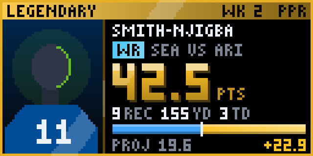
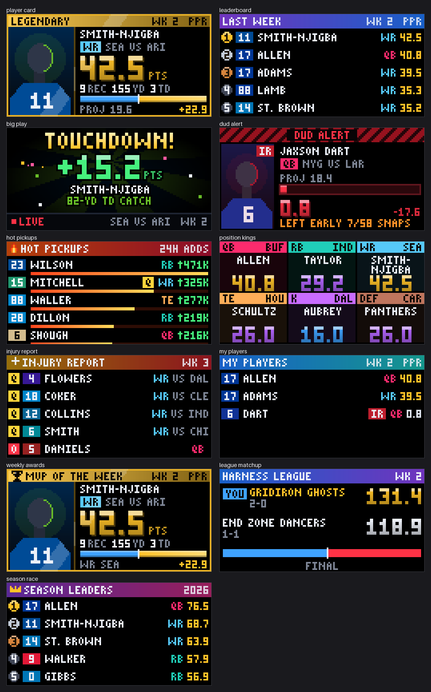
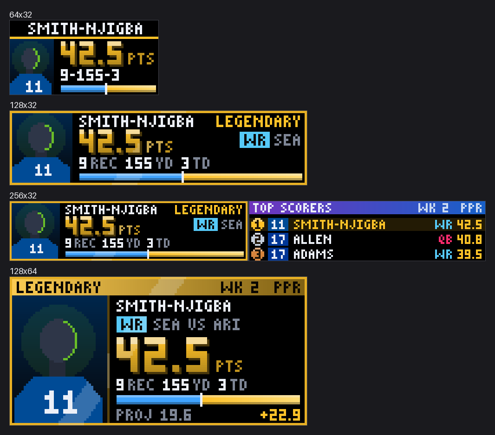

# Fantasy Blitz

An arcade-style NFL fantasy football show for your LED scoreboard. It needs no
league login. It shows the week's top fantasy scorers as collectible player
cards, a leaderboard, a celebration when someone scores big, the week's
biggest busts, the free agents everyone is adding, injury news, the best
player at each position, Tuesday's awards and the season race. It can also
follow a list of players you care about and the matchups in your own Sleeper or
ESPN league.



Points come from Sleeper's public feed, already calculated for PPR,
Half-PPR and Standard scoring, so they match what the fantasy apps show.
Game states, touchdown descriptions and player photos come from ESPN. Neither
needs an API key.

## The screens



| Screen | What it shows | When |
|--------|---------------|------|
| Player card | A top scorer's week as a trading card: photo, points, the stat line behind them, and an XP bar against their projection. The frame color is the card's rarity: gold (Legendary, 30+ points), purple (Epic, 20+), blue (Rare, 12+) | All week |
| Leaderboard | The top ten scorers, gold, silver and bronze coins for the top three | All week |
| Big play | A burst when a player gains 6+ points between two updates, with ESPN's description ("82-YD TD CATCH") and confetti for touchdowns. With live priority on, it interrupts the rotation for a few seconds | While games are live |
| Dud alert | The players who fell furthest below a projection of 12+. A player who got hurt early says LEFT EARLY instead of taking the blame | Once their game is over |
| Hot pickups | The free agents added most on Sleeper in the last 24 hours, with a heat bar; a second page shows the most dropped | Between games |
| Position kings | The top scorer at each position | Game days and the recap |
| Injury report | Injury tags (Q, D, O, IR) on the players who matter most this week | Tuesday until kickoff |
| My players | Points for the players on your watchlist | All week, when you have a watchlist |
| Weekly awards | MVP, Bust of the week, Biggest boom and Waiver hero | Tuesday and Wednesday |
| League matchup | Head-to-head scores from your own league, yours first | All week, when a league is set up |
| Season race | The season's top scorers so far | Between games |

Each screen turns itself off outside its part of the week, so the board never
shows an empty screen. In the off-season the plugin shows nothing and the
display skips it.

### The NFL week, as the board sees it

- **Tuesday and Wednesday:** last week's results, the weekly awards and the
  waiver wire.
- **Thursday to Sunday morning:** the injury report and hot pickups, plus last
  week's leaders.
- **Whenever a game is on:** the live leaderboard, player cards for the
  current leaders and big-play alerts.
- **Between Sunday's game windows:** the leaderboard and duds from the games
  that have finished.

## Fantasy football in 90 seconds

Each fantasy manager drafts real NFL players and picks who starts each week.
Those players' real stats become points, and whoever's starters score more
wins the week. Most leagues score it like this:

| What happened | Points |
|---------------|--------|
| Every 10 rushing or receiving yards | 1 |
| Every 25 passing yards | 1 |
| Rushing or receiving touchdown | 6 |
| Passing touchdown | 4 |
| Interception thrown, or fumble lost | -2 |
| Each catch | 1 in PPR, 0.5 in Half-PPR, 0 in Standard |

A **projection** is the expected point total for a player that week. Beating
it by a lot is a **boom**, missing it by a lot is a **bust**. The **waiver
wire** is the pool of players nobody in a league owns yet. **DEF** is a whole
team's defense, scored as one player. `9-155-3` on a small panel is fantasy
shorthand for 9 catches, 155 yards and 3 touchdowns.

## Setting it up

1. Install Fantasy Blitz from the Plugin Store and enable it.
2. Pick the **scoring format** your league uses (PPR if you are not sure).
3. Optional: add players to the **watchlist**, one name each (`Josh Allen`).
   If two players share a name, add the team: `Josh Allen BUF`. Watchlist
   players get their own screen and trigger big-play alerts at a lower
   threshold (3 points instead of 6).
4. Optional: set up **League** to add your own matchups (below).

### League sync

- **Sleeper:** set `provider` to `sleeper` and `league_id` to the long number
  in your league's web address. Sleeper leagues are public, so nothing else is
  needed.
- **ESPN:** set `provider` to `espn` and `league_id` to the number after
  `leagueId=` in your league's address. A public league needs nothing more. A
  private league also needs two cookies from a browser signed in to ESPN
  Fantasy: `espn_s2` and `SWID` (in your browser's developer tools, under
  storage or cookies for espn.com). They are stored in the secrets file, not
  in `config.json`.
- **Yahoo** is not supported: its API needs an app sign-in that a scoreboard
  cannot complete.

Set `team_name` to your team's name or your username, and your matchup is shown
first and marked YOU. Leave it empty to cycle through every matchup.

## Panel sizes



Every screen has a 32-row and a 64-row design that adapts to narrow, normal
and wide panels. On a 256-wide panel most screens show two things side by
side: the card and the leaderboard, two busts, or two matchups. Panels with
spare rows get a title band and a status bar, and very large panels draw the
128x64 design at 2x. Names too long for their space scroll when animations
are on, and are cut at a whole letter when they are off.

## Settings

| Setting | Type | Default | What it does |
|---------|------|---------|--------------|
| `enabled` | boolean | `false` | Enable Fantasy Blitz. |
| `scoring_format` | `ppr` / `half_ppr` / `standard` | `"ppr"` | How fantasy points are counted. PPR gives 1 point per catch, Half-PPR 0.5, Standard 0. Pick the one your league uses. |
| `top_n` | integer (1-10) | `5` | How many of the week's top scorers get a player card. |
| `positions.qb` | boolean | `true` | Show quarterbacks. |
| `positions.rb` | boolean | `true` | Show running backs. |
| `positions.wr` | boolean | `true` | Show wide receivers. |
| `positions.te` | boolean | `true` | Show tight ends. |
| `positions.k` | boolean | `true` | Show kickers. |
| `positions.def` | boolean | `true` | Show team defenses. |
| `watchlist` | array | `[]` | Players to follow, one name each (e.g. 'Josh Allen'). Add a team if a name is shared ('Josh Allen BUF'). They get their own screen and big-play alerts at a lower threshold. |
| `show_headshots` | boolean | `true` | Show player photos on the cards. When off, cards show a team-colour silhouette with the jersey number. |
| `live_priority` | boolean | `true` | Let a big fantasy play interrupt the rotation for a few seconds while games are on. |
| `spoiler_delay_seconds` | integer (0-300) | `0` | Hold live scores and big-play alerts back this many seconds, for watching on a delayed stream. |
| `display_duration` | number (5-300) | `20` | Seconds per screen when a screen's own duration is 0 and it has nothing to count. |
| `screens.player_card.enabled` | boolean | `true` | Show player cards. |
| `screens.player_card.duration` | integer (0-300) | `0` | Seconds on screen (0 = one card every few seconds until all are shown). |
| `screens.leaderboard.enabled` | boolean | `true` | Show the leaderboard. |
| `screens.leaderboard.duration` | integer (0-300) | `0` | Seconds on screen (0 = automatic). |
| `screens.big_play.enabled` | boolean | `true` | Show big play alerts. |
| `screens.big_play.duration` | integer (0-60) | `8` | Seconds each alert stays up. |
| `screens.dud_alert.enabled` | boolean | `true` | Show dud alerts. |
| `screens.dud_alert.duration` | integer (0-300) | `0` | Seconds on screen (0 = automatic). |
| `screens.hot_pickups.enabled` | boolean | `true` | Show hot pickups. |
| `screens.hot_pickups.show_drops` | boolean | `true` | Also show the players being dropped most. |
| `screens.hot_pickups.duration` | integer (0-300) | `0` | Seconds on screen (0 = automatic). |
| `screens.position_kings.enabled` | boolean | `true` | Show position kings. |
| `screens.position_kings.duration` | integer (0-300) | `0` | Seconds on screen (0 = automatic). |
| `screens.injury_report.enabled` | boolean | `true` | Show the injury report. |
| `screens.injury_report.duration` | integer (0-300) | `0` | Seconds on screen (0 = automatic). |
| `screens.watchlist.enabled` | boolean | `true` | Show the watchlist screen. |
| `screens.watchlist.duration` | integer (0-300) | `0` | Seconds on screen (0 = automatic). |
| `screens.weekly_awards.enabled` | boolean | `true` | Show the weekly awards. |
| `screens.weekly_awards.duration` | integer (0-300) | `0` | Seconds on screen (0 = automatic). |
| `screens.league_matchup.enabled` | boolean | `true` | Show league matchups when a league is set up. |
| `screens.league_matchup.duration` | integer (0-300) | `0` | Seconds on screen (0 = automatic). |
| `screens.season_race.enabled` | boolean | `true` | Show the season race. |
| `screens.season_race.duration` | integer (0-300) | `0` | Seconds on screen (0 = automatic). |
| `league.provider` | `none` / `sleeper` / `espn` | `"none"` | Where your league lives. |
| `league.league_id` | string | `""` | Your league's id: the long number in the league's web address. |
| `league.team_name` | string | `""` | Your team name or your username, so your matchup is shown first and marked YOU. Leave empty to show every matchup in turn. |
| `league.espn_s2` | string | `""` | **Secret** (kept in the secrets file). ESPN private leagues only: the espn_s2 cookie from a browser signed in to ESPN Fantasy. |
| `league.swid` | string | `""` | **Secret** (kept in the secrets file). ESPN private leagues only: the SWID cookie (it looks like {XXXXXXXX-...}). |
| `advanced.big_play_min_points` | number (1.0-50.0) | `6.0` | **Advanced.** Smallest jump in a player's points between two updates that counts as a big play. |
| `advanced.watchlist_min_points` | number (0.5-50.0) | `3.0` | **Advanced.** The big-play threshold for watchlist players (usually lower). |
| `advanced.bust_min_projection` | number (0.0-60.0) | `12.0` | **Advanced.** Only players projected for at least this many points can be a dud. |
| `advanced.tier_thresholds.legendary` | number (1.0-100.0) | `30.0` | **Advanced.** Gold, with a foil shimmer. |
| `advanced.tier_thresholds.epic` | number (1.0-100.0) | `20.0` | **Advanced.** Purple. |
| `advanced.tier_thresholds.rare` | number (1.0-100.0) | `12.0` | **Advanced.** Blue. |
| `advanced.live_poll_seconds` | integer (30-600) | `60` | **Advanced.** Seconds between score refreshes while a game is live. |
| `advanced.idle_poll_seconds` | integer (300-21600) | `900` | **Advanced.** Seconds between refreshes when no game is on. |
| `advanced.card_seconds` | integer (3-30) | `6` | **Advanced.** Seconds each card stays up before the next. |
| `advanced.animations` | boolean | `true` | **Advanced.** Animate the screens (count-ups, shimmer, confetti). Off draws each screen once, which is lighter on an older Pi. |
| `advanced.animation_fps` | integer (5-60) | `30` | **Advanced.** Frames per second for the animations. |
| `advanced.request_timeout` | integer (5-60) | `15` | **Advanced.** Seconds to wait for Sleeper or ESPN before giving up. |
| `advanced.headshot_downloads` | boolean | `true` | **Advanced.** Download player photos from ESPN. Off uses only photos already saved. |
| `vegas_mode` | `scroll` / `fixed` / `static` | `"scroll"` | **Advanced.** How Fantasy Blitz behaves in Vegas mode: scroll its top scorers through the ticker, scroll the whole panel as one block, or pause the ticker and show normally. |

A screen `duration` of 0 means "long enough to show everything": about six
seconds per card (`advanced.card_seconds`) and eight per page of a list.

## How often it updates

| Data | Source | Refresh |
|------|--------|---------|
| The current NFL week | Sleeper (`api.sleeper.app/v1/state/nfl`) | Every 15-30 minutes |
| Every player's stats and fantasy points | Sleeper (`api.sleeper.com/stats/nfl/...`) | Every minute while a game is live (`live_poll_seconds`), every 5 minutes between game windows, hourly once the week's games are done, and every 6 hours for a finished week |
| Projections and injury tags | Sleeper (`api.sleeper.com/projections/nfl/...`) | Every 6 hours |
| Trending adds and drops | Sleeper (`/v1/players/nfl/trending/...`) | Every 30 minutes |
| Season totals | Sleeper | Every 6 hours |
| Which games are live or final | ESPN scoreboard | Every minute during games, otherwise every 10 minutes |
| Touchdown descriptions | ESPN game summary | Only when a big play happens |
| Player photos and jersey numbers | ESPN search and headshots | Once per player, kept for a month |
| Fallback points, if Sleeper is down | ESPN fantasy feed | As for Sleeper |

Every request is cached, so a restart does not re-download anything that is
still fresh, and a failed request falls back to the last good copy. The core
calls the plugin every `live_poll_seconds` while a game is live and every
`idle_poll_seconds` otherwise.

Sleeper's stats and projections addresses are not part of its published API
docs. If Sleeper changes them, the plugin switches to ESPN's fantasy feed for
points and projections in your scoring format (without snap counts, so a
bust is only excused by an injury tag).

## Troubleshooting

- **Nothing shows:** the NFL is in its off-season or preseason, which the
  plugin treats as "nothing to show". It starts with Week 1.
- **No big-play alerts:** alerts only happen while games are live, need a
  jump of `advanced.big_play_min_points` (6) between two updates, and are
  held for `spoiler_delay_seconds` if you set one.
- **No photos:** photos download a few at a time, so a fresh install fills
  them in over the first few updates. Check `show_headshots` and
  `advanced.headshot_downloads`. Team defenses show the team crest.
- **League screen missing:** check `league.provider` and `league.league_id`.
  The plugin's info panel in the web UI names the problem (`league_problem`).
- **A watchlist name does not appear:** use the full name as the fantasy apps
  spell it; a bare last name only works when it is unique.

## Development

```bash
# From a LEDMatrix core checkout: every screen at every harness size, compared to the goldens
python scripts/check_plugin.py --plugin fantasy-blitz --plugin-dir /path/to/ledmatrix-plugins/plugins

# From this repo: the plugin's own tests
python scripts/run_plugin_tests.py fantasy-blitz --core /path/to/LEDMatrix

# README screenshots
python scripts/render_docs_assets.py --plugin fantasy-blitz --core-repo /path/to/LEDMatrix
```

The harness renders from `test/fixtures/cache.json`: real Sleeper and ESPN
data recorded for 2026 week 2 (with week 3 projections, injuries and trending
players), frozen on the Tuesday after. The queued big play and the league's
teams are seeded, and the three photos in the fixture are synthetic stand-ins,
not real headshots.
