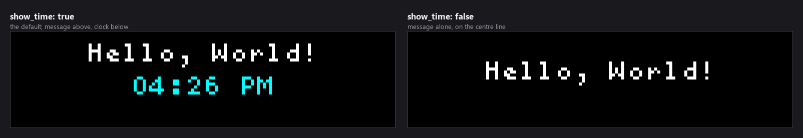

# Hello World

A deliberately tiny plugin that shows a message and the time. It exists for two
reasons: to prove your plugin setup works end to end, and to be **the thing you
copy when starting a new plugin**.


*Every image in this README is real plugin output, rendered at the true panel
size against a frozen clock and then scaled up so the pixels stay pixels.*

---

## Table of Contents

1. [Installation](#installation)
2. [Checking It Loaded](#checking-it-loaded)
3. [Configuration Reference](#configuration-reference)
   - [message and show_time](#message-and-show_time)
   - [Colours](#colours)
   - [Examples](#examples)
4. [Panel Sizes](#panel-sizes)
5. [Using This as a Template](#using-this-as-a-template)
6. [Troubleshooting](#troubleshooting)
7. [Development](#development)
8. [Support](#support)

---

## Installation

**From the Plugin Store (recommended).** Open the LEDMatrix web interface at
`http://<your-pi-ip>:5000`, go to **Plugin Manager**, find **Hello World** in
the **Plugin Store** section, and click **Install**.

**Manually.** Copy this directory into your LEDMatrix `plugin-repos/` and
restart the display service.

Unlike most plugins here, `enabled` defaults to **`true`** — it is meant to show
something the moment it is installed.

A ready-made config block is in
[`example_config.json`](example_config.json):

```json
{
  "hello-world": {
    "enabled": true,
    "message": "Hello, World!",
    "show_time": true,
    "color": [255, 255, 255],
    "time_color": [0, 255, 255],
    "display_duration": 10
  }
}
```

---

## Checking It Loaded

The quickest check is the **Plugin Manager** tab: installed plugins appear
under **Installed Plugins**, and a `hello-world` tab appears in the plugin row
at the top.

From SSH, tail the display log:

```bash
sudo journalctl -u ledmatrix -f | grep hello-world
```

You should see something like:

```text
Discovered plugin: hello-world v1.1.0
Loaded plugin: hello-world
Hello World plugin initialized with message: 'Hello, World!'
```

To see it immediately rather than waiting for the rotation, open its tab in the
web UI and click **Run On-Demand**.

---

## Configuration Reference

Six settings, and all six do something:

| Option | Type | Default | What it does |
|--------|------|---------|--------------|
| `enabled` | boolean | `true` | Whether the plugin runs at all |
| `message` | string | `"Hello, World!"` | The greeting text |
| `show_time` | boolean | `true` | Show the clock beneath the message |
| `color` | array | `[255, 255, 255]` | Message colour, `[R, G, B]` |
| `time_color` | array | `[0, 255, 255]` | Clock colour, `[R, G, B]` |
| `display_duration` | number | `10` | Seconds on screen before the rotation moves on |

### `message` and `show_time`



With `show_time` on, the message sits a third of the way down and the clock two
thirds. With it off, the message alone is drawn on the centre line.

**The message is not shrunk or wrapped.** It is drawn centred at whatever size
the font gives, so a message wider than the panel is clipped at both ends:


The default `Hello, World!` just fits a 128-wide panel. On a 64-wide panel it
does not — keep the message short, or use the
[Scrolling Text](../text-display/) plugin, which scrolls and can auto-size.

### Colours


Both are `[R, G, B]` arrays of integers from 0 to 255. The defaults deliberately
differ so the two lines read as separate things at a glance.

### Examples

**Minimal** — everything else takes its default:

```json
{ "hello-world": { "enabled": true } }
```

**A custom message and colour:**

```json
{
  "hello-world": {
    "enabled": true,
    "message": "Go Lightning!",
    "color": [0, 128, 255],
    "display_duration": 15
  }
}
```

**Message only, no clock:**

```json
{
  "hello-world": {
    "enabled": true,
    "message": "LED Matrix",
    "show_time": false,
    "color": [255, 0, 255]
  }
}
```

---

## Panel Sizes


Text is centred horizontally and placed by fractions of the panel height, so
the layout holds at any size. The only real constraint is message width — see
above.

---

## Using This as a Template

This plugin is intentionally small enough to read in one sitting, which is why
it is the recommended starting point for a new plugin.

| File | What it is |
|------|-----------|
| [`manager.py`](manager.py) | `HelloWorldPlugin`, implementing `update()` and `display()` from `BasePlugin` |
| [`manifest.json`](manifest.json) | Metadata, entry point, and class name — `class_name` must match the class in `manager.py` exactly |
| [`config_schema.json`](config_schema.json) | JSON Schema that generates the web UI settings form |
| [`requirements.txt`](requirements.txt) | Dependencies the plugin loader installs on first run |
| [`example_config.json`](example_config.json) | A config block to paste into `config/config.json` |

To start a new plugin: copy this directory, rename it, update `manifest.json`
(especially `id`, `class_name` and `entry_point`), and replace the bodies of
`update()` and `display()`.

**Two things worth copying deliberately**, because both are easy to get wrong
and this plugin got them wrong until recently:

- **`draw_text(x=...)` is the left edge, not the centre.** To centre text,
  either omit `x` entirely — the display manager centres it for you — or pass
  `centered=True` alongside it. Passing `x=width // 2` on its own starts the
  text at the midpoint and runs it off the right side.
- **Pass `color` on every `draw_text` call.** It is tempting to branch on which
  font you got and only pass the colour in one branch; the other branch then
  silently falls back to white, and the bug only shows up on installs where the
  font manager is available.

Fetch in `update()` and draw in `display()` — never hit the network from
`display()`, which runs every frame.

For deeper details, see the LEDMatrix core docs:

- [Plugin Development Guide](https://github.com/ChuckBuilds/LEDMatrix/blob/main/docs/PLUGIN_DEVELOPMENT_GUIDE.md)
- [Plugin API Reference](https://github.com/ChuckBuilds/LEDMatrix/blob/main/docs/PLUGIN_API_REFERENCE.md)
- [Plugin Architecture Spec](https://github.com/ChuckBuilds/LEDMatrix/blob/main/docs/PLUGIN_ARCHITECTURE_SPEC.md)
- [Advanced Plugin Development](https://github.com/ChuckBuilds/LEDMatrix/blob/main/docs/ADVANCED_PLUGIN_DEVELOPMENT.md)

and this repository's own
[plugin development docs](../../docs/plugin-development/).

---

## Troubleshooting

**The plugin does not appear in the rotation.**
Check it is enabled in **Plugin Manager** and that you restarted the display
service afterwards. Then check the **Logs** tab, or
`journalctl -u ledmatrix`, for errors mentioning `hello-world`.

**`Class HelloWorldPlugin not found in module`.**
`class_name` in `manifest.json` must match the class in `manager.py` exactly —
case-sensitive, no spaces. This is the single most common mistake when copying
this plugin to start a new one.

**The message is cut off at both ends.**
It is wider than the panel. The plugin centres but does not resize or wrap; use
a shorter message or a wider panel.

**Colours look wrong.**
Each value must be a three-element array of integers from 0 to 255. The
settings form rejects anything else, but a hand-edited `config.json` will not.

---

## Development

### Project structure

```text
hello-world/
├── manifest.json         # Plugin metadata and version history
├── manager.py            # HelloWorldPlugin
├── config_schema.json    # Settings schema; source of truth for defaults
├── example_config.json   # A config block to copy
├── requirements.txt      # None beyond the core
├── QUICK_START.md        # Enabling it and verifying it on a Pi
└── README.md
```

[`QUICK_START.md`](QUICK_START.md) covers getting it running on a real Pi and
checking it through the web API; this README covers what the settings do and
how to build on it.

### Regenerating the images in this README

```bash
python scripts/render_docs_assets.py --plugin hello-world
```

`--check` verifies the committed images still match. The clock is frozen in the
shot list so the time readout does not change on every run.

---

## Support

- YouTube: <https://www.youtube.com/@ChuckBuilds>
- Instagram: <https://www.instagram.com/ChuckBuilds/>
- Discord: <https://discord.com/invite/uW36dVAtcT>
- Sponsor: [GitHub Sponsors](https://github.com/sponsors/ChuckBuilds) ·
  [Buy Me a Coffee](https://buymeacoffee.com/chuckbuilds) ·
  [Ko-fi](https://ko-fi.com/chuckbuilds/)

Released under the GNU General Public License v3.0 — see [LICENSE](LICENSE).
