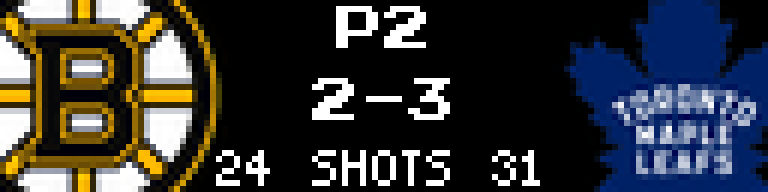
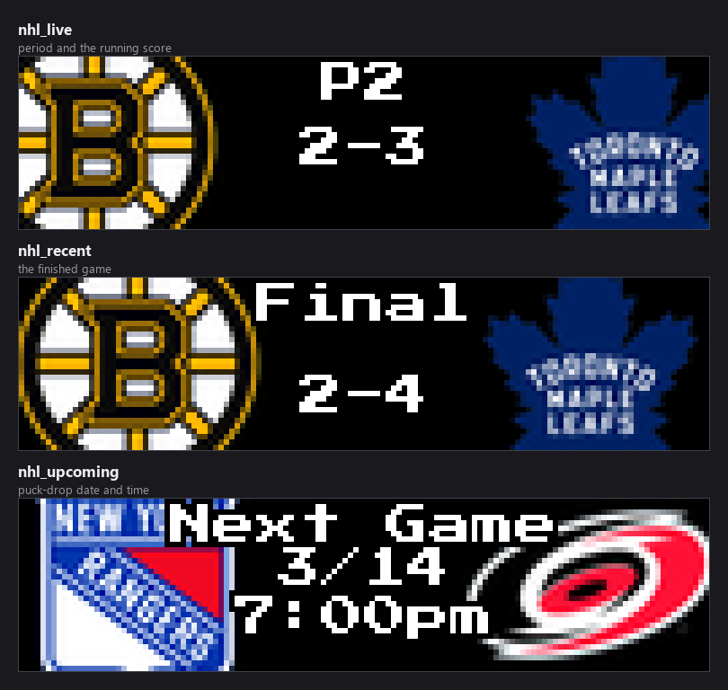
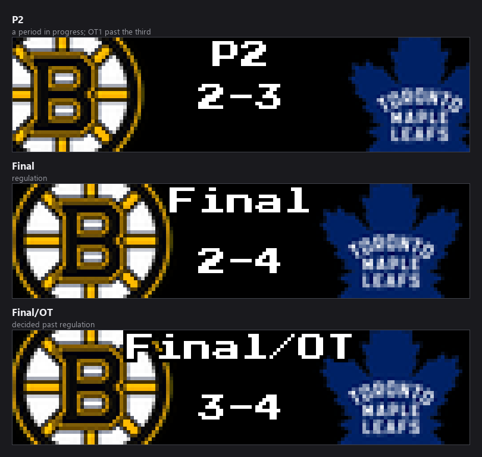
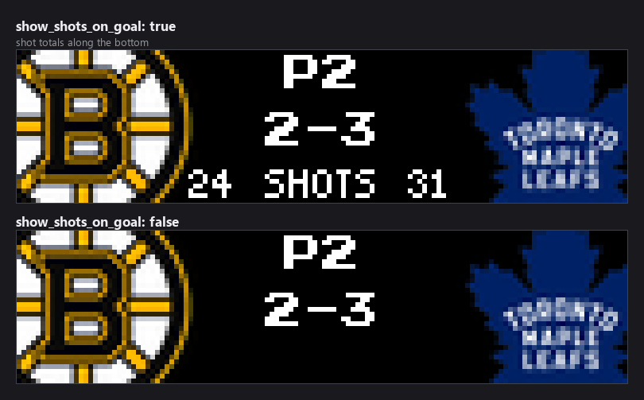
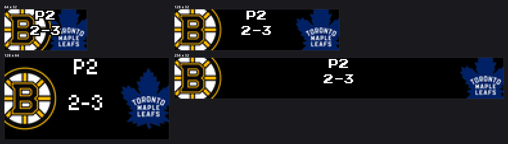
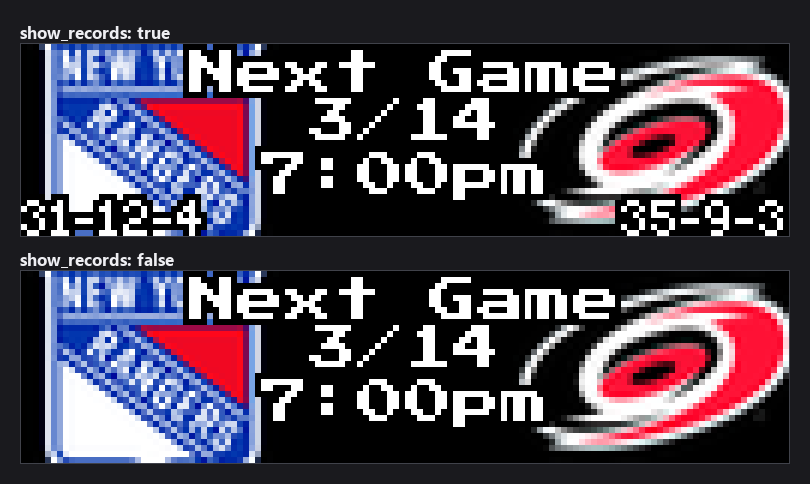

### Connect with ChuckBuilds

- Show support on YouTube: https://www.youtube.com/@ChuckBuilds
- Stay in touch on Instagram: https://www.instagram.com/ChuckBuilds/
- Want to chat or need support? Reach out on the ChuckBuilds Discord: https://discord.com/invite/uW36dVAtcT
- Feeling generous? Support the project:
  - GitHub Sponsors: https://github.com/sponsors/ChuckBuilds
  - Buy Me a Coffee: https://buymeacoffee.com/chuckbuilds
  - Ko-fi: https://ko-fi.com/chuckbuilds/

---

# Hockey Scoreboard

Live, recent, and upcoming games across **NHL**, **NCAA Men's**, and **NCAA
Women's** hockey on your LEDMatrix display, from ESPN's public API. No API key
required.



## Contents

- [Quick start](#quick-start)
- [Display modes](#display-modes)
- [The three leagues](#the-three-leagues)
- [Shots on goal](#shots-on-goal)
- [How games are chosen](#how-games-are-chosen)
- [Rotation, resume, and durations](#rotation-resume-and-durations)
- [Panel sizes](#panel-sizes)
- [Settings reference](#settings-reference)
- [Per-league settings](#per-league-settings)
- [Matchup separator and the upcoming card middle](#matchup-separator-and-the-upcoming-card-middle)
- [Fonts, colours and layout](#fonts-colours-and-layout)
- [Favorite team result colours](#favorite-team-result-colours)
- [Vegas ticker: seeing live games more often](#vegas-ticker-seeing-live-games-more-often)
- [Data source](#data-source)
- [Example configurations](#example-configurations)
- [Troubleshooting](#troubleshooting)

## Quick start

1. Install **Hockey Scoreboard** from the LEDMatrix Plugin Store.
2. Turn on `enabled`, then the leagues you want — `nhl` is on by default, both
   NCAA leagues are off.
3. Add your teams under each league's **Favorite Teams**.

```json
{
  "hockey-scoreboard": {
    "enabled": true,
    "nhl": {
      "enabled": true,
      "teams": {
        "favorite_teams": ["BOS", "TOR"],
        "favorite_teams_only": false
      },
      "filtering": {
        "recent_games_to_show": 3,
        "upcoming_games_to_show": 5
      },
      "live_priority": true
    },
    "ncaa_mens": {
      "enabled": true,
      "teams": { "favorite_teams": ["BU", "DEN"] }
    }
  }
}
```

## Display modes

Nine modes — three per league — that the LEDMatrix host rotation cycles through
independently.



| Mode | Shows | Top line |
|---|---|---|
| `nhl_live` | NHL games in progress | `P1`–`P3`, or `OT1` past the third |
| `nhl_recent` | Finished NHL games | `Final`, or `Final/OT` |
| `nhl_upcoming` | Scheduled NHL games | `Next Game`, then the date and puck drop |
| `ncaa_mens_live` / `_recent` / `_upcoming` | NCAA men's | As above |
| `ncaa_womens_live` / `_recent` / `_upcoming` | NCAA women's | As above |

The three period states:



Each mode renders as **switch** (one game at a time, timed) or **scroll** (all
games scroll horizontally at high FPS), set per league and per mode with
`<league>.display_modes.<mode>_display_mode`.

## The three leagues

Each league has its own managers, its own favorites, and its own config block.
The two NCAA blocks are **identical to each other**; the NHL block differs in
nine defaults, because an NHL night is a smaller, faster-moving slate than a
college one:

| Key | NHL | Both NCAA blocks |
|---|---|---|
| `<league>.enabled` | `true` | `false` |
| `<league>.live_priority` | `true` | `false` |
| `<league>.display_durations.live` | `20` | `15` |
| `<league>.update_intervals.base` | `60` | `300` |
| `<league>.update_intervals.live` | `30` | `60` |
| `<league>.display_options.show_records` | `false` | `true` |
| `<league>.display_options.show_ranking` | `false` | `true` |
| `<league>.display_options.show_shots_on_goal` | `true` | `false` |
| `<league>.display_options.show_powerplay` | `true` | `false` |

Everything else under [Per-league settings](#per-league-settings) is the same in
all three, with the prefix `nhl.`, `ncaa_mens.`, or `ncaa_womens.`.

## Shots on goal

`show_shots_on_goal` adds a shot line along the bottom of a live card. It is on
by default for the NHL, off for both NCAA leagues.



> **`show_powerplay` currently does nothing.** ESPN's power-play flag is read and
> stored on the game (`power_play`), and the setting is resolved into the
> manager's config, but nothing in this plugin or in the LEDMatrix core ever
> draws it. No value of the setting changes what appears. It is left in place
> rather than removed so a future release can wire it up without a breaking
> config change. Tracked as
> [issue #431](https://github.com/ChuckBuilds/ledmatrix-plugins/issues/431).

> **Shots do not appear on scroll or Vegas cards.** Those cards gate the shot
> line on a flat `show_shots` key at the league root, which the schema does not
> declare and the web UI therefore never writes — so it reads as `false` no
> matter what you set `show_shots_on_goal` to. Switch mode is unaffected.
> Tracked as
> [issue #432](https://github.com/ChuckBuilds/ledmatrix-plugins/issues/432).

## How games are chosen

**`upcoming_games_to_show` is not "how many cards you see".** It is the size of
a *pool*. The panel cycles through that pool one card at a time and keeps its
place between visits, so a pool of 3 means the board rotates through the same 3
games until the schedule moves on. A bigger number gives you a *longer lap*, so
any one game comes round **less** often.

Which regime you are in depends on that league's `teams.favorite_teams` and
`teams.favorite_teams_only`:

| `favorite_teams` | `favorite_teams_only` | What you get |
|---|---|---|
| empty | either | The next N games league-wide, chronologically. Every game is a non-favorite game, so the `other_*` filters apply to all of them. |
| set | **on** | Only your teams. The limit is a budget **per team**. |
| set | **off** (default) | **Your teams first, then other games to fill.** Both limits are **totals**. |

Note the key is `teams.favorite_teams_only`, not `show_favorite_teams_only` as
in the single-league scoreboards, and it defaults to **off** here.

### The selection settings

Per league, under `filtering`, all **Advanced**:

| Option | Default | Description |
|---|---|---|
| `recent_games_to_show` | `5` | Pool size for finished games. |
| `upcoming_games_to_show` | `10` | The same for scheduled games. |
| `other_recent_games_to_show` | `5` | How many **non-favorite** finished games to add. `0` gives favorites only. |
| `other_upcoming_games_to_show` | `10` | The same for scheduled games. |
| `other_rotation_interval_seconds` | `1800` | How often the non-favorite slice advances. `0` pins it. |
| `other_games_min_quality` | `ranked` | Which non-favorite games qualify: `any` or `ranked`. |
| `other_games_divisions` | `["fbs"]` | Which divisions non-favorite games may come from. |

**Your favorite teams are never filtered by the last two.** Those settings only
decide what fills the *remaining* slots.

> **Both are effectively inert in hockey.** `ranked` needs a national poll and
> the division filter needs ESPN's FBS/FCS group rosters, which are a college
> *football* taxonomy — no lookup is even attempted here, so every game passes
> both and neither costs a request. The schema's help text for
> `other_games_min_quality` also mentions a `broadcast` option that the enum
> does not offer; it was retired.

### Variety comes from turnover

Rather than widening the pool, the non-favorite slice **moves**: the window
advances by its own width every `other_rotation_interval_seconds`, so
consecutive windows do not overlap and the board works through the schedule
instead of resampling the front of it. Your favorites are not rotated — for
upcoming games the soonest ones are the point.

Both filters **fail open**: if the data behind them cannot be fetched, the game
is allowed through. They fail open a second time as a set — if the filters
between them leave nothing at all, the unfiltered list is used instead. Setting
`other_upcoming_games_to_show` or `other_recent_games_to_show` to `0` is the one
way to ask for an empty slate, and that is honoured.

### Live rotation

When several games are live at once the rotation is weighted: a game involving
one of your teams gets `teams.favorite_live_boost` turns for every one turn
other live games get, and is queued first whenever the rotation refreshes. It
never interrupts a game already on screen — it just gets more and sooner turns.
Set it to `1` for even rotation. It is independent of `live_priority`, which
controls whether live games preempt the recent/upcoming rotation at all.

A live game the API stops reporting for `update_intervals.stale_game_timeout`
seconds is dropped, so an abandoned game does not sit on the board forever.

### Shorter dwell for non-favorite live games

`display_durations.non_favorite_live` (0–120, default `0` = off) gives live
games involving **none** of your teams a shorter turn. It only takes effect when
favorite teams are configured **and** non-favorite live games are being shown —
`favorite_teams_only` off, or `show_all_live` on:

| Favorites set? | Non-favorite games shown? | Game has a favorite? | Duration used |
|---|---|---|---|
| No | — | — | `display_durations.live` |
| Yes | No | favorite | `display_durations.live` |
| Yes | Yes | favorite | `display_durations.live` |
| Yes | Yes | none | `display_durations.non_favorite_live`, when above `0` |

### Excluding teams

`teams.exclude_teams` hides teams from **both** the live rotation and the
recent/final scores — useful when you plan to watch a game delayed. It uses the
same abbreviations as `favorite_teams` and always wins when a team appears in
both lists.

## Rotation, resume, and durations

The plugin registers its nine modes in `manifest.json`, and the display
controller rotates through them in the order they appear:
`nhl_recent`, `nhl_upcoming`, `nhl_live`, then the same three for
`ncaa_mens`, then for `ncaa_womens`. Reorder them in `manifest.json` to change
the sequence.

A league or mode disabled in the config makes the plugin return `False` for that
mode and the controller skips it, so you can disable a whole league or a single
mode within one and the rotation closes up around it.

### Resume

When a mode's time runs out before it has shown every game in its pool, it
**resumes where it left off** on the next visit rather than restarting:

```text
Cycle 1: Recent mode (60s, 10 games in the pool)
  games 1-4 shown, time expires, rotate

Cycle 2: Recent mode resumes
  games 5-8 shown, time expires, rotate

Cycle 3: Recent mode resumes
  games 9-10 shown, full lap complete, progress resets
```

### Dynamic duration

With no per-mode duration configured, the mode's total is calculated as
`number_of_games x per_game_duration` — 24 games at 15s each is a 360-second
mode. That shows everything but can make a mode very long on a full slate, which
is what `dynamic_duration.max_duration_seconds` is for.

## Panel sizes



The plugin passes the render-safety harness with no failures. At 64x32 the two
crests and the centre column share very little room; 128x32 or wider is a much
better fit, especially with the shot line enabled.

## Settings reference

Settings marked **Advanced** sit behind the *Advanced* toggle in the web UI.
Defaults are the schema defaults, which is what the web UI writes.

### Plugin level

| Key | Type | Default | What it does |
|---|---|---|---|
| `enabled` | boolean | `false` | Master on/off switch for the whole plugin. |
| `timezone` | string | `""` | **Advanced.** IANA zone for start times, e.g. `America/Chicago`. Blank follows the LEDMatrix global timezone, then the host system's, then UTC. |
| `schedule_lookback_days` | 1–60 | `14` | **Advanced.** How far back to fetch for the Recent screens. |
| `schedule_lookahead_days` | 1–60 | `7` | **Advanced.** How far ahead to fetch for Upcoming. A game beyond this horizon is never fetched. |
| `no_data_interval_seconds` | 5–86400 s | `300` | **Advanced.** Wait between live checks when nothing is live. Backs off further the longer nothing is found. |
| `live_idle_max_interval_seconds` | 5–86400 s | `900` | **Advanced.** Ceiling for that back-off. Useful out of season. |

### Defaults

Fallbacks used when the corresponding per-league setting is absent.

| Key | Type | Default | What it does |
|---|---|---|---|
| `defaults.display_duration` | 5–60 s | `15` | Per-game on-screen time. |
| `defaults.show_records` | boolean | `false` | Draw win-loss records. |
| `defaults.show_ranking` | boolean | `false` | **Advanced.** Draw poll rank badges. |
| `defaults.show_odds` | boolean | `false` | **Advanced.** Draw betting odds. |
| `defaults.show_shots_on_goal` | boolean | `false` | Draw the shot line on live cards. |
| `defaults.show_powerplay` | boolean | `true` | Highlight power plays. Nothing draws this — see [Shots on goal](#shots-on-goal). |
| `defaults.update_interval_seconds` | 30–86400 s | `3600` | **Advanced.** Base data refresh cadence. |
| `defaults.season_cache_duration_seconds` | 3600–604800 s | `86400` | **Advanced.** How long season data is cached. |

> **The per-league copy wins, and several of its defaults are different.** Each
> league's `display_options.*` overrides the matching `defaults.*`. Because the
> web UI writes schema defaults on save, a saved config already carries the
> per-league value, and changing the `defaults` copy then appears to do nothing.
> Change the per-league setting. The clearest case is
> `show_shots_on_goal`: `false` under `defaults`, `true` under `nhl`.

## Per-league settings

Every table below exists three times — under `nhl`, `ncaa_mens`, and
`ncaa_womens` — with the same keys. `<league>` stands for any of them; where the
NHL default differs, both are given as *NHL / NCAA*.

### Enable and priority

| Key | Type | Default | What it does |
|---|---|---|---|
| `<league>.enabled` | boolean | `true` / `false` | Build this league's managers at all. |
| `<league>.live_priority` | boolean | `true` / `false` | Let this league's live games interrupt the rotation and display immediately. |

### Display modes

| Key | Type | Default |
|---|---|---|
| `<league>.display_modes.live` | boolean | `true` |
| `<league>.display_modes.recent` | boolean | `true` |
| `<league>.display_modes.upcoming` | boolean | `true` |
| `<league>.display_modes.live_display_mode` | `switch` \| `scroll` | `switch` (**Advanced**) |
| `<league>.display_modes.recent_display_mode` | `switch` \| `scroll` | `switch` (**Advanced**) |
| `<league>.display_modes.upcoming_display_mode` | `switch` \| `scroll` | `switch` (**Advanced**) |

### Teams

| Key | Type | Default | What it does |
|---|---|---|---|
| `<league>.teams.favorite_teams` | array | `[]` | Teams to prioritise, by abbreviation. |
| `<league>.teams.favorite_teams_only` | boolean | `false` | Show only your teams' games. |
| `<league>.teams.show_all_live` | boolean | `false` | Show every live game regardless of favorites. |
| `<league>.teams.exclude_teams` | array | `[]` | **Advanced.** Teams to always hide, from the live rotation and from finals alike. Takes precedence over `favorite_teams` and `show_all_live`. |
| `<league>.teams.favorite_live_boost` | 1–5 | `2` | **Advanced.** Turns a favorite's live game gets per one turn for other live games. `1` is even rotation. |

### Filtering

See [The selection settings](#the-selection-settings). All **Advanced**.

| Key | Type | Default |
|---|---|---|
| `<league>.filtering.recent_games_to_show` | 1–20 | `5` |
| `<league>.filtering.upcoming_games_to_show` | 1–50 | `10` |
| `<league>.filtering.other_recent_games_to_show` | 0–20 | `5` |
| `<league>.filtering.other_upcoming_games_to_show` | 0–20 | `10` |
| `<league>.filtering.other_rotation_interval_seconds` | 0–86400 s | `1800` |
| `<league>.filtering.other_games_min_quality` | `any` \| `ranked` | `ranked` |
| `<league>.filtering.other_games_divisions` | array | `["fbs"]` |

### Update intervals

All **Advanced**.

| Key | Type | Default (NHL / NCAA) | What it does |
|---|---|---|---|
| `<league>.update_intervals.base` | 15–300 s | `60` / `300` | Base data refresh. |
| `<league>.update_intervals.live` | 10–300 s | `30` / `60` | Refresh while a game is live. |
| `<league>.update_intervals.recent` | 60–86400 s | `3600` | Refresh for finished games. |
| `<league>.update_intervals.upcoming` | 60–86400 s | `3600` | Refresh for the schedule. |
| `<league>.update_intervals.odds` | 60–86400 s | `3600` | Refresh for betting odds. |
| `<league>.update_intervals.stale_game_timeout` | 60–3600 s | `300` | Drop a live game the API has stopped updating. |

### Display durations

All **Advanced**.

| Key | Type | Default (NHL / NCAA) | What it does |
|---|---|---|---|
| `<league>.display_durations.base` | 5–60 s | `15` | Fallback per-game time. |
| `<league>.display_durations.live` | 5–120 s | `20` / `15` | Per-game time for live games. |
| `<league>.display_durations.non_favorite_live` | 0–120 s | `0` | Shorter turn for live games with no favorite. `0` means use the live duration for everything. |
| `<league>.display_durations.recent` | 5–60 s | `15` | Per-game time on the Recent screen. |
| `<league>.display_durations.upcoming` | 5–60 s | `15` | Per-game time on the Upcoming screen. |

### Display options

All **Advanced**.

| Key | Type | Default (NHL / NCAA) | What it does |
|---|---|---|---|
| `<league>.display_options.show_records` | boolean | `false` / `true` | Draw win-loss records in the bottom corners. |
| `<league>.display_options.show_ranking` | boolean | `false` / `true` | Draw poll rank badges where available. |
| `<league>.display_options.show_odds` | boolean | `false` | Draw betting odds. |
| `<league>.display_options.show_shots_on_goal` | boolean | `true` / `false` | Draw the shot line on live cards. |
| `<league>.display_options.show_powerplay` | boolean | `true` / `false` | Highlight power plays. Nothing draws this yet. |



### Mode durations

How long the *whole mode* holds the board before the core rotates on. `null`
uses the dynamic calculation. All **Advanced**, and read by the LEDMatrix core
rather than by this plugin, which is why they do not appear in the plugin's own
source.

| Key | Type | Default |
|---|---|---|
| `<league>.mode_durations.live_mode_duration` | 10–600 s or `null` | `null` |
| `<league>.mode_durations.recent_mode_duration` | 10–600 s or `null` | `null` |
| `<league>.mode_durations.upcoming_mode_duration` | 10–600 s or `null` | `null` |

### Dynamic duration

All **Advanced**.

| Key | Type | Default |
|---|---|---|
| `<league>.dynamic_duration.enabled` | boolean | `false` |
| `<league>.dynamic_duration.max_duration_seconds` | 60–600 s | — |
| `<league>.dynamic_duration.modes.live.enabled` | boolean | `false` |
| `<league>.dynamic_duration.modes.live.max_duration_seconds` | 60–600 s | — |
| `<league>.dynamic_duration.modes.recent.enabled` | boolean | `false` |
| `<league>.dynamic_duration.modes.recent.max_duration_seconds` | 60–600 s | — |
| `<league>.dynamic_duration.modes.upcoming.enabled` | boolean | `false` |
| `<league>.dynamic_duration.modes.upcoming.max_duration_seconds` | 60–600 s | — |

### Scroll settings

All **Advanced**, and per league.

| Key | Type | Default | What it does |
|---|---|---|---|
| `<league>.scroll_settings.scroll_speed` | 1.0–200.0 px/s | `50.0` | Higher scrolls faster. |
| `<league>.scroll_settings.scroll_delay` | 0.001–0.1 s | `0.01` | Frame delay; `0.01` is 100 FPS. Lower is smoother. |
| `<league>.scroll_settings.gap_between_games` | 8–128 px | `48` | Gap between game cards. |
| `<league>.scroll_settings.show_league_separators` | boolean | `true` | Draw the NHL shield or NCAA logos between leagues. |
| `<league>.scroll_settings.dynamic_duration` | boolean | `true` | Size the scroll duration from the content width. |
| `<league>.scroll_settings.game_card_width` | 32–512 px | `128` | Card width. Lower it on a multi-panel chain to fit more games on screen at once. |

## Matchup separator and the upcoming card middle

The **Matchup Card Layout** section (`scroll_card`) controls what sits between
the two crests before a game starts, and how the date and time are written.
Plugin-wide, not per league.

| Setting | Key | Default | What it does |
|---|---|---|---|
| Matchup Separator | `scroll_card.vs_text` | `VS` | Text between the teams: `VS`, `@`, `at`, `v`. The away side is always on the left, so `@` and `at` read as "away at home". Blank draws nothing. |
| Middle of an Upcoming Card | `scroll_card.upcoming_center` | `vs` | Scroll and Vegas cards: `vs`, `date_time`, or `none`. |
| Middle of a Full-Screen Upcoming Scoreboard | `scroll_card.switch_upcoming_center` | `date_time` | The same choice for the full-screen scoreboard, plus `inherit` to follow the row above. |
| Date Format | `scroll_card.date_format` | `abbrev` | Scroll and Vegas cards: `Sep 19`, `9/19`, `19 Sep`, `19/9`, or `Fri Sep 19`. |
| Full-Screen Date Format | `scroll_card.switch_date_format` | `numeric` | **Advanced.** The same for the full-screen scoreboard, plus `inherit`. It has its own default because the two displays disagree about what is normal. |
| Time Format | `scroll_card.time_format` | `12h` | 12- or 24-hour clock. |
| Show Date / Show Time | `scroll_card.show_date`, `scroll_card.show_time` | `true` | Drop either line. |
| Swap Date and Time | `scroll_card.swap_date_time` | `false` | Flip the two lines. Each display starts from its own order, so this flips rather than forces. |

The centre-gap settings size the scroll and Vegas card's middle strip only — the
full-screen scoreboard pins its crests to the panel edges and is unaffected.

| Key | Type | Default | What it does |
|---|---|---|---|
| `scroll_card.center_gap` | 0–64 px | unset | Pixels kept clear down the middle. Unset scales with card width; `0` restores edge-to-edge logos. |
| `scroll_card.center_gap_ratio` | 0.0–0.6 | `0.28` | **Advanced.** Fraction of card width used when the gap is not pinned. |
| `scroll_card.center_gap_min` | 0–64 px | `22` | **Advanced.** Floor for the scaled gap. |
| `scroll_card.center_gap_max` | 0–96 px | `40` | **Advanced.** Ceiling for the scaled gap. |

## Fonts, colours and layout

Seven text elements, each with `font`, `font_size`, and `text_color`, under
`customization.<element>`. All **Advanced**.

| Element | Default font | Default size | Draws |
|---|---|---|---|
| `score_text` | `PressStart2P-Regular.ttf` | `10` | The score, and the matchup separator on an upcoming card |
| `period_text` | `PressStart2P-Regular.ttf` | `8` | The period, and the date/time on an upcoming scoreboard |
| `team_name` | `PressStart2P-Regular.ttf` | `8` | Team names and abbreviations |
| `status_text` | `4x6-font.ttf` | `6` | Status lines such as "Next Game" |
| `detail_text` | `4x6-font.ttf` | `6` | Small detail lines, including the shot line |
| `rank_text` | `PressStart2P-Regular.ttf` | `10` | Rank badges |
| `odds_text` | `4x6-font.ttf` | `6` | Betting odds (defaults to green, `[0, 255, 0]`) |

Colours are `[r, g, b]` or `"#RRGGBB"`. Every default is white except
`odds_text`. Odds sizes snap to the face's pixel grid to stay crisp:
`4x6-font.ttf` to 7, 14, 21; press_start to 8, 16. Every
`customization.<element>` object sets `additionalProperties: false`.

```json
{
  "customization": {
    "score_text": { "text_color": [255, 200, 0] },
    "status_text": { "text_color": "#00A0FF" }
  }
}
```

### Layout offsets

Nudge any element in pixels. All default to `0`, all **Advanced**, all under
`customization.layout.<element>`, and all set `additionalProperties: false`.

| Element | Keys | Measured from |
|---|---|---|
| `home_logo`, `away_logo` | `x_offset`, `y_offset` | Default logo position |
| `score` | `x_offset`, `y_offset` | Panel centre |
| `status_text` | `x_offset`, `y_offset` | Centre horizontally, top vertically |
| `date` | `x_offset`, `y_offset` | Centre horizontally, default position vertically |
| `time` | `x_offset`, `y_offset` | Centre horizontally, the date's position vertically |
| `records` | `away_x_offset`, `home_x_offset`, `y_offset` | Away from the left, home from the right, both from the bottom |
| `odds` | `x_offset`, `y_offset` | Default odds position |

## Favorite team result colours

A run of games against the same opponent is hard to read at a glance: in scroll
and Vegas mode the same two crests go past several times and only the digits
change. Turn this on to colour a finished game's score by how your team did.

| Key | Type | Default |
|---|---|---|
| `customization.favorite_result_colors.enabled` | boolean | `false` |
| `customization.favorite_result_colors.win_color` | `[r, g, b]` | `[0, 255, 0]` |
| `customization.favorite_result_colors.loss_color` | `[r, g, b]` | `[255, 0, 0]` |
| `customization.favorite_result_colors.tie_color` | `[r, g, b]` | `[255, 200, 0]` |

```json
{
  "customization": {
    "favorite_result_colors": {
      "enabled": true,
      "win_color": [0, 255, 0],
      "loss_color": [255, 0, 0],
      "tie_color": [255, 200, 0]
    }
  }
}
```

- Only finished games are coloured; live and upcoming cards are untouched.
- A game needs **exactly one** favorite team. Neither side or both, and the score
  keeps its normal colour.
- The three colours are Advanced settings.

This tint is applied by the LEDMatrix core rather than by the plugin, which is
why the keys do not appear in this plugin's source.

## Vegas ticker: seeing live games more often

By default a live game **takes over** the display. To keep the marquee scrolling
and still see scores, set this in the **core** config — not in this plugin's
settings:

```json
{
  "display": {
    "vegas_scroll": {
      "live_in_ticker": true,
      "live_weight": 3,
      "favorite_live_weight": 5
    }
  }
}
```

The ticker is otherwise a strict round robin — every plugin appears once per
cycle. These weights let this plugin claim several slots per cycle, spaced
evenly through it. `live_weight` applies whenever this scoreboard has a live
game; `favorite_live_weight` when one of your teams is playing. That distinction
has to be made here rather than in the core, which can tell *that* a game is
live but not *whose*.

- The weight is per **plugin**, not per game. With four games live this
  scoreboard still occupies one slot at a time and picks between its own games
  using `favorite_live_boost`.
- More slots make the cycle **longer**, not faster.

## Data source

ESPN's public site API, no key required:

- NHL: `https://site.api.espn.com/apis/site/v2/sports/hockey/nhl/scoreboard`
- NCAA men's: `.../hockey/mens-college-hockey/scoreboard`
- NCAA women's: `.../hockey/womens-college-hockey/scoreboard`

Crests are downloaded on first sight and cached under
`assets/sports/nhl_logos/`, `assets/sports/ncaa_mens_logos/`, and
`assets/sports/ncaa_womens_logos/`. If a download fails, a placeholder is
generated from the team abbreviation.

## Example configurations

### NHL only

```json
{
  "hockey-scoreboard": {
    "enabled": true,
    "nhl": {
      "enabled": true,
      "teams": { "favorite_teams": ["BOS", "TOR", "NYR"] },
      "display_options": { "show_shots_on_goal": true, "show_records": true }
    }
  }
}
```

### NCAA men's only

```json
{
  "hockey-scoreboard": {
    "enabled": true,
    "nhl": { "enabled": false },
    "ncaa_mens": {
      "enabled": true,
      "teams": { "favorite_teams": ["BU", "DEN", "MIN"] },
      "live_priority": true
    }
  }
}
```

### All three leagues

```json
{
  "hockey-scoreboard": {
    "enabled": true,
    "defaults": { "display_duration": 15 },
    "nhl": {
      "enabled": true,
      "teams": { "favorite_teams": ["BOS"] }
    },
    "ncaa_mens": {
      "enabled": true,
      "teams": { "favorite_teams": ["BU"] }
    },
    "ncaa_womens": {
      "enabled": true,
      "teams": { "favorite_teams": ["WIS"] }
    }
  }
}
```

With three leagues enabled, nine modes enter the rotation and any one league's
games come round roughly a third as often. Disabling the modes you do not watch
— say, every league's Upcoming screen — is usually better than shortening
durations.

## Troubleshooting

**Nothing appears.** Check that `enabled` is on, and that the league's own
`enabled` is on — both NCAA leagues are off by default.

**Shots on goal never show.** In scroll or Vegas mode they cannot — see
[issue #432](https://github.com/ChuckBuilds/ledmatrix-plugins/issues/432). In
switch mode, confirm `<league>.display_options.show_shots_on_goal` is `true`;
the NCAA leagues default it to `false`, and the `defaults` copy does not
override the per-league one.

**Power-play highlighting never shows.** Nothing draws it yet — see
[issue #431](https://github.com/ChuckBuilds/ledmatrix-plugins/issues/431).

**Records or rank badges are on when I turned them off.** You changed the
`defaults` copy. The per-league `display_options` copy wins, and both NCAA
leagues default those to `true`.

**Start times look like UTC.** The plugin could not read your global timezone.
Set `timezone` under Advanced Settings to your IANA zone.

**The same few games keep repeating.** That is the pool cycling. Lower
`other_rotation_interval_seconds` for faster turnover rather than raising the
pool size — a larger pool makes the lap longer, so each game appears less often,
not more.

**A finished game disappeared too soon.** Raise `schedule_lookback_days`
(default 14).

**A game I know about never appears.** It may be beyond
`schedule_lookahead_days` (default 7). A game outside that horizon is never
fetched.

## License

See `LICENSE`.
