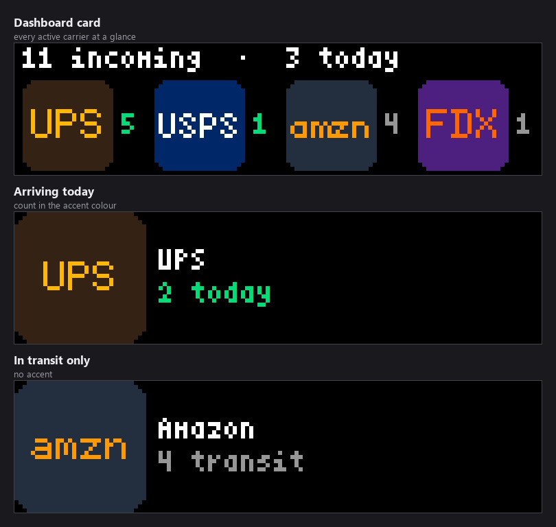
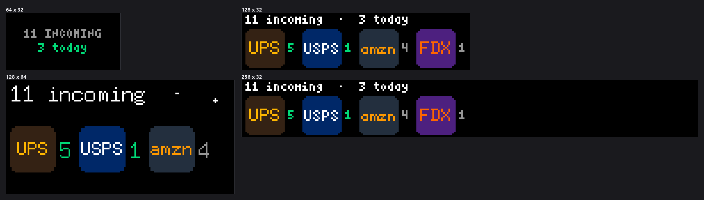
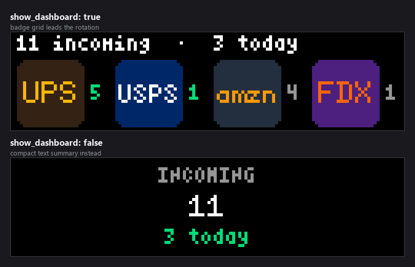
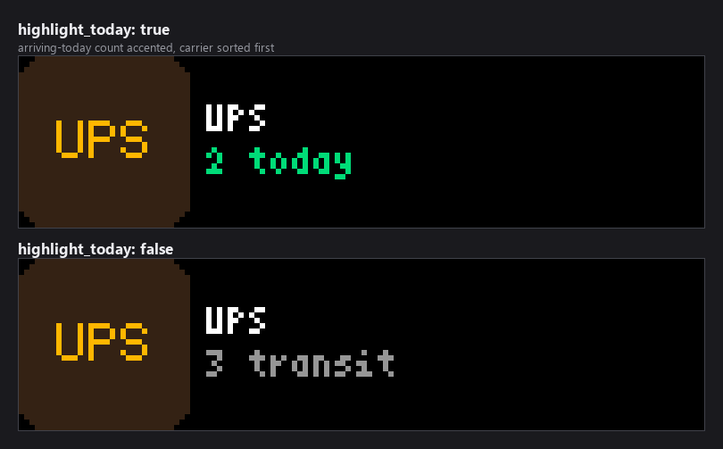
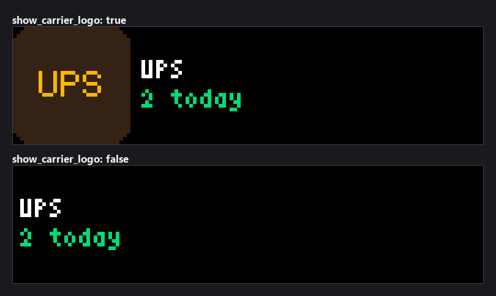
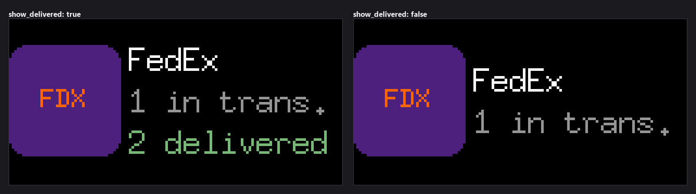

# Incoming Packages

Rotating cards on your LEDMatrix for packages headed your way — one per active
carrier, with the count **arriving today** prioritized and highlighted, plus a
lead summary card.


*Every image in this README is real plugin output from the built-in `mock`
provider, rendered at the true panel size and scaled up so the pixels stay
pixels.*

> **This plugin does not use the Shop app** — Shopify exposes no public API for a
> consumer's package list. Instead it reads a normalized snapshot from a pluggable
> **provider** (default: Home Assistant). The plugin only ever stores an API URL +
> token and reads data — **it never touches your email**.

## Requirements

The default (recommended) setup relies on **one Home Assistant HACS integration**:

- **[Mail and Packages](https://github.com/moralmunky/Home-Assistant-Mail-And-Packages)**
  by `moralmunky` — a HACS custom integration that scans your email **locally inside
  Home Assistant** ("no data leaves your instance") for shipping notifications and
  publishes per-carrier sensors (USPS/UPS/FedEx/DHL/Amazon/Walmart/…) plus the USPS
  Informed Delivery mail image.

This plugin reads those sensors over your LAN via Home Assistant's REST API. The
email scanning stays entirely inside Home Assistant; **the plugin itself only holds
an HA URL + token and never accesses your email**.

> Don't run Home Assistant? Use `provider: mock` to preview it, or `provider:
> aftership` with an AfterShip account (see [Providers](#providers)).

## Setup (Home Assistant)

1. **Install HACS** in Home Assistant if you haven't
   ([hacs.xyz](https://hacs.xyz)).
2. **Install "Mail and Packages"** via HACS (HACS → Integrations → search *Mail and
   Packages* → download), then **restart Home Assistant**.
3. **Configure Mail and Packages** (Settings → Devices & Services → Add Integration →
   *Mail and Packages*) with your email account. This is where your email credentials
   live — in Home Assistant, not in this plugin. Confirm you see `sensor.*_mail_*`
   entities appear.
4. **Create a Long-Lived Access Token** in Home Assistant: click your user (bottom
   left) → **Security** → *Long-Lived Access Tokens* → **Create Token** → copy it.
5. **Configure this plugin** (in the LEDMatrix web UI or config):
   - `provider`: `homeassistant`
   - `ha_base_url`: your HA URL, e.g. `http://homeassistant.local:8123`
     (use the IP, e.g. `http://192.168.1.50:8123`, if the name doesn't resolve)
   - `ha_token`: the long-lived token from step 4
6. Enable the plugin and add `incoming_packages` to your display rotation.

The provider **auto-discovers** the Mail and Packages sensors regardless of the
integration's config-entry name (e.g. `sensor.imap_gmail_com_mail_*`) — no
per-carrier or per-package setup. It reads each carrier's *delivering* (arriving
today) and *packages* (in transit) counts, the delivered totals, the USPS mail
count/image, and Home Assistant's own summary string.

## Providers

- **`homeassistant`** (default) — Mail and Packages sensors, as above.
- **`aftership`** — set `provider: aftership` and an AfterShip `api_key`; reads your
  AfterShip tracking list and aggregates it into the same per-carrier snapshot.
- **`mock`** — built-in demo data to preview the layout on the panel with no
  credentials (also used by the offline test harness).

## Display

- **Rotating cards**, `rotation_interval` seconds each:
  - a lead **dashboard** card — every active carrier at a glance (badge + count,
    green when arriving today) — or a compact text summary (`show_dashboard`);
  - an **animated USPS Informed Delivery** image card when there is mail: it plays
    through each scanned mail piece (`show_usps_mail_image`, `image_frame_seconds`);
  - a **per-carrier delivery image** card when a carrier is out for delivery today —
    the scanned delivery photo from Home Assistant's carrier cameras
    (`show_delivery_images`; Amazon/UPS/FedEx/Walmart/USPS/…);
  - a **count card** per carrier otherwise — a drawn carrier badge, the count
    arriving today (accent color when `highlight_today`), in transit, and a
    "N delivered" confirmation (`show_delivered`).
- Carriers arriving today are sorted first. Known carriers include USPS, UPS,
  FedEx, DHL, Amazon, Walmart, Deutsche Post and more.
- **Size-adaptive**: reads the panel dimensions every frame, picks a bitmap font
  tier sized to the panel, and marquee-scrolls or truncates text that would
  overflow — renders correctly from 64×32 to 256×64.
- When idle it shows Home Assistant's own summary string ("No mail today. No
  packages in transit.").
- **Resilient**: keeps showing the last-good data through a brief Home Assistant
  hiccup rather than blanking, with a small amber "Xm ago" freshness marker once
  the data is stale (`stale_after_minutes`).



Carriers with something arriving today are sorted ahead of carriers that only
have packages in transit, and their count is drawn in `accent_color`.

Carrier badges are drawn (colored badge + abbreviation), so no trademarked logo
images are bundled. Drop a `assets/carrier_logos/<slug>.png` (e.g. `ups.png`,
`fedex.png`) to override a badge with your own image.



The plugin reads the panel size every frame and picks a bitmap font tier to
match, shortening labels rather than overflowing — `in transit` becomes
`in trans.` when the card is narrow.

## Configuration

Settings live in the plugin's tab in the web UI and in `config/config.json`
under `incoming-packages`. The full schema is
[`config_schema.json`](config_schema.json).

### Connection

| Key | Default | Notes |
|---|---|---|
| `enabled` | `false` | Master switch |
| `provider` | `homeassistant` | `homeassistant`, `aftership`, or `mock` — see [Providers](#providers) |
| `ha_base_url` | `""` | Home Assistant URL, e.g. `http://homeassistant.local:8123`. Used by the `homeassistant` provider |
| `ha_token` | — | Home Assistant long-lived access token. Stored as a secret, so the web UI masks it |
| `api_key` | — | AfterShip API key. Only read when `provider` is `aftership`. Also a secret |
| `entity_prefix` | `sensor.mail_` | Mail and Packages entity prefix. Advanced; the provider auto-discovers the sensors, so this is rarely needed |
| `update_interval` | `600` | Seconds between provider refreshes (60–7200). Advanced |
| `stale_after_minutes` | `60` | Data older than this gets the amber "Xm ago" freshness marker (5–1440). Advanced |

### What appears on the cards

| Key | Default | Notes |
|---|---|---|
| `show_dashboard` | `true` | Lead with the badge grid rather than a compact text summary |
| `show_carrier_logo` | `true` | Draw the carrier badge on each card |
| `show_delivered` | `true` | Add the "N delivered" confirmation for packages delivered today |
| `include_delivered` | `false` | Also give already-delivered packages their own card |
| `show_usps_mail_image` | `true` | Include the USPS Informed Delivery mail card when there is mail |
| `show_delivery_images` | `true` | Show a carrier's scanned delivery photo when it is out for delivery today |
| `highlight_today` | `true` | Sort arriving-today carriers first and accent their count |
| `accent_color` | `[0, 220, 120]` | The accent colour used for that highlight |
| `customization.title_text.text_color` | `[255, 255, 255]` | Colour of the primary text |

### Rotation and motion

| Key | Default | Notes |
|---|---|---|
| `display_duration` | `30` | Seconds the plugin holds the screen per turn in the rotation (1–300) |
| `rotation_interval` | `6` | Seconds each card is shown before the next (1–60). Advanced |
| `max_cards` | `8` | Cap on how many cards are in the rotation (1–20). Advanced |
| `image_frame_seconds` | `1.5` | Seconds per frame when animating the USPS mail image (0.2–10). Advanced |
| `scroll_enabled` | `true` | Marquee-scroll text too long to fit rather than truncating. Advanced |
| `scroll_speed` | `5` | Frames between marquee steps; higher is slower (1–30). Advanced |
| `scroll_separator` | `"   "` | Text inserted between marquee loops. Advanced |
| `timezone` | `""` | Override the timezone used to decide what "today" means. Empty follows the global LEDMatrix timezone. Advanced |

Settings marked advanced sit in the collapsed **Advanced Settings** section of
the web UI form.

### What the toggles look like

`show_dashboard` decides whether the rotation opens with the badge grid or a
compact summary:



`highlight_today` controls both the accent colour and the sort order:



`show_carrier_logo` drops the badge and gives the text the full width:



`show_delivered` adds the confirmation line, which needs a panel tall enough
for a third row:



### Previewing without Home Assistant

Set `provider` to `mock` to see the layout with built-in demo data and no
credentials at all — four carriers, two of them arriving today. Every image in
this README is that provider.

```json
{
  "incoming-packages": {
    "enabled": true,
    "provider": "mock"
  }
}
```
