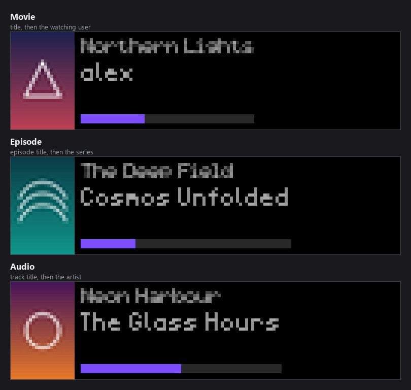
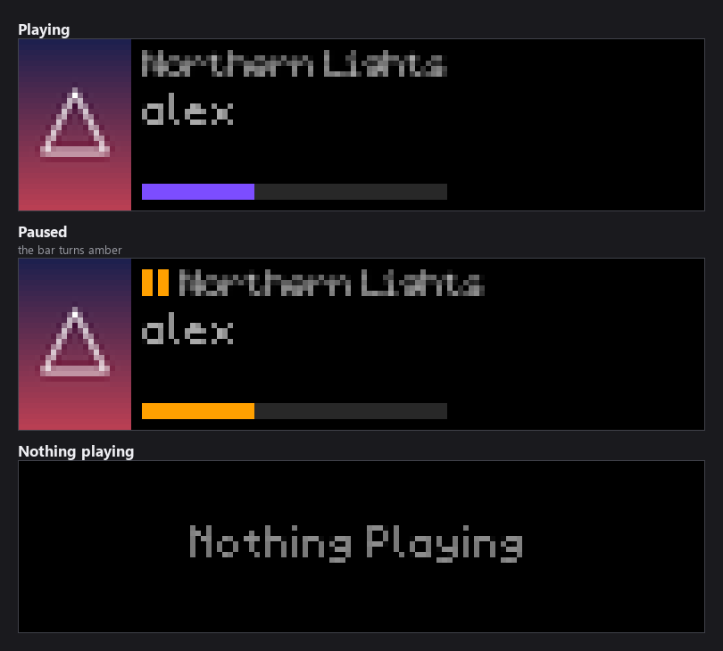
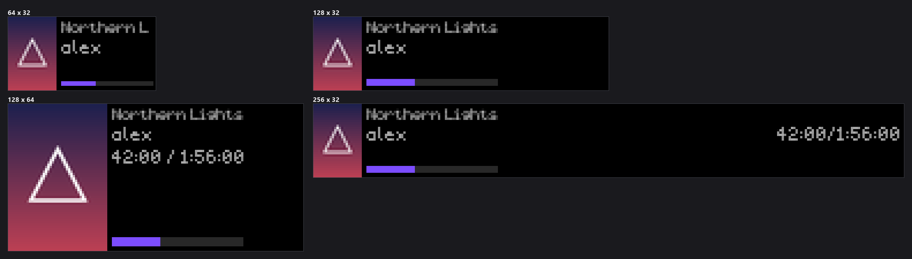
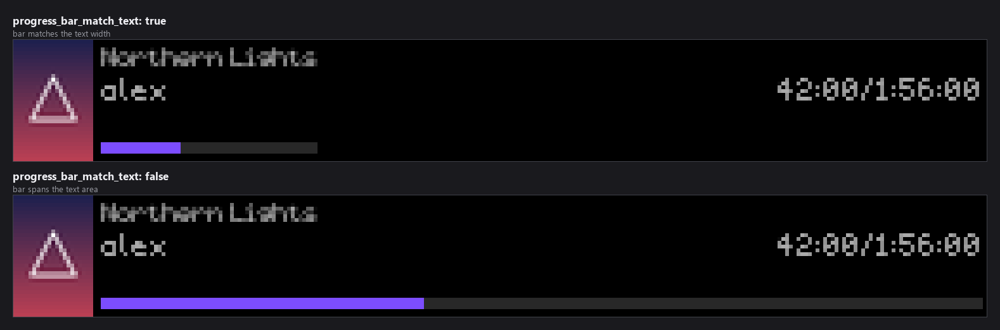

# Jellyfin Now Playing

Shows what's currently playing on your Jellyfin media server: the poster on the
left, with the title, a subtitle, and a playback progress bar on the right.

*Every image in this README is real plugin output, rendered at the true panel
size against a recorded Jellyfin response and scaled up so the pixels stay
pixels. The poster art in them is generated, not real cover art.*

- **Movies** show the movie poster with the title and the watching user's name.
- **TV episodes** show the *series* poster with the episode title and series name.
- **Music** shows the album art with the track title and artist.
- Long titles scroll as a marquee (or truncate with `...` if scrolling is disabled).
- The progress bar moves smoothly between polls and turns **amber with a ⏸
  indicator** while playback is paused.
- When nothing is playing, a dim "Nothing Playing" screen is shown.
- Works on all supported panel sizes. Wide and tall panels also get a
  `position / duration` time readout.

The subtitle row is what changes between them: a movie shows who is watching,
an episode shows its series, and a track shows its artist.

## Setup

### 1. Get a Jellyfin API key

1. Open your Jellyfin web UI as an administrator.
2. Go to **Dashboard → Advanced → API Keys**.
3. Click **+**, name the key (e.g. `LEDMatrix`), and copy the generated key.

### 2. Configure the plugin

| Setting | Description |
|---|---|
| `jellyfin_url` | Your server's base URL, e.g. `http://192.168.1.50:8096` (or your reverse-proxy HTTPS URL). |
| `api_key` | The API key from step 1. Stored as a secret and only ever sent to your own server. |

Until both are set, the panel shows `Jellyfin: Set URL/API Key`.

## Configuration reference

| Key | Default | Description |
|---|---|---|
| `enabled` | `false` | Enable the plugin |
| `display_duration` | `15` | Seconds the screen is shown per rotation |
| `jellyfin_url` | `http://localhost:8096` | Jellyfin server base URL |
| `api_key` | — | Jellyfin API key (secret) |
| `username` | `""` | Only show sessions for this user; empty shows any user's session |
| `content_types` | Movie, Episode, Audio | Which media types are shown |
| `show_progress` | `true` | Draw the playback progress bar |
| `show_paused` | `true` | Keep showing paused sessions (off treats paused as nothing playing) |
| `update_interval` | `10` | Seconds between session polls (advanced) |
| `scroll_enabled` | `true` | Marquee-scroll text that doesn't fit |
| `scroll_speed` | `5` | Frames per one-character scroll step; higher is slower (advanced) |
| `scroll_separator` | `"   "` | Gap text between marquee repetitions (advanced) |
| `progress_bar_match_text` | `true` | Size the bar to the text rather than the whole text area (advanced) — see below |

### Fonts and colors

These live under `customization` in `config.json`, and under **Display
Customization** in the web UI.

| Key | Default | Description |
|---|---|---|
| `customization.title_text.font` | `5by7.regular.ttf` | Font for the media title (advanced) |
| `customization.title_text.font_size` | `7` | Title height in pixels, 4–16 (advanced) |
| `customization.title_text.text_color` | `[255, 255, 255]` | Title color |
| `customization.subtitle_text.font` | `4x6-font.ttf` | Font for the subtitle and the time readout (advanced) |
| `customization.subtitle_text.font_size` | `6` | Subtitle height in pixels, 4–16 (advanced) |
| `customization.subtitle_text.text_color` | `[170, 170, 170]` | Subtitle color |
| `customization.progress_bar.bar_color` | `[124, 77, 255]` | Filled portion of the bar. Ignored while paused, when the bar is amber |
| `customization.progress_bar.background_color` | `[40, 40, 40]` | Unfilled portion of the bar |

Five fonts are offered. Three are TrueType and work at every size in the 4–16
range; two are `.bdf` bitmap faces, which exist at exactly one size each:

| Font | Kind | Sizes |
|---|---|---|
| `5by7.regular.ttf` | TrueType | any |
| `4x6-font.ttf` | TrueType | any |
| `PressStart2P-Regular.ttf` | TrueType | any |
| `5x7.bdf` | bitmap | 7 only |
| `4x6.bdf` | bitmap | 6 only |

Picking a bitmap font at a size it does not have used to fall back to a much
smaller built-in font with only a log warning. It now loads at the font's own
size instead, so the **Font Size** setting is simply ignored for those two.

### Progress bar width

`progress_bar_match_text` decides how far the bar runs. It matters most on a
wide panel, where a short title otherwise leaves a bar stretched across the
whole display:

A title long enough to scroll fills the bar either way.

## Multiple sessions

If several people are streaming at once, the plugin picks one session:

1. Sessions without media, filtered-out users, and filtered-out content types
   are ignored (paused sessions too, if `show_paused` is off).
2. Actively **playing** sessions are preferred over paused ones.
3. Ties keep the server's order.

Set `username` to pin the display to one account.

## Troubleshooting

| Panel says | Meaning |
|---|---|
| `Jellyfin: Set URL/API Key` | `jellyfin_url` or `api_key` isn't configured yet. |
| `Jellyfin: Update API Key` | The server rejected the key (revoked or mistyped). Create a new one. |
| `Jellyfin: Unreachable` | Wrong URL, server down, or a firewall is blocking the LEDMatrix host. |
| `Nothing Playing` | No client is actively streaming (sessions idle longer than ~60s don't count). |
| Series poster instead of an episode still | By design — episodes show the show's poster, which reads far better at 21–42 px wide. |
| Gray placeholder instead of a poster | The item has no primary image, or the image fetch failed; the text still shows. |

## Privacy

The API key is stored via the LEDMatrix secrets store (`x-secret`) and is only
sent to the Jellyfin server you configure — no third-party services are involved.
