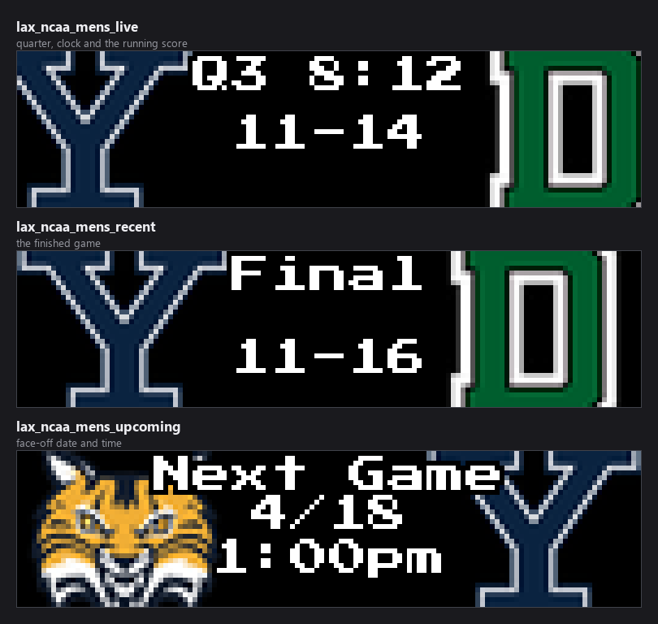
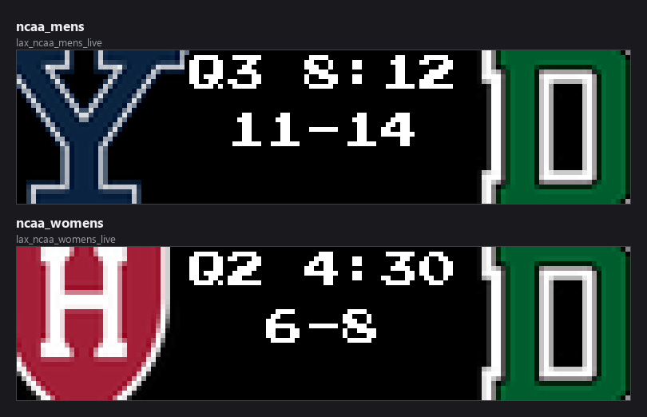
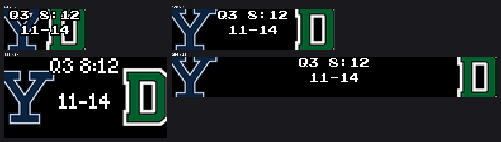
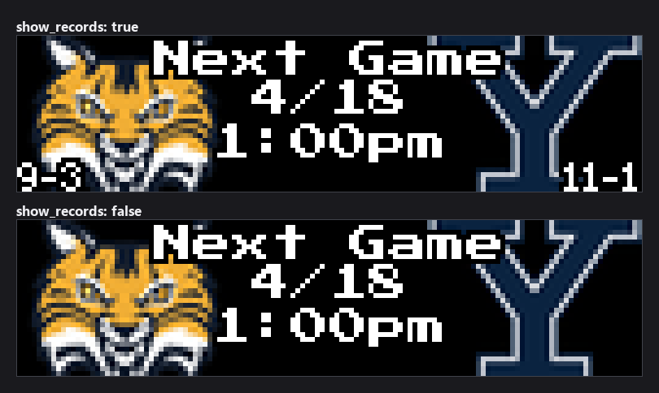

# Lacrosse Scoreboard

Live, recent, and upcoming **NCAA Men's and Women's Lacrosse** games on your
LEDMatrix display, from ESPN's public API. No API key required.


> **Upgrading from before 1.1.0:** the display modes gained a `lax_` prefix
> (`lax_ncaa_mens_recent` rather than `ncaa_mens_recent`) so they no longer
> collide with the NCAA hockey modes that `hockey-scoreboard` exposes. If you
> pinned any of the old unprefixed names in `display_durations`,
> `rotation_order`, or anywhere else in `config.json`, update them. The
> [CHANGELOG](CHANGELOG.md) has the full mapping.

## Contents

- [Quick start](#quick-start)
- [Team abbreviations](#team-abbreviations)
- [Display modes](#display-modes)
- [The two leagues](#the-two-leagues)
- [How games are chosen](#how-games-are-chosen)
- [Panel sizes](#panel-sizes)
- [Settings reference](#settings-reference)
- [Per-league settings](#per-league-settings)
- [Matchup separator and the upcoming card middle](#matchup-separator-and-the-upcoming-card-middle)
- [Text colours](#text-colours)
- [Favorite team result colours](#favorite-team-result-colours)
- [Vegas ticker: seeing live games more often](#vegas-ticker-seeing-live-games-more-often)
- [Data source](#data-source)
- [Requirements and installation](#requirements-and-installation)
- [Testing](#testing)
- [Troubleshooting](#troubleshooting)

## Quick start

1. Install **Lacrosse Scoreboard** from the LEDMatrix Plugin Store.
2. Turn on `enabled`, then turn on the league you want — `ncaa_mens` is on by
   default, `ncaa_womens` is off.
3. Add your schools under that league's **Favorite Teams**, using the
   **full-name abbreviations** described below.

```json
{
  "lacrosse-scoreboard": {
    "enabled": true,
    "ncaa_mens": {
      "enabled": true,
      "teams": {
        "favorite_teams": ["NCAA_MENS_TOP_10", "JOHNS HOPKINS"],
        "favorite_teams_only": false
      },
      "filtering": {
        "recent_games_to_show": 3,
        "upcoming_games_to_show": 5
      },
      "live_priority": true
    },
    "ncaa_womens": {
      "enabled": true,
      "teams": { "favorite_teams": ["NCAA_WOMENS_TOP_10"] }
    }
  }
}
```

## Team abbreviations

**NCAA lacrosse uses full-name abbreviations, not the short codes you know from
the football, basketball, or hockey plugins.** ESPN's lacrosse feed returns
`NORTH CAROLINA`, `JOHNS HOPKINS`, `SAINT JOSEPH'S` — not `UNC`, `JHU`, `SJU`.
Use the full-name form or the match fails silently.

| Team | Abbreviation |
|---|---|
| Maryland | `MARYLAND` |
| North Carolina | `NORTH CAROLINA` |
| Syracuse | `SYRACUSE` |
| Johns Hopkins | `JOHNS HOPKINS` |
| Duke | `DUKE` |
| Notre Dame | `NOTRE DAME` |
| Princeton | `PRINCETON` |
| Virginia | `VIRGINIA` |
| Yale | `YALE` |
| Harvard | `HARVARD` |
| Cornell | `CORNELL` |
| Penn State | `PENN STATE` |
| Richmond | `RICHMOND` |
| Saint Joseph's | `SAINT JOSEPH'S` |
| Mount St. Mary's | `MOUNT ST. MARY'S` |
| William & Mary | `WILLIAM & MARY` |
| Long Island University | `LONG ISLAND UNIVERSI` *(ESPN truncates to 20 characters)* |

Uppercase, with spaces, apostrophes, and periods exactly as they appear. To
check one:

```bash
curl -s 'https://site.api.espn.com/apis/site/v2/sports/lacrosse/mens-college-lacrosse/scoreboard' | python -m json.tool | grep -A1 abbreviation
```

### Dynamic team shortcuts

Rather than listing abbreviations by hand, put one of these tokens in
`favorite_teams` and it expands to the current poll:

| Token | League | Expands to |
|---|---|---|
| `NCAA_MENS_TOP_5` | Men's | Top 5 of the Inside Lacrosse D1 Men's Poll |
| `NCAA_MENS_TOP_10` | Men's | Top 10 of the same poll |
| `NCAA_MENS_TOP_20` | Men's | The full top 20 |
| `NCAA_WOMENS_TOP_5` | Women's | Top 5 of the IWLCA Coaches Poll |
| `NCAA_WOMENS_TOP_10` | Women's | Top 10 of the same poll |
| `NCAA_WOMENS_TOP_25` | Women's | The full top 25 |

Tokens mix with literal abbreviations:
`["NCAA_MENS_TOP_10", "JOHNS HOPKINS", "PRINCETON"]` tracks the current top ten
*plus* either of those two schools that is not already in it.

## Display modes

Six modes — three per league — that the LEDMatrix host rotation cycles through
independently.



| Mode | Shows | Top line |
|---|---|---|
| `lax_ncaa_mens_live` | Men's games in progress | Quarter and clock — `Q3 8:12`, or `OT1` past the fourth |
| `lax_ncaa_mens_recent` | Finished men's games | `Final`, or `Final/OT` |
| `lax_ncaa_mens_upcoming` | Scheduled men's games | `Next Game`, then the date and start time |
| `lax_ncaa_womens_live` | Women's games in progress | As above |
| `lax_ncaa_womens_recent` | Finished women's games | As above |
| `lax_ncaa_womens_upcoming` | Scheduled women's games | As above |

Each mode renders as **switch** (one game at a time, timed) or **scroll** (all
games scroll horizontally at high FPS), set per league and per mode with
`<league>.display_modes.<mode>_display_mode`.

## The two leagues

The two leagues are configured separately and have their own managers, their own
favorites, and their own poll.



Their config blocks are **identical in every setting except one**: `ncaa_mens`
defaults to `enabled: true` and `ncaa_womens` to `enabled: false`. Every table
under [Per-league settings](#per-league-settings) applies verbatim to both, with
the prefix `ncaa_mens.` or `ncaa_womens.`.

Both are spring sports: men's runs roughly January to late May, women's February
to late May. Outside that window ESPN returns an empty schedule and there is
nothing to draw.

## How games are chosen

**`upcoming_games_to_show` is not "how many cards you see".** It is the size of
a *pool*. The panel cycles through that pool one card at a time and keeps its
place between visits, so a pool of 3 means the board rotates through the same 3
games until the schedule moves on. A bigger number gives you a *longer lap*, so
any one game comes round **less** often.

Which regime you are in depends on that league's `teams.favorite_teams` and
`teams.favorite_teams_only`:

| `favorite_teams` | `favorite_teams_only` | What you get |
|---|---|---|
| empty | either | The next N games league-wide, chronologically. Every game is a non-favorite game, so the `other_*` filters apply to all of them. |
| set | **on** | Only your schools. The limit is a budget **per team**. |
| set | **off** (default) | **Your schools first, then other games to fill.** Both limits are **totals**. |

Note the key is `favorite_teams_only`, not `show_favorite_teams_only` as in the
single-league scoreboards, and it defaults to **off** here.

Within the other-games pool the better matchup leads and each team appears once.
The pool is each team's *next* game ordered by the best poll position of either
side, with ties falling back to start time. Your favorite schools are ordered by
when they play, not by rank: for your own team the next game is the point.

### Variety comes from turnover

Rather than widening the pool, the non-favorite slice **moves**: the window
advances by its own width every `filtering.other_rotation_interval_seconds`, so
consecutive windows do not overlap and the board works through the schedule
instead of resampling the front of it. Your favorites are not rotated.

Both filters **fail open**: if the data behind them cannot be fetched, the game
is allowed through. They fail open a second time as a set — if the filters
between them leave nothing at all, the unfiltered list is used instead. Setting
`other_upcoming_games_to_show` or `other_recent_games_to_show` to `0` is the one
way to ask for an empty slate, and that is honoured.

> **`other_games_divisions` does nothing here.** It needs ESPN's FBS/FCS group
> rosters, which are a college *football* taxonomy; no lookup is even attempted
> for lacrosse, so every game passes. `other_games_min_quality` **does** work in
> this plugin, because NCAA lacrosse has a national poll to rank against — its
> `ranked` default restricts non-favorite games to those involving a poll team.
> (The schema's help text for it mentions a `broadcast` option the enum does not
> offer.)

### Live rotation

When several games are live at once the rotation is weighted: a game involving
one of your schools gets `teams.favorite_live_boost` turns for every one turn
other live games get, and is queued first whenever the rotation refreshes. Set
it to `1` for even rotation. A live game the API stops reporting for
`update_intervals.stale_game_timeout` seconds is dropped, so an abandoned game
does not sit on the board forever.

## Panel sizes

The scorebug is laid out from the panel dimensions rather than a fixed grid.



At 64x32 the two crests and the centre column share very little room; 128x32 or
wider is a much better fit for this card.

## Settings reference

Settings marked **Advanced** sit behind the *Advanced* toggle in the web UI.
Defaults are the schema defaults, which is what the web UI writes.

### Plugin level

| Key | Type | Default | What it does |
|---|---|---|---|
| `enabled` | boolean | `false` | Master on/off switch for the whole plugin. |
| `timezone` | string | `""` | **Advanced.** IANA zone for start times, e.g. `America/New_York`. Blank follows the LEDMatrix global timezone, then the host system's, then UTC. |
| `schedule_lookback_days` | 1–60 | `14` | **Advanced.** How far back to fetch for the Recent screens. |
| `schedule_lookahead_days` | 1–60 | `7` | **Advanced.** How far ahead to fetch for Upcoming. A game beyond this horizon is never fetched, so it cannot reach the board even though the date is known. |
| `no_data_interval_seconds` | 5–86400 | `300` | **Advanced.** Wait between live checks when nothing is live. Backs off further the longer nothing is found. |
| `live_idle_max_interval_seconds` | 5–86400 | `900` | **Advanced.** Ceiling for that back-off. Useful out of season. |

### Defaults

Fallbacks used when the corresponding per-league setting is absent.

| Key | Type | Default | What it does |
|---|---|---|---|
| `defaults.display_duration` | 5–60 s | `15` | Per-game on-screen time. |
| `defaults.show_records` | boolean | `false` | Draw win-loss records. |
| `defaults.show_ranking` | boolean | `false` | Draw poll rank badges. |
| `defaults.show_odds` | boolean | `false` | **Advanced.** Draw betting odds. |
| `defaults.show_shots` | boolean | `false` | **Advanced.** Draw shot totals. See the troubleshooting note — ESPN does not currently publish them. |
| `defaults.update_interval_seconds` | 30–86400 s | `3600` | **Advanced.** Base data refresh cadence. |
| `defaults.season_cache_duration_seconds` | 3600–604800 s | `86400` | **Advanced.** How long season data is cached. |

> **The per-league copy wins, and its default is different.** Each league's
> `display_options.show_records` and `show_ranking` default to **`true`** while
> `defaults.show_records` and `defaults.show_ranking` default to **`false`**.
> Because the web UI writes schema defaults on save, a saved config already
> carries the per-league `true`, and changing the `defaults` value then appears
> to do nothing. Change the per-league setting.



## Per-league settings

Every table below exists twice, once under `ncaa_mens` and once under
`ncaa_womens`, with identical types and defaults. `<league>` stands for either.

### Enable and priority

| Key | Type | Default | What it does |
|---|---|---|---|
| `<league>.enabled` | boolean | `true` for `ncaa_mens`, `false` for `ncaa_womens` | Build this league's managers at all. The only setting that differs between the two. |
| `<league>.live_priority` | boolean | `false` | Let this league's live games interrupt the rotation and display immediately. |

### Display modes

| Key | Type | Default |
|---|---|---|
| `<league>.display_modes.live` | boolean | `true` |
| `<league>.display_modes.recent` | boolean | `true` |
| `<league>.display_modes.upcoming` | boolean | `true` |
| `<league>.display_modes.live_display_mode` | `switch` \| `scroll` | `switch` |
| `<league>.display_modes.recent_display_mode` | `switch` \| `scroll` | `switch` |
| `<league>.display_modes.upcoming_display_mode` | `switch` \| `scroll` | `switch` |

### Teams

| Key | Type | Default | What it does |
|---|---|---|---|
| `<league>.teams.favorite_teams` | array | `[]` | Schools to prioritise. Full-name abbreviations, or a dynamic token. |
| `<league>.teams.favorite_teams_only` | boolean | `false` | Show only your schools' games. |
| `<league>.teams.show_all_live` | boolean | `false` | Show every live game regardless of favorites. |
| `<league>.teams.exclude_teams` | array | `[]` | **Advanced.** Schools to always hide, from the live rotation and from finals alike (spoiler protection). Takes precedence over `favorite_teams` and `show_all_live`. |
| `<league>.teams.favorite_live_boost` | 1–5 | `2` | **Advanced.** Turns a favorite's live game gets per one turn for other live games. `1` is even rotation. |

### Filtering

| Key | Type | Default | What it does |
|---|---|---|---|
| `<league>.filtering.recent_games_to_show` | 1–20 | `5` | Pool size for finished games. With favorites, per team; without, in total. |
| `<league>.filtering.upcoming_games_to_show` | 1–50 | `10` | The same for scheduled games. |
| `<league>.filtering.other_upcoming_games_to_show` | 0–20 | `10` | **Advanced.** How many non-favorite upcoming games to add. `0` gives favorites only. |
| `<league>.filtering.other_recent_games_to_show` | 0–20 | `5` | **Advanced.** The same for finished games. |
| `<league>.filtering.other_rotation_interval_seconds` | 0–86400 s | `1800` | **Advanced.** How often the non-favorite window advances. `0` pins it. |
| `<league>.filtering.other_games_min_quality` | `any` \| `ranked` | `ranked` | **Advanced.** Restrict non-favorite games to those involving a poll team. Works in this plugin — lacrosse has a national poll. |
| `<league>.filtering.other_games_divisions` | array | `["fbs"]` | **Advanced.** Inert here; a college football taxonomy. |

### Update intervals

All **Advanced**.

| Key | Type | Default | What it does |
|---|---|---|---|
| `<league>.update_intervals.base` | 60–900 s | `300` | Base data refresh. |
| `<league>.update_intervals.live` | 10–300 s | `60` | Refresh while a game is live. |
| `<league>.update_intervals.recent` | 60–86400 s | `3600` | Refresh for finished games. |
| `<league>.update_intervals.upcoming` | 60–86400 s | `3600` | Refresh for the schedule. |
| `<league>.update_intervals.odds` | 60–86400 s | `3600` | Refresh for betting odds. |
| `<league>.update_intervals.stale_game_timeout` | 60–3600 s | `300` | Drop a live game the API has stopped updating. |

### Display durations

All **Advanced**.

| Key | Type | Default | What it does |
|---|---|---|---|
| `<league>.display_durations.base` | 5–60 s | `15` | Fallback per-game time. |
| `<league>.display_durations.live` | 5–120 s | `15` | Per-game time for live games. Applies to games with a favorite when a non-favorite duration is set. |
| `<league>.display_durations.non_favorite_live` | 0–120 s | `0` | Shorter turn for live games with no favorite. Only applies when favorites are set **and** non-favorite live games are shown. `0` means use the live duration for everything. |
| `<league>.display_durations.recent` | 5–60 s | `15` | Per-game time on the Recent screen. |
| `<league>.display_durations.upcoming` | 5–60 s | `15` | Per-game time on the Upcoming screen. |

### Display options

| Key | Type | Default | What it does |
|---|---|---|---|
| `<league>.display_options.show_records` | boolean | `true` | Draw win-loss records. Overrides `defaults.show_records`. |
| `<league>.display_options.show_ranking` | boolean | `true` | Draw poll rank badges (`#1`, `#2`). Unranked teams show no badge, by design. |
| `<league>.display_options.show_odds` | boolean | `false` | **Advanced.** Draw betting odds. |
| `<league>.display_options.show_shots` | boolean | `false` | **Advanced.** Draw shot totals when ESPN publishes them. |

### Mode durations

How long the *whole mode* holds the board before the core rotates on. `null`
means use the dynamic calculation. All **Advanced**, and read by the LEDMatrix
core rather than by this plugin, which is why they do not appear in the plugin's
own source.

| Key | Type | Default |
|---|---|---|
| `<league>.mode_durations.live_mode_duration` | 10–600 s or `null` | `null` |
| `<league>.mode_durations.recent_mode_duration` | 10–600 s or `null` | `null` |
| `<league>.mode_durations.upcoming_mode_duration` | 10–600 s or `null` | `null` |

When a mode cycles back it continues from the last game shown rather than
restarting, so nothing repeats within a lap.

### Dynamic duration

Sizes each mode's total time from how much there is to show. All **Advanced**.

| Key | Type | Default |
|---|---|---|
| `<league>.dynamic_duration.enabled` | boolean | `false` |
| `<league>.dynamic_duration.max_duration_seconds` | 60–600 s | — |
| `<league>.dynamic_duration.modes.live.enabled` | boolean | `false` |
| `<league>.dynamic_duration.modes.live.max_duration_seconds` | 60–600 s | — |
| `<league>.dynamic_duration.modes.recent.enabled` | boolean | `false` |
| `<league>.dynamic_duration.modes.recent.max_duration_seconds` | 60–600 s | — |
| `<league>.dynamic_duration.modes.upcoming.enabled` | boolean | `false` |
| `<league>.dynamic_duration.modes.upcoming.max_duration_seconds` | 60–600 s | — |

### Scroll settings

All **Advanced**, and per league.

| Key | Type | Default | What it does |
|---|---|---|---|
| `<league>.scroll_settings.scroll_speed` | 1.0–200.0 px/s | `50.0` | Higher scrolls faster. |
| `<league>.scroll_settings.scroll_delay` | 0.001–0.1 s | `0.01` | Frame delay; `0.01` is 100 FPS. Lower is smoother. |
| `<league>.scroll_settings.gap_between_games` | 8–128 px | `48` | Gap between game cards. |
| `<league>.scroll_settings.show_league_separators` | boolean | `true` | Draw NCAA league icons between leagues. |
| `<league>.scroll_settings.dynamic_duration` | boolean | `true` | Size the scroll duration from the content width. |
| `<league>.scroll_settings.game_card_width` | 32–512 px | `128` | Card width. Lower it on a multi-panel chain to fit more games on screen at once. |

## Fonts, colours and layout

Seven text elements, each with `font`, `font_size`, and `text_color`, under
`customization.<element>`. All **Advanced**. Available faces:
`PressStart2P-Regular.ttf`, `4x6-font.ttf`, `5by7.regular.ttf`.

| Element | Default font | Default size | Draws |
|---|---|---|---|
| `score_text` | `PressStart2P-Regular.ttf` | `10` | The score, and the matchup separator on an upcoming card |
| `period_text` | `PressStart2P-Regular.ttf` | `8` | The quarter and clock, and the date/time on an upcoming scoreboard |
| `team_name` | `PressStart2P-Regular.ttf` | `8` | Team names and abbreviations |
| `status_text` | `4x6-font.ttf` | `6` | Status lines such as "Next Game" |
| `detail_text` | `4x6-font.ttf` | `6` | Small detail lines |
| `rank_text` | `PressStart2P-Regular.ttf` | `10` | Poll rank badges |
| `odds_text` | `4x6-font.ttf` | `6` | Betting odds (defaults to green, `[0, 255, 0]`) |

Odds font sizes snap to the face's pixel grid to stay crisp: `4x6-font.ttf`
snaps to 7, 14, 21; press_start to 8, 16. Every `customization.<element>` object
sets `additionalProperties: false`.

### Layout offsets

Nudge any element in pixels. All default to `0`, all are **Advanced**, all live
under `customization.layout.<element>`, and all set
`additionalProperties: false`.

| Element | Keys | Measured from |
|---|---|---|
| `home_logo`, `away_logo` | `x_offset`, `y_offset` | Default logo position |
| `score` | `x_offset`, `y_offset` | Panel centre |
| `status_text` | `x_offset`, `y_offset` | Centre horizontally, top vertically |
| `date` | `x_offset`, `y_offset` | Centre horizontally, default position vertically |
| `time` | `x_offset`, `y_offset` | Centre horizontally, the date's position vertically |
| `records` | `away_x_offset`, `home_x_offset`, `y_offset` | Away from the left, home from the right, both from the bottom |

## Matchup separator and the upcoming card middle

The **Matchup Card Layout** section (`scroll_card`) controls what sits between
the two crests before a game starts, and how the date and time are written.
These settings are plugin-wide, not per league, and apply to every display mode.

| Setting | Key | Default | What it does |
|---|---|---|---|
| Matchup Separator | `scroll_card.vs_text` | `VS` | Text between the teams: `VS`, `@`, `at`, `v`. The away side is always on the left, so `@` and `at` read as "away at home". Blank draws nothing. |
| Middle of an Upcoming Card | `scroll_card.upcoming_center` | `vs` | Scroll and Vegas cards: `vs`, `date_time`, or `none`. |
| Middle of a Full-Screen Upcoming Scoreboard | `scroll_card.switch_upcoming_center` | `date_time` | The same choice for the full-screen scoreboard, plus `inherit` to follow the row above. |
| Date Format | `scroll_card.date_format` | `abbrev` | Scroll and Vegas cards: `Sep 19`, `9/19`, `19 Sep`, `19/9`, or `Fri Sep 19`. |
| Full-Screen Date Format | `scroll_card.switch_date_format` | `numeric` | **Advanced.** The same for the full-screen scoreboard, plus `inherit`. It has its own default because the two displays disagree about what is normal. |
| Time Format | `scroll_card.time_format` | `12h` | 12- or 24-hour clock. |
| Show Date / Show Time | `scroll_card.show_date`, `scroll_card.show_time` | `true` | Drop either line. |
| Swap Date and Time | `scroll_card.swap_date_time` | `false` | Flip the two lines. Each display starts from its own order, so this flips rather than forces. |

The centre-gap settings size the scroll and Vegas card's middle strip only — the
full-screen scoreboard pins its crests to the panel edges and is unaffected.

| Key | Type | Default | What it does |
|---|---|---|---|
| `scroll_card.center_gap` | 0–64 px | unset | Pixels kept clear down the middle. Unset scales with card width; `0` restores edge-to-edge logos. |
| `scroll_card.center_gap_ratio` | 0.0–0.6 | `0.28` | **Advanced.** Fraction of card width used when the gap is not pinned. |
| `scroll_card.center_gap_min` | 0–64 px | `22` | **Advanced.** Floor for the scaled gap. |
| `scroll_card.center_gap_max` | 0–96 px | `40` | **Advanced.** Ceiling for the scaled gap. |

```json
{
  "scroll_card": {
    "vs_text": "@",
    "switch_upcoming_center": "vs",
    "date_format": "weekday"
  }
}
```

## Text colours

Each `customization.<element>.text_color` colours the text drawn in that
element's face, on the full-screen scoreboard and on the scroll and Vegas cards
alike. Colours are `[r, g, b]` or `"#RRGGBB"`. Every default is white except
`odds_text`, which is green.

```json
{
  "customization": {
    "score_text": { "text_color": [255, 200, 0] },
    "status_text": { "text_color": "#00A0FF" }
  }
}
```

The betting-odds figures keep their own colours — they are tinted by which side
is favoured — and so does a finished game's score when **Favorite Team Result
Colors** is on.

## Favorite team result colours

A run of games against the same opponent is hard to read at a glance: in scroll
and Vegas mode the same two crests go past several times and only the digits
change. Turn this on to colour a finished game's score by how your school did.

| Key | Type | Default |
|---|---|---|
| `customization.favorite_result_colors.enabled` | boolean | `false` |
| `customization.favorite_result_colors.win_color` | `[r, g, b]` | `[0, 255, 0]` |
| `customization.favorite_result_colors.loss_color` | `[r, g, b]` | `[255, 0, 0]` |
| `customization.favorite_result_colors.tie_color` | `[r, g, b]` | `[255, 200, 0]` |

```json
{
  "customization": {
    "favorite_result_colors": {
      "enabled": true,
      "win_color": [0, 255, 0],
      "loss_color": [255, 0, 0],
      "tie_color": [255, 200, 0]
    }
  }
}
```

- Only finished games are coloured; live and upcoming cards are untouched.
- A game needs **exactly one** favorite school. Neither side or both, and the
  score keeps its normal colour.
- The three colours are Advanced settings.

This tint is applied by the LEDMatrix core rather than by the plugin, which is
why the keys do not appear in this plugin's source.

## Vegas ticker: seeing live games more often

By default a live game **takes over** the display: the Vegas ticker stops and
this scoreboard shows full screen until the game ends. To keep the marquee
scrolling and still see scores, set this in the **core** config — not in this
plugin's settings:

```json
{
  "display": {
    "vegas_scroll": {
      "live_in_ticker": true,
      "live_weight": 3,
      "favorite_live_weight": 5
    }
  }
}
```

The ticker is otherwise a strict round robin — every plugin appears once per
cycle. These weights let this plugin claim several slots per cycle, spaced
evenly through it rather than bunched together. `live_weight` applies whenever
this scoreboard has a live game; `favorite_live_weight` applies when one of your
schools is playing. That distinction has to be made here rather than in the
core, which can tell *that* a game is live but not *whose*.

- The weight is per **plugin**, not per game. With four games live this
  scoreboard still occupies one slot at a time and picks between its own games
  using `favorite_live_boost`.
- More slots make the cycle **longer**, not faster.

## Data source

ESPN's public site API, no key required:

- Men's scoreboard: `https://site.api.espn.com/apis/site/v2/sports/lacrosse/mens-college-lacrosse/scoreboard`
- Men's rankings: `https://site.api.espn.com/apis/site/v2/sports/lacrosse/mens-college-lacrosse/rankings`
- Women's scoreboard: `https://site.api.espn.com/apis/site/v2/sports/lacrosse/womens-college-lacrosse/scoreboard`
- Women's rankings: `https://site.api.espn.com/apis/site/v2/sports/lacrosse/womens-college-lacrosse/rankings`

Crests are fetched from `https://a.espncdn.com/i/teamlogos/ncaa/500/{team_id}.png`
and cached under `assets/sports/ncaa_logos/`. Rankings are cached for an hour.

## Requirements and installation

- Python 3.9+
- LEDMatrix core 2.0.0 or newer
- A 64x32 panel minimum; 128x32 or wider recommended
- Internet access to reach ESPN

Install from the Plugin Store in the LEDMatrix web UI: open
`http://your-pi-ip:5000`, go to **Plugin Manager**, find **Lacrosse Scoreboard**
under **Plugin Store**, and click **Install**. Crests download on first sight.

Manual install from source:

```bash
cd /path/to/LEDMatrix
python -m pip install --user pillow requests pytz
cp -r /path/to/ledmatrix-plugins/plugins/lacrosse-scoreboard plugin-repos/
sudo systemctl restart ledmatrix
```

Dependencies, from `requirements.txt`: `Pillow>=9.0.0` (image compositing),
`requests>=2.28.0` (ESPN calls), `pytz>=2022.1` (timezone conversion), and
`urllib3>=1.26.0` (HTTP retry logic). All are present in a typical LEDMatrix
install.

## Testing

A standalone smoke test is included:

```bash
cd plugins/lacrosse-scoreboard && python test_lacrosse_plugin.py
```

It stubs the LEDMatrix host modules, imports every plugin module, exercises the
dynamic team resolver against live ESPN rankings, and runs a 50-event window of
both men's and women's scoreboard data through `Lacrosse._extract_game_details`,
asserting the required fields are populated. No test framework required.

The documentation images come from `docs/assets/lacrosse-scoreboard/shots.json`
and re-render with `python scripts/render_docs_assets.py --plugin
lacrosse-scoreboard --check`.

## Troubleshooting

**My favorite team doesn't show up.** You are almost certainly using a short
abbreviation like `UNC` or `JHU`. Lacrosse abbreviations are the full school
name in uppercase — see [Team abbreviations](#team-abbreviations).

**No games appear at all.** Both are spring sports. Men's runs roughly January
through late May, women's February through late May. Outside that window ESPN
returns an empty schedule and there is nothing to draw. Check too that both
`enabled` and the league's own `enabled` are on — `ncaa_womens` is off by
default.

**Records or rank badges are on when I turned them off.** You changed the
`defaults` copy. The per-league `display_options` copy wins and defaults to
`true`; change that one.

**Start times look like UTC.** The plugin could not read your global timezone.
Set `timezone` under Advanced Settings to your IANA zone, e.g.
`America/New_York`.

**Rank badges aren't appearing.** Confirm `<league>.display_options.show_ranking`
is `true`. Rankings cache for an hour and only populate for teams in the current
poll; unranked teams show no badge by design.

**Shot totals are always 0.** ESPN's lacrosse feed does not expose per-team shot
counts the way its hockey feed exposes saves. `show_shots` is wired but stays
empty until ESPN publishes the stat. Leave it off.

**Tournament games show `TBD` placeholders.** ESPN uses team IDs `-1` and `-2`
for bracket slots with no opponent yet. These resolve to real crests once the
bracket is set.

**A crest is missing or wrong.** Delete the cached file at
`assets/sports/ncaa_logos/{ABBR}.png` — the exact file name, spaces and all —
and it re-downloads on the next update.

**A game I know about never appears.** It may be beyond
`schedule_lookahead_days` (default 7). A game outside that horizon is never
fetched.

## License

See `LICENSE`.
