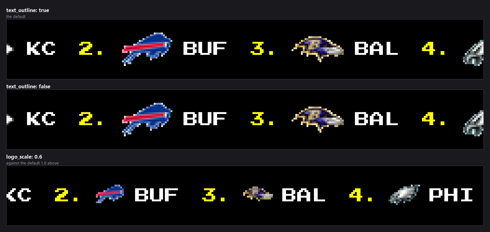
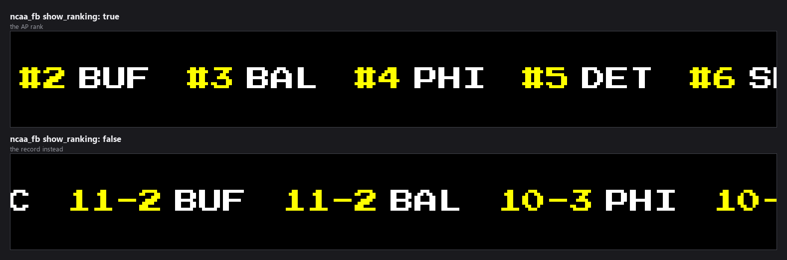
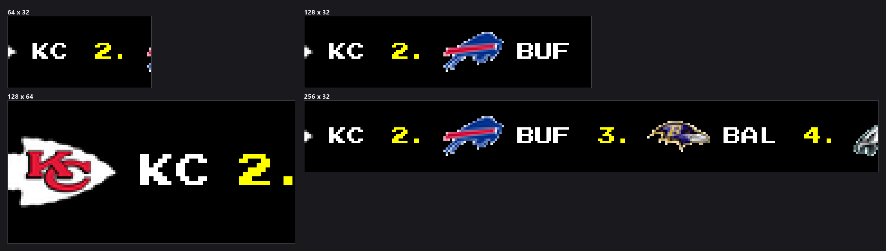

-----------------------------------------------------------------------------------
### Connect with ChuckBuilds

- Show support on Youtube: https://www.youtube.com/@ChuckBuilds
- Stay in touch on Instagram: https://www.instagram.com/ChuckBuilds/
- Want to chat or need support? Reach out on the ChuckBuilds Discord: https://discord.com/invite/uW36dVAtcT
- Feeling Generous? Support the project:
  - Github Sponsorship: https://github.com/sponsors/ChuckBuilds
  - Buy Me a Coffee: https://buymeacoffee.com/chuckbuilds
  - Ko-fi: https://ko-fi.com/chuckbuilds/ 

-----------------------------------------------------------------------------------

# Leaderboard Plugin


*Every image in this README is real plugin output, rendered at the true panel
size from seeded standings so it reproduces exactly. Teams and records are
invented.*

Each team is drawn as **position number, logo, abbreviation**. Records are not
shown for the major leagues — the only place a record replaces the number is
NCAA football with `show_ranking` off, below.

A plugin for LEDMatrix that displays scrolling leaderboards and standings for multiple sports leagues including NFL, NBA, MLB, NCAA Football, NCAA Basketball, NHL, and more.

## Features

- **Multi-Sport Support**: NFL, NBA, MLB, NCAA Football, NCAA Basketball, NCAA Women's Basketball, NHL
- **Scrolling Ticker Display**: Continuous scrolling of standings and rankings
- **Conference/Division Filtering**: Filter by conference, division, or league
- **NCAA Rankings**: Display college football and basketball rankings
- **Team Records**: Show win-loss records and statistics
- **Dynamic Duration**: Adjust display time based on content width
- **Configurable Display**: Adjustable scroll speed, duration, and filtering options
- **Background Data Fetching**: Efficient API calls without blocking display

## Configuration

### Global Settings

- `display_duration`: How long to show the leaderboard (10-300 seconds, default: 30)
- `scroll_speed`: Scrolling speed multiplier (0.5-10, default: 2)
- `scroll_delay`: Delay between scroll steps (0.001-0.1 seconds, default: 0.01)
- `dynamic_duration`: Enable dynamic duration based on content width (default: true)
- `min_duration`: Minimum display duration (10-300 seconds, default: 30)
- `max_duration`: Maximum display duration (30-600 seconds, default: 300)
- `loop`: Continuously loop the leaderboard (default: true)

### Appearance (`global.appearance`)

The leaderboard renders for a 1:1 LED matrix, where a partially-lit pixel is a
visibly dim LED rather than a smooth edge. These options control that:

- `pixel_perfect_text` (default `true`): draw text with anti-aliasing off, so
  every glyph pixel is fully on or fully off. Set to `false` for the older,
  softer look.
- `crisp_logos` (default `true`): give logos hard edges instead of a ring of
  half-lit pixels.
- `text_outline` (default `true`): black outline behind text so it stays
  readable where it sits near a logo.
- `logo_scale` (default `1.0`): logo height as a fraction of the panel height.
  `1.0` fits the panel exactly; anything above `1.0` crops the top and bottom of
  every logo.
- `font_size` (default `0` = pick a size for the panel height): sizes are
  snapped to the font's pixel grid — multiples of 8 for Press Start 2P — because
  off-grid sizes are what make pixel fonts look blurry.

### How many teams are shown

Each league's `top_teams` sets how far down the standings to go. **Set it to `0`
to show every team the league returns** (all 32 NFL teams, the full AP Top 25,
and so on).

A longer list needs proportionally more time on screen. The display controller
gives the plugin `min(plugin cap, core cap)` seconds and then moves on
mid-scroll, so a list longer than that budget simply stops partway through —
which looks like the leaderboard cutting off at an arbitrary team. The relevant
settings:

| Setting | Where | Default |
|---|---|---|
| `global.dynamic_duration.max_duration_seconds` | this plugin | 600 |
| `global.dynamic_duration.controller_cap_seconds` | this plugin | 600 |
| `display.dynamic_duration.max_duration_seconds` | LEDMatrix core config | 180 |

The **lowest** of the three wins, so the core's 180s default is usually the one
that decides it. All 32 NFL teams is roughly 3,200px of ticker: about 240s at
the default 15 px/s, or about 36s at 100 px/s.

If the content will not fit the budget, the plugin logs a warning at startup
naming which cap is limiting it and roughly how much of the list will not be
reached. Raise that cap, increase the scroll speed
(`global.display.scroll_speed` / `scroll_delay`), or lower `top_teams`.

### Per-League Settings

#### NFL Configuration

```json
{
  "leagues": {
    "nfl": {
      "enabled": true,
      "conference": "both",
      "division": "all"
    }
  }
}
```

#### NBA Configuration

```json
{
  "leagues": {
    "nba": {
      "enabled": true,
      "conference": "both"
    }
  }
}
```

#### MLB Configuration

```json
{
  "leagues": {
    "mlb": {
      "enabled": true,
      "league": "both",
      "division": "all"
    }
  }
}
```

#### NCAA Football Configuration

```json
{
  "leagues": {
    "ncaa_fb": {
      "enabled": true,
      "division": "fbs",
      "show_rankings": true
    }
  }
}
```

#### NCAA Basketball Configuration

```json
{
  "leagues": {
    "ncaam_basketball": {
      "enabled": true,
      "show_rankings": true
    },
    "ncaaw_basketball": {
      "enabled": true,
      "show_rankings": true
    }
  }
}
```

#### NHL Configuration

```json
{
  "leagues": {
    "nhl": {
      "enabled": true,
      "conference": "both"
    }
  }
}
```

### Top level

| Key | Default | Notes |
|---|---|---|
| `enabled` | `false` | Enable or disable the leaderboard plugin. |
| `display_duration` | `30` | How long to display the leaderboard in seconds (10–300). |
| `update_interval` | `3600` | How often to fetch new leaderboard data in seconds (300–86400). |

### `global`

| Key | Default | Notes |
|---|---|---|
| `global.display_duration` | `30` | Duration in seconds to display the leaderboard (10–300). |
| `global.scroll_speed` | `1` | Scrolling speed multiplier (0.1–10). |
| `global.target_fps` | `100` | Target frames per second for scrolling (30–200). |
| `global.scroll_speed_scale` | `8` | Scroll speed scale factor (1–20). **Not implemented**. |
| `global.request_timeout` | `30` | Request timeout in seconds (5–120). |
| `global.dynamic_duration.enabled` | `true` | Enable dynamic duration based on content width. |
| `global.dynamic_duration.min_duration_seconds` | `45` | Minimum display duration when dynamic duration is enabled (10–300). |
| `global.dynamic_duration.max_duration_seconds` | `600` | Maximum display duration when dynamic duration is enabled (30–1200). |
| `global.dynamic_duration.buffer_ratio` | `0.1` | Extra buffer applied to the calculated duration (percentage expressed as 0-1). |
| `global.dynamic_duration.controller_cap_seconds` | `600` | Failsafe cap for the display controller when dynamic duration is enabled (60–1800). |
| `global.min_duration` | `45` | [Deprecated] Use dynamic_duration.min_duration_seconds instead (10–300). |
| `global.max_duration` | `600` | [Deprecated] Use dynamic_duration.max_duration_seconds instead (30–1200). |
| `global.duration_buffer` | `0.1` | [Deprecated] Use dynamic_duration.buffer_ratio instead (0.01–1.0). |
| `global.max_display_time` | `600` | [Deprecated] Use dynamic_duration.controller_cap_seconds instead (60–1800). |
| `global.scroll_pixels_per_second` | `15.0` | [Deprecated] Scroll speed in pixels per second. Use display.scroll_speed and display.scroll_delay for finer control (5.0–50.0). |
| `global.display.scroll_speed` | `1.0` | Scrolling speed in pixels per frame (0.5–5.0). |
| `global.display.scroll_delay` | `0.01` | Delay between scroll steps in seconds (0.001–0.1). |
| `global.scroll_target_fps` | `100.0` | Target FPS for scrolling (30.0–200.0). |
| `global.scroll_mode` | `"one_shot"` | Scrolling mode — one of `one_shot`, `continuous`. |
| `global.scroll_direction` | `"left"` | Scroll direction — one of `left`, `right`. **Not implemented**. |
| `global.enable_scroll_metrics` | `false` | Enable scroll performance metrics. **Not implemented**. |
| `global.scroll_delay` | `0.01` | Delay between scroll steps in seconds (0.001–0.1). |
| `global.loop` | `false` | Continuously loop the leaderboard. |
| `global.appearance.pixel_perfect_text` | `true` | Render text with hard pixel edges. Disable only if you prefer the older anti-aliased (softer, blurrier) look. |
| `global.appearance.crisp_logos` | `true` | Give logos hard edges instead of a ring of half-lit pixels. |
| `global.appearance.text_outline` | `true` | Draw a black outline around text so it stays readable over logos. |
| `global.appearance.logo_scale` | `1.0` | Logo height as a fraction of the panel height. 1.0 fits the panel exactly; above 1.0 crops the top and bottom of every logo (0.5–1.5). |
| `global.appearance.font_size` | `0` | Font size in pixels. 0 picks a size that suits the panel height. Values are snapped to the font's pixel grid (multiples of 8 for Press Start 2P) to keep text sharp (0–32). |

### `enabled_sports`

Each league takes the same four or five keys.

| Key | Default | Notes |
|---|---|---|
| `enabled_sports.nfl.enabled` | `true` | Enable NFL standings. |
| `enabled_sports.nfl.top_teams` | `10` | Number of top NFL teams to display. 0 shows every team the standings return (up to 32). Long lists need a matching display duration - see the README (0–32). |
| `enabled_sports.nba.enabled` | `true` | Enable NBA standings. |
| `enabled_sports.nba.top_teams` | `10` | Number of top NBA teams to display. 0 shows every team the standings return (up to 30). Long lists need a matching display duration - see the README (0–30). |
| `enabled_sports.mlb.enabled` | `true` | Enable MLB standings. |
| `enabled_sports.mlb.top_teams` | `10` | Number of top MLB teams to display. 0 shows every team the standings return (up to 30). Long lists need a matching display duration - see the README (0–30). |
| `enabled_sports.ncaa_fb.enabled` | `true` | Enable NCAA Football rankings. |
| `enabled_sports.ncaa_fb.top_teams` | `25` | Number of top NCAA Football teams to display. 0 shows every team the standings return (up to 130). Long lists need a matching display duration - see the README (0–130). |
| `enabled_sports.ncaa_fb.show_ranking` | `true` | Show NCAA Football rankings instead of standings. |
| `enabled_sports.nhl.enabled` | `true` | Enable NHL standings. |
| `enabled_sports.nhl.top_teams` | `10` | Number of top NHL teams to display. 0 shows every team the standings return (up to 32). Long lists need a matching display duration - see the README (0–32). |
| `enabled_sports.ncaam_basketball.enabled` | `false` | Enable NCAA Men's Basketball rankings. |
| `enabled_sports.ncaam_basketball.top_teams` | `25` | Number of top NCAA Men's Basketball teams to display. 0 shows every team the standings return (up to 350). Long lists need a matching display duration - see the README (0–350). |
| `enabled_sports.ncaam_basketball.show_ranking` | `true` | Show rankings/seeds instead of sequential numbering. During March Madness, automatically shows tournament seeds. |
| `enabled_sports.ncaam_hockey.enabled` | `false` | Enable NCAA Men's Hockey rankings. |
| `enabled_sports.ncaam_hockey.top_teams` | `10` | Number of top NCAA Men's Hockey teams to display. 0 shows every team the standings return (up to 60). Long lists need a matching display duration - see the README (0–60). |
| `enabled_sports.ncaam_hockey.show_ranking` | `true` | Show NCAA Men's Hockey rankings instead of standings. |
| `enabled_sports.ncaaw_basketball.enabled` | `false` | Enable NCAA Women's Basketball rankings. |
| `enabled_sports.ncaaw_basketball.top_teams` | `25` | Number of top NCAA Women's Basketball teams to display. 0 shows every team the standings return (up to 350). Long lists need a matching display duration - see the README (0–350). |
| `enabled_sports.ncaaw_basketball.show_ranking` | `true` | Show rankings/seeds instead of sequential numbering. During March Madness, automatically shows tournament seeds. |
| `enabled_sports.ncaa_baseball.enabled` | `false` | Enable NCAA Baseball standings. |
| `enabled_sports.ncaa_baseball.top_teams` | `25` | Number of top NCAA Baseball teams to display. 0 shows every team the standings return (up to 350). Long lists need a matching display duration - see the README (0–350). |
| `enabled_sports.ncaa_baseball.season` | — | Season identifier (e.g. '2026'). Omit to use the current ESPN season. |
| `enabled_sports.ncaa_baseball.level` | `1` | Competition level (1 = Division I, 2 = Division II, 3 = Division III) (1–3). |
| `enabled_sports.ncaa_baseball.sort` | `"winpercent:desc,gamesbehind:asc"` | Sort key and order for standings. |


### What the settings look like



`show_ranking` is the one setting that changes *what information* appears
rather than how it looks, and only for NCAA football:





## Display Format

The leaderboard displays information in a scrolling format showing:

- **Rank**: Team's current position
- **Team Name**: Full team name or abbreviation
- **Record**: Win-loss record (e.g., "12-3")
- **Conference**: For pro leagues (AFC, NFC, East, West)
- **Statistics**: Additional stats when available

## Supported Leagues

The plugin supports the following sports leagues:

- **nfl**: NFL (National Football League) - conferences and divisions
- **nba**: NBA (National Basketball Association) - conferences
- **mlb**: MLB (Major League Baseball) - leagues and divisions
- **nhl**: NHL (National Hockey League) - conferences
- **ncaa_fb**: NCAA Football - FBS/FCS divisions, rankings
- **ncaam_basketball**: NCAA Men's Basketball - rankings
- **ncaaw_basketball**: NCAA Women's Basketball - rankings

## Filtering Options

### NFL Filtering
- **conference**: `both`, `afc`, `nfc`
- **division**: `all`, `east`, `west`, `north`, `south`

### NBA Filtering
- **conference**: `both`, `east`, `west`

### MLB Filtering
- **league**: `both`, `american`, `national`
- **division**: `all`, `east`, `central`, `west`

### NCAA Filtering
- **division**: `fbs`, `fcs` (Football only)
- **show_rankings**: `true`, `false` (show rankings vs standings)

## Background Service

The plugin uses background data fetching for efficient API calls:

- Requests timeout after 30 seconds (configurable)
- Up to 3 retries for failed requests
- Priority level 2 (medium priority)
- Updates every hour by default (configurable)

## Data Sources

Standings and rankings data is fetched from ESPN's public API endpoints for all supported leagues.

## Dependencies

This plugin requires the main LEDMatrix installation and uses the cache manager for data storage.

## Installation

The easiest way is the Plugin Store in the LEDMatrix web UI:

1. Open `http://your-pi-ip:5000`
2. Open the **Plugin Manager** tab
3. Find **Sports Leaderboard** in the **Plugin Store** section and click
   **Install**
4. Open the plugin's tab in the second nav row to configure leagues and
   display options

Manual install: copy this directory into your LEDMatrix
`plugins_directory` (default `plugin-repos/`) and restart the display
service.

## Troubleshooting

- **No standings showing**: Check if leagues are enabled and API endpoints are accessible
- **Missing team information**: Ensure standings data is available for the selected leagues
- **Slow scrolling**: Adjust scroll speed and delay settings
- **API errors**: Check your internet connection and ESPN API availability

## Advanced Features

- **Dynamic Duration**: Automatically adjusts display time based on content width
- **Conference Filtering**: Filter standings by conference or division
- **NCAA Rankings**: Display college football and basketball rankings
- **Team Records**: Show detailed win-loss records and statistics
- **Continuous Loop**: Optionally loop the leaderboard continuously

## Performance Notes

- The plugin is designed to be lightweight and not impact display performance
- Background fetching ensures smooth scrolling without blocking
- Configurable update intervals balance freshness vs. API load
