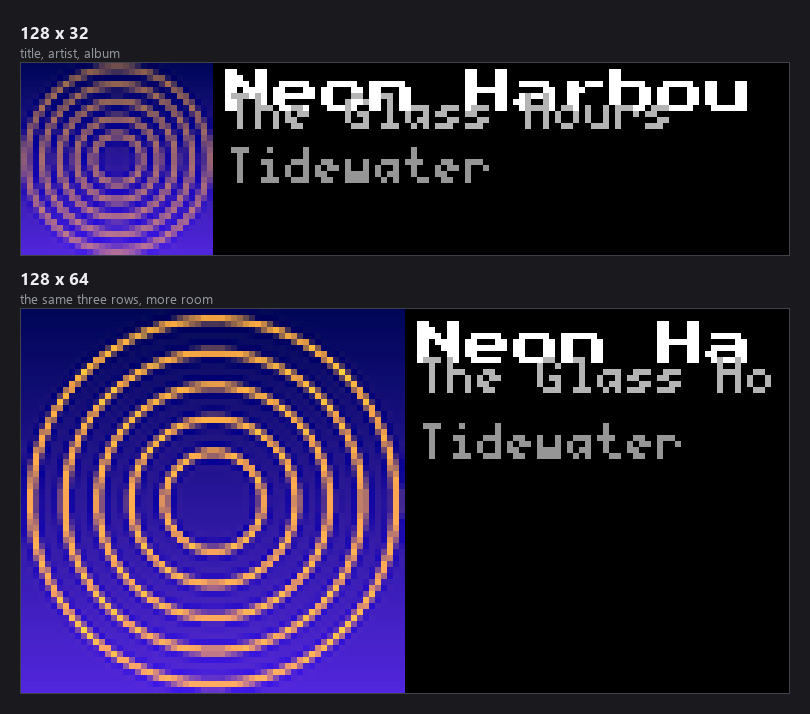
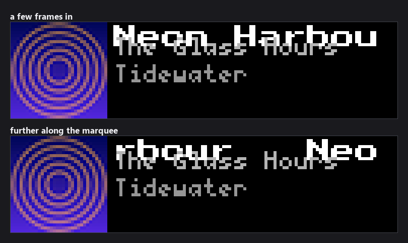
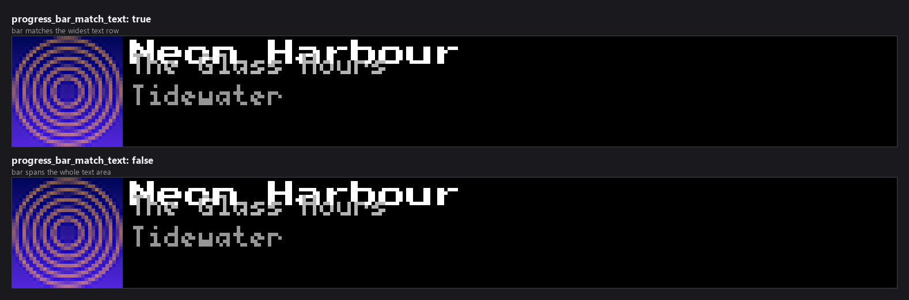
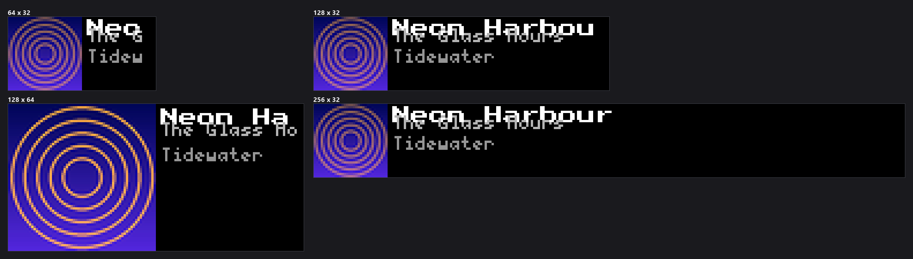

-----------------------------------------------------------------------------------
### Connect with ChuckBuilds

- Show support on Youtube: https://www.youtube.com/@ChuckBuilds
- Stay in touch on Instagram: https://www.instagram.com/ChuckBuilds/
- Want to chat or need support? Reach out on the ChuckBuilds Discord: https://discord.com/invite/uW36dVAtcT
- Feeling Generous? Support the project:
  - Github Sponsorship: https://github.com/sponsors/ChuckBuilds
  - Buy Me a Coffee: https://buymeacoffee.com/chuckbuilds
  - Ko-fi: https://ko-fi.com/chuckbuilds/ 

-----------------------------------------------------------------------------------

# Music Player Plugin


*Every image in this README is real plugin output, rendered at the true panel
size from a recorded now-playing payload so it reproduces exactly. The cover
art in them is generated, not a real album cover.*

A plugin for LEDMatrix that displays real-time now playing information from Spotify and YouTube Music with album art, scrolling text, and progress bars.

Screenshot


## Features

- **Dual Music Sources**: Support for both Spotify and YouTube Music
- **Real-time Updates**: Live track information with automatic refresh
- **Album Art Display**: High-quality album artwork with automatic resizing and enhancement
- **Scrolling Text**: Smooth scrolling for long track titles, artists, and album names
- **Progress Bar**: Visual progress indicator showing playback position
- **Source Switching**: Automatic detection and switching between music sources
- **Authentication Support**: Built-in OAuth2 for Spotify and token-based auth for YTM
- **Background Polling**: Non-blocking data fetching with configurable intervals
- **Error Handling**: Graceful fallback to "Nothing Playing" state
- **Thread Safety**: Thread-safe operations for concurrent access
- **Display Modes**: Dedicated "now_playing" display mode
- **Configuration**: Flattened config structure for easy plugin management

## Configuration

### Plugin Settings
Use Web Ui to configure


### Configuration Options

Settings live in the plugin's tab in the web UI and in `config/config.json`
under `ledmatrix-music`. The full schema is
[`config_schema.json`](config_schema.json).

### Source and behaviour

| Key | Default | Notes |
|---|---|---|
| `enabled` | `true` | Enable or disable the music player plugin. |
| `display_duration` | `30` | How long to show the music display (10-300 seconds). |
| `preferred_source` | `"spotify"` | Preferred music source — one of `spotify`, `ytm`. |
| `polling_interval_seconds` | `2` | Polling interval for Spotify in seconds (1–60). Advanced. |
| `ytm_companion_url` | `"http://localhost:9863"` | YouTube Music Companion server URL. |
| `spotify_client_id` | — | Spotify API Client ID. Stored as a secret, so the web UI masks it. |
| `spotify_client_secret` | — | Spotify API Client Secret. Stored as a secret, so the web UI masks it. |
| `live_priority` | `false` | Enable live priority - music will interrupt normal display rotation when actively playing. |
| `layout_mode` | `"classic"` | Layout engine. 'classic' is the original fixed-size layout (unchanged). 'adaptive' (beta) scales the title/artist/album fonts to the panel height, growing on large panels and shrinking gracefully on small ones — the album art already scales this way. Your customization fonts and y_percent offsets still apply in adaptive mode. Requires LEDMatrix core with the adaptive layout system; falls back to classic on older cores. Switch back to 'classic' at any time to restore the original rendering — one of `classic`, `adaptive`. Advanced. |
| `progress_bar_match_text` | `true` | Size the progress bar to the widest of the title, artist and album lines instead of stretching it across the whole text area. On a wide panel a short title otherwise leaves a bar spanning the display, which reads as a full-width element in Vegas scroll mode. A line long enough to scroll still fills the bar, since it genuinely fills that width. Turn off for the original full-width bar. Advanced. |

### Marquee scrolling

Each of the three text rows scrolls independently and takes the same five keys.

| Key | Default | Notes |
|---|---|---|
| `text_scrolling.title.enabled` | `true` | Enable scrolling for track title. Advanced. |
| `text_scrolling.title.speed` | `5` | Scroll speed divisor (higher = slower, lower = faster). Controls how many frames between each character scroll. Range: 1-20. Advanced. |
| `text_scrolling.title.separator` | `"   "` | Text separator between wrapped text (e.g., '   ' for 3 spaces, ' | ' for pipe). Advanced. |
| `text_scrolling.title.initial_pause_frames` | `0` | Number of frames to pause before starting scroll (0 = no pause) (0–300). Advanced. |
| `text_scrolling.title.end_pause_frames` | `0` | Number of frames to pause at end before wrapping (0 = no pause) (0–300). Advanced. |
| `text_scrolling.artist.enabled` | `true` | Enable scrolling for artist name. Advanced. |
| `text_scrolling.artist.speed` | `5` | Scroll speed divisor (higher = slower, lower = faster). Controls how many frames between each character scroll. Range: 1-20. Advanced. |
| `text_scrolling.artist.separator` | `"   "` | Text separator between wrapped text (e.g., '   ' for 3 spaces, ' | ' for pipe). Advanced. |
| `text_scrolling.artist.initial_pause_frames` | `0` | Number of frames to pause before starting scroll (0 = no pause) (0–300). Advanced. |
| `text_scrolling.artist.end_pause_frames` | `0` | Number of frames to pause at end before wrapping (0 = no pause) (0–300). Advanced. |
| `text_scrolling.album.enabled` | `true` | Enable scrolling for album name. Advanced. |
| `text_scrolling.album.speed` | `5` | Scroll speed divisor (higher = slower, lower = faster). Controls how many frames between each character scroll. Range: 1-20. Advanced. |
| `text_scrolling.album.separator` | `"   "` | Text separator between wrapped text (e.g., '   ' for 3 spaces, ' | ' for pipe). Advanced. |
| `text_scrolling.album.initial_pause_frames` | `0` | Number of frames to pause before starting scroll (0 = no pause) (0–300). Advanced. |
| `text_scrolling.album.end_pause_frames` | `0` | Number of frames to pause at end before wrapping (0 = no pause) (0–300). Advanced. |

### Fonts and row positions

There are no colour settings — the three rows use fixed shades, as described
under [Color Customization](#color-customization).

| Key | Default | Notes |
|---|---|---|
| `customization.title_text.font` | `"PressStart2P-Regular.ttf"` | Select the font to use — one of `PressStart2P-Regular.ttf`, `4x6-font.ttf`, `5by7.regular.ttf`, `5x7.bdf`, `4x6.bdf`, `cozette.bdf`. Advanced. |
| `customization.title_text.font_size` | `8` | Font size in pixels (4–16). Advanced. |
| `customization.title_text.y_percent` | — | Vertical position override as fraction of display height (0.0=top, 1.0=bottom). Leave empty for automatic positioning based on font size (0.0–1.0). Advanced. |
| `customization.artist_text.font` | `"5x7.bdf"` | Select the font to use (default matches the display manager 5x7 font) — one of `PressStart2P-Regular.ttf`, `4x6-font.ttf`, `5by7.regular.ttf`, `5x7.bdf`, `4x6.bdf`, `cozette.bdf`. Advanced. |
| `customization.artist_text.font_size` | `7` | Font size in pixels (4–16). Advanced. |
| `customization.artist_text.y_percent` | — | Vertical position override as fraction of display height (0.0=top, 1.0=bottom). Leave empty for automatic positioning based on font size (0.0–1.0). Advanced. |
| `customization.album_text.font` | `"5x7.bdf"` | Select the font to use (default matches the display manager 5x7 font) — one of `PressStart2P-Regular.ttf`, `4x6-font.ttf`, `5by7.regular.ttf`, `5x7.bdf`, `4x6.bdf`, `cozette.bdf`. Advanced. |
| `customization.album_text.font_size` | `7` | Font size in pixels (4–16). Advanced. |
| `customization.album_text.y_percent` | — | Vertical position override as fraction of display height (0.0=top, 1.0=bottom). Leave empty for automatic positioning based on font size (0.0–1.0). Advanced. |


### What the rows look like



Album art takes the full panel height on the left; the title, artist and album
stack in the space that is left. A row too wide for that space marquee-scrolls
rather than truncating:



`progress_bar_match_text` decides how far the playback bar runs. On a wide
panel a short title otherwise leaves a bar stretched across the display:





## Authentication Setup

### Spotify Authentication

1. **Create Spotify App**:
   - Go to [Spotify Developer Dashboard](https://developer.spotify.com/dashboard)
   - Create a new app
   - Note your Client ID and Client Secret
   - Set Redirect URI to `http://localhost:8080/callback` (or your preferred URL)

2. **Configure Credentials**:
   Add to `config/config_secrets.json`:
   ```json
   {
     "ledmatrix-music": {
       "spotify_client_id": "your_client_id_here",
       "spotify_client_secret": "your_client_secret_here",
       "spotify_redirect_uri": "http://localhost:8080/callback"
     }
   }
   ```

   > Older configs that put these under a `"music"` key with
   > `SPOTIFY_CLIENT_ID` (uppercase) still work — `spotify_client.py`
   > falls back to that legacy form — but new installs should use the
   > `"ledmatrix-music"` key with lowercase names shown above.

3. **Run Authentication**:
   ```bash
   cd plugins/ledmatrix-music
   python3 authenticate_spotify.py
   ```
   - Follow the prompts to authorize in your browser
   - Copy the redirected URL back to the script
   - Token will be saved to `config/spotify_auth.json`

### YouTube Music Authentication

1. **Install YTM Desktop App**:
   - Download from [YTM Desktop](https://github.com/ytmdesktop/ytmdesktop)
   - Install and run the application
   - Enable the Companion Server in settings

2. **Configure YTM URL**:
   Update your config if using a different port:
   ```json
   {
     "ledmatrix-music": {
       "ytm_companion_url": "http://localhost:9863"
     }
   }
   ```

3. **Run Authentication**:
   ```bash
   cd plugins/ledmatrix-music
   python3 authenticate_ytm.py
   ```
   - The script will request an auth code
   - Approve the request in YTM Desktop App within 30 seconds
   - Token will be saved to `config/ytm_auth.json`
   - Each installation registers with a unique app ID (a random hex code appended to
     `LEDMatrixController`), so authenticating multiple LEDMatrix displays against the
     same YTM Desktop App won't overwrite each other's authorization

## Display Format

The music display shows:

- **Album Art**: Square album artwork on the left side
- **Track Title**: Scrolling white text at the top
- **Artist**: Scrolling gray text in the middle
- **Album**: Scrolling light gray text below artist
- **Progress Bar**: White progress bar at the bottom
- **Nothing Playing**: Centered message when no music is detected

### Adaptive Layout (beta)

Set `"layout_mode": "adaptive"` to scale the title/artist/album fonts to
your panel height — the same way the album art already scales
(`album_art_size = matrix_height`). On a tall panel the text grows right
along with the artwork instead of staying at a fixed size.

```json
{
  "layout_mode": "adaptive"
}
```

- The default is `"classic"`: rendering is completely unchanged unless you
  opt in. **To revert at any time, set it back to `"classic"`** — no
  reinstall needed.
- Your font and vertical-position (`y_percent`) customizations still apply
  in adaptive mode: an explicitly configured font/font_size for
  `title_text`/`artist_text`/`album_text` wins over the automatic sizing.
- Since text still scrolls when it's too wide for the panel, fonts are
  sized by height only (title/artist/album each get an equal share of the
  vertical space above the progress bar) — width never forces the font
  smaller the way it might on a scoreboard.
- Requires a LEDMatrix core with the adaptive layout system
  (`docs/ADAPTIVE_LAYOUT.md`); older cores silently keep the classic layout.

## Music Sources

### Spotify
- **API**: Spotify Web API
- **Authentication**: OAuth2 with refresh tokens
- **Data**: Track name, artist, album, artwork, progress, duration
- **Polling**: Configurable interval (default 2 seconds)
- **Features**: Real-time playback state, album art, progress tracking

### YouTube Music
- **API**: YTM Desktop Companion Server
- **Authentication**: Token-based with YTM Desktop App
- **Data**: Track name, artist, album, artwork, progress, duration
- **Updates**: Real-time via Socket.IO events
- **Features**: Live updates, ad detection, playback state

## Display Modes

### Now Playing Mode
- **Mode Name**: `now_playing`
- **Description**: Real-time music information display
- **Features**: Album art, scrolling text, progress bar
- **Duration**: Configurable (10-300 seconds)

## Technical Details

### Threading
- **Polling Thread**: Background thread for Spotify polling
- **Socket.IO Thread**: Real-time updates from YTM
- **Display Thread**: Main display rendering
- **Thread Safety**: All shared data protected with locks

### Image Processing
- **Album Art**: Automatic download and resizing
- **Enhancement**: Contrast and saturation boost for LED matrix
- **Caching**: Images cached to avoid repeated downloads
- **Fallback**: Placeholder rectangle when no artwork available

### Scrolling Logic
- **Text Scrolling**: Smooth character-by-character scrolling
- **Wrap Around**: Continuous scrolling with separator
- **Speed Control**: Configurable scroll speed and timing
- **Multi-line**: Independent scrolling for title, artist, and album

### Error Handling
- **Network Errors**: Graceful fallback to cached data
- **Authentication Errors**: Clear error messages and guidance
- **API Errors**: Automatic retry with exponential backoff
- **Display Errors**: Fallback to "Nothing Playing" state

## Troubleshooting

### No Music Display
1. Check if plugin is enabled in config
2. Verify preferred source is set correctly
3. Check authentication status
4. Review plugin logs for errors

### Spotify Issues
1. Verify credentials in `config_secrets.json`
2. Run `authenticate_spotify.py` to refresh token
3. Check Spotify app is playing music
4. Verify internet connection

### YouTube Music Issues
1. Ensure YTM Desktop App is running
2. Check Companion Server is enabled
3. Run `authenticate_ytm.py` to refresh token
4. Verify YTM is playing music

### Authentication Problems
1. Check file permissions on config directory
2. Verify credentials are correct
3. Ensure redirect URI matches Spotify app settings
4. Check YTM Desktop App is running during auth

### Display Issues
1. Check album art URLs are accessible
2. Verify font files are available
3. Check matrix dimensions and layout
4. Review scrolling configuration

### Performance Issues
1. Adjust polling interval
2. Check system resources
3. Monitor network connectivity
4. Review error logs

## Advanced Configuration

### Custom Fonts
The plugin uses LEDMatrix's font system:
- **Title Font**: `small_font` (TTF)
- **Artist/Album Font**: `bdf_5x7_font` (BDF)

### Color Customization
Colors are hardcoded for optimal LED matrix display:
- **Title**: White (255, 255, 255)
- **Artist**: Light Gray (180, 180, 180)
- **Album**: Gray (150, 150, 150)
- **Progress Bar**: White (200, 200, 200)

### Layout Customization
Layout is optimized for LED matrix displays:
- **Album Art Size**: Full height of display
- **Text Area**: Remaining width after album art
- **Positioning**: Percentage-based for different matrix sizes

## API Integration

### Spotify Web API
- **Endpoint**: `https://api.spotify.com/v1/me/player/currently-playing`
- **Authentication**: Bearer token with automatic refresh
- **Rate Limiting**: Built-in delays between requests
- **Data Format**: JSON with track, artist, album, and progress info

### YTM Companion Server
- **Protocol**: Socket.IO over WebSocket
- **Authentication**: Token-based with app approval
- **Real-time**: Live updates via event callbacks
- **Data Format**: JSON with video, player, and progress info

## Performance Features

### Background Data Fetching
- **Non-blocking**: API calls don't block display updates
- **Caching**: Album art and track data cached locally
- **Retry Logic**: Automatic retry on network errors
- **Throttling**: Rate limiting to prevent API abuse

### Memory Management
- **Image Caching**: Album art cached with size limits
- **Queue Management**: Bounded queues for event data
- **Cleanup**: Proper resource cleanup on shutdown
- **Garbage Collection**: Automatic cleanup of old data

### Display Optimization
- **Frame Rate**: Optimized for smooth scrolling
- **Redraw Logic**: Only redraw when necessary
- **State Management**: Efficient state tracking
- **Error Recovery**: Graceful recovery from errors

## Integration Notes

This plugin is designed to work alongside other LEDMatrix plugins:

- **Weather Plugin**: Rotate between weather and music
- **News Plugin**: Show music during news breaks
- **Sports Plugin**: Display music during sports intermissions
- **Clock Plugin**: Show time and music information

## Dependencies

- **spotipy**: Spotify Web API client
- **python-socketio[client]**: Socket.IO client for YTM
- **requests**: HTTP library for API calls
- **pillow**: Image processing for album art
- **LEDMatrix**: Base plugin system and display management

## Version History

### v1.1.0
- Adaptive layout (beta, opt-in): `layout_mode: "adaptive"` scales title/
  artist/album fonts to the panel height, matching the album art's
  existing height-based scaling. Default stays `"classic"`; revert anytime
  by setting it back, no reinstall needed.

### v1.0.0
- Initial plugin release
- Migrated from `src/old_managers/music_manager.py`
- Flattened configuration structure
- Plugin system integration
- Path resolution fixes for plugin location
- Comprehensive documentation

## Support

For issues, feature requests, or questions:

1. **Check Logs**: Review plugin logs for error messages
2. **Verify Config**: Ensure configuration is correct
3. **Test Authentication**: Run auth scripts to verify setup
4. **Check Dependencies**: Ensure all required packages are installed
5. **Review Documentation**: Check this README for troubleshooting steps

## License

This plugin is licensed under the GNU General Public License v3.0. See the [LICENSE](LICENSE) file for details.

## Contributing

Contributions are welcome! Please:

1. Fork the repository
2. Create a feature branch
3. Make your changes
4. Test thoroughly
5. Submit a pull request

## Acknowledgments

- **Spotify**: For the excellent Web API
- **YTM Desktop**: For the Companion Server
- **LEDMatrix**: For the plugin system and display management
- **Community**: For feedback and contributions
