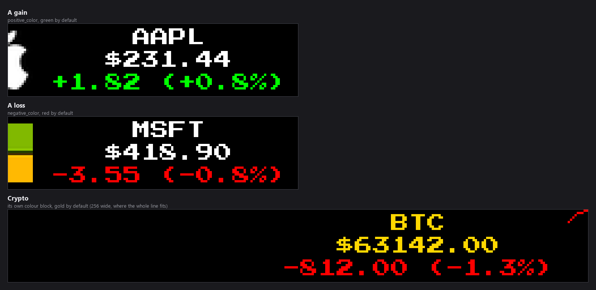
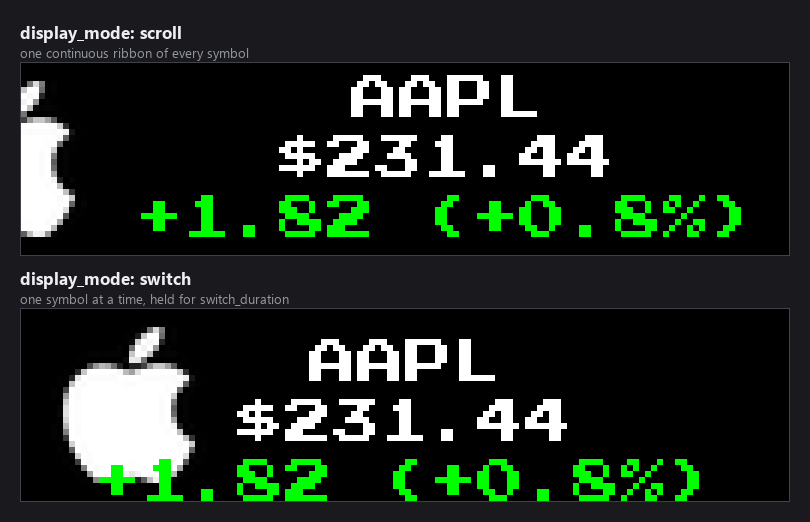
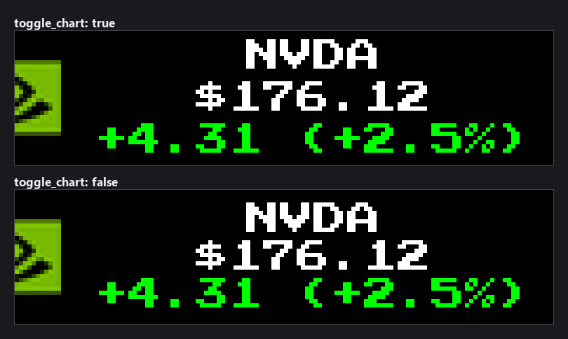
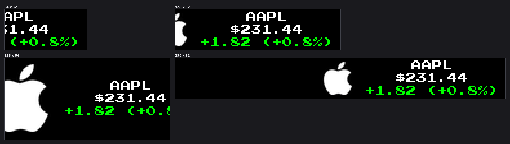

# Stock & Crypto Ticker Plugin

A scrolling ticker for the LEDMatrix display showing live stock and
cryptocurrency prices, percent changes, and optional inline price charts.
Data comes from Yahoo Finance — no API key required.


*Every image in this README is real plugin output, rendered at the true panel
size from a recorded quote so it reproduces exactly.*

## Features

- Live stock and crypto prices via Yahoo Finance (no API key)
- Color-coded gain/loss with positive/negative colors
- Optional inline mini chart per symbol (`display.toggle_chart`)
- Two display modes: continuous scroll, or one symbol at a time
- Independent stock and crypto symbol lists
- Per-element font and color customization

## Installation

1. Open the LEDMatrix web interface (`http://your-pi-ip:5000`)
2. Open the **Plugin Manager** tab
3. Find **Stock Ticker** in the **Plugin Store** section and click
   **Install**
4. Open the plugin's tab in the second nav row to configure it

## Configuration

The full schema lives in
[`config_schema.json`](config_schema.json) — what you see in the web UI is
generated from it. The most-used keys, with their actual nesting:

### Top level

| Key | Default | Notes |
|---|---|---|
| `enabled` | `false` | Master switch |
| `update_interval` | `600` | Seconds between Yahoo Finance fetches for stocks |

### `display.*` — how the ticker scrolls

| Key | Default | Notes |
|---|---|---|
| `display.display_mode` | `"scroll"` | `"scroll"` or `"switch"` |
| `display.switch_duration` | `15` | Seconds per symbol in switch mode |
| `display.scroll_speed` | `1.0` | Scroll speed multiplier |
| `display.scroll_delay` | `0.02` | Per-step delay (smaller = smoother but more CPU) |
| `display.toggle_chart` | `true` | Show an inline mini-chart per symbol |
| `display.chart_width_px` | `64` | Mini-chart width in pixels — a fixed size that does not scale with the display width (`8`-`256`) |
| `display.chart_height_px` | `32` | Mini-chart height in pixels — a fixed size that does not scale with the display height; clamped to the panel (`6`-`256`) |
| `display.dynamic_duration` | `true` | Let the controller pick a duration based on content width |
| `display.min_duration` | `30` | Floor for dynamic duration (seconds) |
| `display.max_duration` | `300` | Ceiling for dynamic duration (seconds) |
| `display.duration_buffer` | `0.1` | Padding factor on dynamic duration |
| `display.stock_gap` | `32` | Pixels of space between symbols |

### `stocks.*`

| Key | Default | Notes |
|---|---|---|
| `stocks.enabled` | `true` | Enable the stocks list |
| `stocks.symbols` | `["ASTS","SCHD","INTC","NVDA","T","VOO","SMCI"]` | Yahoo Finance symbols — stocks, indexes (`^GSPC`), commodities (`GC=F`), share classes (`BRK-B`), non-US listings (`7203.T`). See [Symbol format](#symbol-format) |
| `stocks.display_format` | `"{symbol}: ${price} ({change}%)"` | Placeholders: `{symbol}`, `{price}`, `{change}` |

### `crypto.*`

| Key | Default | Notes |
|---|---|---|
| `crypto.enabled` | `false` | Enable the crypto list |
| `crypto.update_interval` | `600` | Seconds between crypto fetches |
| `crypto.symbols` | `["BTC-USD","ETH-USD"]` | Coin pairs. A bare symbol (`BTC`) is quoted in USD; name another currency to override (`BTC-EUR`) |
| `crypto.display_format` | `"{symbol}: ${price} ({change}%)"` | Same placeholders as stocks |

### `customization.*`

Per-element font, size, and colour overrides, kept separately for stocks and
crypto so the two are distinguishable at a glance. Each of `symbol`, `price`
and `price_delta` has its own `font` and `font_size`; the colour keys differ
by element:

| Key | Default | Notes |
|---|---|---|
| `customization.stocks.symbol.text_color` | `[255, 255, 255]` | Ticker symbol, stocks |
| `customization.stocks.price.text_color` | `[255, 255, 255]` | Price line, stocks |
| `customization.stocks.price_delta.positive_color` | `[0, 255, 0]` | Change when up, stocks |
| `customization.stocks.price_delta.negative_color` | `[255, 0, 0]` | Change when down, stocks |
| `customization.crypto.symbol.text_color` | `[255, 215, 0]` | Ticker symbol, crypto |
| `customization.crypto.price.text_color` | `[255, 215, 0]` | Price line, crypto |
| `customization.crypto.price_delta.positive_color` | `[0, 255, 0]` | Change when up, crypto |
| `customization.crypto.price_delta.negative_color` | `[255, 0, 0]` | Change when down, crypto |

`price_delta` has no `text_color` — its colour is chosen by the sign of the
change, from the two keys above.



Five fonts are offered per element. Three are TrueType and work at every size
in the 4–16 range; two are `.bdf` bitmap faces, which exist at exactly one
size each and are loaded at that size whatever `font_size` says:

| Font | Kind | Sizes |
|---|---|---|
| `PressStart2P-Regular.ttf` | TrueType | any |
| `4x6-font.ttf` | TrueType | any |
| `5by7.regular.ttf` | TrueType | any |
| `5x7.bdf` | bitmap | 7 only |
| `4x6.bdf` | bitmap | 6 only |

## Symbol format

Symbols are passed to Yahoo Finance exactly as you type them, so **whatever
works in the search box on [finance.yahoo.com](https://finance.yahoo.com)
works here** — copy the symbol from the top of the quote page. It is not
limited to plain stock tickers.

| You want | Enter | Examples |
|---|---|---|
| A stock | the ticker | `AAPL`, `NVDA`, `VOO`, `SCHD` |
| A market index | `^` + code | `^GSPC` (S&P 500), `^DJI` (Dow), `^IXIC` (Nasdaq), `^VIX`, `^RUT` (Russell 2000), `^N225` (Nikkei), `^FTSE` |
| A commodity / future | code + `=F` | `GC=F` (gold), `SI=F` (silver), `CL=F` (crude oil), `NG=F` (natural gas), `ZC=F` (corn), `HG=F` (copper) |
| A share class | ticker + `-` + class | `BRK-B` (Berkshire B), `BF-B` (Brown-Forman B) |
| A non-US listing | ticker + exchange suffix | `7203.T` (Toyota, Tokyo), `005930.KS` (Samsung, Korea), `SHEL.L` (Shell, London) |
| Crypto | pair, or bare symbol | `BTC-USD`, `ETH-USD`, `SOL-USD`; a bare `BTC` is quoted in USD for you |

Commodities and indexes go in **`stocks.symbols`**, not `crypto.symbols` —
the crypto list is only for coin pairs.

```json
{
  "stocks": {
    "enabled": true,
    "symbols": ["AAPL", "NVDA", "^GSPC", "^VIX", "GC=F", "CL=F", "BRK-B"]
  },
  "crypto": {
    "enabled": true,
    "symbols": ["BTC-USD", "ETH-USD"]
  }
}
```

### Non-USD crypto

Name the quote currency to price a coin in something other than dollars:
`BTC-EUR`, `ETH-GBP`. A symbol with no quote currency (`BTC`) is sent as
`BTC-USD`.

### What is not accepted

Symbols are upper-case only (`aapl` is rejected — use `AAPL`), and cannot
contain spaces. If the field refuses what you typed, the web UI names the
value it rejected.

### The two display modes



`scroll` renders every symbol into one continuous ribbon and slides it past;
`switch` shows a single symbol at a time and cuts to the next after
`switch_duration` seconds.

### The inline chart

`display.toggle_chart` draws the day's price history behind the text, sized by
`chart_width_px` and `chart_height_px`:



### Panel sizes



### A note on display width

Longer symbols take more room on the panel. `^GSPC` and `GC=F` are five and
four characters, so they behave like any ticker, but if a symbol looks
cropped on a narrow panel, `display.display_mode: "switch"` shows one at a
time instead of scrolling.

## Pairing with the Stock News plugin

This plugin pairs naturally with the [`stock-news`](../stock-news/)
plugin: prices on one rotation slot, related headlines on another.

## Troubleshooting

**No data showing**
- Confirm the symbols are valid on
  [finance.yahoo.com](https://finance.yahoo.com) — typos return empty data.
- Check the **Logs** tab for HTTP errors. Yahoo occasionally rate-limits;
  raising `update_interval` usually fixes it.

**Scroll feels choppy**
- Lower `display.scroll_delay` (default 0.02) toward 0.01 for smoother
  motion at the cost of CPU.
- Or switch `display.display_mode` to `"switch"` to step through one
  symbol at a time instead of scrolling.

**Chart isn't drawing**
- Set `display.toggle_chart` to `true`.
- Charts need enough horizontal room next to each symbol. On a 64×32
  panel they may be cropped — try a wider chain.

## License

GPL-3.0, same as the LEDMatrix project.
