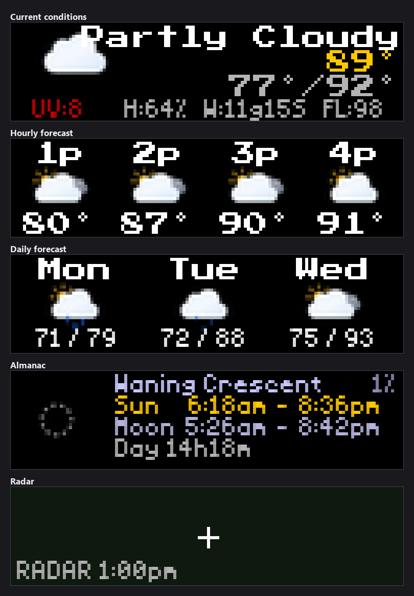
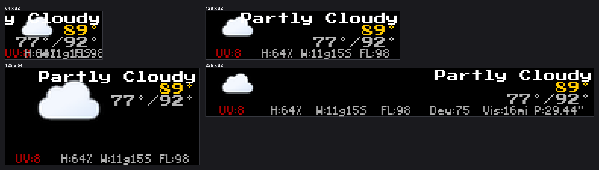

-----------------------------------------------------------------------------------
### Connect with ChuckBuilds

- Show support on Youtube: https://www.youtube.com/@ChuckBuilds
- Stay in touch on Instagram: https://www.instagram.com/ChuckBuilds/
- Want to chat or need support? Reach out on the ChuckBuilds Discord: https://discord.com/invite/uW36dVAtcT
- Feeling Generous? Support the project:
  - Github Sponsorship: https://github.com/sponsors/ChuckBuilds
  - Buy Me a Coffee: https://buymeacoffee.com/chuckbuilds
  - Ko-fi: https://ko-fi.com/chuckbuilds/ 

-----------------------------------------------------------------------------------

# Weather Display Plugin

*Every image in this README is real plugin output, rendered from a recorded
Open-Meteo response for Dallas on 2026-06-14 so it reproduces exactly.*

Comprehensive weather display plugin for LEDMatrix showing current conditions, hourly forecast, and daily forecast.

Current Weather:

Hourly Forecast:

Daily Forecast:

## Features

- **Current conditions**: temperature, conditions icon, humidity, wind,
  feels-like, dew point, visibility, pressure (extra metrics need height ≥48px)
- **Hourly forecast**: next 24 hours
- **Daily forecast**: 3–7 day high/low
- **Almanac**: sunrise/sunset, moon phase, day length
- **Precipitation radar**: animated RainViewer imagery over a real
  OpenStreetMap basemap (worldwide), with optional ~30 min of forecast
  (nowcast) frames and a retro WeatherStar vector-map style
- **Weather alerts**: when active (US only), takes priority in the rotation

## Requirements

- Internet connection
- No API key required — weather data comes from [Open-Meteo](https://open-meteo.com/),
  a free and open-source weather API
- Display size: 64x32 minimum; 64x48 or larger to see the extra current-
  conditions metrics

## Configuration

### Configuration options

The plugin's full schema lives in
[`config_schema.json`](config_schema.json) — what you see in the web UI is
generated from it. The keys you'll touch most often:

| Key | Default | Notes |
|---|---|---|
| `enabled` | `false` | Master switch |
| `location_latitude` / `location_longitude` | `null` | Set both to skip geocoding and pin an exact position. Left null, the city/state/country above are geocoded once and cached. Advanced |
| `api_key` | `null` | Not needed for the default setup — Open-Meteo requires no key. Kept for deployments that proxy a keyed weather service. Advanced |
| `location_city` | `"Dallas"` | City name |
| `location_state` | `"Texas"` | State/province (optional, helps US disambiguation) |
| `location_country` | `"US"` | ISO 3166-1 alpha-2 code |
| `units` | `"imperial"` | `"imperial"` (°F) or `"metric"` (°C) |
| `display_duration` | `30` | Seconds per mode (5–300) |
| `update_interval` | `1800` | Seconds between weather fetches (min 300) |
| `display_format` | `"{temp}°F\n{condition}"` | Placeholders: `{temp}`, `{condition}`, `{humidity}`, `{wind}` |
| `show_current_weather` | `true` | Toggle current conditions mode |
| `show_hourly_forecast` | `true` | Toggle hourly mode |
| `show_daily_forecast` | `true` | Toggle daily mode |
| `show_almanac` | `true` | Toggle almanac mode (sun/moon) |
| `show_radar` | `true` | Toggle precipitation radar mode |
| `show_alerts` | `true` | Show active weather alerts (preempts rotation, US only) |
| `show_feels_like` / `show_dew_point` / `show_visibility` / `show_pressure` | `true` | Extra current-conditions metrics (need height ≥ 48px) |
| `radar_map_style` | `"osm"` | Basemap: `osm`, `carto`, `carto_dark`, `esri` (real tiles, worldwide) or `vector` (retro WeatherStar state outlines, US-only). Tile styles fall back to the vector map automatically when tiles can't be fetched |
| `radar_range_miles` | `75` | Distance from your location to the panel edge (10–500). Replaces the deprecated `radar_zoom`, which is still honored for old configs |
| `radar_show_nowcast` | `true` | Append ~30 min of predicted radar (`FCST +10m` … with yellow dots) after the observed frames |
| `radar_tile_server` | `"https://maps.chuck-builds.com"` | Self-hosted OSM tile server for the `osm` style (`{server}/tile/{z}/{x}/{y}.png`); public mirrors are the fallback |
| `radar_map_brightness` | `0.5` | Dim the tile basemap so precipitation pops on the matrix |
| `radar_line_color` | `[0, 130, 70]` | RGB for state outlines (vector style / fallback) |
| `radar_fill_color` | `[15, 25, 15]` | RGB for land fill (`[0,0,0]` = outlines only) |
| `radar_update_interval` | `180` | Seconds between new-frame checks (60–1800). Checks are cheap; tiles only download when RainViewer publishes a new frame |
| `radar_past_frames` | `6` | Observed frames to animate (~10 min apart) |
| `radar_frame_seconds` / `radar_loop_pause_seconds` | `0.5` / `1.5` | Animation pacing: per-frame time and the hold on the newest frame |
| `dynamic_duration.enabled` | `false` | Opt-in: hold the radar until a full animation loop completes rather than cutting mid-loop |
| `dynamic_duration.max_duration_seconds` | `60` | Ceiling on that hold, in seconds (10–300), so a slow loop cannot monopolise the panel |

## Display modes

The plugin registers these modes in `manifest.json` and the display
controller rotates through them in order:

| Mode | Description |
|---|---|
| `weather` | Current conditions: temperature, icon, humidity, wind, plus optional feels-like / dew point / visibility / pressure on taller displays |
| `hourly_forecast` | Next ~24 hours |
| `daily_forecast` | 3–7 day high/low forecast |
| `almanac` | Sunrise, sunset, moon phase, day length |
| `radar` | Animated precipitation radar (RainViewer) over an OSM or vector basemap, with optional nowcast frames |

The radar panel above is rendered with no network access, so it shows the
overlay — the location crosshair and the frame timestamp — over an empty
basemap. On a connected display the basemap tiles and the precipitation frames
fill it; those come from live tile servers, which is why this one screen cannot
be reproduced from a recording the way the others are.

Every mode adapts to the panel. The current-conditions screen adds the
feels-like, dew point, visibility and pressure readings only when the panel is
at least 48px tall:

When an active weather alert is available and `show_alerts` is true, the
alert takes priority over the normal rotation. Alerts are sourced from the
[NWS API](https://www.weather.gov/documentation/services-web-api) and are
only available for US locations.

## Usage

The plugin auto-rotates through enabled display modes based on
`display_duration`. Toggle individual modes on or off with the
`show_*` keys above (or the matching toggles in the web UI).

## Data sources

| Data | Source | Key required |
|---|---|---|
| Current conditions, forecast, almanac | [Open-Meteo](https://open-meteo.com/) | None |
| Weather alerts | [NWS API](https://www.weather.gov/documentation/services-web-api) (US only) | None |
| Precipitation radar | [RainViewer](https://www.rainviewer.com/api.html) | None |
| Radar basemap tiles | Self-hosted/[OpenStreetMap](https://www.openstreetmap.org) (or Carto/Esri per `radar_map_style`) | None |

## Troubleshooting

**No weather data displayed / "No Data" on screen:**
- Verify internet connection
- Ensure location is spelled correctly (`location_city` must be a city
  name that Open-Meteo's geocoding can resolve)
- Check plugin logs for specific error messages

**Slow updates:**
- Lower `update_interval` for fresher data (minimum 300 s); the default
  1800 s (30 min) is recommended since weather rarely changes faster

**Radar not showing:**
- Radar uses RainViewer and updates on a separate `radar_update_interval`
  (default 180 s); allow a minute for the first tiles to load — frames are
  fetched in the background across update cycles

**Radar map is the green-outline vector style instead of a real map:**
- That's the automatic fallback when basemap tiles can't be fetched. Check
  connectivity to your `radar_tile_server` (or leave it empty to use public
  OSM mirrors), and note the `vector` style is the only offline-friendly one

## License

GPL-3.0 License - see main LEDMatrix repository for details.
