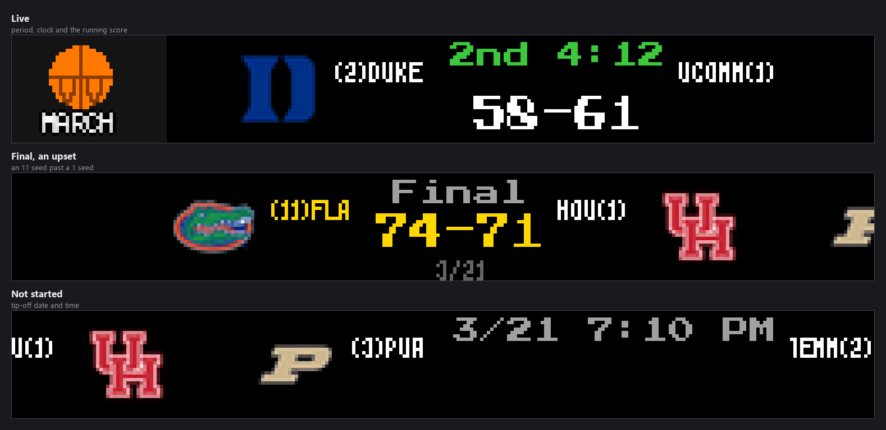
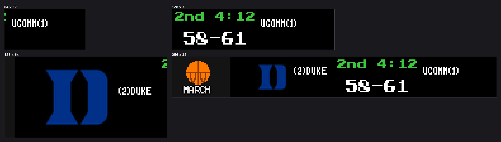
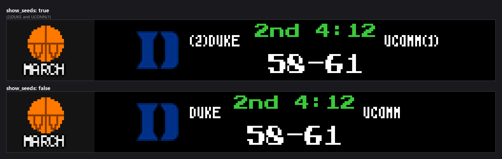
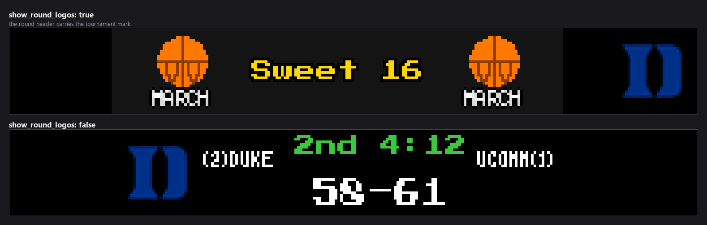
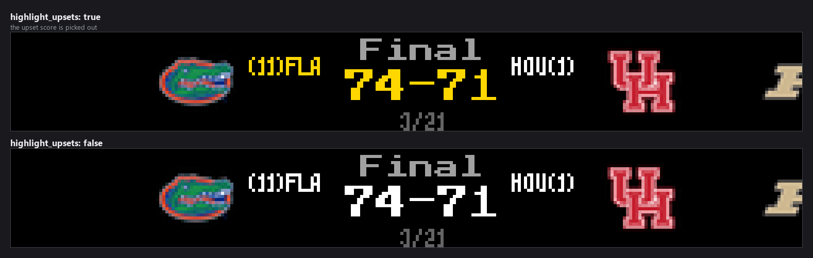

-----------------------------------------------------------------------------------
### Connect with ChuckBuilds

- Show support on Youtube: https://www.youtube.com/@ChuckBuilds
- Stay in touch on Instagram: https://www.instagram.com/ChuckBuilds/
- Want to chat or need support? Reach out on the ChuckBuilds Discord: https://discord.com/invite/uW36dVAtcT
- Feeling Generous? Support the project:
  - Github Sponsorship: https://github.com/sponsors/ChuckBuilds
  - Buy Me a Coffee: https://buymeacoffee.com/chuckbuilds
  - Ko-fi: https://ko-fi.com/chuckbuilds/

-----------------------------------------------------------------------------------

# March Madness Plugin


*Every image in this README is real plugin output, rendered at the true panel
size from seeded games so it reproduces exactly. Teams, seeds and scores are
invented; the team marks are the logo assets the plugin already ships.*

A plugin for LEDMatrix that tracks the NCAA Division I basketball tournaments. It
shows a horizontally-scrolling ticker of tournament games grouped by round — from
the Round of 64 through the National Championship — with team seeds, round
branding, live scores, and upset highlighting.

Unlike the in-season **Basketball Scoreboard** plugin (which can also surface
tournament games in its normal live/recent/upcoming rotation), this plugin is a
dedicated bracket view: it orders games by tournament round and region, draws round
separators, and calls out upsets, so it reads like a bracket rather than a game
list.

## Features

- **Men's & Women's Tournaments**: Track the NCAA Men's (NCAAM) and Women's
  (NCAAW) Division I tournaments, independently toggleable.
- **Round Grouping**: Games are grouped and ordered by round — Round of 64, Round
  of 32, Sweet Sixteen, Elite Eight, Final Four, and the National Championship.
- **Seeds**: Shows each team's tournament seed (1–16) next to its name.
- **Round Logos**: Optional round-logo separators between game groups.
- **Upset Highlighting**: Highlights upset winners (a higher seed beating a lower
  seed) in gold.
- **Bracket Progress**: Optionally shows which teams are still alive in each region.
- **Favorite Teams**: Highlight your teams anywhere they appear in the bracket.
- **Live Scores**: Live game scores with an automatically shortened refresh
  interval while games are in progress.
- **Any Panel Size**: Renders on 64×32, 128×32, 128×64, and 256×32 matrices.

## Installation

### From Plugin Store (Recommended)

Install **March Madness** from the LEDMatrix plugin store and enable it in your
display rotation.

### Manual Installation

Copy the `march-madness` folder into your LEDMatrix plugins directory and install
its requirements:

```bash
pip install -r requirements.txt
```

## Display Modes

| Mode | Description |
|------|-------------|
| `march_madness` | A single horizontally-scrolling ticker of tournament games, grouped by round with seeds, round-logo separators, live scores, and upset highlighting. |

The plugin exposes one screen; its length adapts to how many games are on the
board (see `dynamic_duration` below).

A game is drawn differently depending on where it is:



Rounds are separated by a header carrying the round name and the tournament
mark, and the ticker runs through them in bracket order.



## Configuration

The web UI form is generated from `config_schema.json`, which is the source of
truth. The keys below are the ones you'll typically set.

### Global

| Key | Default | Notes |
|-----|---------|-------|
| `enabled` | `false` | Enable the March Madness display. |
| `leagues.ncaam` | `true` | Show NCAA Men's Tournament games. |
| `leagues.ncaaw` | `true` | Show NCAA Women's Tournament games. |
| `favorite_teams` | `[]` | Team abbreviations to highlight (e.g. `DUKE`, `UNC`). Empty shows all teams equally. |

### Display Options

| Key | Default | Range | Notes |
|-----|---------|-------|-------|
| `show_seeds` | `true` | — | Show tournament seeds (1–16) next to team names. |
| `show_round_logos` | `true` | — | Show round-logo separators between game groups. |
| `highlight_upsets` | `true` | — | Draw an upset winner's name and score in gold. An upset is a bigger seed number beating a smaller one — an 11 seed past a 1 seed. |
| `show_bracket_progress` | `true` | — | **Not implemented.** The value is read into the plugin and never used again; nothing on the panel changes. See [issue #406](https://github.com/ChuckBuilds/ledmatrix-plugins/issues/406). |
| `scroll_speed` | `1.0` | 0.5–5.0 | Scroll speed in pixels per frame. |
| `scroll_delay` | `0.02` | 0.001–0.1 | Delay between scroll frames, in seconds (smaller = smoother, more CPU). |
| `target_fps` | `120` | 30–200 | Target frames per second for the scroll. |
| `loop` | `true` | — | Loop the scroll continuously. |
| `dynamic_duration` | `true` | — | Adjust the on-screen duration automatically based on content width. |
| `min_duration` | `30` | 10–300 | Minimum display duration in seconds (used with `dynamic_duration`). |
| `max_duration` | `300` | 30–600 | Maximum display duration in seconds (used with `dynamic_duration`). |

Three of these change what you see on the panel directly:







### Data Settings

| Key | Default | Range | Notes |
|-----|---------|-------|-------|
| `update_interval` | `300` | 60–3600 | How often to refresh tournament data, in seconds. Automatically shortens to 60s when live games are detected. |
| `request_timeout` | `30` | 5–60 | API request timeout in seconds. |

## Data Source

Tournament data comes from the public **ESPN** college-basketball scoreboard API
(men's and women's). **No API key is required.** Responses are fetched over a
pooled HTTP session with automatic retry/backoff on transient errors, and the
refresh cadence is governed by `update_interval` (shortened automatically while
games are live).

## Troubleshooting

- **Nothing is shown / "no games"** — The tournaments only run in March–April. The
  plugin has no games to display outside that window; the ESPN scoreboard returns
  an empty slate and the ticker stays idle.
- **Only one tournament appears** — Check `leagues.ncaam` / `leagues.ncaaw`; both
  default to on.
- **Scrolling looks choppy on a Pi** — Lower `target_fps` and/or increase
  `scroll_delay` to reduce CPU load.
- **My team isn't highlighted** — Confirm the abbreviation in `favorite_teams`
  matches ESPN's (e.g. `DUKE`, `UNC`, `UCONN`).

## License

Released under the GNU General Public License v3.0 — see [LICENSE](LICENSE).
