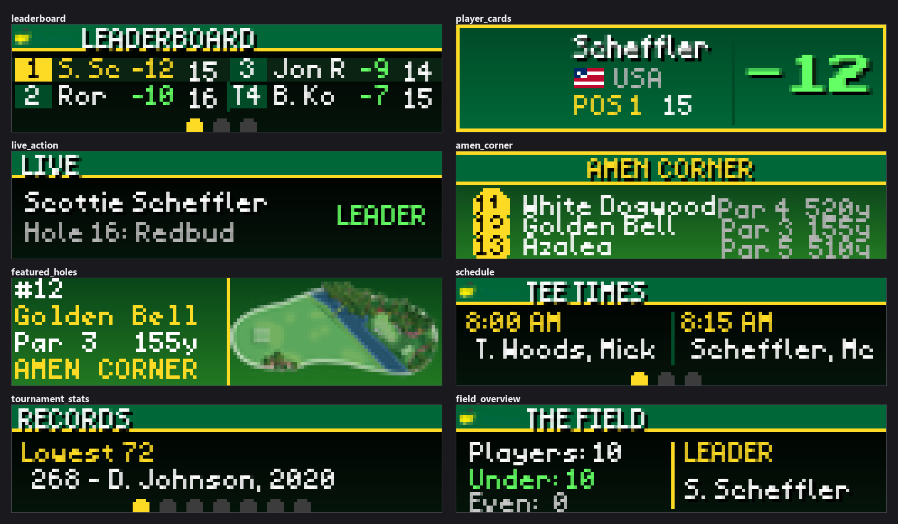
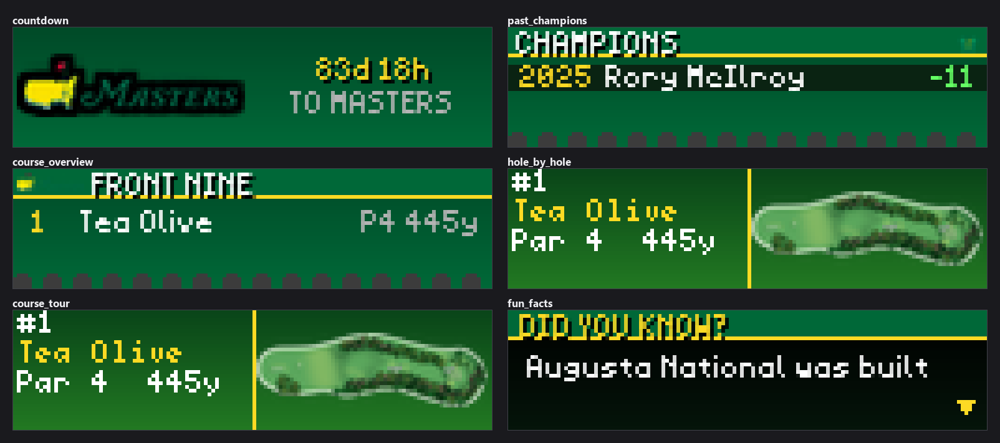
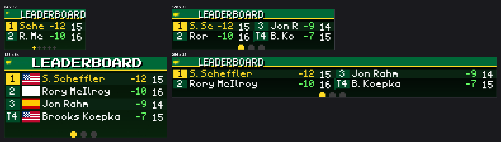

# Masters Tournament LED Display Plugin


*Every image in this README is real plugin output, rendered at the true panel
size using the plugin's own `mock_data` mode, so they reproduce offline.*

A high-polish Augusta National Masters Tournament display plugin for LEDMatrix with course imagery, live leaderboards, player stats, hole maps, and maximum Masters branding. Works year-round with engaging off-season content.

## Features

### 14 Display Modes

1. **Leaderboard** - Live tournament standings with scores, positions, and thru indicators (paginated)
2. **Player Cards** - Individual player spotlights with ESPN headshots, country flags, round scores, green jacket count
3. **Hole-by-Hole** - Rotating hole cards with real Augusta National overhead maps
4. **Live Action** - Real-time scoring alerts and leader updates
5. **Course Tour** - Rotating hole maps showcasing all 18 holes at Augusta National
6. **Amen Corner** - Dedicated display for the famous holes 11-13
7. **Featured Holes** - Highlight signature holes (12, 13, 15, 16)
8. **Schedule** - Daily tee times and pairings (paginated)
9. **Past Champions** - Historical Masters winners through 2025 (paginated)
10. **Tournament Stats** - Tournament records and statistics (paginated)
11. **Fun Facts** - 35 real Masters and Augusta National trivia facts with scrolling text
12. **Countdown** - Days until the next Masters Tournament
13. **Field Overview** - Under/over/even par breakdown with leader highlight
14. **Course Overview** - Augusta National front nine / back nine stats and signature holes

### Dynamic Scaling

Automatically adapts to any LED matrix size:
- **32x16**: Minimal layout with 1-2 players, abbreviated names
- **64x32**: Standard layout with 3-4 players, basic stats (recommended)
- **128x64+**: Maximum detail with 5-8 players, full statistics, photos

### Masters Branding

Authentic Augusta National visual identity:
- **Masters green** (#00784A) as primary brand color
- **Gold accents** for leaders
- **Azalea pink** decorative elements
- Masters logo placement
- Green jacket icons
- Course-specific imagery

### Year-Round Operation

- **Tournament Week**: Live leaderboards, player tracking, real-time updates
- **Practice Rounds**: Schedule displays, course tours, player preparation
- **Off-Season**: Past champions, course beauty, tournament countdown

## Installation

### Via Plugin Store (Recommended)

1. Open the LEDMatrix web interface (`http://your-pi-ip:5000`)
2. Open the **Plugin Manager** tab
3. Find **Masters Tournament** in the **Plugin Store** section and click
   **Install**
4. Open the **Masters Tournament** tab in the second nav row to enable
   and configure it

### Manual Installation

```bash
cd ~/Github/ledmatrix-plugins/plugins
git clone <repo-url> masters-tournament
cd masters-tournament
pip install -r requirements.txt
```

## Configuration

### Basic Setup

```json
{
  "enabled": true,
  "display_duration": 20,
  "update_interval": 30,
  "mock_data": false,
  "favorite_players": [
    "Scottie Scheffler",
    "Rory McIlroy"
  ]
}
```

### Display Modes Configuration

Enable/disable specific modes and configure their settings:

```json
{
  "display_modes": {
    "leaderboard": {
      "enabled": true,
      "top_n": 10,
      "show_favorites_always": true,
      "duration": 25
    },
    "player_cards": {
      "enabled": true,
      "show_headshots": true,
      "duration_per_player": 15
    },
    "course_tour": {
      "enabled": true,
      "show_animations": true,
      "duration_per_hole": 15,
      "featured_holes": [12, 13, 16]
    }
  }
}
```

### Notifications

Configure alerts and interruptions:

```json
{
  "notifications": {
    "practice_round_alerts": {
      "enabled": true,
      "interrupt_display": true,
      "duration": 15
    },
    "favorite_player_alerts": {
      "enabled": true,
      "interrupt_display": true,
      "duration": 10
    }
  }
}
```

### Branding Options

Customize Masters visual elements:

```json
{
  "branding": {
    "show_masters_logo": true,
    "show_green_jacket": true,
    "show_azaleas": true,
    "color_scheme": "classic"
  }
}
```

### Top level

| Key | Default | Notes |
|---|---|---|
| `enabled` | `true` | Enable or disable the Masters Tournament plugin. |
| `display_duration` | `20` | Duration in seconds to display each mode before rotating (5–300). |
| `update_interval` | `30` | How often to fetch new data in seconds (30s during tournament, 3600s off-season) (10–3600). |
| `player_card_duration` | `8` | Seconds each player card is shown before rotating to the next player in the player card display mode (1–300). |
| `hole_display_duration` | `15` | Seconds between hole advances in course tour and hole-by-hole display modes (1–300). |
| `page_display_duration` | `15` | Seconds between page advances in paginated modes (leaderboard, champions, tournament stats, schedule, course overview) (1–300). |
| `scroll_card_width` | `128` | Width in pixels of each card when rendered in Vegas scroll mode (the horizontally-scrolling ticker). Set lower to pack more cards into a long panel; set higher for more detail per card. Card height always matches the display height (32–256). |
| `post_tournament_display_days` | `1` | Number of days after the final round to continue showing tournament results (leaderboard, player cards, etc.) before switching to countdown mode. Set to 0 to switch immediately after the tournament ends, or higher to extend the post-tournament display window (0–14). |
| `mock_data` | `false` | Use mock tournament data for testing (useful when Masters isn't live). |
| `favorite_players` | *(empty)* | List of favorite player names (e.g., ['Scottie Scheffler', 'Rory McIlroy']). |

### Display modes

Each of the fourteen modes takes `enabled`; a few carry extra keys.

| Key | Default | Notes |
|---|---|---|
| `display_modes.leaderboard.enabled` | `true` | Show live leaderboard. |
| `display_modes.leaderboard.top_n` | `10` | Number of players to show on leaderboard (1–50). |
| `display_modes.leaderboard.show_favorites_always` | `true` | Always include favorite players even if outside top N. |
| `display_modes.leaderboard.duration` | `25` | Display duration for leaderboard (seconds) (5–120). |
| `display_modes.player_cards.enabled` | `true` | Show individual player spotlight cards. |
| `display_modes.player_cards.show_headshots` | `true` | Display player headshot photos. **Not implemented**. |
| `display_modes.player_cards.duration_per_player` | `15` | Time to show each player card (seconds) (5–60). **Not implemented**. |
| `display_modes.course_tour.enabled` | `true` | Show rotating hole maps with course imagery. |
| `display_modes.course_tour.show_animations` | `true` | Enable transitions and animations. **Not implemented**. |
| `display_modes.course_tour.duration_per_hole` | `15` | Time to show each hole (seconds) (5–60). **Not implemented**. |
| `display_modes.course_tour.show_divider` | `true` | Show the vertical divider line between the hole info and map columns. Set to false for a cleaner single-cell look. |
| `display_modes.course_tour.featured_holes` | `[12, 13, 16]` | Featured holes to highlight (Amen Corner, par 3s). **Not implemented**. |
| `display_modes.hole_by_hole.enabled` | `true` | Show hole-by-hole scores for favorite players. |
| `display_modes.hole_by_hole.duration` | `20` | Display duration (seconds) (5–120). |
| `display_modes.live_action.enabled` | `true` | Show real-time birdie/eagle notifications. |
| `display_modes.live_action.duration` | `10` | Notification display duration (seconds) (3–30). |
| `display_modes.amen_corner.enabled` | `true` | Dedicated display for holes 11-13 (Amen Corner). |
| `display_modes.amen_corner.duration` | `20` | Display duration (seconds) (5–120). |
| `display_modes.featured_holes.enabled` | `true` | Show scoring on signature holes (12, 16). |
| `display_modes.featured_holes.duration` | `15` | Display duration (seconds) (5–120). |
| `display_modes.schedule.enabled` | `true` | Show tee times and pairings. |
| `display_modes.schedule.duration` | `20` | Display duration (seconds) (5–120). |
| `display_modes.past_champions.enabled` | `true` | Show historical Masters winners. |
| `display_modes.past_champions.duration` | `20` | Display duration (seconds) (5–120). |
| `display_modes.tournament_stats.enabled` | `true` | Show tournament records and statistics. |
| `display_modes.fun_facts.enabled` | `true` | Show Masters and Augusta National fun facts. |
| `display_modes.countdown.enabled` | `true` | Show countdown to next Masters Tournament. |
| `display_modes.field_overview.enabled` | `true` | Show field breakdown (under/over/even par counts). |
| `display_modes.course_overview.enabled` | `true` | Show Augusta National front nine / back nine overview. |

### Settings that do nothing

Neither of these blocks is read anywhere in the plugin or the core — no
`config.get("notifications")`, no `config.get("branding")`. They are in the
schema and the web UI, and changing them has no effect. Tracked in
[issue #418](https://github.com/ChuckBuilds/ledmatrix-plugins/issues/418),
along with the five `display_modes` leaves marked above.

| Key | Default |
|---|---|
| `notifications.practice_round_alerts.enabled` | `true` |
| `notifications.practice_round_alerts.interrupt_display` | `true` |
| `notifications.practice_round_alerts.duration` | `15` |
| `notifications.favorite_player_alerts.enabled` | `true` |
| `notifications.favorite_player_alerts.interrupt_display` | `true` |
| `notifications.favorite_player_alerts.duration` | `10` |
| `notifications.tournament_start_alert.enabled` | `true` |
| `notifications.tournament_start_alert.interrupt_display` | `false` |
| `branding.show_masters_logo` | `true` |
| `branding.show_green_jacket` | `true` |
| `branding.show_azaleas` | `true` |
| `branding.color_scheme` | `"classic"` |


### What the modes look like

Which modes are available depends on where you are in the tournament calendar.
During Masters week these eight render and the off-season set is blank:



Outside it, that reverses — these six render and the tournament set is blank:



Enabling only an off-season mode during Masters week therefore shows nothing;
that is the phase gate, not a fault. On a 128-wide panel Amen Corner packs
three hole names against their par and yardage, so the two columns sit very
close together.



## Data Source

This plugin uses the **ESPN Golf API** (free, no API key required):

- **Live Leaderboard**: Updates every 30 seconds during tournament play
- **Player Statistics**: Detailed round-by-round scores
- **Schedule**: Tee times and pairings
- **Player Photos**: Downloaded and cached locally

### Caching Strategy

- **Live tournament**: 30-second cache for leaderboard
- **Practice rounds**: 5-minute cache
- **Off-season**: 1-hour cache for historical data
- **Player photos**: Permanent local cache (download once)

### Mock Data Mode

For testing when the Masters isn't live:

```json
{
  "mock_data": true
}
```

This generates realistic mock leaderboard data with:
- 10 players with authentic names
- Scores ranging from -12 to -3
- Round scores and thru indicators
- Simulated tournament conditions

## Usage Examples

### Tournament Week Setup

Monitor your favorite players during Masters week:

```json
{
  "enabled": true,
  "favorite_players": ["Scottie Scheffler", "Jon Rahm"],
  "display_modes": {
    "leaderboard": {"enabled": true, "duration": 30},
    "player_cards": {"enabled": true, "duration_per_player": 20},
    "live_action": {"enabled": true}
  },
  "update_interval": 30,
  "notifications": {
    "favorite_player_alerts": {
      "enabled": true,
      "interrupt_display": true
    }
  }
}
```

### Off-Season Display

Celebrate Masters history year-round:

```json
{
  "enabled": true,
  "display_modes": {
    "past_champions": {"enabled": true, "duration": 25},
    "course_tour": {"enabled": true, "duration_per_hole": 20},
    "tournament_stats": {"enabled": true}
  },
  "update_interval": 3600
}
```

### Course Showcase

Focus on Augusta National's beauty:

```json
{
  "enabled": true,
  "display_modes": {
    "course_tour": {
      "enabled": true,
      "featured_holes": [11, 12, 13, 16],
      "duration_per_hole": 25
    },
    "amen_corner": {"enabled": true}
  }
}
```

## Vegas Scroll Mode

When Vegas scroll mode is active, the plugin provides:

- Individual player cards for each leaderboard entry
- Hole map cards for all 18 holes
- Past champion cards
- Smooth scrolling integration with other plugins

## Display Size Optimization

### 32x16 (Minimal)
- 1-2 players maximum
- Position, abbreviated name, score
- No country flags or round scores
- 8x8px logos

### 64x32 (Standard)
- 3-4 players
- Position, name, country, score, thru
- 16x16px logos
- Full Masters branding

### 128x64 (Maximum Detail)
- 5-8 players
- Position, name, country, scores, rounds, photos
- 24x24px player headshots
- Detailed statistics
- Enhanced visual elements

## Assets

### Bundled Assets
- Masters logo (simplified, tournament-inspired design)
- Green jacket icon
- Azalea flower icons
- 18 hole map placeholders (auto-generated)

### Downloaded Assets
- Player headshots from ESPN (cached in `assets/masters/players/`)

### Creating Custom Hole Maps

To add custom hole map images:

1. Create PNG images sized 512x512px
2. Name them `hole_01.png` through `hole_18.png`
3. Place in `assets/masters/courses/`
4. Plugin will automatically load and scale them

## Troubleshooting

### No Data Displayed

Check these common issues:

1. **Masters not currently active**: Enable `mock_data: true` for testing
2. **API timeout**: Check network connectivity
3. **Cache issues**: Clear cache via web UI or restart LEDMatrix

### Text Too Small

Adjust display size settings:

```json
{
  "display_duration": 30
}
```

Longer duration allows easier reading of small text.

### Favorite Players Not Showing

Ensure exact name match:

```json
{
  "favorite_players": ["Scottie Scheffler"]
}
```

Check ESPN leaderboard for correct spelling.

## Tournament Schedule

The Masters is typically held:

- **Practice Rounds**: Monday-Wednesday (April 6-8)
- **Tournament**: Thursday-Sunday (April 9-12)

Plugin automatically detects tournament phase and adjusts:
- Update intervals (30s live, 5m practice, 1h off-season)
- Cache duration
- Mode prioritization

## Development

### Testing with Mock Data

```bash
# Enable mock mode in config
cd ~/Github/ledmatrix-plugins/plugins/masters-tournament
# Edit config to set "mock_data": true

# Restart LEDMatrix
sudo systemctl restart ledmatrix

# Monitor logs
tail -f /var/log/ledmatrix/ledmatrix.log
```

### Adding New Display Modes

1. Add mode to `manifest.json` `display_modes` array
2. Add config schema entry in `config_schema.json`
3. Implement rendering in `masters_renderer.py`
4. Add display method in `manager.py`
5. Update `_build_enabled_modes()` mapping

## API Reference

### ESPN Golf API Endpoints

- **Leaderboard**: `https://site.api.espn.com/apis/site/v2/sports/golf/pga/leaderboard`
- **Schedule**: `https://site.api.espn.com/apis/site/v2/sports/golf/pga/schedule`
- **News**: `https://site.api.espn.com/apis/site/v2/sports/golf/pga/news`

No API key required. Rate limits apply (plugin respects with caching).

## Credits

- **Plugin Development**: Claude (Anthropic)
- **Masters Tournament**: Augusta National Golf Club
- **Data Provider**: ESPN Golf API
- **LED Matrix Framework**: LEDMatrix by ChuckBuilds

## License

This plugin is for personal, non-commercial use only. Masters Tournament, Augusta National, and related branding are trademarks of Augusta National, Inc.

## Version History

### 2.0.0
- 14 display modes (added fun facts, countdown, field overview, course overview)
- Real Masters logo from masters.com
- Real Augusta National overhead hole maps for all 18 holes
- 23 real ESPN player headshots
- 16 country flags for player cards
- Phase-aware mode rotation (off-season, pre-tournament, practice, live, evening)
- Paginated displays with page indicator dots
- Broadcast-quality pixel-perfect rendering
- 35 fun facts, 40 past champions through 2025, tournament records database
- Player cards with green jacket count and round-by-round scores

### 1.0.0 (Initial Release)
- 10 display modes
- ESPN API integration
- Dynamic scaling (32x16 to 128x64+)
- Mock data support
- Vegas scroll mode
- Year-round operation
- Configurable notifications
- Masters branding
