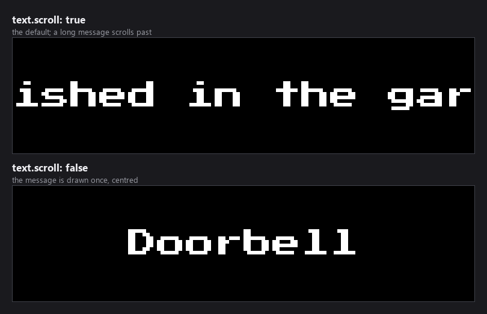
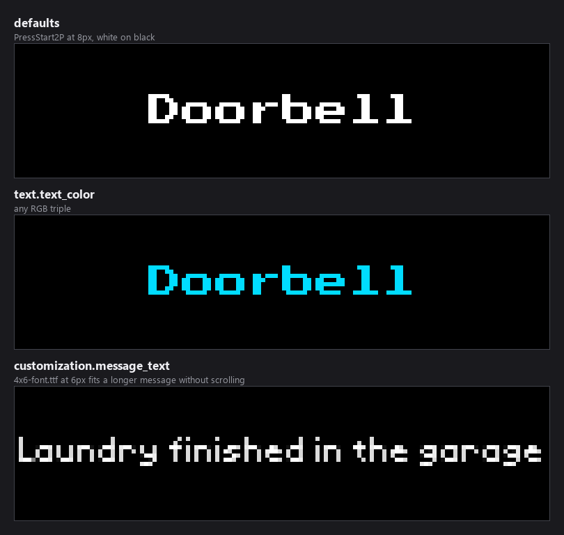
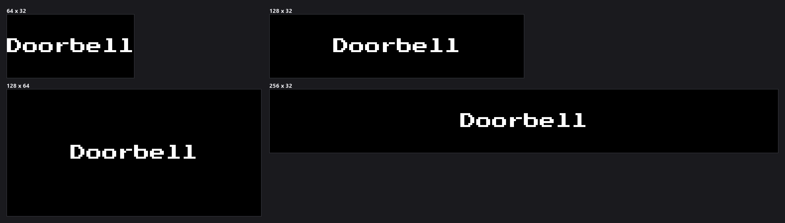

-----------------------------------------------------------------------------------
### Connect with ChuckBuilds

- Show support on Youtube: https://www.youtube.com/@ChuckBuilds
- Stay in touch on Instagram: https://www.instagram.com/ChuckBuilds/
- Want to chat or need support? Reach out on the ChuckBuilds Discord: https://discord.com/invite/uW36dVAtcT
- Feeling Generous? Support the project:
  - Github Sponsorship: https://github.com/sponsors/ChuckBuilds
  - Buy Me a Coffee: https://buymeacoffee.com/chuckbuilds
  - Ko-fi: https://ko-fi.com/chuckbuilds/ 

-----------------------------------------------------------------------------------

# MQTT Notifications Plugin

> ⚠️ **Alpha**: This plugin is still under active development and may not
> work reliably yet. Expect rough edges and configuration changes.

Display text or images from Home Assistant (or any MQTT publisher) by
subscribing to configurable MQTT topics. Incoming notifications interrupt
the normal display rotation via the on-demand display system to show
important messages.

## Features

- **MQTT Integration**: Connects to MQTT broker and subscribes to configurable topics
- **Dynamic Topic Configuration**: Support for any MQTT topics with wildcard support (`+` and `#`)
- **Text Display**: Display scrolling or static text messages
- **Image Display**: Display images from base64 encoded data or file paths
- **Interrupt Display**: Automatically interrupts normal rotation using on-demand display system
- **Auto-Reconnection**: Automatic reconnection with exponential backoff

## Installation

1. Open the LEDMatrix web interface (`http://your-pi-ip:5000`)
2. Open the **Plugin Manager** tab
3. Find **MQTT Notifications** in the **Plugin Store** section and click
   **Install**. Dependencies (`paho-mqtt`, etc.) install automatically
   from `requirements.txt` on first load.
4. Open the plugin's tab in the second nav row to configure your MQTT
   broker, credentials, and topic subscriptions.

## Configuration

Add the following to your `config/config.json`:

```json
{
  "mqtt-notifications": {
    "enabled": true,
    "mqtt": {
      "host": "localhost",
      "port": 1883,
      "username": "optional_username",
      "password": "optional_password",
      "topics": [
        "homeassistant/ledmatrix/+"
      ]
    },
    "display": {
      "default_duration": 10
    },
    "text": {
      "font_path": "assets/fonts/PressStart2P-Regular.ttf",
      "font_size": 8,
      "text_color": [255, 255, 255],
      "background_color": [0, 0, 0],
      "scroll": true,
      "scroll_speed": 30
    }
  }
}
```

## What it looks like


A message is drawn as a single line of text. Long messages scroll by default;
short ones fit as they are.



`text.scroll` is on by default. With it off the message is drawn once and
centred, which suits short alerts and costs no CPU between redraws.

### Appearance



| Key | Default | What it does |
|---|---|---|
| `text.font_path` | `assets/fonts/PressStart2P-Regular.ttf` | Font file, TTF or BDF. Relative to the project root, or absolute. |
| `text.font_size` | `8` | Size in pixels. |
| `text.text_color` | `[255, 255, 255]` | RGB triple. |
| `text.background_color` | `[0, 0, 0]` | RGB triple. |
| `text.scroll` | `true` | Scroll the message rather than drawing it once. |
| `text.scroll_speed` | `30` | Pixels per second. Higher is faster. |
| `text.scroll_gap_width` | `32` | Pixels of gap between scroll loops. |
| `customization.message_text.font` | `PressStart2P-Regular.ttf` | Picked from a list in the web UI: `PressStart2P-Regular.ttf`, `4x6-font.ttf`, `5by7.regular.ttf`, `5x7.bdf`, `4x6.bdf`. Overrides `text.font_path` when set. |
| `customization.message_text.font_size` | `8` | Size for that face. |

The two font routes exist because `text.font_path` takes any path while
`customization.message_text.font` offers a dropdown of the bundled faces. The
`customization` block wins when it loads successfully; colours come from `text`
either way, since `customization` carries no colour keys.

### Panel sizes



The plugin passes the render-safety harness on every supported size.

### Connection and timing settings

| Key | Default | What it does |
|---|---|---|
| `enabled` | `false` | Master on/off switch. Off by default. |
| `mqtt.host` | `localhost` | Broker hostname or IP. |
| `mqtt.port` | `1883` | Broker port. |
| `mqtt.username` | `""` | Optional. |
| `mqtt.password` | `""` | Optional. |
| `mqtt.client_id` | `ledmatrix-mqtt-notifications` | Client id the plugin connects with. Change it if you run two boards against one broker, since a broker will disconnect a duplicate id. |
| `mqtt.keepalive` | `60` | Keepalive interval in seconds. |
| `mqtt.topics` | `["homeassistant/ledmatrix/+"]` | Topics to subscribe to. `+` matches one level, `#` matches the rest. |
| `display.default_duration` | `10` | How long a message holds the screen when its payload does not set `duration`. |
| `display_duration` | `10` | **Inert in this plugin.** The core reads this as a plugin's screen time, but this plugin overrides that accessor and returns `display.default_duration` instead, so setting the root key alone changes nothing. Set `display.default_duration`. |
| `update_interval` | `60` | How often the core calls the plugin's `update()`, which checks connection health. The MQTT client itself runs on its own thread, so this does not affect how quickly a message appears. |

`mqtt`, `display`, `text`, `customization` and `customization.message_text` all
set `additionalProperties: false`, so a misspelled key is rejected rather than
quietly ignored.

## Message Format

Send JSON messages to the configured MQTT topics. The message format is:

```json
{
  "type": "optional-custom-type-name",
  "content": {
    "text": "Optional text message to display",
    "image": "Optional: base64 encoded image or file path"
  },
  "duration": 10.0,
  "priority": "high|normal|low"
}
```

### Message Fields

- **type** (optional): Custom type identifier. If not provided, will be derived from the topic name (last segment after `/`)
- **content** (required): Object containing either `text` or `image`
  - **text** (optional): Text message to display
  - **image** (optional): Base64 encoded image (data URI format: `data:image/png;base64,...`) or file path
- **duration** (optional): Display duration in seconds. If not specified, uses `default_duration` from config
- **priority** (optional): Message priority (currently not used, reserved for future use)

### Topic Configuration

Topics can be configured as an array of strings, supporting MQTT wildcards:

- **`+`** (single-level wildcard): Matches one topic level. Example: `homeassistant/ledmatrix/+` matches `homeassistant/ledmatrix/doorbell` but not `homeassistant/ledmatrix/room1/doorbell`
- **`#`** (multi-level wildcard): Matches multiple topic levels. Example: `homeassistant/ledmatrix/#` matches all topics under `homeassistant/ledmatrix/`

**Examples:**
```json
"topics": [
  "homeassistant/ledmatrix/+",
  "my/custom/topic",
  "notifications/#"
]
```

## HomeAssistant Integration

### Example: Doorbell Notification

```yaml
automation:
  - alias: "Doorbell LED Matrix"
    trigger:
      - platform: state
        entity_id: binary_sensor.doorbell
        to: 'on'
    action:
      - service: mqtt.publish
        data:
          topic: "homeassistant/ledmatrix/doorbell"
          payload: |
            {
              "type": "doorbell",
              "content": {
                "text": "Someone is at the door!"
              },
              "duration": 15.0
            }
```

### Example: Timer Notification

```yaml
automation:
  - alias: "Timer Complete LED Matrix"
    trigger:
      - platform: state
        entity_id: timer.kitchen_timer
        to: 'idle'
    condition:
      - condition: state
        entity_id: timer.kitchen_timer
        state: 'idle'
    action:
      - service: mqtt.publish
        data:
          topic: "homeassistant/ledmatrix/timer"
          payload: |
            {
              "type": "timer",
              "content": {
                "text": "Timer Complete!"
              },
              "duration": 10.0
            }
```

### Example: Custom Topic with Wildcard

Using a wildcard topic (`homeassistant/ledmatrix/+`) allows you to send to any subtopic:

```yaml
automation:
  - alias: "Custom Notification"
    trigger:
      - platform: state
        entity_id: sensor.temperature
        above: 80
    action:
      - service: mqtt.publish
        data:
          topic: "homeassistant/ledmatrix/alert"
          payload: |
            {
              "content": {
                "text": "Temperature Alert: {{ states('sensor.temperature') }}°F"
              },
              "duration": 10.0
            }
```

Note: The `type` field is optional. If omitted, it will be derived from the topic name (e.g., `alert` from `homeassistant/ledmatrix/alert`).

### Example: Reminder with Image

```yaml
automation:
  - alias: "Reminder LED Matrix"
    trigger:
      - platform: time
        at: "08:00:00"
    action:
      - service: mqtt.publish
        data:
          topic: "homeassistant/ledmatrix/reminder"
          payload: |
            {
              "type": "reminder",
              "content": {
                "text": "Take your vitamins!",
                "image": "/config/www/images/vitamins.png"
              },
              "duration": 10.0
            }
```

### Example: Base64 Image

To send a base64 encoded image, use the data URI format:

```json
{
  "type": "custom-notification",
  "content": {
    "image": "data:image/png;base64,iVBORw0KGgoAAAANSUhEUgAA..."
  },
  "duration": 15.0
}
```

## Image Support

- **Formats**: PNG, JPEG, GIF (animated GIFs supported)
- **Base64**: Use data URI format: `data:image/png;base64,<base64_data>`
- **File Paths**: Absolute paths or paths relative to LEDMatrix project root
- **Resizing**: Images are automatically resized to fit the LED matrix while maintaining aspect ratio
- **Transparency**: RGBA images are converted to RGB with black background

## Troubleshooting

### Plugin Not Connecting to MQTT

1. Check MQTT broker is running and accessible
2. Verify host, port, username, and password in config
3. Check firewall settings
4. Review plugin logs for connection errors

### Messages Not Displaying

1. Verify message format matches expected JSON structure
2. Check topic names match configuration
3. Ensure plugin is enabled in config
4. Review plugin logs for parsing errors

### Images Not Displaying

1. Verify image format is supported (PNG, JPEG, GIF)
2. For base64 images, ensure data URI format is correct
3. For file paths, verify file exists and is readable
4. Check image dimensions (very large images may take time to process)

## License

See LICENSE file in plugin directory.
