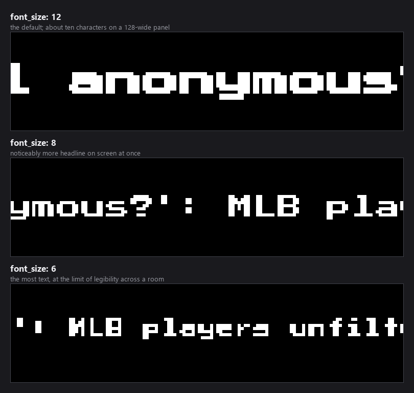
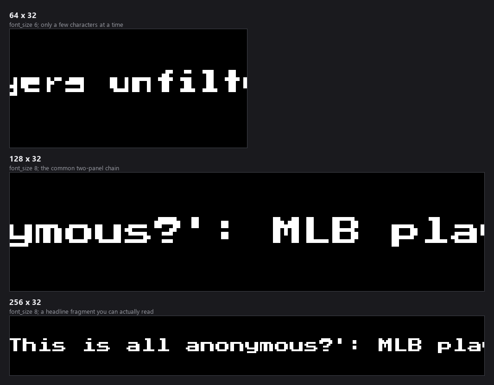

# News Ticker

A scrolling headline ticker for your LED matrix, fed by RSS. Nine sports feeds
are built in, and it takes any RSS URL you point it at.


*Every image in this README is real plugin output, rendered at the true panel
size from a recorded ESPN RSS response and then scaled up so the pixels stay
pixels. The headlines are genuine ESPN copy from 2 September 2026.*

---

## Table of Contents

1. [What's On Screen](#whats-on-screen)
2. [Installation](#installation)
3. [Quick Start](#quick-start)
4. [Choosing Feeds](#choosing-feeds)
   - [Built-in feeds](#built-in-feeds)
   - [Custom feeds](#custom-feeds)
   - [How many headlines you see](#how-many-headlines-you-see)
5. [Scrolling and Timing](#scrolling-and-timing)
   - [How fast it moves](#how-fast-it-moves)
   - [Dynamic duration and paging](#dynamic-duration-and-paging)
6. [Appearance](#appearance)
   - [Font size](#font-size)
   - [Fonts](#fonts)
   - [Colours and logos](#colours-and-logos)
   - [Background fetching](#background-fetching)
7. [Panel Sizes](#panel-sizes)
8. [Troubleshooting](#troubleshooting)
9. [Development](#development)
10. [Support](#support)

---

## What's On Screen

A single strip of headlines scrolling right to left, with a coloured separator
between them. Headlines are pulled from every enabled feed, interleaved, and
drawn as one continuous strip — so the panel is never blank between items.

Because it scrolls, **the first moment of a turn is legitimately an empty
panel**: the strip starts fully off the right edge and travels in.

---

## Installation

**From the Plugin Store (recommended).** Open the LEDMatrix web interface at
`http://<your-pi-ip>:5000`, go to **Plugin Manager**, find **News Ticker** in
the **Plugin Store** section, and click **Install**.

**Manually.** Copy this directory into your LEDMatrix `plugin-repos/` and
restart the display service.

> **A fresh install shows nothing.** `enabled` defaults to `false`, and
> `feeds.enabled_feeds` defaults to an **empty list** — so even switched on,
> there is nothing to fetch until you pick at least one feed.

---

## Quick Start

```json
{
  "news": {
    "enabled": true,
    "feeds": { "enabled_feeds": ["TOP SPORTS", "MLB"] }
  }
}
```

A fuller configuration:

```json
{
  "news": {
    "enabled": true,
    "feeds": {
      "enabled_feeds": ["MLB", "NFL", "TOP SPORTS"],
      "text_color": [255, 255, 255],
      "separator_color": [255, 0, 0],
      "show_logos": true,
      "logo_size": 28
    },
    "global": {
      "display_duration": 30,
      "update_interval": 300,
      "font_size": 8,
      "headlines_per_feed": 2,
      "rotation_enabled": true,
      "rotation_threshold": 3
    }
  }
}
```

---

## Choosing Feeds

### Built-in feeds

`feeds.enabled_feeds` takes any of these names:

| Name | Source |
|------|--------|
| `TOP SPORTS` | ESPN top headlines |
| `MLB` | ESPN MLB |
| `NFL` | ESPN NFL |
| `NBA` | ESPN NBA |
| `NHL` | ESPN NHL |
| `NCAA FB` | ESPN college football |
| `NCAA` | ESPN college sports |
| `BIG10` | A Google News search for Big Ten football |
| `Other` | Covering the Corner (Cleveland Guardians) |

`BIG10` is a Google News query rather than an official feed, because
`btn.com/feed/` returns HTML and the ESPN Big Ten blog feed was retired. It is
therefore looser in scope than the other entries.

### Custom feeds

Any RSS URL works. `feeds.custom_feeds` takes a list of objects:

```json
{
  "feeds": {
    "custom_feeds": [
      { "name": "Local", "url": "https://example.com/rss", "enabled": true }
    ]
  }
}
```

| Key | What it does |
|-----|--------------|
| `name` | Shown as the source label and used in the cache key |
| `url` | The RSS URL. Standard RSS `<item>` elements with `<title>` are required |
| `enabled` | Include this feed |
| `logo` | Optional logo for the feed. An object with a `path` to an image file |

The parser reads `title`, `description`, `pubDate` and `link` from each
`<item>`, unescapes HTML entities, and tidies whitespace. Atom-only feeds
without `<item>` elements will fetch successfully and yield nothing.

### How many headlines you see

| Option | Default | What it does |
|--------|---------|--------------|
| `global.headlines_per_feed` | `2` | Headlines taken from each enabled feed per fetch |
| `global.rotation_enabled` | `true` | Rotate which feeds appear when many are enabled |
| `global.rotation_threshold` | `3` | Number of feeds above which rotation kicks in |

With three feeds and the default `headlines_per_feed: 2`, a cycle carries six
headlines. Raising it makes the strip longer, and therefore each lap slower —
the same trade as any ticker.

---

## Scrolling and Timing

| Option | Default | What it does |
|--------|---------|--------------|
| `global.display_duration` | `30` | Seconds the ticker holds the panel per turn |
| `global.update_interval` | `300` | Seconds between feed fetches |
| `global.display.scroll_speed` | `1.0` | Pixels moved per step |
| `global.display.scroll_delay` | `0.01` | Seconds per step |
| `global.target_fps` | `100` | Target frame rate |

### How fast it moves

As with the scrolling-text plugin, the rate is:

```text
pixels per second = scroll_speed / scroll_delay
```

The defaults — 1 pixel every 0.01s — give 100 px/s, which the plugin logs on
startup so you can check what it actually resolved to.

### Dynamic duration and paging

Two features stop a long strip from being cut off mid-headline.

**`global.dynamic_duration`** sizes the turn to the content instead of using a
fixed `display_duration`. It accepts `true`/`false` or an object:

| Key | Default | What it does |
|-----|---------|--------------|
| `enabled` | `true` | Size the turn to how long one full pass takes |
| `min_duration_seconds` | `30` | Never shorter than this |
| `max_duration_seconds` | `300` | Never longer than this |
| `buffer_ratio` | `0.1` | Extra headroom added to the computed time |

**`global.headline_paging`** splits a strip too long for one turn into pages,
so each headline gets fully seen across successive turns rather than the tail
never appearing.

| Key | Default | What it does |
|-----|---------|--------------|
| `enabled` | `true` | Break a long strip into pages |
| `max_headlines_per_page` | `0` | `0` means auto — as many as fit the time budget |
| `page_hold_seconds` | `2.0` | Pause at a page boundary |
| `duration_overrun_allowance` | `0.25` | Fraction of overrun tolerated before splitting again |

Together these mean you rarely need to tune `display_duration` by hand: the
plugin works out how long a pass takes and asks for that much time.

---

## Appearance

### Font size

`global.font_size` (default `12`) is the biggest lever on how much headline is
readable at once.



At the default 12 on a 128-wide panel only about ten characters are on screen
at a time, which reads more like a stream of letters than a headline. Dropping
to 8 roughly doubles it. This is the setting to change first if the ticker feels
unreadable.

### Fonts

`customization.headline_text` and `customization.source_text` each take a
`font`, `font_size` and (for the source) `text_color`. Five faces are
available and all five render distinctly:

| Font | Kind | Notes |
|------|------|-------|
| `PressStart2P-Regular.ttf` | Scalable | The default; chunky and very legible |
| `4x6-font.ttf` | Scalable | Fits far more text per line |
| `5by7.regular.ttf` | Scalable | A rounder 5×7 face |
| `5x7.bdf` | Bitmap | Crisp; drawn at its native 7px |
| `4x6.bdf` | Bitmap | The smallest; native 6px |

**`font_size` only affects the scalable faces.** A `.bdf` is a bitmap font that
exists at exactly one pixel size, so it is drawn at the size its file declares
and ignores `font_size`.

`global.font_path` (default `assets/fonts/PressStart2P-Regular.ttf`) sets the
face used when no `customization.headline_text.font` is given. It takes a path
rather than a name, resolved relative to the LEDMatrix project root, so it can
point at a font that is not in the picker. `customization` wins where both are
set.

### Colours and logos

| Option | Default | What it does |
|--------|---------|--------------|
| `feeds.text_color` | `[255, 255, 255]` | Headline colour |
| `feeds.separator_color` | `[255, 0, 0]` | Colour of the mark between headlines |
| `feeds.show_logos` | `true` | Draw each feed's logo before its headlines |
| `feeds.logo_size` | `28` | Logo height in pixels |
| `customization.source_text.text_color` | `[150, 150, 150]` | The source label |


The separator is visible at the right edge of each panel above — it is the mark
that keeps two headlines from reading as one sentence, so a colour that
contrasts with `text_color` is worth keeping.

---

### Background fetching

Feeds are fetched on a background thread so the panel never stalls on a slow
server. Under `global.background_service`:

| Option | Default | What it does |
|--------|---------|--------------|
| `enabled` | `true` | Fetch in the background rather than inline |
| `request_timeout` | `30` | Seconds before a feed request gives up |
| `max_retries` | `3` | Retries per failed feed |
| `priority` | `2` | Queue priority against other plugins' fetches |

A feed that times out is skipped for that cycle rather than blocking the
others, so one dead source does not empty the ticker.

---

## Panel Sizes



Width matters more here than for any other plugin in this repo, because the
ticker's usefulness is how much of a headline you can take in at a glance:

- **64×32** shows a few characters at a time even at `font_size: 6`. Legible,
  but you read it letter by letter.
- **128×32** is workable at `font_size: 8`.
- **256×32** is where a ticker starts to feel like one — a readable fragment of
  a real headline sits on the panel at once.

If you are choosing a panel with a news ticker in mind, buy width.

---

## Troubleshooting

**Nothing appears at all.**
`enabled` defaults to `false`, and `feeds.enabled_feeds` defaults to an empty
list. Both need setting.

**The panel is blank for a moment when the ticker's turn starts.**
Expected — the strip begins off the right edge and travels in.

**A feed shows no headlines.**
Check the log for a fetch error. The parser needs standard RSS `<item>`
elements; an Atom-only feed fetches fine and yields nothing. `Other` and
`BIG10` point at third-party sources that can change or disappear.

**I can't read the headlines.**
Lower `global.font_size` — the default of 12 is large for a 128-wide panel.
See [Font size](#font-size).

**The end of the strip never appears.**
That is what `headline_paging` exists for; check it is enabled. Alternatively
leave `dynamic_duration` on so the turn is sized to the content.

**I picked a font and nothing changed.**
On a current version all five faces work. Older versions offered `cozette.bdf`,
which had no font file at all, and both `.bdf` faces silently fell back to the
default because they were requested at `font_size` rather than at their own
pixel size.

**Headlines are stale.**
`global.update_interval` (default 300s) sets the fetch cadence, and results are
cached per feed per hour. A feed that publishes rarely will simply repeat.

---

## Development

### Project structure

```text
news/
├── manifest.json        # Plugin metadata and version history
├── manager.py           # NewsTickerPlugin
├── config_schema.json   # Settings schema; source of truth for defaults
├── requirements.txt
├── test_news_ticker.py
├── test_unchanged_headlines_keep_strip.py
└── README.md
```

### Dependencies

`requests` for fetching and Pillow for drawing, both already provided by the
LEDMatrix core — `requirements.txt` lists them as comments rather than pins for
exactly that reason. RSS is parsed with Python's built-in
`xml.etree.ElementTree`, so there is no feed-parser dependency to install.

Headlines are cached under `news_<feed>_<YYYYMMDDHH>`, so the cache key rolls
over hourly and a restart within the same hour reuses what was already fetched.

### Regenerating the images in this README

```bash
python scripts/render_docs_assets.py --plugin news
```

The fixture under `docs/assets/news/fixtures/` is a recorded ESPN RSS response,
so the images are real data and reproducible. Because the ticker scrolls, the
shot list advances the plugin a number of frames before capturing — a single
frame would be the empty panel the strip starts from.

---

## Support

- YouTube: <https://www.youtube.com/@ChuckBuilds>
- Instagram: <https://www.instagram.com/ChuckBuilds/>
- Discord: <https://discord.com/invite/uW36dVAtcT>
- Sponsor: [GitHub Sponsors](https://github.com/sponsors/ChuckBuilds) ·
  [Buy Me a Coffee](https://buymeacoffee.com/chuckbuilds) ·
  [Ko-fi](https://ko-fi.com/chuckbuilds/)

Released under the GNU General Public License v3.0 — see [LICENSE](LICENSE).
