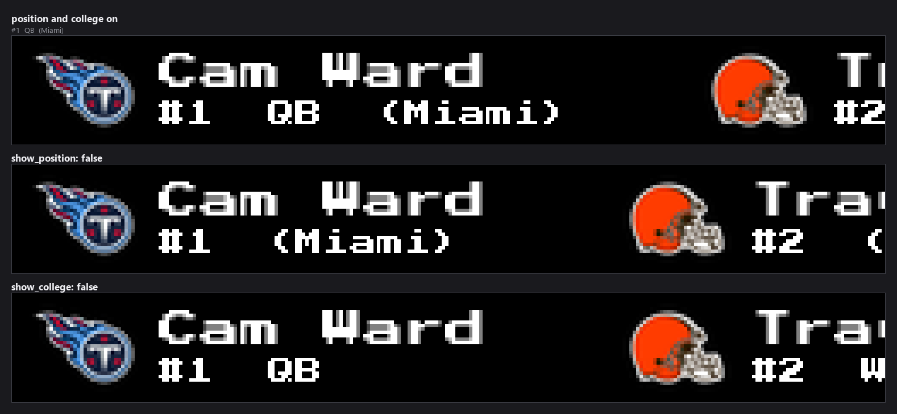
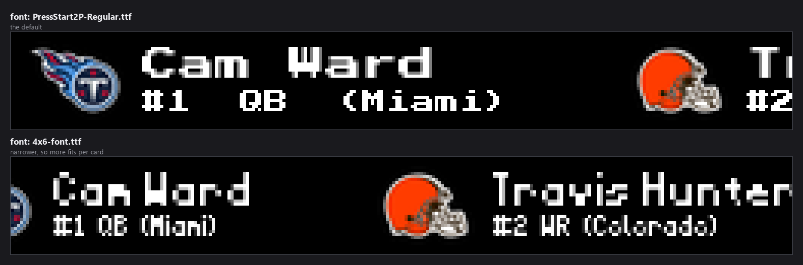
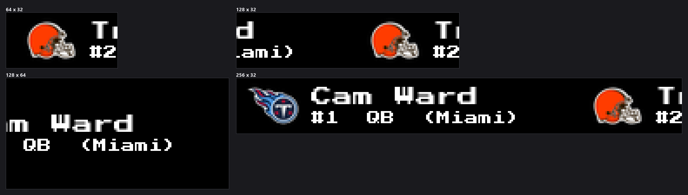

# NFL Draft Plugin for LEDMatrix


*Every image in this README is real plugin output, rendered at the true panel
size from seeded picks so it reproduces exactly. The picks are the real 2025
first round; the team marks are the logo assets the plugin already ships.*

Displays projected and live NFL draft picks from ESPN on your LED matrix display.

[](https://buymeacoffee.com/sarjent)

## Features

- **Projected Draft Picks**: Shows Tankathon mock draft picks during the off-season (Round 1)
- **Live Draft Tracking**: Automatically switches to live mode when ESPN detects the draft is active — no config change needed
- **Auto-Poll on Draft Day**: Polling ramps up to every 10 minutes automatically on April 20–27, then drops back to daily off-season
- **Team Logos**: Displays NFL team logos from core LEDMatrix assets
- **Smooth Scrolling**: Horizontal scroll through picks with NFL Draft logo header
- **On the Clock**: Highlights the next pick in green during live draft
- **Favorite Teams**: Pins your team's picks to the front of the scroll
- **Vegas Scroll Mode**: Integrates as individual pick cards in a continuous scroll stream
- **Simulate Mode**: Replay any completed draft year using real ESPN data

## Installation

Install directly from the LEDMatrix web UI plugin store. The plugin is available in the [ChuckBuilds/ledmatrix-plugins](https://github.com/ChuckBuilds/ledmatrix-plugins) monorepo:

```text
Plugin ID: nfl-draft
Plugin path: plugins/nfl-draft
```

## Configuration

| Option | Type | Default | Description |
|--------|------|---------|-------------|
| `enabled` | boolean | `true` | Enable/disable the plugin |
| `display_duration` | number | `60` | Display duration in seconds |
| `font` | string | `"PressStart2P-Regular.ttf"` | Font file from assets/fonts/ |
| `player_name_font_size` | integer | `12` | Font size for player names |
| `detail_font_size` | integer | `8` | Font size for pick number / position / college |
| `player_name_color` | object | `{r:255,g:255,b:255}` | Player-name colour, as separate `player_name_color.r`, `player_name_color.g` and `player_name_color.b` values (0–255) |
| `pick_number_color` | object | `{r:255,g:255,b:255}` | Detail-line colour, as separate `pick_number_color.r`, `pick_number_color.g` and `pick_number_color.b` values (0–255) |
| `scroll_speed` | number | `30` | Scroll speed in pixels per second |
| `live_refresh_interval` | integer | `600` | Refresh interval during live draft (seconds) |
| `projection_refresh_interval` | integer | `86400` | Refresh interval for projections (seconds) |
| `draft_year` | integer | `0` | Draft year (0 = auto-detect current/upcoming) |
| `show_position` | boolean | `true` | Show player position |
| `show_college` | boolean | `true` | Show player college/school |
| `logo_size` | integer | `0` | Team logo height in pixels (0 = auto-size to display height) |
| `item_gap` | integer | `32` | Gap in pixels between draft pick items |
| `live_priority` | boolean | `false` | When true, draft takes over the display exclusively while live |
| `favorite_teams` | array | `[]` | Up to 3 team abbreviations (e.g. `["KC","SF"]`) pinned to scroll front |
| `simulate_live` | boolean | `false` | Replay a completed draft year as if it were live |
| `simulate_year` | integer | `2025` | Draft year to use when `simulate_live` is enabled |

### After the draft ends

| Key | Default | Notes |
|---|---|---|
| `post_draft_show` | `"both"` | What to display during the post-draft window. 'favorites' = only picks for your favorite teams, 'rounds' = per-round results for all teams, 'both' = favorite team picks followed by per-round results — one of `favorites`, `rounds`, `both`. |
| `post_draft_days` | `7` | Number of days after the draft ends to keep showing results. After this window the plugin goes silent until the following February (1–30). |
| `display_rounds` | `3` | Number of rounds to display during the post-draft window (1 = first round only, 7 = all rounds). Only applies when post_draft_show is 'rounds' or 'both' (1–7). |

### Duration and rotation

| Key | Default | Notes |
|---|---|---|
| `dynamic_duration.enabled` | `true` | . |
| `dynamic_duration.min_duration` | `30` | Minimum display duration in seconds. |
| `dynamic_duration.max_duration` | `300` | Maximum display duration in seconds. |
| `vegas_mode` | `"scroll"` | Override how this plugin appears in Vegas scroll mode. 'scroll' = individual picks scroll through the stream (default), 'fixed' = entire display scrolls by as one block, 'static' = scroll pauses while plugin displays for its duration — one of `scroll`, `fixed`, `static`. |

### Settings that do nothing

`transition.type` and `transition.speed` are in the schema and the web UI form,
and nothing reads them — not this plugin and not the LEDMatrix core, which
implements no display transitions. Four other plugins carry the same dead
block, tracked in
[issue #381](https://github.com/ChuckBuilds/ledmatrix-plugins/issues/381).

| Key | Default | Notes |
|---|---|---|
| `transition.type` | `"redraw"` | one of `redraw`, `fade`, `slide`, `wipe`. Not implemented. |
| `transition.speed` | `2` | Transition speed (1-10). Not implemented. |
| `transition.enabled` | `true` | Enable transitions. Not implemented. |


## Display Layout

```text
[NFL DRAFT LOGO]  [TEAM LOGO]  Player Name
                               #1  QB  (Indiana)
```

Each pick card scrolls horizontally. During live draft, a **ROUND X** label precedes the picks and the next pick shows **On the Clock** in green.

`show_position` and `show_college` each drop a piece of the detail line:



`font` changes the face for both rows. The 4x6 face is narrower, so more of a
long player name fits before the card scrolls past:





On first run the plugin copies its bundled `nfl_draft_logo.png` into the
LEDMatrix `assets/sports/nfl_logos/` folder, so the shared sports renderer can
find it alongside the team logos.

## Live Draft Mode

The plugin detects the draft automatically — **no config change is required**. When ESPN reports `state: in`, the plugin switches to live picks, shows the current round, and marks the next pick on the clock.

**`live_priority`** controls whether the draft *interrupts* other plugins to take over the display exclusively. Leave it `false` to keep the draft in normal rotation alongside other plugins.

## Data Sources

- **Pre-draft**: [Tankathon](https://www.tankathon.com/nfl/mock_draft) mock draft (Round 1)
- **Live/post-draft**: ESPN public API — no API key required
- **Position data**: ESPN core API prospects (supplements live picks where position is unavailable inline)

## Requirements

- LEDMatrix v2.0.0 or higher
- Minimum display size: 64×32 pixels
- Python 3.9+

## License

Released under the GNU General Public License v3.0 — see [LICENSE](LICENSE).

## Support

If this plugin is useful to you, consider buying me a coffee!

[](https://buymeacoffee.com/sarjent)

## Contributing

Contributions are welcome! Please open an issue or pull request on [GitHub](https://github.com/ChuckBuilds/ledmatrix-plugins).
