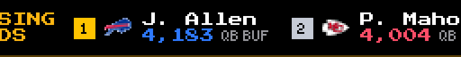
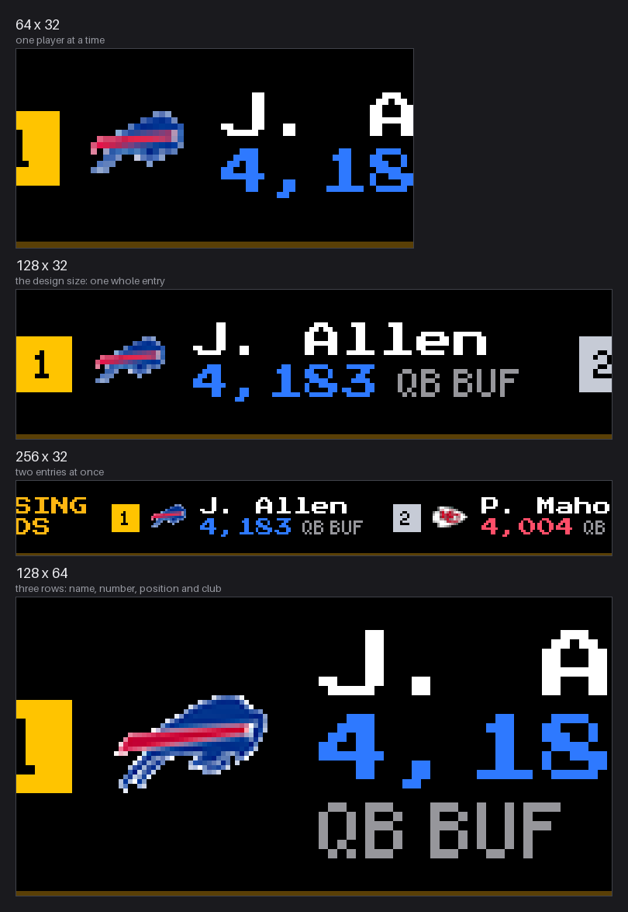
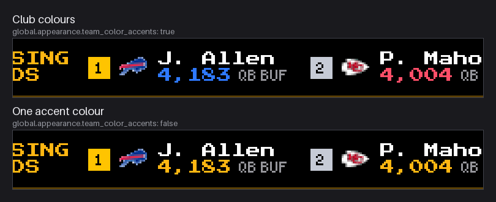
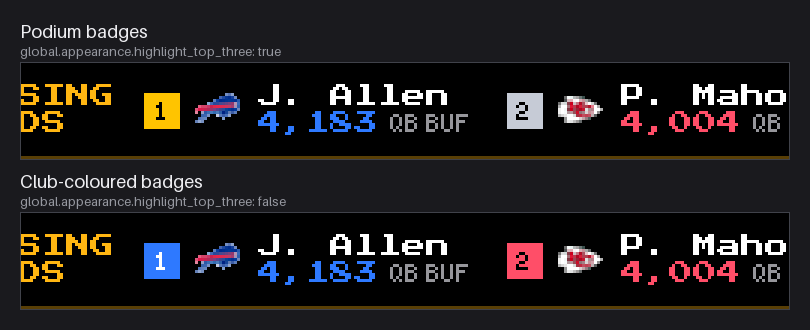

# NFL Stat Leaders

A scrolling ticker of the NFL's statistical leaders — the numbers a fantasy
table argues about. Each category is its own leaderboard, drawn with the
club's crest and the club's own colours, and you choose which ones appear.



No API key, no account, no secrets. The data is ESPN's public leaders feed.

## What it shows

Eleven leaderboards. Six are on out of the box — the ones standard fantasy
scoring is built from:

| Category | Config key | On by default |
|---|---|---|
| Passing yards | `passing_yards` | yes |
| Passing touchdowns | `passing_touchdowns` | yes |
| Rushing yards | `rushing_yards` | yes |
| Rushing touchdowns | `rushing_touchdowns` | yes |
| Receiving yards | `receiving_yards` | yes |
| Receiving touchdowns | `receiving_touchdowns` | yes |
| Receptions | `receptions` | no |
| Sacks | `sacks` | no |
| Interceptions (defensive) | `interceptions` | no |
| Tackles | `total_tackles` | no |
| Passer rating | `quarterback_rating` | no |

They scroll in the order above. Each one opens with a title card, then the
top players: a rank badge, the club crest, the player, the number, and their
position and club.

The top three wear gold, silver and bronze badges; everyone else gets a badge
in their club's colour. Those colours are sampled from the crest itself rather
than kept in a table, and lifted until they read on a panel — several official
primaries are black or near-black navy, which an LED renders as "off".

## Panel sizes



Designed for wide, short panels. From 56 pixels tall the layout gains a third
row, so the position and club move off the number's line onto their own.

## Settings

### Top level

| Setting | Default | What it does |
|---|---|---|
| `enabled` | `false` | Turn the ticker on |
| `update_interval` | `3600` | Seconds between refreshes. ESPN updates these after games, so hourly is plenty (minimum 900) |
| `categories` | six on | Which leaderboards to show, one switch each (table above) |
| `players_per_category` | `5` | How many players each leaderboard lists, 1–10. More players means a longer scroll |
| `season` | `0` | Season to show, named for the year it kicks off in — `2025` means the 2025-26 season. `0` picks the current season and falls back to the last completed one during the off-season |
| `season_type` | `regular` | `regular` or `postseason` |

### `global`

| Setting | Default | What it does |
|---|---|---|
| `display_duration` | `30` | Seconds on screen when dynamic duration is off |
| `scroll_mode` | `one_shot` | `one_shot` scrolls through once and holds; `continuous` loops |
| `request_timeout` | `30` | Seconds to wait for ESPN |
| `display_options.scroll_speed` | `1.0` | Pixels per scroll step |
| `display_options.scroll_delay` | `0.01` | Seconds between steps — speed is `scroll_speed / scroll_delay` px/s, snapped to a speed the panel can move in whole pixels |
| `dynamic_duration.enabled` | `true` | Size the slot to how long the ticker takes to scroll |
| `dynamic_duration.min_duration_seconds` | `45` | Shortest slot |
| `dynamic_duration.max_duration_seconds` | `600` | Longest slot |
| `dynamic_duration.buffer_ratio` | `0.1` | Extra time added to the calculated duration |
| `dynamic_duration.controller_cap_seconds` | `600` | Failsafe cap on this plugin's slot |

### `global.appearance`

| Setting | Default | What it does |
|---|---|---|
| `team_color_accents` | `true` | Colour each number and rank badge with the club's colour |
| `highlight_top_three` | `true` | Gold, silver and bronze badges for the podium |
| `show_league_logo` | `true` | The NFL shield on the title cards |
| `accent_color` | `#FFB612` | Title and divider colour, and the fallback when club colours are off |
| `pixel_perfect_text` | `true` | Hard pixel edges on text |
| `crisp_logos` | `true` | Hard edges on crests instead of half-lit pixels |
| `text_outline` | `true` | Black outline so text stays readable over a crest |
| `logo_scale` | `1.0` | Crest size, 0.4–1.4 |
| `font_size` | `0` | `0` picks a size for the panel height; other values snap to multiples of 8 |





## Example

```json
{
  "nfl-stat-leaders": {
    "enabled": true,
    "update_interval": 3600,
    "players_per_category": 5,
    "season": 0,
    "season_type": "regular",
    "categories": {
      "passing_yards": true,
      "passing_touchdowns": true,
      "rushing_yards": true,
      "rushing_touchdowns": true,
      "receiving_yards": true,
      "receiving_touchdowns": true,
      "receptions": true
    },
    "global": {
      "scroll_mode": "one_shot",
      "appearance": {
        "team_color_accents": true,
        "highlight_top_three": true
      }
    }
  }
}
```

## How long the ticker runs

At the default speed, measured with five players in each category:

| Categories on | 128×32 | 128×64 | 256×128 |
|---|---|---|---|
| six (the default) | 47 s | 99 s | 148 s |
| seven | 55 s | 115 s | 172 s |
| all eleven | 85 s | 178 s | 267 s |

A taller panel takes longer because the layout is scaled up with it.

The display controller caps how long any one plugin holds the screen —
`display.dynamic_duration.max_duration_seconds` in the core's own config, 180
seconds by default — and the last categories simply never arrive if the ticker
is longer than the cap. The plugin logs a warning naming both numbers when that
happens. To fit more in: turn off categories you do not care about, lower
`players_per_category`, raise the core's cap, or raise the scroll speed.

## Data

`https://site.web.api.espn.com/apis/common/v3/sports/football/nfl/leaders`,
with ESPN's older `site/v2` leaders endpoint as a fallback. Both are public and
need no key.

The one thing neither embeds reliably is which club a player is on — it usually
arrives as a reference URL. Resolving those would be one request per player per
category, so the franchise id inside the reference is mapped locally instead
(`nfl_stat_teams.py`), which is also what makes the crest load from the core's
own assets with no network at all.

Everything is fetched in `update()` and cached; `display()` only draws. If ESPN
is unreachable the last successful leaderboards stay on the panel rather than
going blank.

## Files

| File | What it does |
|---|---|
| `manager.py` | The plugin: config, scheduling, scrolling |
| `nfl_stat_fetcher.py` | ESPN requests, caching, normalising leaders |
| `nfl_stat_categories.py` | The categories, and how to find each in ESPN's feed |
| `nfl_stat_teams.py` | Franchise id → abbreviation → crest |
| `nfl_stat_renderer.py` | Drawing the ticker |

## Requirements

LEDMatrix core 3.4.0 or newer, a panel at least 64×32, and an internet
connection.

## License

GPL-3.0
