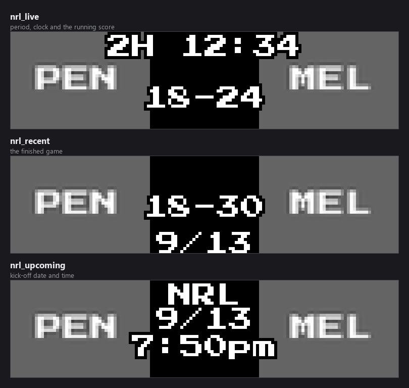
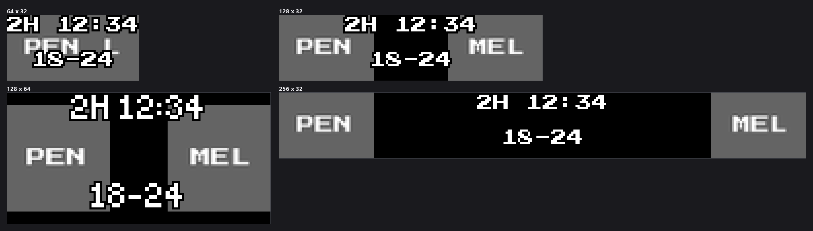
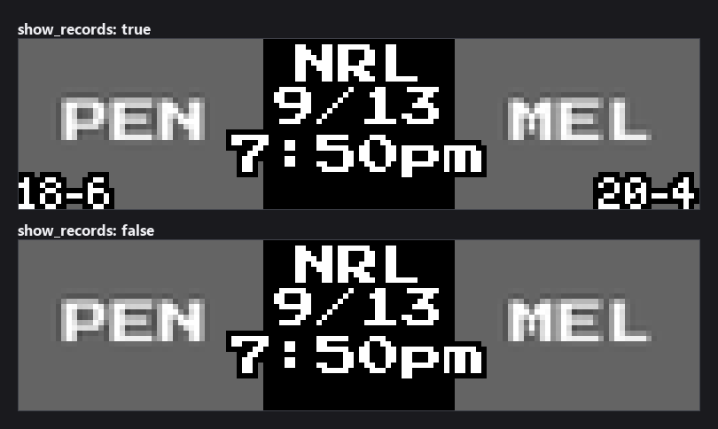

# NRL Scoreboard

Live, recent, and upcoming **NRL (National Rugby League)** games on your
LEDMatrix display, from ESPN's public rugby-league API. No API key, no account,
no configuration beyond picking your clubs.


This plugin is a single-league fork of `soccer-scoreboard` and keeps full
feature parity: switch or scroll display, live-game priority, try/win
celebrations, dynamic per-mode durations, and Vegas continuous-scroll support.

> The crests above are grey placeholders because this documentation renders
> against a checkout with no cached logos. On a running display the real club
> crests are downloaded from ESPN's CDN on first sight and cached.

## Contents

- [Quick start](#quick-start)
- [Display modes](#display-modes)
- [How games are chosen](#how-games-are-chosen)
- [Panel sizes](#panel-sizes)
- [Settings reference](#settings-reference)
- [Matchup separator and the upcoming card middle](#matchup-separator-and-the-upcoming-card-middle)
- [Text colours](#text-colours)
- [Favorite team result colours](#favorite-team-result-colours)
- [Vegas ticker: seeing live games more often](#vegas-ticker-seeing-live-games-more-often)
- [Data source and the `3` league-slug quirk](#data-source-and-the-3-league-slug-quirk)
- [Scoring and period model](#scoring-and-period-model)
- [Team logos](#team-logos)
- [Troubleshooting](#troubleshooting)

## Quick start

1. Install **NRL Scoreboard** from the LEDMatrix Plugin Store.
2. Open its settings and add your clubs under **Favorite Teams**.
3. Save. The board picks the plugin up on the next rotation.

Use the **full team name** (`"Penrith Panthers"`) or the ESPN numeric team ID —
not the three-letter abbreviation. Two NRL abbreviations are ambiguous: `NEW` is
both Newcastle Knights and New Zealand Warriors, and `CAN` is both Canberra
Raiders and Canterbury Bulldogs. An ambiguous entry is left unresolved and
logged as an error rather than guessed at.

A minimal `config/config.json` entry:

```json
{
  "nrl-scoreboard": {
    "enabled": true,
    "favorite_teams": ["Penrith Panthers", "Brisbane Broncos"],
    "display_modes": {
      "live": true,
      "live_display_mode": "switch",
      "recent": true,
      "recent_display_mode": "scroll",
      "upcoming": true,
      "upcoming_display_mode": "scroll"
    },
    "live_priority": true,
    "game_limits": {
      "recent_games_to_show": 3,
      "upcoming_games_to_show": 5
    }
  }
}
```

## Display modes

Three modes, each independently switchable, each declared in the manifest so the
core can schedule them separately.



| Mode | Shows | Top line |
|---|---|---|
| `nrl_live` | Games in progress | Period and running clock — `1H 22:10`, `2H 12:34`, `HALF`, `ET` |
| `nrl_recent` | Finished games | `Final`, or whatever period text the fixture ended on |
| `nrl_upcoming` | Scheduled games | `NRL`, then the kick-off date and time |

Each mode renders as **switch** (one game at a time, timed) or **scroll** (all
games scroll horizontally at high FPS), set per mode with
`display_modes.<mode>_display_mode`.

## How games are chosen

**`upcoming_games_to_show` is not "how many cards you see".** It is the size of
a *pool*. The panel cycles through that pool one card at a time and keeps its
place between visits, so a pool of 3 means the board rotates through the same 3
games until the schedule moves on. A bigger number gives you a *longer lap*, so
any one game comes round **less** often.

Which of three regimes you are in depends on `favorite_teams` and
`show_favorite_teams_only`:

| `favorite_teams` | `show_favorite_teams_only` | What you get |
|---|---|---|
| empty | either | The next N games league-wide, chronologically. Every game is a non-favorite game, so the `other_*` filters apply to all of them. |
| set | **on** (default) | Only your clubs. The limit is a budget **per team**. |
| set | **off** | **Your clubs first, then other games to fill.** Both limits are **totals**. |

### The selection settings

| Option | Default | Description |
|---|---|---|
| `upcoming_games_to_show` | `1` | How many **favorite** upcoming games to pool. |
| `recent_games_to_show` | `1` | The same, for finished games. |
| `other_upcoming_games_to_show` | `1` | How many **non-favorite** upcoming games to add. `0` gives you favorites only. |
| `other_recent_games_to_show` | `1` | The same, for finished games. |
| `other_rotation_interval_seconds` | `1800` | How often the non-favorite slice advances. `0` pins it. |
| `other_games_min_quality` | `ranked` | Which non-favorite games qualify. Inert here — see below. |
| `other_games_divisions` | `["fbs"]` | Which divisions non-favorite games may come from. Inert here — see below. |

All seven are declared **twice**: at the root of the config and inside
`game_limits`. Both render in the web UI and both are read. **`game_limits` wins
where the key is present**, and the root value is used otherwise. Set one place
or the other, not both.

Within the other-games pool the better matchup leads and each team appears once.
The pool is each team's *next* game ordered by the best poll position of either
side, with ties falling back to kick-off order. A league with no national poll —
which the NRL is — keeps plain chronological order. Your favorite clubs are
ordered by when they play, not by rank: for your own team the next game is the
point.

### Variety comes from turnover

Rather than widening the pool, the non-favorite slice **moves**: the window
advances by its own width every `other_rotation_interval_seconds`, so
consecutive windows do not overlap and the board works through the schedule
instead of resampling the front of it. Your favorites are not rotated.

Both filters **fail open**: if the data behind them cannot be fetched, the game
is allowed through. They fail open a second time as a set — if the filters
between them leave nothing at all, the unfiltered list is used instead. Setting
`other_upcoming_games_to_show` or `other_recent_games_to_show` to `0` is the one
way to ask for an empty slate, and that is honoured.

> **`other_games_min_quality` and `other_games_divisions` do nothing in this
> plugin.** `ranked` needs a national poll and the division filter needs ESPN's
> FBS/FCS group rosters; rugby league has neither, so every game passes both.
> Neither costs a request — no poll is fetched and no division lookup is made.
> They are present because the selection code is common to every scoreboard.

### Live rotation

When several games are live at once the rotation is weighted, not a flat
round-robin: a game involving one of your clubs gets `favorite_live_boost` turns
for every one turn other live games get, and is queued first whenever the
rotation refreshes. Set it to `1` for even rotation. How long each game holds the
screen is `live_game_duration`, or `non_favorite_live_game_duration` for games
without a favorite when that is set above `0`.

A live game that stops being reported by the API for `stale_game_timeout`
seconds is dropped from the rotation, so a game the feed abandons does not sit
on the board forever.

## Panel sizes

The scorebug is laid out from the panel dimensions rather than a fixed grid, and
the plugin passes the render-safety harness on all eight supported sizes.



At 64x32 the two crests and the centre column share very little room; a wider
panel is a much better fit for this card.

## Settings reference

Everything the plugin accepts. Settings marked **Advanced** sit behind the
*Advanced* toggle in the web UI. Defaults are the schema defaults, which is what
the web UI writes.

### Core

| Key | Type | Default | What it does |
|---|---|---|---|
| `enabled` | boolean | `true` | Master on/off switch. |
| `favorite_teams` | array | `[]` | Clubs to prioritise. Full name or ESPN team ID. |
| `exclude_teams` | array | `[]` | Clubs to always hide, from live rotation and finals alike (spoiler protection). Takes precedence over `favorite_teams` and `show_all_live`. |
| `live_priority` | boolean | `true` | Let live games interrupt the normal mode rotation and display immediately. |
| `timezone` | string | `""` | **Advanced.** IANA zone for start times, e.g. `Australia/Sydney`. Blank follows the LEDMatrix global timezone, then the host system's, then UTC. |

### Display modes

| Key | Type | Default | What it does |
|---|---|---|---|
| `display_modes.live` | boolean | `true` | Show live games. |
| `display_modes.recent` | boolean | `true` | Show recently completed games. |
| `display_modes.upcoming` | boolean | `true` | Show scheduled games. |
| `display_modes.live_display_mode` | `switch` \| `scroll` | `switch` | One game at a time, or all games scrolling. |
| `display_modes.recent_display_mode` | `switch` \| `scroll` | `switch` | As above, for finished games. |
| `display_modes.upcoming_display_mode` | `switch` \| `scroll` | `switch` | As above, for scheduled games. |

`display_modes` sets `additionalProperties: false`, so a misspelled key here is
rejected outright rather than quietly ignored.

### Timing

| Key | Type | Default | What it does |
|---|---|---|---|
| `live_game_duration` | 10–120 s | `20` | How long each live game holds the screen. Applies to favorites' games when a separate non-favorite duration is set; to all live games when no favorites are configured. |
| `non_favorite_live_game_duration` | 0–120 s | `0` | **Advanced.** Shorter turn for live games without a favorite. Only applies when favorites are set **and** non-favorite live games are shown. `0` means use `live_game_duration` for everything. |
| `recent_game_duration` | 5–60 s | `15` | Per-game time on the Recent screen. |
| `upcoming_game_duration` | 5–60 s | `15` | Per-game time on the Upcoming screen. |
| `game_display_duration` | 3–60 s | `15` | **Advanced.** Generic per-game fallback where a mode-specific duration is not set. |
| `display_duration` | 5–60 s | `15` | **Advanced.** Legacy per-game duration, superseded by the three above. |

### Mode durations

How long the *whole mode* holds the board before the core rotates to the next
plugin. Leave at `null` to let dynamic duration decide.

| Key | Type | Default |
|---|---|---|
| `mode_durations.live_mode_duration` | 10–600 s or `null` | `null` |
| `mode_durations.recent_mode_duration` | 10–600 s or `null` | `null` |
| `mode_durations.upcoming_mode_duration` | 10–600 s or `null` | `null` |

All three are **Advanced**. They are read by the LEDMatrix core rather than by
this plugin, which is why they do not appear in the plugin's own source.

### Dynamic duration

Sizes each mode's total time from how much there is to show, instead of a fixed
number.

| Key | Type | Default | What it does |
|---|---|---|---|
| `dynamic_duration.enabled` | boolean | `false` | **Advanced.** Master switch for the plugin. |
| `dynamic_duration.min_duration_seconds` | 10–300 s | `30` | **Advanced.** Floor, even with few games. |
| `dynamic_duration.max_duration_seconds` | 60–600 s | — | **Advanced.** Ceiling. |
| `dynamic_duration.modes.live.enabled` | boolean | `false` | **Advanced.** Per-mode override. |
| `dynamic_duration.modes.live.max_duration_seconds` | 60–600 s | — | **Advanced.** |
| `dynamic_duration.modes.recent.enabled` | boolean | `false` | **Advanced.** |
| `dynamic_duration.modes.recent.max_duration_seconds` | 60–600 s | — | **Advanced.** |
| `dynamic_duration.modes.upcoming.enabled` | boolean | `false` | **Advanced.** |
| `dynamic_duration.modes.upcoming.max_duration_seconds` | 60–600 s | — | **Advanced.** |

### Filtering

| Key | Type | Default | What it does |
|---|---|---|---|
| `show_favorite_teams_only` | boolean | `true` | Show only your clubs' games. |
| `filtering.show_favorite_teams_only` | boolean | `true` | **Advanced.** The same setting in its nested home; this copy wins when the `filtering` object is present. |
| `filtering.show_all_live` | boolean | `false` | **Advanced.** Show every live game regardless of favorites. `exclude_teams` still applies. |
| `filtering.favorite_live_boost` | 1–5 | `2` | **Advanced.** Turns a favorite's live game gets per one turn for other live games. `1` is even rotation. |

### Overlays

| Key | Type | Default | What it does |
|---|---|---|---|
| `show_records` | boolean | `false` | Draw each club's win-loss record in the bottom corners. |
| `show_ranking` | boolean | `false` | Draw ladder positions where ESPN publishes them. |
| `show_odds` | boolean | `true` | Draw betting odds. |
| `display_options.show_records` | boolean | `false` | **Advanced.** Nested copy; wins over the root key when present. |
| `display_options.show_ranking` | boolean | `false` | **Advanced.** Nested copy. |
| `display_options.show_odds` | boolean | `true` | **Advanced.** Nested copy. |



### Celebrations

| Key | Type | Default | What it does |
|---|---|---|---|
| `celebration_enabled` | boolean | `true` | Full-screen takeover when a favorite scores or wins a live game. |
| `celebration_duration` | 3–30 s | `8` | **Advanced.** How long the takeover stays up. |
| `celebrate_opponent_goals` | boolean | `false` | **Advanced.** Also celebrate the opponent's points. |

A celebration owns the screen while it runs: the live rotation does not advance
underneath it, and the dwell timer resets afterwards so the scoring game gets a
full turn before the board moves on.

### Fetching

| Key | Type | Default | What it does |
|---|---|---|---|
| `update_interval_seconds` | 30–86400 s | `3600` | **Advanced.** Base data refresh cadence. |
| `live_update_interval` | 5–300 s | `30` | **Advanced.** Refresh cadence while a game is live. |
| `recent_update_interval` | 60–86400 s | `3600` | **Advanced.** Refresh cadence for finished games. |
| `upcoming_update_interval` | 60–86400 s | `3600` | **Advanced.** Refresh cadence for the schedule. |
| `stale_game_timeout` | 60–3600 s | `300` | **Advanced.** Drop a live game the API has stopped updating. |
| `no_data_interval_seconds` | 5–86400 s | `300` | **Advanced.** Wait between live checks when there are no live games. Backs off further the longer nothing is found. |
| `live_idle_max_interval_seconds` | 5–86400 s | `900` | **Advanced.** Ceiling for that back-off. |
| `schedule_lookback_days` | 1–60 | `14` | **Advanced.** How far back to fetch for the Recent screen. |
| `schedule_lookahead_days` | 1–60 | `7` | **Advanced.** How far ahead to fetch for Upcoming. A fixture beyond this horizon is never fetched, so it cannot reach the board even though the date is known. |

### Background service

All **Advanced**; the defaults suit a Pi and rarely want changing.

| Key | Type | Default |
|---|---|---|
| `background_service.enabled` | boolean | `true` |
| `background_service.max_workers` | 1–10 | `3` |
| `background_service.request_timeout` | 5–120 s | `30` |
| `background_service.max_retries` | 1–10 | `3` |
| `background_service.priority` | 1–5 | `2` |

`background_service` sets `additionalProperties: false`.

### Fonts and sizes

Seven text elements, each with `font`, `font_size`, and `text_color`, under
`customization.<element>`. Available faces: `PressStart2P-Regular.ttf`,
`4x6-font.ttf`, `5by7.regular.ttf`, `5x7.bdf`, `4x6.bdf`, `cozette.bdf`.

| Element | Default font | Default size | Draws |
|---|---|---|---|
| `score_text` | `PressStart2P-Regular.ttf` | `10` | The score, and the matchup separator on an upcoming card |
| `period_text` | `PressStart2P-Regular.ttf` | `8` | The clock and period, and the date/time on an upcoming scoreboard |
| `team_name` | `PressStart2P-Regular.ttf` | `8` | Team names and abbreviations |
| `status_text` | `4x6-font.ttf` | `6` | Status lines such as "Next Game" |
| `detail_text` | `4x6-font.ttf` | `6` | Small detail lines |
| `rank_text` | `PressStart2P-Regular.ttf` | `10` | Ladder positions |
| `odds_text` | `4x6-font.ttf` | `6` | Betting odds (defaults to green, `[0, 255, 0]`) |

The `.bdf` faces are bitmap fonts that exist at exactly one pixel size; sizes
snap to that grid to stay crisp rather than being scaled. Every
`customization.<element>` object sets `additionalProperties: false`.

### Layout offsets

Nudge any element in pixels. All default to `0`, all live under
`customization.layout.<element>`, and all set `additionalProperties: false`.

| Element | Keys | Measured from |
|---|---|---|
| `home_logo`, `away_logo` | `x_offset`, `y_offset` | Default logo position |
| `score` | `x_offset`, `y_offset` | Panel centre |
| `status_text` | `x_offset`, `y_offset` | Centre horizontally, top vertically |
| `date` | `x_offset`, `y_offset` | Centre horizontally, default position vertically |
| `time` | `x_offset`, `y_offset` | Centre horizontally, the date's position vertically |
| `records` | `away_x_offset`, `home_x_offset`, `y_offset` | Away from the left, home from the right, both from the bottom |
| `odds` | `x_offset`, `y_offset` | **Advanced.** Default odds position |

### Scroll settings

| Key | Type | Default |
|---|---|---|
| `scroll_settings.scroll_speed` | 0.01–200 px/s | `1.0` |
| `scroll_settings.scroll_delay` | 0.001–0.1 s | `0.01` |
| `scroll_settings.gap_between_games` | 8–128 px | `48` |
| `scroll_settings.show_league_separators` | boolean | `true` |
| `scroll_settings.dynamic_duration` | boolean | `true` |
| `scroll_settings.game_card_width` | 32–512 px | `128` |

All **Advanced**.

> **These six settings currently have no effect.** The scroll renderer reads a
> `scroll_mode` object that the schema does not declare, and the schema will not
> accept `scroll_mode` if you add it by hand — so the block is unreachable from
> the UI and from a hand-written config alike. Tracked as
> [issue #422](https://github.com/ChuckBuilds/ledmatrix-plugins/issues/422).
> Scroll display itself works; only these tuning knobs are inert.

## Matchup separator and the upcoming card middle

The **Matchup Card Layout** section controls what sits between the two crests
before a game starts, and how the date and time are written. These settings
apply to every display mode — the scroll ticker, the Vegas ticker, and the
full-screen scoreboard.

| Setting | Key | Default | What it does |
|---|---|---|---|
| Matchup Separator | `scroll_card.vs_text` | `VS` | Text between the teams: `VS`, `@`, `at`, `v`. The away side is always on the left, so `@` and `at` read as "away at home". Blank draws nothing. |
| Middle of an Upcoming Card | `scroll_card.upcoming_center` | `vs` | Scroll and Vegas cards: `vs`, `date_time`, or `none`. |
| Middle of a Full-Screen Upcoming Scoreboard | `scroll_card.switch_upcoming_center` | `date_time` | The same choice for the full-screen scoreboard, plus `inherit` to follow the row above. |
| Date Format | `scroll_card.date_format` | `abbrev` | Scroll and Vegas cards: `Sep 19`, `9/19`, `19 Sep`, `19/9`, or `Fri Sep 19`. |
| Full-Screen Date Format | `scroll_card.switch_date_format` | `numeric` | **Advanced.** The same for the full-screen scoreboard, plus `inherit`. It has its own default because the two displays disagree about what is normal: the cards have always written `Sep 19` and the full-screen scoreboard `9/19`, so a single shared default would restyle one of them. |
| Time Format | `scroll_card.time_format` | `12h` | 12- or 24-hour clock. |
| Show Date / Show Time | `scroll_card.show_date`, `scroll_card.show_time` | `true` | Drop either line. |
| Swap Date and Time | `scroll_card.swap_date_time` | `false` | Flip the two lines. Each display starts from its own order, so this flips rather than forces: scroll and Vegas cards put the time on top, the full-screen stack puts the date on top. |

Choosing the separator for the full-screen scoreboard moves the date and time
out of the middle and onto the top and bottom rows, the way the scroll card lays
them out; the "Next Game" header gives up the top row to them.

The centre-gap settings size the scroll and Vegas card's middle strip only — the
full-screen scoreboard pins its crests to the panel edges and is unaffected.

| Key | Type | Default | What it does |
|---|---|---|---|
| `scroll_card.center_gap` | 0–64 px | unset | Pixels kept clear down the middle. Unset scales with card width; `0` restores edge-to-edge logos. |
| `scroll_card.center_gap_ratio` | 0.0–0.6 | `0.28` | **Advanced.** Fraction of card width used when the gap is not pinned. |
| `scroll_card.center_gap_min` | 0–64 px | `22` | **Advanced.** Floor for the scaled gap. |
| `scroll_card.center_gap_max` | 0–96 px | `40` | **Advanced.** Ceiling for the scaled gap. |

```json
{
  "scroll_card": {
    "vs_text": "@",
    "switch_upcoming_center": "vs",
    "date_format": "weekday"
  }
}
```

## Text colours

Each `customization.<element>.text_color` colours the text drawn in that
element's face, on the full-screen scoreboard and on the scroll and Vegas cards
alike. Colours are `[r, g, b]` or `"#RRGGBB"`. Every default is white except
`odds_text`, which is green.

```json
{
  "customization": {
    "score_text": { "text_color": [255, 200, 0] },
    "status_text": { "text_color": "#00A0FF" }
  }
}
```

Two things keep their own colours on purpose: the betting-odds figures, which
are coloured by which side is favoured, and a finished game's score when
**Favorite Team Result Colors** is on — that tint wins. Records and rankings
drawn in the small fixed face stay white; no element in the schema owns that
face.

## Favorite team result colours

A run of games against the same opponent is hard to read at a glance: in scroll
and Vegas mode the same two crests go past several times and only the digits
change. Turn this on to colour a finished game's score by how your club did.

| Key | Type | Default |
|---|---|---|
| `customization.favorite_result_colors.enabled` | boolean | `false` |
| `customization.favorite_result_colors.win_color` | `[r, g, b]` | `[0, 255, 0]` |
| `customization.favorite_result_colors.loss_color` | `[r, g, b]` | `[255, 0, 0]` |
| `customization.favorite_result_colors.tie_color` | `[r, g, b]` | `[255, 200, 0]` |

```json
{
  "customization": {
    "favorite_result_colors": {
      "enabled": true,
      "win_color": [0, 255, 0],
      "loss_color": [255, 0, 0],
      "tie_color": [255, 200, 0]
    }
  }
}
```

- Only finished games are coloured; live and upcoming cards are untouched.
- A game needs **exactly one** favorite club. Neither side or both, and the score
  keeps its normal colour.
- Applies to the switch view and the scroll/Vegas ticker alike.
- The three colours are Advanced settings.

This tint is applied by the LEDMatrix core rather than by the plugin, which is
why the keys do not appear in this plugin's source.

## Vegas ticker: seeing live games more often

By default a live game **takes over** the display: the Vegas ticker stops and
this scoreboard shows full screen until the game ends. To keep the marquee
scrolling and still see scores, set this in the **core** config — not in this
plugin's settings:

```json
{
  "display": {
    "vegas_scroll": {
      "live_in_ticker": true,
      "live_weight": 3,
      "favorite_live_weight": 5
    }
  }
}
```

The ticker is otherwise a strict round robin — every plugin appears once per
cycle — so with a dozen plugins enabled a score comes round once a lap. These
weights let this plugin claim several slots per cycle, spaced evenly through it
rather than bunched together.

`live_weight` applies whenever this scoreboard has a live game.
`favorite_live_weight` applies when one of your `favorite_teams` is playing. That
distinction has to be made here rather than in the core, which can tell *that* a
game is live but not *whose*.

- The weight is per **plugin**, not per game. With four games live this
  scoreboard still occupies one slot at a time and picks between its own games
  using `favorite_live_boost`.
- More slots make the cycle **longer**, not faster — everything else appears
  proportionally less often. And appearing more often only helps if the data is
  fresh, which is governed by `live_update_interval`.

## Data source and the `3` league-slug quirk

```
https://site.api.espn.com/apis/site/v2/sports/rugby-league/3/scoreboard
```

Note the `3` in the path. That is **ESPN's internal numeric slug for the NRL**
under the `rugby-league` sport — not a typo, and it must **not** be changed to
`nrl`. The human-facing web path is `/nrl/`, but the API path segment is the
literal string `3` (confirmed via
`site.web.api.espn.com/apis/v2/scoreboard/header?sport=rugby-league`, which
lists NRL as `id:8370, abbreviation:"NRL", slug:"3"`). Changing `3` to `nrl`
makes the endpoint 404 and the plugin silently stops fetching games. Every place
the code uses `3` carries a comment saying so.

No API key is required.

## Scoring and period model

The NRL plays two 40-minute halves, not quarters. ESPN reports `status.period`
as `1` or `2` with a `displayClock` that counts **up** in minutes, like soccer.
The plugin renders the period text as:

| Text | Meaning |
|---|---|
| `1H` / `2H` with the clock | First or second half, e.g. `2H 12:34` |
| `HALF` | Half-time |
| `ET` | Golden-point extra time (period ≥ 3) |
| `Final` | Completed game |
| Start time | Upcoming game |

Each club carries a single running integer score.

## Team logos

Crests are downloaded from ESPN's CDN on first sight and cached locally — there
are no bundled logo assets to manage. If a download fails, a placeholder is
generated from the team abbreviation, which is what the images in this document
show.

## Troubleshooting

**Nothing appears.** Check that `enabled` is `true` and at least one entry in
`display_modes` is on. With `show_favorite_teams_only` at its default of `true`
and no `favorite_teams` set, there is nothing to select from.

**A club I follow never shows up.** Confirm you used the full team name or the
ESPN ID, not the abbreviation — `NEW` and `CAN` are each shared by two clubs and
are deliberately left unresolved. The log records an error naming the entry it
could not resolve.

**A fixture I know about never appears.** It may be beyond
`schedule_lookahead_days` (default 7). A fixture outside that horizon is never
fetched.

**The same few games keep repeating.** That is the pool cycling. Lower
`other_rotation_interval_seconds` for faster turnover rather than raising the
pool size — a larger pool makes the lap longer, so each game appears less often,
not more.

**A finished game disappeared too soon.** Raise `schedule_lookback_days`
(default 14).

**Changes in the UI seem to do nothing.** Check whether you set the root copy of
a key that also exists under `game_limits`, `display_options`, or `filtering`.
The nested copy wins where it is present.

## License

See `LICENSE`.
