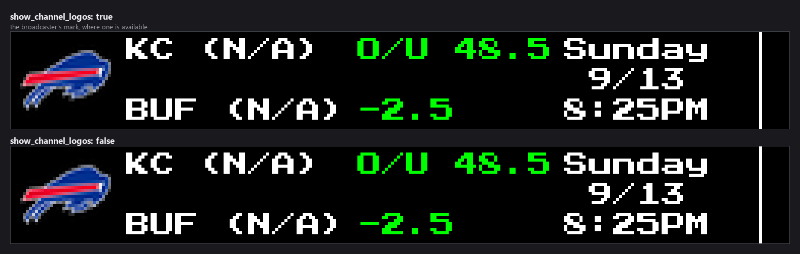
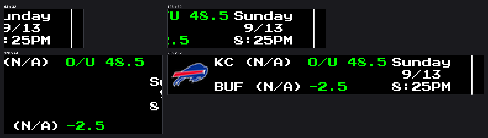

-----------------------------------------------------------------------------------
### Connect with ChuckBuilds

- Show support on Youtube: https://www.youtube.com/@ChuckBuilds
- Stay in touch on Instagram: https://www.instagram.com/ChuckBuilds/
- Want to chat or need support? Reach out on the ChuckBuilds Discord: https://discord.com/invite/uW36dVAtcT
- Feeling Generous? Support the project:
  - Github Sponsorship: https://github.com/sponsors/ChuckBuilds
  - Buy Me a Coffee: https://buymeacoffee.com/chuckbuilds
  - Ko-fi: https://ko-fi.com/chuckbuilds/ 

-----------------------------------------------------------------------------------

# Odds Ticker Plugin


*Every image in this README is real plugin output, rendered at the true panel
size from seeded games so it reproduces exactly. Team records come from a live
per-team ESPN lookup that these offline renders skip, which is why they read
`(N/A)`.*

A plugin for LEDMatrix that displays scrolling odds and betting lines for upcoming games across multiple sports leagues including NFL, NBA, MLB, NCAA Football, and NCAA Basketball.

## Features

- **Multi-Sport Support**: NFL, NBA, MLB, NCAA Football, NCAA Basketball
- **Scrolling Ticker Display**: Continuous scrolling of odds information
- **Betting Lines**: Point spreads, money lines, and over/under totals
- **Favorite Teams**: Prioritize odds for your favorite teams
- **Broadcast Information**: Show channel logos and game times
- **Configurable Display**: Adjustable scroll speed, duration, and filtering options
- **Background Data Fetching**: Efficient API calls without blocking display

## Configuration

Every setting except `enabled` lives inside one of five blocks —
`display_options`, `data_settings`, `filtering`, `leagues` or `customization`.
The schema sets `additionalProperties: false`, so a key written at the top
level is **rejected**, not ignored. The full schema is
[`config_schema.json`](config_schema.json).

```json
{
  "odds-ticker": {
    "enabled": true,
    "display_options": { "scroll_speed": 1.0 },
    "filtering": { "max_games_per_league": 5 },
    "leagues": { "nfl": { "enabled": true, "favorite_teams": ["KC", "BUF"] } }
  }
}
```

### Display

| Key | Default | Notes |
|---|---|---|
| `display_options.display_duration` | `30` | Duration in seconds to display the odds ticker (used when dynamic_duration is disabled) (10–300). |
| `display_options.dynamic_duration` | `true` | Enable dynamic duration based on content width. Automatically adjusts display time based on how much content there is. |
| `display_options.min_duration` | `30` | Minimum display duration in seconds when dynamic duration is enabled (10–300). |
| `display_options.max_duration` | `300` | Maximum display duration in seconds when dynamic duration is enabled (30–600). |
| `display_options.duration_buffer` | `0.1` | Extra buffer time added to calculated duration (as percentage, 0.1 = 10%) (0.01–1.0). |
| `display_options.scroll_speed` | `1.0` | Scrolling speed in pixels per frame (0.5–5.0). |
| `display_options.scroll_delay` | `0.02` | Delay between scroll steps in seconds (lower = faster scrolling) (0.001–0.1). |
| `display_options.scroll_pixels_per_second` | `50.0` | Scroll speed in pixels per second (used for dynamic duration calculation). Set to match your actual scroll rate: scroll_speed / scroll_delay (5.0–100.0). |
| `display_options.target_fps` | `120` | Target frames per second for smooth scrolling. Higher values = smoother animation (120 recommended) (30–200). |
| `display_options.loop` | `true` | Continuously loop the ticker. If false, stops at the end. |
| `display_options.show_channel_logos` | `true` | Show broadcast channel logos. |
| `display_options.broadcast_logo_height_ratio` | `0.8` | Height ratio for broadcast channel logos (0.8 = 80% of display height) (0.1–1.0). |
| `display_options.broadcast_logo_max_width_ratio` | `0.8` | Maximum width ratio for broadcast channel logos relative to display width (0.1–2.0). |

### Data fetching

| Key | Default | Notes |
|---|---|---|
| `data_settings.update_interval` | `3600` | How often to fetch new odds data in seconds when there are no live games (300–86400). |
| `data_settings.live_game_update_interval` | `60` | How often to fetch new odds data in seconds when there are live games being displayed (30–300). |
| `data_settings.future_fetch_days` | `7` | Days ahead to fetch upcoming games (1–90). |
| `data_settings.request_timeout` | `30` | Request timeout in seconds for API calls (5–120). |
| `data_settings.fetch_odds` | `true` | Enable fetching of betting odds. |

### Which games appear

| Key | Default | Notes |
|---|---|---|
| `filtering.show_favorite_teams_only` | `false` | Only show odds for favorite teams across all leagues. |
| `filtering.games_per_favorite_team` | `1` | Number of games to show per favorite team (1–5). |
| `filtering.max_games_per_league` | `5` | Maximum number of games to show per league (1–20). |
| `filtering.show_odds_only` | `false` | Include only games that have odds data; games without odds will be excluded from the ticker. |
| `filtering.sort_order` | `"soonest"` | Sort order for displaying games — one of `soonest`, `league`, `team`. |

### Fonts

| Key | Default | Notes |
|---|---|---|
| `customization.team_text.font` | `"PressStart2P-Regular.ttf"` | Select the font to use — one of `PressStart2P-Regular.ttf`, `4x6-font.ttf`, `5by7.regular.ttf`, `5x7.bdf`, `4x6.bdf`. |
| `customization.team_text.font_size` | `8` | Font size in pixels (4–16). |
| `customization.odds_text.font` | `"PressStart2P-Regular.ttf"` | Select the font to use — one of `PressStart2P-Regular.ttf`, `4x6-font.ttf`, `5by7.regular.ttf`, `5x7.bdf`, `4x6.bdf`. |
| `customization.odds_text.font_size` | `8` | Font size in pixels (4–16). |
| `customization.datetime_text.font` | `"PressStart2P-Regular.ttf"` | Select the font to use — one of `PressStart2P-Regular.ttf`, `4x6-font.ttf`, `5by7.regular.ttf`, `5x7.bdf`, `4x6.bdf`. |
| `customization.datetime_text.font_size` | `8` | Font size in pixels (4–16). |

### Leagues

Each league takes `enabled` and `favorite_teams`, and `ncaam_basketball` adds
`show_seeds_in_tournament`. `favorite_teams` defaults to `null`, which means
"no favourites for this league" rather than an empty list.

| Key | Default |
|---|---|
| `leagues.nfl.enabled` | `true` |
| `leagues.nfl.favorite_teams` | `null` |
| `leagues.nba.enabled` | `true` |
| `leagues.nba.favorite_teams` | `null` |
| `leagues.mlb.enabled` | `true` |
| `leagues.mlb.favorite_teams` | `null` |
| `leagues.nhl.enabled` | `true` |
| `leagues.nhl.favorite_teams` | `null` |
| `leagues.milb.enabled` | `false` |
| `leagues.milb.favorite_teams` | `null` |
| `leagues.ncaa_fb.enabled` | `false` |
| `leagues.ncaa_fb.favorite_teams` | `null` |
| `leagues.ncaam_basketball.enabled` | `false` |
| `leagues.ncaam_basketball.favorite_teams` | `null` |
| `leagues.ncaam_basketball.show_seeds_in_tournament` | `true` |
| `leagues.ncaa_baseball.enabled` | `false` |
| `leagues.ncaa_baseball.favorite_teams` | `null` |


### What the toggles look like





## Display Format

The odds ticker displays information in a scrolling format showing:

- **Team Names**: Home and away team abbreviations
- **Point Spread**: Betting line (e.g., "TB -3")
- **Money Line**: Win odds (e.g., "TB -150")
- **Over/Under**: Total points line (e.g., "O/U 45.5")
- **Game Time**: When the game starts
- **Broadcast**: Channel logo and network

## Supported Leagues

The plugin supports the following sports leagues:

- **nfl**: NFL (National Football League)
- **nba**: NBA (National Basketball Association)
- **mlb**: MLB (Major League Baseball)
- **ncaa_fb**: NCAA Football
- **ncaam_basketball**: NCAA Men's Basketball

## Team Abbreviations

### NFL Teams
Common abbreviations: TB, DAL, GB, KC, BUF, SF, PHI, NE, MIA, NYJ, LAC, DEN, LV, CIN, BAL, CLE, PIT, IND, HOU, TEN, JAX, ARI, LAR, SEA, WSH, NYG, MIN, DET, CHI, ATL, CAR, NO

### NBA Teams
Common abbreviations: LAL, BOS, GS, MIL, PHI, DEN, MIA, BKN, ATL, CHA, NY, IND, DET, TOR, CHI, CLE, ORL, WSH, HOU, SA, MIN, POR, SAC, LAC, MEM, DAL, PHX, UTAH, OKC, NO

### MLB Teams
Common abbreviations: NYY, BOS, LAD, HOU, ATL, PHI, TOR, TB, MIL, CHC, CIN, PIT, STL, MIN, CLE, CHW, DET, KC, LAA, ATH, SEA, TEX, ARI, COL, SD, SF, BAL, MIA, NYM, WSH

### NCAA Football Teams
Common abbreviations: UGA, AUB, BAMA, CLEM, OSU, MICH, FSU, LSU, OU, TEX, etc.

### NCAA Basketball Teams
Common abbreviations: DUKE, UNC, KANSAS, KENTUCKY, UCLA, ARIZONA, GONZAGA, BAYLOR, VILLANOVA, MICHIGAN, etc.

## Background Service

The plugin uses background data fetching for efficient API calls:

- Requests timeout after 30 seconds (configurable)
- Up to 3 retries for failed requests
- Priority level 2 (medium priority)
- Updates every hour by default (configurable)

## Data Sources

Odds data is fetched from various sports data APIs and aggregated for display. The plugin integrates with the main LEDMatrix odds management system.

## Dependencies

This plugin requires the main LEDMatrix installation and uses the OddsManager for data access.

## Installation

The easiest way is the Plugin Store in the LEDMatrix web UI:

1. Open `http://your-pi-ip:5000`
2. Open the **Plugin Manager** tab
3. Find **Odds Ticker** in the **Plugin Store** section and click
   **Install**
4. Open the plugin's tab in the second nav row to configure leagues,
   favorite teams, and display preferences

Manual install: copy this directory into your LEDMatrix
`plugins_directory` (default `plugin-repos/`) and restart the display
service.

## Troubleshooting

- **No odds showing**: Check if leagues are enabled and odds data is available
- **Missing channel logos**: Ensure broadcast logo files exist in your assets/broadcast_logos/ directory
- **Slow scrolling**: Adjust scroll speed and delay settings
- **API errors**: Check your internet connection and data provider availability

## Advanced Features

- **Channel Logos**: Automatically displays broadcast network logos
- **Game Filtering**: Filter by favorite teams or specific criteria
- **Odds Types**: Supports spread, moneyline, and totals
- **Time Display**: Shows game start times and countdown
- **Continuous Loop**: Optionally loop the ticker continuously

## Performance Notes

- The plugin is designed to be lightweight and not impact display performance
- Background fetching ensures smooth scrolling without blocking
- Configurable update intervals balance freshness vs. API load
