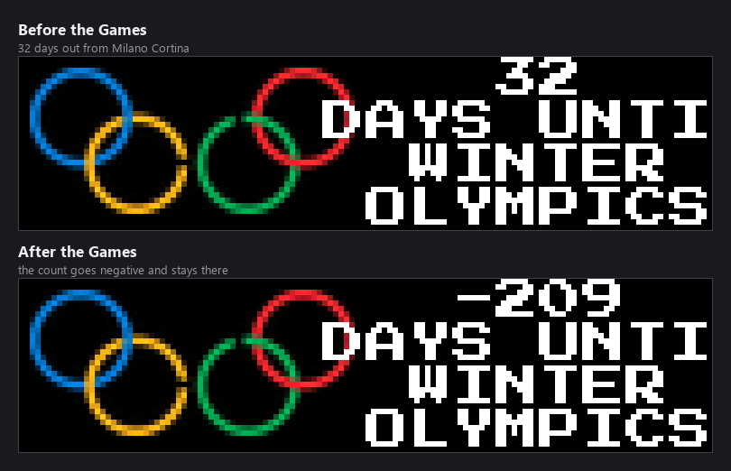
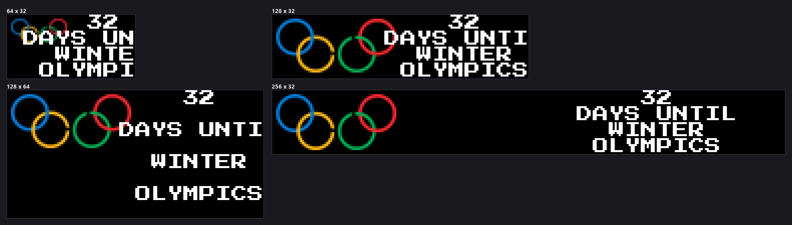

-----------------------------------------------------------------------------------
### Connect with ChuckBuilds

- Show support on Youtube: https://www.youtube.com/@ChuckBuilds
- Stay in touch on Instagram: https://www.instagram.com/ChuckBuilds/
- Want to chat or need support? Reach out on the ChuckBuilds Discord: https://discord.com/invite/uW36dVAtcT
- Feeling Generous? Support the project:
  - Github Sponsorship: https://github.com/sponsors/ChuckBuilds
  - Buy Me a Coffee: https://buymeacoffee.com/chuckbuilds
  - Ko-fi: https://ko-fi.com/chuckbuilds/ 

-----------------------------------------------------------------------------------

# Olympics Countdown Plugin


*Every image in this README is real plugin output, rendered at the true panel
size with the clock pinned, so it reproduces exactly — including the clipped
`DAYS UNTI` described under [Known problems](#known-problems).*

A LEDMatrix plugin that displays a countdown to the next Olympics (summer or winter) with an Olympics logo. Once the Olympics starts, it automatically switches to countdown to the closing ceremony.

Screenshot Preview:


## Features

- **Automatic Olympics Detection**: Automatically determines the next Olympics (summer or winter)
- **Dynamic Countdown**: 
  - Before Olympics: Countdown to opening ceremony
  - During Olympics: Countdown to closing ceremony
- **Olympics Logo**: Displays Olympics logo (image or programmatically drawn Olympic rings)
- **Adaptive Text Display**: Automatically adjusts text size and layout for different display sizes
- **Multiple Olympics Support**: Includes dates for upcoming Olympics through 2032

## Installation

### From Plugin Store (Recommended)

1. Open the LEDMatrix web interface (`http://your-pi-ip:5000`)
2. Open the **Plugin Manager** tab
3. Find **Olympics Countdown** in the **Plugin Store** section and click
   **Install**

### Manual Installation

1. Copy the plugin from the monorepo:
   ```bash
   cp -r ledmatrix-plugins/plugins/olympics /path/to/LEDMatrix/plugin-repos/
   ```

2. Enable the plugin in `config/config.json`:
   ```json
   {
     "olympics": {
       "enabled": true,
       "display_duration": 15
     }
   }
   ```

## Configuration

Settings live in the plugin's tab in the web UI and in `config/config.json`
under `olympics`. The schema sets `additionalProperties: false`, so a key that
is not listed below will be **rejected**, not ignored. The full schema is
[`config_schema.json`](config_schema.json).

### Basics

| Key | Default | Notes |
|---|---|---|
| `enabled` | `false` | Enable or disable the Olympics plugin. |
| `display_duration` | `30` | How long to display the plugin in seconds (switch mode) (5–300). |
| `update_interval` | `300` | How often to fetch fresh data in seconds (default: 5 minutes) (60–3600). |
| `timezone` | `"UTC"` | Timezone for event times (IANA format, e.g., 'America/New_York'). |
| `section_duration` | `10` | How long to show each section (medals, events, results) in switch mode (3–60). |
| `vegas_mode` | `"scroll"` | Vegas display mode: scroll (continuous), fixed (static block), static (pauses scroll) — one of `scroll`, `fixed`, `static`. |
| `text_color` | `[255, 255, 255]` | RGB color for text [R, G, B] (default: white). |

### Which sections appear

| Key | Default | Notes |
|---|---|---|
| `show_medals` | `true` | Show medal count section. |
| `show_schedule` | `true` | Show upcoming events section. |
| `show_results` | `true` | Show recent results section. |
| `medal_race_enabled` | `true` | Enable medal race comparison between countries. |
| `live_alerts_enabled` | `true` | Enable priority alerts for live medal events. |

### What goes in them

| Key | Default | Notes |
|---|---|---|
| `top_countries_count` | `5` | Number of top countries to display by medal count (1–20). |
| `additional_countries` | *(empty)* | Country codes to always show (ISO 3166-1 alpha-3, e.g., ['USA', 'CAN']). |
| `rival_countries` | *(empty)* | Rival countries for medal race comparison. |
| `sport_filters` | *(empty)* | Filter events to specific sports (empty = all sports). |
| `upcoming_events_count` | `5` | Maximum number of upcoming events to display (1–20). |
| `recent_results_count` | `5` | Maximum number of recent results to display (1–20). |

### Notifications

| Key | Default | Notes |
|---|---|---|
| `notifications_enabled` | `false` | Enable webhook notifications for medal wins, records, and live finals. |
| `favorite_countries` | *(empty)* | Countries to receive notifications for (ISO 3166-1 alpha-3, e.g., ['USA', 'CAN']). |
| `webhooks` | *(empty)* | Webhook endpoints for notifications. |

### Settings that do nothing

These four are in the schema and in the web UI form, but no code in the plugin
reads them. Changing them has no effect.

| Key | Default | Notes |
|---|---|---|
| `transition.type` | `"redraw"` | Not implemented. The schema offers `redraw`, `fade`, `slide`, `wipe`, `dissolve` and `pixelate`; none of them do anything. |
| `transition.speed` | `2` | Not implemented. |
| `transition.enabled` | `true` | Not implemented. |
| `high_performance_transitions` | `false` | Not implemented. |

The LEDMatrix core implements no display transitions, and four other plugins
declare the same dead block — tracked in
[issue #381](https://github.com/ChuckBuilds/ledmatrix-plugins/issues/381).


### Example

```json
{
  "olympics": {
    "enabled": true,
    "display_duration": 30,
    "top_countries_count": 5,
    "rival_countries": ["USA", "CHN"],
    "sport_filters": ["Alpine Skiing", "Figure Skating"]
  }
}
```

## Known problems

Two defects on the countdown screen, tracked in
[issue #410](https://github.com/ChuckBuilds/ledmatrix-plugins/issues/410).

**The countdown is currently negative.** The plugin carries one hardcoded
Games — Milano Cortina, opening 6 February 2026 — and the day count is a plain
difference with no floor and nothing to roll on to. Since those Games closed,
every install has been counting down past zero:



**`DAYS UNTIL` is clipped below 256px.** The lines are centred in the right
half of the panel, and at the default font the label is wider than that half,
so it loses its last characters. Only a 256-wide panel fits it:



At 64x32 the text also overlaps the rings.

This is not a subtle clip: `check_plugin.py` fails six of its eight panel
sizes on it, and the two that pass are the 256-wide ones.

```
[FAIL]   64x32  olympics overflow bbox=(64, 8, 87, 31)
[FAIL]  128x32  olympics overflow bbox=(129, 8, 135, 15)
[PASS]  256x32  olympics
[PASS] 256x128  olympics
```

## Display Behavior

### Countdown Display

- **Before Olympics**: Shows "N DAYS UNTIL [SUMMER/WINTER] OLYMPICS"
- **During Olympics**: Shows "N DAYS UNTIL CLOSING"
- **On Opening Day**: Shows "OLYMPICS OPENING TODAY"
- **On Closing Day**: Shows "OLYMPICS CLOSING TODAY"

### Layout

- Olympics logo is displayed on the left half of the display
- Countdown text is displayed on the right half, stacked vertically
- Layout automatically adjusts for different display sizes

### Supported Olympics

The plugin includes dates for:
- **Winter Olympics 2026**: Milan-Cortina (Feb 6-22, 2026)
- **Summer Olympics 2028**: Los Angeles (July 14-30, 2028)
- **Winter Olympics 2030**: TBD (placeholder dates)
- **Summer Olympics 2032**: Brisbane (July 23 - Aug 8, 2032)

## Assets

The plugin will look for an Olympics logo image in the following locations:
- `olympics-logo.png`
- `olympics logo.png`
- `olympics-icon.png`
- `logo.png`
- `assets/olympics-logo.png`
- `assets/logo.png`

If no image is found, the plugin will automatically draw the Olympic rings programmatically as a fallback.

**Note**: You can provide your own Olympics logo image by placing it in the plugin directory with one of the names above.

## Dependencies

- Python 3.7+
- PIL/Pillow (for image handling)
- LEDMatrix 2.0.0 or higher

No additional Python packages are required beyond what LEDMatrix provides.

## Troubleshooting

### Logo Image Not Displaying

If the logo image doesn't appear:
1. Check that the image file exists in the plugin directory with one of the supported names
2. The plugin will automatically fall back to programmatic Olympic rings if the image is missing
3. Verify file permissions allow reading the image file

### Countdown Not Updating

- The countdown updates based on `update_interval` (default: 1 hour)
- The countdown changes once per day, so hourly updates are sufficient
- Check the plugin logs for any errors

### Text Not Fitting

- The plugin automatically adjusts text size and layout based on display dimensions
- There is no `logo_size` setting. Earlier versions of this README suggested
  reducing one; the schema has no such key and sets `additionalProperties:
  false`, so adding it makes the configuration invalid. The label clipping is
  [issue #410](https://github.com/ChuckBuilds/ledmatrix-plugins/issues/410),
  and a 256-wide panel is the only current workaround
- The plugin automatically adjusts layout based on display dimensions

## Development

### Project Structure

```
olympics/
├── manifest.json          # Plugin metadata
├── manager.py             # Main plugin class
├── config_schema.json     # Configuration schema
├── README.md             # This file
├── requirements.txt      # Python dependencies
└── assets/               # Optional: Olympics logo image
    └── olympics-logo.png
```

### Testing

Test the plugin using the LEDMatrix emulator:
```bash
python run.py --emulator
```

## License

This plugin follows the same license as the LEDMatrix project.

## Author

ChuckBuilds

## Version

1.0.0

