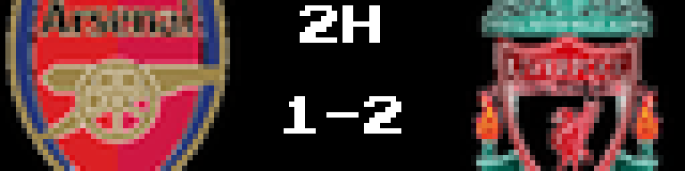
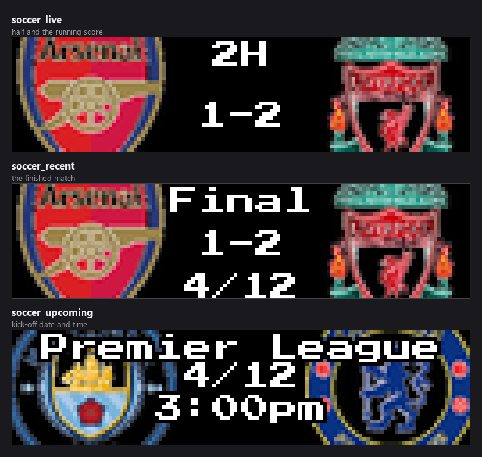
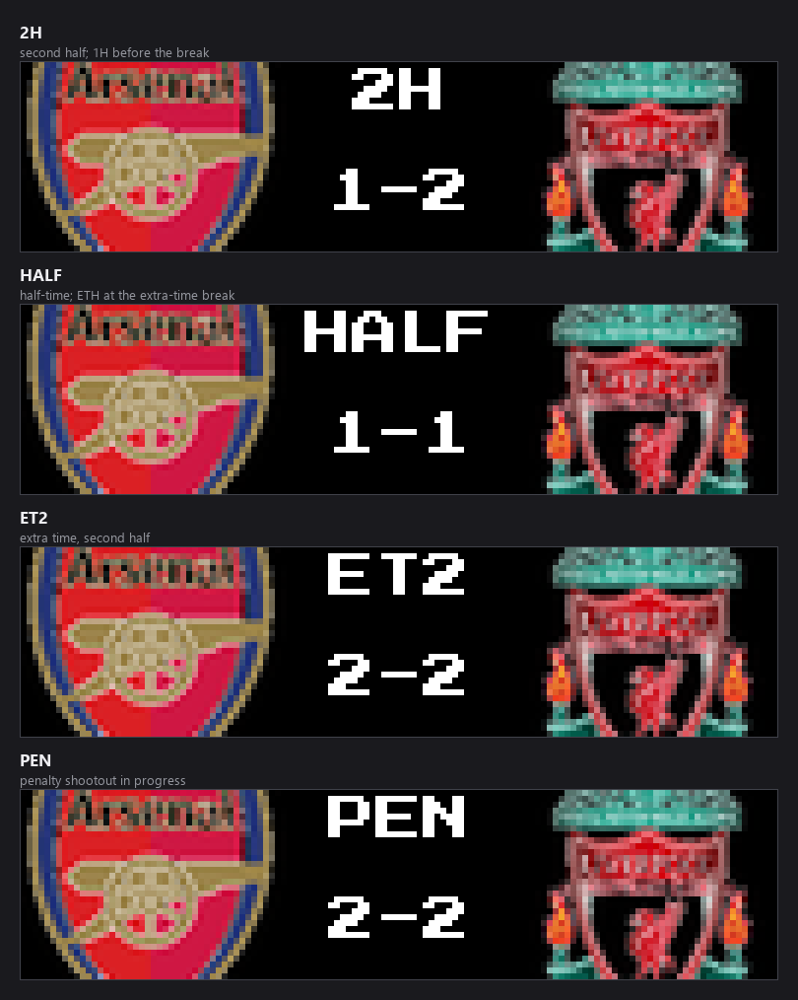
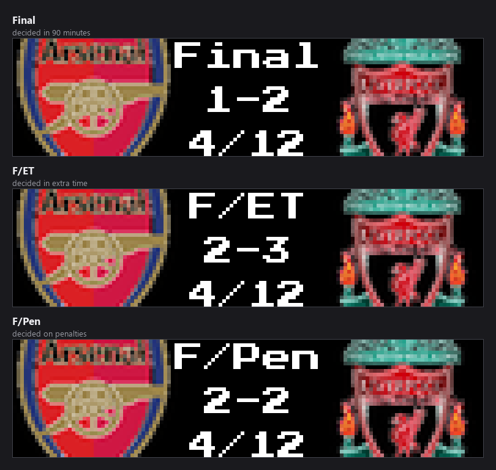
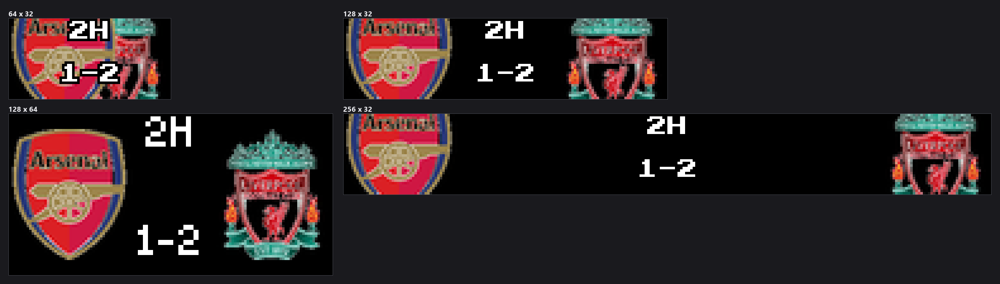
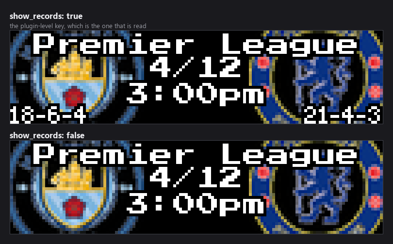

### Connect with ChuckBuilds

- Show support on YouTube: https://www.youtube.com/@ChuckBuilds
- Stay in touch on Instagram: https://www.instagram.com/ChuckBuilds/
- Want to chat or need support? Reach out on the ChuckBuilds Discord: https://discord.com/invite/uW36dVAtcT
- Feeling generous? Support the project:
  - GitHub Sponsors: https://github.com/sponsors/ChuckBuilds
  - Buy Me a Coffee: https://buymeacoffee.com/chuckbuilds
  - Ko-fi: https://ko-fi.com/chuckbuilds/

---

# Soccer Scoreboard

Live, recent, and upcoming soccer on your LEDMatrix display — ten leagues built
in, and any other league ESPN covers can be added. From ESPN's public API, no
API key required.



## Contents

- [Quick start](#quick-start)
- [Display modes](#display-modes)
- [Match states](#match-states)
- [Supported leagues](#supported-leagues)
- [Adding another league](#adding-another-league)
- [FIFA World Cup](#fifa-world-cup)
- [Team abbreviations](#team-abbreviations)
- [How games are chosen](#how-games-are-chosen)
- [Panel sizes](#panel-sizes)
- [Settings reference](#settings-reference)
- [Per-league settings](#per-league-settings)
- [Matchup separator and the upcoming card middle](#matchup-separator-and-the-upcoming-card-middle)
- [Fonts, colours and layout](#fonts-colours-and-layout)
- [Favorite team result colours](#favorite-team-result-colours)
- [Vegas ticker: seeing live games more often](#vegas-ticker-seeing-live-games-more-often)
- [Installation](#installation)
- [Troubleshooting](#troubleshooting)

## Quick start

1. Install **Soccer Scoreboard** from the LEDMatrix Plugin Store.
2. Turn on `enabled`, then the leagues you want. The seven domestic leagues are
   on by default; the two UEFA competitions and the World Cup are off.
3. Add your clubs under each league's **Favorite Teams**, using ESPN
   abbreviations.

```json
{
  "soccer-scoreboard": {
    "enabled": true,
    "show_records": true,
    "leagues": {
      "eng.1": {
        "enabled": true,
        "favorite_teams": ["LIV", "MCI", "ARS"],
        "filtering": { "show_favorite_teams_only": false },
        "game_limits": {
          "recent_games_to_show": 2,
          "upcoming_games_to_show": 3
        }
      },
      "esp.1": {
        "enabled": true,
        "favorite_teams": ["RMA", "BAR"]
      }
    }
  }
}
```

## Display modes

Like the other multi-league scoreboards, soccer registers **three modes per
league**, named `soccer_<league>_<type>`, where `<league>` is the ESPN league
code:



| Mode | Shows |
|---|---|
| `soccer_<league>_live` | That league's matches in progress |
| `soccer_<league>_recent` | That league's recently finished matches |
| `soccer_<league>_upcoming` | That league's scheduled matches |

The manifest declares the 30 modes for the ten built-in leagues, and those are
the names to use in `display.plugin_rotation_order` or an on-demand request:

| League | Modes |
|---|---|
| Premier League | `soccer_eng.1_live`, `soccer_eng.1_recent`, `soccer_eng.1_upcoming` |
| La Liga | `soccer_esp.1_live`, `soccer_esp.1_recent`, `soccer_esp.1_upcoming` |
| Bundesliga | `soccer_ger.1_live`, `soccer_ger.1_recent`, `soccer_ger.1_upcoming` |
| Serie A | `soccer_ita.1_live`, `soccer_ita.1_recent`, `soccer_ita.1_upcoming` |
| Ligue 1 | `soccer_fra.1_live`, `soccer_fra.1_recent`, `soccer_fra.1_upcoming` |
| Liga Portugal | `soccer_por.1_live`, `soccer_por.1_recent`, `soccer_por.1_upcoming` |
| MLS | `soccer_usa.1_live`, `soccer_usa.1_recent`, `soccer_usa.1_upcoming` |
| Champions League | `soccer_uefa.champions_live`, `soccer_uefa.champions_recent`, `soccer_uefa.champions_upcoming` |
| Europa League | `soccer_uefa.europa_live`, `soccer_uefa.europa_recent`, `soccer_uefa.europa_upcoming` |
| FIFA World Cup | `soccer_fifa.world_live`, `soccer_fifa.world_recent`, `soccer_fifa.world_upcoming` |

Only enabled leagues, and only the mode types switched on for them, are
registered at runtime. A league added under `custom_leagues` registers
`soccer_<code>_live` / `_recent` / `_upcoming` the same way, but it is not in
the manifest, because its code is not known ahead of time.

The old generic names `soccer_live`, `soccer_recent` and `soccer_upcoming` are
no longer registered. The plugin still has a branch that accepts them and pools
every enabled league, but LEDMatrix only sends registered mode names, so they
cannot be selected; use the per-league names above.

Each mode renders as **switch** (one match at a time, timed) or **scroll** (all
matches scroll horizontally at high FPS), set per league and per mode with
`leagues.<slug>.display_modes.<mode>_display_mode`.

The mode toggles are named `live`, `recent`, `upcoming` — no `show_` prefix,
unlike the football and basketball scoreboards.

## Match states

Soccer has the richest status model of any scoreboard here, because a knockout
tie can run past 90 minutes and finish on penalties. The status area shows:



| While live | Meaning |
|---|---|
| `1H` / `2H` | First or second half |
| `HALF` | Half-time |
| `ET1` / `ET2` | Extra time, first or second half |
| `ETH` | Half-time of extra time |
| `PEN` | Penalty shootout in progress |



| Once finished | Meaning |
|---|---|
| `Final` | Decided inside 90 minutes |
| `F/ET` | Decided in extra time |
| `F/Pen` | Decided on penalties |

No configuration is involved — the state comes from the feed.

## Supported leagues

Ten leagues are built in, each with its own config block under `leagues`:

| Slug | League | Enabled by default |
|---|---|---|
| `eng.1` | Premier League (England) | Yes |
| `esp.1` | La Liga (Spain) | Yes |
| `ger.1` | Bundesliga (Germany) | Yes |
| `ita.1` | Serie A (Italy) | Yes |
| `fra.1` | Ligue 1 (France) | Yes |
| `usa.1` | MLS (USA) | Yes |
| `por.1` | Liga Portugal | Yes |
| `uefa.champions` | UEFA Champions League | No |
| `uefa.europa` | UEFA Europa League | No |
| `fifa.world` | FIFA World Cup | No |

**`enabled` is the only setting whose default differs between them** — all ten
blocks are otherwise identical, with the same 53 settings each. Everything under
[Per-league settings](#per-league-settings) applies to all ten.

## Adding another league

Any other league ESPN covers can be added under **Add More Leagues**
(`custom_leagues`). Click **Add Item**, then fill in **both** a display name and
the ESPN league code — a row with a blank name will not save.

| Field | Type | Default | What it does |
|---|---|---|---|
| `custom_leagues[].name` | string, 1–100 chars | — | Display name, e.g. `Liga MX`. |
| `custom_leagues[].league_code` | string, 1–50 chars | — | ESPN code, lowercase and dot-separated, e.g. `mex.1`. |
| `custom_leagues[].priority` | 1–100 or `null` | `50` | Display order; lower shows first. |

Common codes:

| Code | League |
|---|---|
| `eng.2` | English Championship |
| `eng.3` | English League One |
| `eng.fa` | FA Cup |
| `eng.league_cup` | EFL (Carabao) Cup |
| `mex.1` | Liga MX |
| `arg.1` | Argentine Primera División |
| `bra.1` | Brasileirão Série A |
| `ned.1` | Eredivisie |
| `sco.1` | Scottish Premiership |
| `tur.1` | Turkish Süper Lig |
| `bel.1` | Belgian Pro League |
| `conmebol.libertadores` | Copa Libertadores |

Codes are exactly as they appear in ESPN's own URLs
(`espn.com/soccer/scoreboard/_/league/eng.2`). Per-league favorites, durations,
and display modes live behind the settings button on the league's row.

## FIFA World Cup

Enable the **FIFA World Cup** league (`fifa.world`) to track World Cup 2026
(June 11 – July 19, USA/Canada/Mexico).

- **To follow every match:** enable `fifa.world` and leave
  `filtering.show_favorite_teams_only` off.
- **To follow one country:** enable `fifa.world`, set `favorite_teams` to that
  country's ESPN abbreviation (`USA`, `ENG`, `BRA`), and turn
  `filtering.show_favorite_teams_only` on.

Knockout ties use the extra-time and penalty states in
[Match states](#match-states).

## Team abbreviations

`favorite_teams` takes the **ESPN API abbreviation** for each club (`"LIV"`,
`"MCI"`). Full club names are not accepted.

See **[TEAMS.md](TEAMS.md)** for a complete list across all supported leagues.

```json
"favorite_teams": ["LIV", "MCI", "ARS"]
```

> If you are unsure of an abbreviation, enable debug logging — the plugin logs
> `home_abbr` and `away_abbr` for every match it processes.

## How games are chosen

**`upcoming_games_to_show` is not "how many cards you see".** It is the size of
a *pool*. The panel cycles through that pool one card at a time and keeps its
place between visits, so a pool of 3 means the board rotates through the same 3
matches until the schedule moves on. A bigger number gives you a *longer lap*,
so any one match comes round **less** often.

Which regime you are in depends on that league's `favorite_teams` and
`filtering.show_favorite_teams_only`:

| `favorite_teams` | `show_favorite_teams_only` | What you get |
|---|---|---|
| empty | either | The next N matches league-wide, chronologically. Every match is a non-favorite match, so the `other_*` filters apply to all of them. |
| set | **on** (default) | Only your clubs. The limit is a budget **per team**. |
| set | **off** | **Your clubs first, then other matches to fill.** Both limits are **totals**. |

### The selection settings

Per league, under `game_limits`:

| Option | Default | Description |
|---|---|---|
| `recent_games_to_show` | `1` | Pool size for finished matches. |
| `upcoming_games_to_show` | `1` | The same for scheduled matches. |
| `other_recent_games_to_show` | `1` | How many **non-favorite** finished matches to add. `0` gives favorites only. |
| `other_upcoming_games_to_show` | `1` | The same for scheduled matches. |
| `other_rotation_interval_seconds` | `1800` | How often the non-favorite slice advances. `0` pins it. |
| `favorite_rotation_boost` | `1` | Number of turns each favorite team's recent/upcoming game gets for every 1 turn other games get in switch mode. `1` shows each game once. |
| `other_games_min_quality` | `ranked` | Which non-favorite matches qualify: `any` or `ranked`. **Hidden from the config form since 2.32.0 (still declared).** |
| `other_games_divisions` | `["fbs"]` | Which divisions non-favorite matches may come from. **Hidden from the config form since 2.32.0 (still declared).** |

The same eight keys also exist at the **plugin level**. The web UI saves a value
into both places, so each copy is only taken as a choice when it differs from its
default: a league value you changed wins, then a plugin-level value you changed
(applied to every league left at its default), then the league's own value.

**Your favorite clubs are never filtered by the last two.** Those settings only
decide what fills the *remaining* slots.

> **Both are inert in soccer.** `ranked` needs a national poll and the division
> filter needs ESPN's FBS/FCS group rosters — a college *football* taxonomy — so
> every match passes both and neither costs a request.

### Variety comes from turnover

Rather than widening the pool, the non-favorite slice **moves**: the window
advances by its own width every `other_rotation_interval_seconds`, so
consecutive windows do not overlap and the board works through the schedule
instead of resampling the front of it. Your favorites are not rotated — for
upcoming matches the soonest ones are the point.

Both filters **fail open**: if the data behind them cannot be fetched, the match
is allowed through. They fail open a second time as a set — if the filters
between them leave nothing at all, the unfiltered list is used instead. Setting
`other_upcoming_games_to_show` or `other_recent_games_to_show` to `0` is the one
way to ask for an empty slate, and that is honoured.

### Live rotation and celebrations

When several matches are live at once the rotation is weighted: a match
involving one of your clubs gets `filtering.favorite_live_boost` turns for every
one turn other live matches get, and is queued first whenever the rotation
refreshes. It never interrupts a match already on screen. Set it to `1` for even
rotation, and note it is independent of `live_priority`, which controls whether
live matches preempt the recent/upcoming rotation at all.

When a favorite club scores or wins a live match, the scorebug gives way to a
full-screen celebration — `celebration_enabled` (default on),
`celebration_duration` (default 8s), and `celebrate_opponent_goals` (default
off).

A live match the API stops reporting for `stale_game_timeout` seconds is
dropped, so an abandoned match does not sit on the board forever.

### Shorter dwell for non-favorite live matches

`non_favorite_live_game_duration` (0–120, default `0` = off) gives live matches
involving **none** of your clubs a shorter turn. It only takes effect when
favorite teams are configured **and** non-favorite live matches are being shown
— `filtering.show_favorite_teams_only` off, or `filtering.show_all_live` on:

| Favorites set? | Non-favorite matches shown? | Match has a favorite? | Duration used |
|---|---|---|---|
| No | — | — | `live_game_duration` |
| Yes | No | favorite | `live_game_duration` |
| Yes | Yes | favorite | `live_game_duration` |
| Yes | Yes | none | `non_favorite_live_game_duration`, when above `0` |

`exclude_teams` hides clubs from **both** the live rotation and the
recent/final scores — useful when watching a match delayed. It always wins when
a club appears in both lists.

## Panel sizes



The plugin passes the render-safety harness on all eight supported sizes. At
64x32 the two crests and the centre column share very little room; 128x32 or
wider is a much better fit.

## Settings reference

Settings marked **Advanced** sit behind the *Advanced* toggle in the web UI.
Defaults are the schema defaults, which is what the web UI writes.

### Plugin level

| Key | Type | Default | What it does |
|---|---|---|---|
| `enabled` | boolean | `false` | Master on/off switch for the whole plugin. |
| `display_duration` | 5–60 s | `15` | Per-game on-screen time. |
| `game_display_duration` | 3–60 s | `15` | **Advanced.** Per-match time within a mode, where the league does not override it. |
| `live_game_duration` | 10–120 s | `30` | **Advanced.** Per-match time for live matches, where the league does not override it. |
| `show_records` | boolean | `false` | Draw win-draw-loss records in the bottom corners. |
| `show_ranking` | boolean | `false` | Draw table positions where available. **Hidden from the config form since 2.32.0 (still declared) — the empty rank badge also replaced the record.** |
| `show_odds` | boolean | `true` | Draw betting odds. |
| `show_favorite_teams_only` | boolean | `true` | Show only your clubs' matches, where the league does not override it. |
| `recent_games_to_show` | 1–20 | `1` | Pool size for finished matches, where the league does not override it. |
| `upcoming_games_to_show` | 1–20 | `1` | The same for scheduled matches. |
| `other_recent_games_to_show` | 0–20 | `1` | **Advanced.** Non-favorite finished matches to add. |
| `other_upcoming_games_to_show` | 0–20 | `1` | **Advanced.** The same for scheduled matches. |
| `other_rotation_interval_seconds` | 0–86400 s | `1800` | **Advanced.** How often the non-favorite slice advances. |
| `favorite_rotation_boost` | 1–5 | `1` | **Advanced.** Number of turns each favorite team's recent/upcoming game gets for every 1 turn other games get in switch mode. `1` shows each game once. |
| `other_games_min_quality` | `any` \| `ranked` | `ranked` | **Advanced.** Inert in soccer — see above. **Hidden from the config form since 2.32.0 (still declared).** |
| `other_games_divisions` | array | `["fbs"]` | **Advanced.** Inert in soccer — see above. **Hidden from the config form since 2.32.0 (still declared).** |
| `update_interval_seconds` | 30–86400 s | `3600` | **Advanced.** Base data refresh cadence. |
| `live_update_interval` | 10–300 s | `30` | **Advanced.** Refresh cadence while a match is live. |
| `recent_update_interval` | 60–86400 s | `3600` | **Advanced.** Refresh cadence for finished matches. |
| `upcoming_update_interval` | 60–86400 s | `3600` | **Advanced.** Refresh cadence for the schedule. |
| `stale_game_timeout` | 60–3600 s | `300` | **Advanced.** Drop a live match the API has stopped updating. |
| `schedule_lookback_days` | 1–60 | `14` | **Advanced.** How far back to fetch for the Recent screen. |
| `schedule_lookahead_days` | 1–60 | `14` | **Advanced.** How far ahead to fetch for Upcoming. A fixture beyond this horizon is never fetched. |
| `no_data_interval_seconds` | 5–86400 s | `300` | **Advanced.** Wait between live checks when nothing is live. Backs off further the longer nothing is found. |
| `live_idle_max_interval_seconds` | 5–86400 s | `900` | **Advanced.** Ceiling for that back-off. Useful out of season. |
| `timezone` | string | `""` | **Advanced.** IANA zone for kick-off times, e.g. `Europe/London`. Blank follows the LEDMatrix global timezone, then the host system's, then UTC. |



> **The display toggles, update intervals, `live_game_duration` and
> `show_favorite_teams_only` here are also per-league settings.** Every league
> block declares the same keys, and the web UI writes the schema default into
> each of them, so a copy still at its default is not taken as a choice. A
> league value you changed wins; otherwise a plugin-level value you changed
> applies to that league; otherwise the league's own value stands. Each copy is
> compared with its own default, so the plugin-level `live_game_duration` of 30
> does not override a league's 20. This matches afl- and nrl-scoreboard.

### Background service

All **Advanced**; the defaults suit a Pi and rarely want changing.

| Key | Type | Default |
|---|---|---|
| `background_service.enabled` | boolean | `true` |
| `background_service.max_workers` | 1–10 | `1` |
| `background_service.request_timeout` | 5–120 s | `30` |
| `background_service.max_retries` | 1–10 | `3` |
| `background_service.priority` | 1–5 | `2` |

## Per-league settings

Every table below exists ten times, once per slug under `leagues`, with
identical keys and defaults except `enabled`. `<league>` stands for any slug —
`leagues.eng.1`, `leagues.esp.1`, and so on.

### Teams and priority

| Key | Type | Default | What it does |
|---|---|---|---|
| `<league>.enabled` | boolean | see [Supported leagues](#supported-leagues) | Build this league's managers at all. |
| `<league>.favorite_teams` | array | `[]` | Clubs to prioritise, by ESPN abbreviation. |
| `<league>.exclude_teams` | array | `[]` | Clubs to always hide, from the live rotation and from finals alike. Takes precedence over `favorite_teams` and `show_all_live`. |
| `<league>.live_priority` | boolean | `true` | Let this league's live matches interrupt the rotation and display immediately. |

### Display modes

| Key | Type | Default |
|---|---|---|
| `<league>.display_modes.live` | boolean | `true` |
| `<league>.display_modes.recent` | boolean | `true` |
| `<league>.display_modes.upcoming` | boolean | `true` |
| `<league>.display_modes.live_display_mode` | `switch` \| `scroll` | `switch` |
| `<league>.display_modes.recent_display_mode` | `switch` \| `scroll` | `switch` |
| `<league>.display_modes.upcoming_display_mode` | `switch` \| `scroll` | `switch` |

### Filtering

| Key | Type | Default | What it does |
|---|---|---|---|
| `<league>.filtering.show_favorite_teams_only` | boolean | `true` | Show only your clubs' matches. |
| `<league>.filtering.show_all_live` | boolean | `false` | Show every live match regardless of favorites. `exclude_teams` still applies. |
| `<league>.filtering.favorite_live_boost` | 1–5 | `2` | Turns a favorite's live match gets per one turn for other live matches. `1` is even rotation. |

### Game limits

See [The selection settings](#the-selection-settings).

| Key | Type | Default |
|---|---|---|
| `<league>.game_limits.recent_games_to_show` | 1–20 | `1` |
| `<league>.game_limits.upcoming_games_to_show` | 1–20 | `1` |
| `<league>.game_limits.other_recent_games_to_show` | 0–20 | `1` |
| `<league>.game_limits.other_upcoming_games_to_show` | 0–20 | `1` |
| `<league>.game_limits.other_rotation_interval_seconds` | 0–86400 s | `1800` |
| `<league>.game_limits.favorite_rotation_boost` | 1–5 | `1` |
| `<league>.game_limits.other_games_min_quality` | `any` \| `ranked` | `ranked`. **Hidden from the config form since 2.32.0 (still declared).** |
| `<league>.game_limits.other_games_divisions` | array | `["fbs"]`. **Hidden from the config form since 2.32.0 (still declared).** |

### Durations

| Key | Type | Default | What it does |
|---|---|---|---|
| `<league>.live_game_duration` | number | `20` | Per-match time for live matches. Applies to matches with a favorite when a non-favorite duration is set. |
| `<league>.non_favorite_live_game_duration` | number | `0` | Shorter turn for live matches with no favorite. `0` means use `live_game_duration` for everything. |
| `<league>.recent_game_duration` | number | `15` | Per-match time on the Recent screen. |
| `<league>.upcoming_game_duration` | number | `15` | Per-match time on the Upcoming screen. |

### Update intervals

| Key | Type | Default | What it does |
|---|---|---|---|
| `<league>.update_interval_seconds` | number | `3600` | This league's base fetch cadence. |
| `<league>.live_update_interval` | number | `30` | How often live match data refreshes. |
| `<league>.recent_update_interval` | number | `3600` | How often the finished-matches list is rebuilt. This also sets how soon a match that has just ended can appear. |
| `<league>.upcoming_update_interval` | number | `3600` | How often the upcoming-matches list is rebuilt. Selection and the non-favorite rotation both run on the display side, so this governs only the fetch. |
| `<league>.stale_game_timeout` | number | `300` | Drop a live match the API has stopped updating. |

### Celebrations

| Key | Type | Default |
|---|---|---|
| `<league>.celebration_enabled` | boolean | `true` |
| `<league>.celebration_duration` | number | `8` |
| `<league>.celebrate_opponent_goals` | boolean | `false` |
| `<league>.celebration_team_colors` | boolean | `true` |
| `<league>.celebration_confetti` | boolean | `true` |

The takeover is drawn in the **scoring team's own colours**, read from that
team's logo: a team-coloured gradient behind the screen, the opposing crest
dimmed so the team that scored reads at a glance, confetti in the team's
colours, and the scoring side's digits glowing. A winner gets a sunburst behind
the banner. Turn the colours off with `celebration_team_colors: false` for a
fixed navy and amber, and the confetti off on its own with
`celebration_confetti: false`.

Every frame is a finished screen rather than a step of an animation, because
unless a league is in `scroll` mode the core redraws this plugin about once a
second and any single frame may be the only one anyone sees. When a goal
arrives while another plugin is on screen the plugin asks the core for its
high-FPS loop, and the confetti and the glow run smoothly.

### Display options

| Key | Type | Default |
|---|---|---|
| `<league>.display_options.show_records` | boolean | `false` |
| `<league>.display_options.show_ranking` | boolean | `false`. **Hidden from the config form since 2.32.0 (still declared) — the empty rank badge also replaced the record.** |
| `<league>.display_options.show_odds` | boolean | `true` |

> **A value changed here wins over the plugin-level key of the same name**,
> which applies to any league left at its default. See the note under
> [Plugin level](#plugin-level).

### Mode durations

How long the *whole mode* holds the board before the core rotates on. `null`
uses the dynamic calculation.

| Key | Type | Default |
|---|---|---|
| `<league>.mode_durations.live_mode_duration` | 10–600 s or `null` | `null` |
| `<league>.mode_durations.recent_mode_duration` | 10–600 s or `null` | `null` |
| `<league>.mode_durations.upcoming_mode_duration` | 10–600 s or `null` | `null` |

### Dynamic duration

Sizes each mode's total time from how much there is to show.

| Key | Type | Default |
|---|---|---|
| `<league>.dynamic_duration.enabled` | boolean | `false` |
| `<league>.dynamic_duration.min_duration_seconds` | 10–300 s | `30` |
| `<league>.dynamic_duration.max_duration_seconds` | 60–600 s | — |
| `<league>.dynamic_duration.modes.live.enabled` | boolean | `false` |
| `<league>.dynamic_duration.modes.live.max_duration_seconds` | 60–600 s | — |
| `<league>.dynamic_duration.modes.recent.enabled` | boolean | `false` |
| `<league>.dynamic_duration.modes.recent.max_duration_seconds` | 60–600 s | — |
| `<league>.dynamic_duration.modes.upcoming.enabled` | boolean | `false` |
| `<league>.dynamic_duration.modes.upcoming.max_duration_seconds` | 60–600 s | — |

### Scroll settings

The per-league `<league>.scroll_settings` block is retired as of 2.27.0. Nothing
ever read it: the core scroll base only looks for `scroll_settings` at the top
level of a league key, and this plugin keeps its leagues under `leagues`. The
scrolling strip is also one surface shared by every league, so a per-league
speed has no single meaning. The strip uses the soccer defaults (50 px/s, a
24 px gap, cards sized from the panel height) and the device-wide scroll
frame rate. The key is still accepted, so configs saved by older versions keep
validating; its values are ignored.

## Matchup separator and the upcoming card middle

The **Matchup Card Layout** section (`scroll_card`) controls what sits between
the two crests before a match starts, and how the date and time are written.
Plugin-wide, not per league.

| Setting | Key | Default | What it does |
|---|---|---|---|
| Matchup Separator | `scroll_card.vs_text` | `VS` | Text between the clubs: `VS`, `@`, `at`, `v`. The away side is always on the left, so `@` and `at` read as "away at home". Blank draws nothing. |
| Middle of an Upcoming Card | `scroll_card.upcoming_center` | `vs` | Scroll and Vegas cards: `vs`, `date_time`, or `none`. |
| Middle of a Full-Screen Upcoming Scoreboard | `scroll_card.switch_upcoming_center` | `date_time` | The same choice for the full-screen scoreboard, plus `inherit` to follow the row above. |
| Date Format | `scroll_card.date_format` | `abbrev` | Scroll and Vegas cards: `Sep 19`, `9/19`, `19 Sep`, `19/9`, or `Fri Sep 19`. |
| Full-Screen Date Format | `scroll_card.switch_date_format` | `numeric` | **Advanced.** The same for the full-screen scoreboard, plus `inherit`. It has its own default because the two displays disagree about what is normal. |
| Time Format | `scroll_card.time_format` | `12h` | 12- or 24-hour clock. |
| Show Date / Show Time | `scroll_card.show_date`, `scroll_card.show_time` | `true` | Drop either line. |
| Swap Date and Time | `scroll_card.swap_date_time` | `false` | Flip the two lines. Each display starts from its own order, so this flips rather than forces. |

The centre-gap settings size the scroll and Vegas card's middle strip only — the
full-screen scoreboard pins its crests to the panel edges and is unaffected.

| Key | Type | Default | What it does |
|---|---|---|---|
| `scroll_card.center_gap` | 0–64 px | unset | Pixels kept clear down the middle. Unset scales with card width; `0` restores edge-to-edge logos. |
| `scroll_card.center_gap_ratio` | 0.0–0.6 | `0.28` | **Advanced.** Fraction of card width used when the gap is not pinned. |
| `scroll_card.center_gap_min` | 0–64 px | `22` | **Advanced.** Floor for the scaled gap. |
| `scroll_card.center_gap_max` | 0–96 px | `40` | **Advanced.** Ceiling for the scaled gap. |

## Fonts, colours and layout

Seven text elements, each with `font`, `font_size`, and `text_color`, under
`customization.<element>`.

| Element | Default font | Default size | Draws |
|---|---|---|---|
| `score_text` | `PressStart2P-Regular.ttf` | `10` | The score, and the matchup separator on an upcoming card |
| `period_text` | `PressStart2P-Regular.ttf` | `8` | The half and clock, and the date/time on an upcoming scoreboard |
| `team_name` | `PressStart2P-Regular.ttf` | `8` | Club names and abbreviations |
| `status_text` | `4x6-font.ttf` | `6` | Status lines such as the league name |
| `detail_text` | `4x6-font.ttf` | `6` | Small detail lines |
| `rank_text` | `PressStart2P-Regular.ttf` | `10` | Table positions |
| `odds_text` | `4x6-font.ttf` | `6` | Betting odds (defaults to green, `[0, 255, 0]`) |

Colours are `[r, g, b]` or `"#RRGGBB"`. Every default is white except
`odds_text`. Odds sizes snap to the face's pixel grid to stay crisp:
`4x6-font.ttf` to 7, 14, 21; press_start to 8, 16. Every
`customization.<element>` object sets `additionalProperties: false`.

```json
{
  "customization": {
    "score_text": { "text_color": [255, 200, 0] },
    "status_text": { "text_color": "#00A0FF" }
  }
}
```

### Layout offsets

Nudge any element in pixels. All default to `0`, all under
`customization.layout.<element>`, and all set `additionalProperties: false`.

| Element | Keys | Measured from |
|---|---|---|
| `home_logo`, `away_logo` | `x_offset`, `y_offset` | Default logo position |
| `score` | `x_offset`, `y_offset` | Panel centre |
| `status_text` | `x_offset`, `y_offset` | Centre horizontally, top vertically |
| `date` | `x_offset`, `y_offset` | Centre horizontally, default position vertically |
| `time` | `x_offset`, `y_offset` | Centre horizontally, the date's position vertically |
| `records` | `away_x_offset`, `home_x_offset`, `y_offset` | Away from the left, home from the right, both from the bottom |
| `odds` | `x_offset`, `y_offset` | Default odds position |

## Favorite team result colours

A run of matches against the same opponent is hard to read at a glance: in
scroll and Vegas mode the same two crests go past several times and only the
digits change. Turn this on to colour a finished match's score by how your club
did.

| Key | Type | Default |
|---|---|---|
| `customization.favorite_result_colors.enabled` | boolean | `false` |
| `customization.favorite_result_colors.win_color` | `[r, g, b]` | `[0, 255, 0]` |
| `customization.favorite_result_colors.loss_color` | `[r, g, b]` | `[255, 0, 0]` |
| `customization.favorite_result_colors.tie_color` | `[r, g, b]` | `[255, 200, 0]` |

```json
{
  "customization": {
    "favorite_result_colors": {
      "enabled": true,
      "win_color": [0, 255, 0],
      "loss_color": [255, 0, 0],
      "tie_color": [255, 200, 0]
    }
  }
}
```

- Only finished matches are coloured; live and upcoming cards are untouched.
- A match needs **exactly one** favorite club. Neither side or both, and the
  score keeps its normal colour. A draw uses `tie_color`, which soccer sees far
  more of than the other sports.
- The three colours are Advanced settings.

This tint is applied by the LEDMatrix core rather than by the plugin, which is
why the keys do not appear in this plugin's source.

## Vegas ticker: seeing live games more often

By default a live match **takes over** the display. To keep the marquee
scrolling and still see scores, set this in the **core** config — not in this
plugin's settings:

```json
{
  "display": {
    "vegas_scroll": {
      "live_in_ticker": true,
      "live_weight": 3,
      "favorite_live_weight": 5
    }
  }
}
```

The ticker is otherwise a strict round robin — every plugin appears once per
cycle. These weights let this plugin claim several slots per cycle, spaced
evenly through it. `live_weight` applies whenever this scoreboard has a live
match; `favorite_live_weight` when one of your clubs is playing. That
distinction has to be made here rather than in the core, which can tell *that* a
match is live but not *whose*.

- The weight is per **plugin**, not per match. With four matches live this
  scoreboard still occupies one slot at a time and picks between its own matches
  using `favorite_live_boost`.
- More slots make the cycle **longer**, not faster.

## Installation

From the Plugin Store in the LEDMatrix web UI: open `http://your-pi-ip:5000`, go
to **Plugin Manager**, find **Soccer Scoreboard** under **Plugin Store**, and
click **Install**. Then open the plugin's tab to pick your leagues and clubs.

Match data comes from ESPN's public API. Crests download on first sight and
cache under `assets/sports/soccer_logos/`. The plugin requires the main
LEDMatrix installation and inherits from its soccer base classes.

The documentation images come from `docs/assets/soccer-scoreboard/shots.json`
and re-render with `python scripts/render_docs_assets.py --plugin
soccer-scoreboard --check`.

## Troubleshooting

**Nothing appears.** Check that `enabled` is on and at least one league's own
`enabled` is on. With `filtering.show_favorite_teams_only` at its default of
`true` and no `favorite_teams` set, there is nothing to select from.

**Records, rankings or odds will not turn on.** A per-league
`leagues.<slug>.display_options` value changed from its default wins over the
plugin-level key. Records and rankings default off, so turning them on at the
plugin level reaches every league; odds default on, so a league whose
`show_odds` was switched off keeps them off whatever the plugin-level key says.
Turn it back on for that league.

**A club I follow never shows up.** `favorite_teams` needs the ESPN
abbreviation, not the club name — see [TEAMS.md](TEAMS.md). Enable debug logging
and the plugin prints `home_abbr` and `away_abbr` for every match it processes.

**A custom league will not save.** Both the name and the league code are
required; a row with a blank name is dropped. Codes are lowercase and
dot-separated, exactly as in ESPN's URLs.

**The same few matches keep repeating.** That is the pool cycling. Lower
`other_rotation_interval_seconds` for faster turnover rather than raising the
pool size — a larger pool makes the lap longer, so each match appears less
often, not more.

**Start times look like UTC.** The plugin could not read your global timezone.
Set `timezone` under Advanced Settings to your IANA zone.

**A finished match disappeared too soon.** Raise `schedule_lookback_days`
(default 14), or lower `recent_update_interval` if results are slow to appear.

**A fixture I know about never appears.** It may be beyond
`schedule_lookahead_days` (default 14). A fixture outside that horizon is never
fetched.

## License

See `LICENSE`.
