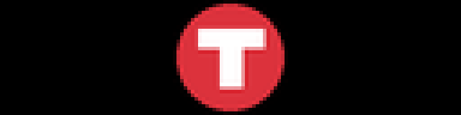

# Static Image

Show your own images on the LED matrix — a logo, a photo, a pixel-art piece.
One image, or a set that rotates, with optional per-image schedules so a
picture only appears at the times you choose.



*Every image in this README is real plugin output, rendered at the true panel
size and then scaled up so the pixels stay pixels. The coloured marks are plain
samples standing in for your own images.*

---

## Table of Contents

1. [What's On Screen](#whats-on-screen)
2. [Installation](#installation)
3. [Quick Start](#quick-start)
4. [Adding Images](#adding-images)
5. [Scaling and Background](#scaling-and-background)
   - [fit_to_display and preserve_aspect_ratio](#fit_to_display-and-preserve_aspect_ratio)
   - [background_color](#background_color)
6. [Rotating Through Several Images](#rotating-through-several-images)
   - [rotation_mode](#rotation_mode)
   - [The two rotation intervals](#the-two-rotation-intervals)
7. [Per-Image Schedules](#per-image-schedules)
8. [Panel Sizes](#panel-sizes)
9. [Troubleshooting](#troubleshooting)
10. [Development](#development)
11. [Support](#support)

---

## What's On Screen

One image at a time, centred on the panel. With several images configured the
plugin cycles through them; with one, it simply shows that one.

Transparent areas of a PNG are filled with `background_color`, which defaults to
black — so on an LED panel a transparent background means those pixels are
simply off.

---

## Installation

**From the Plugin Store (recommended).** Open the LEDMatrix web interface at
`http://<your-pi-ip>:5000`, go to **Plugin Manager**, find **Static Image
Display** in the **Plugin Store** section, and click **Install**. Images are
uploaded from the plugin's own tab.

**Manually.** Copy this directory into your LEDMatrix `plugin-repos/` and
restart the display service.

`enabled` defaults to **`false`**, so nothing appears until you switch the
plugin on.

---

## Quick Start

```json
{
  "static-image": {
    "enabled": true,
    "images": [
      { "id": "logo", "path": "assets/plugins/static-image/logo.png" }
    ]
  }
}
```

Several images on a rotation:

```json
{
  "static-image": {
    "enabled": true,
    "image_config": { "mode": "multiple", "rotation_mode": "sequential" },
    "image_rotation_interval": 15,
    "images": [
      { "id": "logo",   "path": "assets/plugins/static-image/logo.png",   "display_order": 1 },
      { "id": "badge",  "path": "assets/plugins/static-image/badge.png",  "display_order": 2 },
      { "id": "banner", "path": "assets/plugins/static-image/banner.png", "display_order": 3 }
    ]
  }
}
```

---

## Adding Images

The `images` array is normally filled by the upload widget in the web UI, which
writes the file and the entry for you. Each entry takes:

| Key | Type | Default | What it does |
|-----|------|---------|--------------|
| `id` | string | *auto* | Unique identifier for the entry |
| `path` | string | — | File path, relative to the project root |
| `display_order` | integer | `0` | Order for sequential rotation; lower goes first |
| `uploaded_at` | string | *auto* | Upload timestamp, set by the UI |
| `schedule` | object | `null` | Optional time window — see [Per-Image Schedules](#per-image-schedules) |

PNG, JPEG and GIF all load; PNG is the sensible choice for anything with sharp
edges or transparency. A still frame is taken from an animated GIF — this
plugin does not animate.

---

## Scaling and Background

| Option | Type | Default | What it does |
|--------|------|---------|--------------|
| `fit_to_display` | boolean | `true` | Scale the image to the panel |
| `preserve_aspect_ratio` | boolean | `true` | Keep proportions while scaling |
| `background_color` | array | `[0, 0, 0]` | Fill for transparent areas, `[R, G, B]` |

### `fit_to_display` and `preserve_aspect_ratio`


- **`fit_to_display: true`** (the default) scales the image to the panel. With
  it off, the image is drawn at its native pixel size — a 192×64 source on a
  128×32 panel shows only the middle of itself.
- **`preserve_aspect_ratio: true`** (the default) keeps proportions, so a wide
  image is letterboxed rather than squashed. Turn it off only when you want the
  image to fill the panel exactly and do not mind the distortion.

The two work together: `preserve_aspect_ratio` has no effect when
`fit_to_display` is off, because nothing is being scaled.

**Design images at your panel's aspect ratio** where you can. A 128×32 panel is
4:1, which is unusually wide — a square logo will only ever use a third of it.

Choosing a format:

| Content | Use | Why |
|---------|-----|-----|
| Logo or icon | PNG with transparency | Sharp edges stay sharp, and the background stays unlit |
| Photograph | JPEG | Much smaller for the same result; transparency is not needed |
| Pixel art | PNG at native resolution | Sized to the panel exactly, no resampling to soften it |

### `background_color`

Transparent pixels in a PNG are filled with this colour.


Black (the default) leaves those pixels unlit, which is what you almost always
want on an LED matrix. A non-black background lights **every** pixel on the
panel — noticeably brighter in a dark room and a real increase in power draw.

---

## Rotating Through Several Images

| Option | Type | Default | What it does |
|--------|------|---------|--------------|
| `image_config.mode` | string | `single` | `single` shows one image; `multiple` rotates |
| `image_config.rotation_mode` | string | `sequential` | How the next image is chosen |
| `rotation_settings.sequential_loop` | boolean | `true` | Return to the first image after the last |
| `rotation_settings.random_seed` | integer / null | `null` | Fixes the random order; `null` uses the clock |
| `image_rotation_interval` | number | `15` | Seconds each image is shown |
| `display_duration` | number | `10` | Seconds the plugin holds the panel per turn |

### `rotation_mode`

| Value | What it does |
|-------|--------------|
| `sequential` | In `display_order`, wrapping at the end when `sequential_loop` is on |
| `random` | A random pick each time. Set `random_seed` for a repeatable order |
| `time_based` | Advances on its own timer — **also needs `rotation_settings.time_intervals.enabled: true`** |
| `date_based` | **Not implemented.** The code is a stub that always returns the first image |

Two of those deserve emphasis:

- **`time_based` needs a second switch.** Setting `rotation_mode: "time_based"`
  alone does nothing; `rotation_settings.time_intervals.enabled` must also be
  `true`, and `interval_seconds` (default `3600`) sets the pace. With the switch
  off, the image never advances.
- **`date_based` does nothing at all.** It is a placeholder in the source —
  selecting it pins the display to the first available image. It is listed here
  because the setting is offered in the UI and silently doing nothing is worse
  than being told.

With `sequential_loop: false` the rotation stops on the last image rather than
wrapping, which is what you want for a sequence with an ending.

### The two rotation intervals

There are two different "how often" settings and they are not alternatives:

| Setting | Default | Applies |
|---------|---------|---------|
| `image_rotation_interval` | `15` | Always. Seconds each image is shown before the next |
| `rotation_settings.time_intervals.interval_seconds` | `3600` | **Only** in `time_based` mode, and only with `time_intervals.enabled` on |

`image_rotation_interval` is the one most people want. It falls back to
`display_duration` if unset, so leaving both alone gives a 10-second dwell.

---

## Per-Image Schedules

Each image can carry a `schedule` object restricting when it is eligible.
Images outside their window are skipped by the rotation entirely.

```json
{
  "id": "open-sign",
  "path": "assets/plugins/static-image/open.png",
  "schedule": {
    "enabled": true,
    "mode": "time_range",
    "start_time": "08:00",
    "end_time": "18:00"
  }
}
```

| Key | Default | What it does |
|-----|---------|--------------|
| `enabled` | `false` | Turn scheduling on for this image. **With it off the schedule is ignored entirely** |
| `mode` | `always` | `always`, `time_range` (same window every day), or `per_day` (a different window per weekday) |
| `start_time` | `"08:00"` | Window opens, `HH:MM` 24-hour |
| `end_time` | `"18:00"` | Window closes, `HH:MM` 24-hour |
| `days` | `null` | Per-weekday windows, used only when `mode` is `per_day` |

The common mistake is setting `mode` and the times but leaving `enabled` at
`false`, which leaves the image always visible.

If every image is scheduled out at once there is nothing eligible to draw, so
keep at least one image unscheduled as a fallback.

---

## Panel Sizes


With `preserve_aspect_ratio` on, a square image is capped by the panel's
*height*, so a longer chain does not make it bigger — it just centres it in
more black. Doubling the height to 128×64 doubles the mark. If you want an
image to use a wide panel, give it a wide source.

---

## Troubleshooting

**Nothing appears.**
`enabled` defaults to `false`. After that, check the `images` array is not
empty and that at least one entry's `path` resolves.

**The image is missing but others show.**
Check the log for a load warning. `path` is relative to the LEDMatrix project
root, not to the plugin directory.

**Only part of the image is visible.**
`fit_to_display` is off, so the image is drawn at native size and cropped by
the panel. Turn it on, or resize the source.

**The image looks squashed.**
`preserve_aspect_ratio` is off. Turn it on to letterbox instead of stretch.

**It never rotates.**
Check `image_config.mode` is `multiple` — `single` never advances. If
`rotation_mode` is `time_based`, also check
`rotation_settings.time_intervals.enabled` is `true`. If it is `date_based`,
that mode is a stub and will not rotate at all.

**A scheduled image shows all the time.**
`schedule.enabled` defaults to `false`; the window is ignored until you set it.

**The whole panel is lit and it is too bright.**
`background_color` is not black. Transparent areas are being filled with it.

---

## Development

### Project structure

```text
static-image/
├── manifest.json        # Plugin metadata and version history
├── manager.py           # StaticImagePlugin
├── config_schema.json   # Settings schema; source of truth for defaults
├── requirements.txt
├── test/                # Harness config and golden images
└── README.md
```

### Changing the image programmatically

The plugin exposes two methods for driving it from code or another plugin
rather than through configuration:

```python
plugin.set_image_path("assets/plugins/static-image/alert.png")
plugin.reload_image()
```

Both return a boolean for whether they succeeded. This bypasses the `images`
array and the rotation, so it suits a one-off takeover — an alert, say — rather
than a permanent change.

### Regenerating the images in this README

```bash
python scripts/render_docs_assets.py --plugin static-image
```

`--check` verifies the committed images still match what the plugin renders.
The sample marks live in `docs/assets/static-image/sample/`.

Note that rotation cannot be shown in a still: every `rotation_mode` starts on
the first eligible image, and the differences only appear across frames. The
rotation behaviour above is documented from the source rather than from a
screenshot.

---

## Support

- YouTube: <https://www.youtube.com/@ChuckBuilds>
- Instagram: <https://www.instagram.com/ChuckBuilds/>
- Discord: <https://discord.com/invite/uW36dVAtcT>
- Sponsor: [GitHub Sponsors](https://github.com/sponsors/ChuckBuilds) ·
  [Buy Me a Coffee](https://buymeacoffee.com/chuckbuilds) ·
  [Ko-fi](https://ko-fi.com/chuckbuilds/)

Released under the GNU General Public License v3.0 — see [LICENSE](LICENSE).
