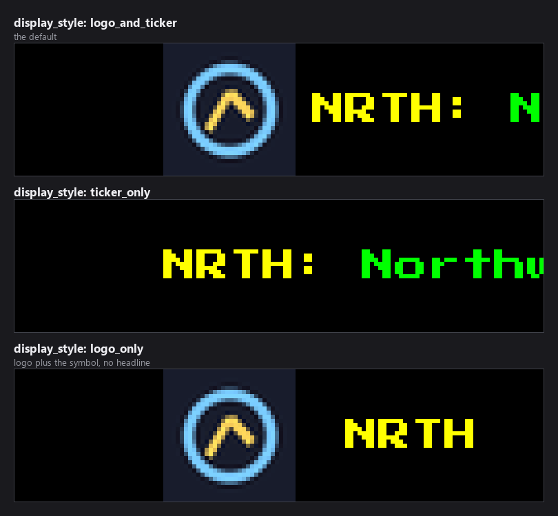
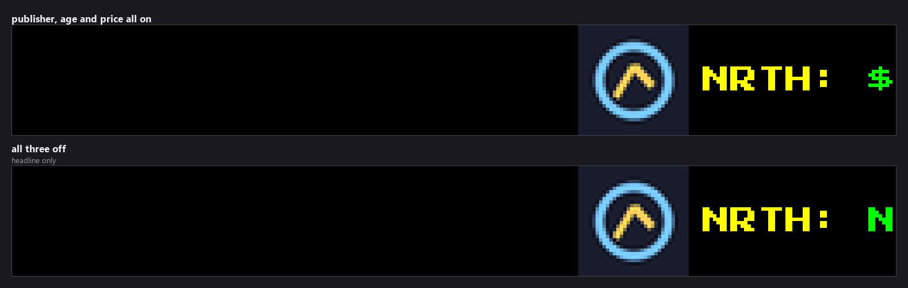
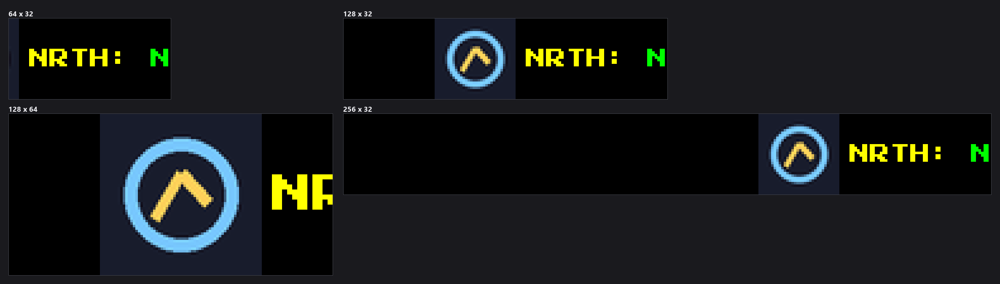

# Stock News Ticker Plugin

*Every image in this README is real plugin output, rendered at the true panel
size from seeded headlines so it reproduces exactly. The ticker symbols,
companies and the logo in them are invented.*

A plugin for LEDMatrix that displays scrolling stock-specific news headlines and financial updates from RSS feeds, focused on market news and company announcements.

## Features

- **Stock Symbol Tracking**: Monitor specific stocks for relevant news
- **Financial RSS Feeds**: Aggregate news from financial sources
- **Scrolling Headlines**: Continuous ticker display of stock news
- **Custom Feeds**: Add your own financial RSS feed URLs
- **Symbol Highlighting**: Color-coded display for stock symbols
- **Configurable Display**: Adjustable scroll speed, colors, and filtering
- **Network off the render path**: Headlines, prices and logos are fetched in `update()`; drawing never waits on the network

## Configuration

Settings live in the plugin's tab in the web UI and in `config/config.json`
under `stock-news`. Everything except `enabled` sits under `global` or `feeds`.
The full schema is [`config_schema.json`](config_schema.json).

| Key | Default | Notes |
|---|---|---|
| `enabled` | `false` | Enable or disable the stock news ticker plugin. |

### Appearance

| Key | Default | Notes |
|---|---|---|
| `global.display_style` | `"logo_and_ticker"` | What to render per story: logo + full text, text only, or logo + symbol only — one of `logo_and_ticker`, `ticker_only`, `logo_only`. |
| `global.font_path` | `"assets/fonts/PressStart2P-Regular.ttf"` | Path to a TTF font. Falls back to 4x6-font.ttf then PIL default if missing. Advanced. |
| `global.font_size` | `0` | Font size in pixels. Set to 0 for auto (display_height ÷ 3, clamped 6–16). Advanced. |
| `global.show_publisher` | `true` | Append the news source (e.g. '• Reuters') after each headline. |
| `global.show_age` | `true` | Append relative publish time (e.g. '• 2h ago') after each headline. |
| `global.show_price` | `false` | Show current market price (e.g. '$189.42') before the headline. |
| `global.price_color_mode` | `"fixed"` | Price colour: 'fixed' always uses text_color; 'change' colours it price_up_color / price_down_color based on movement since market open — one of `fixed`, `change`. Advanced. |
| `global.publisher_font_size` | `0` | Font size for the publisher segment (e.g. 'Reuters'). Set to 0 for a small pixel-perfect auto default (independent of the headline's font_size), or set an explicit size to override (0–24). Advanced. |
| `global.publisher_font_path` | *(blank)* | Optional separate TTF for the publisher segment. Empty = use the small 4x6 pixel font by default, which stays crisp at small sizes. Advanced. |
| `global.age_font_size` | `0` | Font size for the relative-age segment (e.g. '2h ago'). Set to 0 for a small pixel-perfect auto default (independent of the headline's font_size), or set an explicit size to override (0–24). Advanced. |
| `global.age_font_path` | *(blank)* | Optional separate TTF for the relative-age segment. Empty = use the small 4x6 pixel font by default, which stays crisp at small sizes. Advanced. |
| `global.logo_fetch_enabled` | `true` | Download company logos and cache them to disk. The download happens during the next data update, so a new symbol's logo appears shortly after its first headline. Advanced. |
| `global.logo_size` | `0` | Logo height in pixels. Set to 0 for auto (= display height). Width scales freely to maintain aspect ratio (0–128). Advanced. |
| `global.logo_url_template` | `"https://financialmodelingprep.com/image-stock/{symbol}.png"` | URL template for logo downloads. {symbol} is replaced with the ticker. Advanced. |

### Scrolling and duration

| Key | Default | Notes |
|---|---|---|
| `global.scroll_pixels_per_second` | `60.0` | Scroll speed in pixels per second (5.0–100.0). The LEDMatrix core moves it to the nearest speed the panel can draw in whole pixels — on a 100Hz panel the default 60 runs at 66.7 — and logs the result as `Scroll configured: …`. **Changed in 2.8.0:** this setting used to be ignored and every install scrolled at 100 px/s; set `100` for that speed. |
| `global.item_gap` | `0` | Blank pixels between stories. Set to 0 for auto (= display width) (0–512). Advanced. |
| `global.dynamic_duration` | `true` | Let display time match actual scroll time (recommended). Advanced. |
| `global.display_duration` | `30` | Fallback display duration in seconds when dynamic_duration is off (10–300). Advanced. |
| `global.min_duration` | `30` | Minimum display duration when dynamic duration is enabled (seconds) (10–300). Advanced. |
| `global.max_duration` | `300` | Maximum display duration when dynamic duration is enabled (seconds) (30–600). Advanced. |

### Which headlines appear

| Key | Default | Notes |
|---|---|---|
| `global.rotation_enabled` | `true` | Rotate through headlines after each scroll cycle. Advanced. |
| `global.rotation_threshold` | `1` | Scroll cycles before advancing to the next headline (1–10). Advanced. |
| `global.shuffle_headlines` | `true` | Randomise headline order on fetch and after each full rotation cycle. Advanced. |
| `global.max_headline_length` | `120` | Maximum headline length in characters before truncating with '...'. Default 120 shows most headlines in full (40–300). Advanced. |
| `global.max_headlines_per_symbol` | `1` | Max headlines shown per stock symbol (1–5). Advanced. |
| `global.headlines_per_rotation` | `2` | Max headlines pulled from each custom RSS feed (1–10). Advanced. |
| `global.eager_fetch_on_startup` | `true` | Fetch every configured symbol once immediately (ignoring the normal per-symbol spacing) so the ticker isn't left showing just 1-2 headlines for several minutes after a restart or config change. Falls back to the spread schedule once every symbol has data. Advanced. |
| `global.sync_with_stocks_plugin` | `false` | Automatically track the same stocks watched in the Stock Ticker plugin (ledmatrix-stocks). Synced symbols are merged with any symbols configured above. |

### Fetching and rate limits

| Key | Default | Notes |
|---|---|---|
| `global.update_interval_seconds` | `900` | Full refresh cycle length in seconds. Symbol fetches are spread evenly within this window (60–7200). Advanced. |
| `global.max_daily_requests` | `200` | Hard cap on total HTTP requests per day (10–2000). Advanced. |
| `global.max_requests_per_hour` | `50` | Rolling hourly request limit (5–500). Advanced. |
| `global.respect_market_hours` | `true` | Slow down fetching outside US equity market hours (Mon–Fri ~9am–4:30pm ET). Advanced. |
| `global.off_hours_multiplier` | `4` | Multiply per-symbol fetch interval by this amount during off-hours (1–24). Advanced. |
| `global.stale_threshold_multiplier` | `2` | Data older than update_interval_seconds × this factor dims the ticker colours (1–10). Advanced. |

### HTTP requests (`background_service`)

| Key | Default | Notes |
|---|---|---|
| `global.background_service.request_timeout` | `30` | HTTP timeout in seconds for headline and price requests (5–120). Logo downloads use a fixed 10s. Advanced. |
| `global.background_service.max_retries` | `3` | Retries with exponential backoff when a request fails with a connection error or a 429/5xx response (1–10). Advanced. |

### Feeds and colours

| Key | Default | Notes |
|---|---|---|
| `feeds.stock_symbols` | `["AAPL", "GOOGL", "MSFT"]` | Stock symbols — headlines fetched from Yahoo Finance. Fetches are spread across update_interval_seconds. |
| `feeds.custom_feeds` | *(empty)* | Extra RSS feeds to include alongside stock symbols. |
| `feeds.text_color` | `"#00ff00"` | Color for headline text. |
| `feeds.symbol_color` | `"#ffff00"` | Color for stock symbol labels (e.g. 'AAPL:'). |
| `feeds.publisher_color` | `"#6e6e6e"` | Color for the publisher segment (e.g. '• Reuters'). Advanced. |
| `feeds.age_color` | `"#6e6e6e"` | Color for the relative-age segment (e.g. '• 2h ago'), independent of publisher_color. Advanced. |
| `feeds.price_up_color` | `"#00ff00"` | Price color when up since market open. Only used when price_color_mode is 'change'. Advanced. |
| `feeds.price_down_color` | `"#ff3b30"` | Price color when down since market open. Only used when price_color_mode is 'change'. Advanced. |

### What the display styles look like

`logo_only` still shows the symbol — and the price, if `show_price` is on — it
just leaves out the headline text.

### The headline extras

`show_publisher`, `show_age` and `show_price` each append a segment to every
story:

`price_color_mode` deserves a note. In `change` mode the price is drawn in
`price_up_color` when the stock is up since the open and `price_down_color`
when it is down. Both of those default to `#00ff00` and `#ff3b30`, and
`text_color` also defaults to `#00ff00` — so **with the default palette a
rising price looks exactly the same in either mode**, and only a falling price
changes colour. Set `text_color` to something other than green if you want the
distinction to read at a glance.

### Panel sizes

## Display Format

The stock news ticker displays information in a scrolling format showing:

- **Logo**: the company logo, when one has been downloaded (`display_style`)
- **Stock Symbol**: Ticker symbol in yellow (e.g., "AAPL:")
- **Price**: when `show_price` is on
- **Headline**: News headline text in green
- **Publisher and age**: " - Reuters - 2h ago", each optional
- **Gap**: blank space between stories (`item_gap`, default the panel width)

## Stock Symbol Format

Stock symbols should be in uppercase format:

- **AAPL**: Apple Inc.
- **GOOGL**: Alphabet Inc.
- **MSFT**: Microsoft Corporation
- **TSLA**: Tesla Inc.
- **AMZN**: Amazon.com Inc.
- **META**: Meta Platforms Inc.
- **NFLX**: Netflix Inc.

## Data fetching

Fetching happens in the plugin's `update()`, which the LEDMatrix core calls on
its own schedule; drawing only ever reads what was fetched.

- One symbol is fetched per call, spread across `update_interval_seconds`
  (default 900s, i.e. every 15 minutes for the whole list), and slower outside
  US market hours (`off_hours_multiplier`). Right after a start or a symbol
  change every symbol is fetched once straight away (`eager_fetch_on_startup`).
- Requests time out after `background_service.request_timeout` seconds (default
  30) and are retried up to `background_service.max_retries` times (default 3)
  with exponential backoff.
- Missing company logos are downloaded during the same update and cached on
  disk; a symbol whose logo download fails is not retried until the plugin
  restarts.
- `max_daily_requests` and `max_requests_per_hour` cap the total.

## Data Sources

The plugin can fetch from:

1. **Stock-Specific Feeds**: News APIs for individual stocks (requires API keys in practice)
2. **Financial RSS Feeds**: General financial news RSS feeds
3. **Custom URLs**: User-defined RSS feed URLs

## Dependencies

This plugin requires the main LEDMatrix installation and uses the cache manager for data storage.

## Installation

1. Copy this plugin directory to your `ledmatrix-plugins/plugins/` folder
2. Ensure the plugin is enabled in your LEDMatrix configuration
3. Configure your stock symbols and RSS feeds
4. Restart LEDMatrix to load the new plugin

## Troubleshooting

- **No headlines showing**: Check if stock symbols are valid and RSS feeds are accessible
- **RSS parsing errors**: Verify feed URLs return proper XML format
- **Slow scrolling**: Raise `global.scroll_pixels_per_second`; the log line `Scroll configured: …` shows the speed actually used
- **Network errors**: Check your internet connection and RSS server availability

## Advanced Features

- **Symbol Filtering**: Only show news for tracked stock symbols
- **Multiple Headlines**: Display multiple headlines per symbol
- **Rotation Cycles**: Cycle through headlines in batches
- **Color Customization**: Configure colors for symbols, headlines, publisher, age and price
- **Font Sizing**: Adjustable font size for readability

## Performance Notes

- The plugin is designed to be lightweight and not impact display performance
- Fetching and RSS parsing happen in `update()`, never while drawing
- Configurable update intervals balance freshness vs. network load
- Caching reduces unnecessary network requests

## Example RSS Feeds

Popular financial RSS feeds you can add:

- **MarketWatch**: `https://feeds.marketwatch.com/marketwatch/marketpulse/`
- **Yahoo Finance**: `https://feeds.finance.yahoo.com/rss/2.0/headline`
- **Reuters Business**: `https://feeds.reuters.com/reuters/businessNews`
- **CNBC**: `https://www.cnbc.com/id/100003114/device/rss/rss.html`
- **Bloomberg**: `https://feeds.bloomberg.com/markets/news.rss`

## Integration Notes

This plugin is designed to work alongside the main stocks plugin for comprehensive financial display:

- **Stock News Plugin**: Headlines and company updates
- **Stocks Plugin**: Price tickers and charts
- **Combined Use**: Show news headlines while stocks cycle in background
