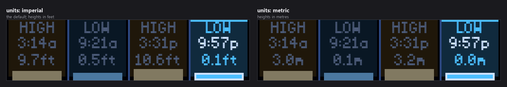
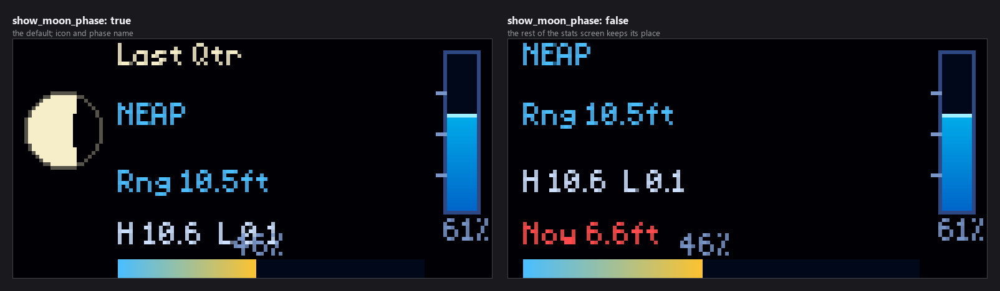

# Tide Display

Live coastal tides on your LED matrix, from NOAA. Four screens — an animated
water level, today's tide schedule, a 24-hour curve, and moon-phase stats —
rotating on their own, for any of the ~3000 NOAA tide stations.


*Every image in this README is real plugin output, rendered at the true panel
size from recorded NOAA responses for station 8443970 (Boston) on 2 September
2026. The times and heights are the real predictions for that day.*

---

## Table of Contents

1. [The Four Screens](#the-four-screens)
2. [Installation](#installation)
3. [Finding Your Station](#finding-your-station)
4. [Configuration Reference](#configuration-reference)
   - [Station and units](#station-and-units)
   - [Choosing screens](#choosing-screens)
   - [Colours](#colours)
   - [Fonts](#fonts)
5. [Panel Sizes](#panel-sizes)
6. [Where the Data Comes From](#where-the-data-comes-from)
   - [Caching and what happens offline](#caching-and-what-happens-offline)
7. [Troubleshooting](#troubleshooting)
8. [Development](#development)
9. [Support](#support)

---

## The Four Screens

Each is a separate display mode. All four are on by default and rotate every
`display_duration` seconds.


| Screen | Setting | Shows |
|--------|---------|-------|
| **current** | `show_current` | The live water level with an animated surface, whether the tide is rising or falling, and the next tide either side |
| **schedule** | `show_schedule` | Today's four tides as columns, with the next one highlighted |
| **chart** | `show_chart` | The 24-hour prediction curve with H/L markers and a line at the current time |
| **stats** | `show_stats` | Moon phase, whether tides are spring or neap, and today's range |

The `current` screen prefers a **live** water-level reading where the station
has a sensor, falling back to the prediction where it does not. Many stations
are prediction-only, which is normal and not an error.

---

## Installation

**From the Plugin Store (recommended).** Open the LEDMatrix web interface at
`http://<your-pi-ip>:5000`, go to **Plugin Manager**, find **Tide Display** in
the **Plugin Store** section, and click **Install**.

**Manually.** Copy this directory into your LEDMatrix `plugin-repos/` and
restart the display service.

`enabled` defaults to **`false`**, and `station_id` is blank — with no station
set the plugin draws a short setup prompt rather than failing, so a blank panel
means it is not enabled at all.

---

## Finding Your Station

Tide predictions are per-station, so this is the one setting you must supply.

1. Open <https://tidesandcurrents.noaa.gov/stations.html>.
2. Find the station nearest your stretch of coast.
3. Copy its **7-digit ID** — for example `8443970` for Boston, `9414290` for
   San Francisco, `8724580` for Key West.

```json
{
  "tide-display": {
    "enabled": true,
    "station_id": "8443970",
    "station_name": "BOSTON"
  }
}
```

`station_name` is only a label. Leave it blank and the ID is shown instead —
useful while you are checking you picked the right station, less so afterwards.

Some stations to start from:

| Location | ID | Location | ID |
|----------|-----|----------|-----|
| Seattle, WA | `9447130` | Boston, MA | `8443970` |
| San Francisco, CA | `9414290` | New York, NY | `8518750` |
| Los Angeles, CA | `9410660` | Bar Harbor, ME | `8413320` |
| Key West, FL | `8724580` | Galveston, TX | `8771341` |
| Miami, FL | `8723170` | Honolulu, HI | `1612340` |

Stations differ in what they offer. All have tide *predictions*; only some have
a live water-level sensor. A station with no sensor still fills every screen,
using predictions throughout.

---

## Configuration Reference

### Station and units

| Option | Type | Default | What it does |
|--------|------|---------|--------------|
| `enabled` | boolean | `false` | Whether the plugin runs at all |
| `station_id` | string | `""` | The 7-digit NOAA station ID |
| `station_name` | string | `""` | Label shown instead of the ID |
| `units` | string | `imperial` | `imperial` (feet) or `metric` (metres) |
| `display_duration` | number | `12` | Seconds each screen holds the panel |



The unit conversion is done by NOAA rather than locally — the plugin asks the
API for `english` or `metric` and displays what comes back — so the heights are
the authoritative figures either way, not a rounding of one into the other.

### Choosing screens

| Option | Default | What it does |
|--------|---------|--------------|
| `show_current` | `true` | The animated water-level screen |
| `show_schedule` | `true` | Today's tide times in columns |
| `show_chart` | `true` | The 24-hour curve |
| `show_stats` | `true` | Moon phase and range |
| `show_moon_phase` | `true` | The moon icon and phase name on the stats screen |



Turning a screen off shortens the rotation rather than leaving a gap. With all
four on and the default 12 seconds each, a full cycle takes just under a
minute.

**Turning all four off shows all four.** The plugin treats an empty selection
as "no preference" rather than "show nothing", so it can never go dark by
configuration alone.

`show_moon_phase` only affects the stats screen — the rest of that screen keeps
its layout, so the phase name is replaced by space rather than everything
shifting up.

### Colours

| Option | Default | What it does |
|--------|---------|--------------|
| `tide_color` | `[0, 100, 200]` | The water fill |
| `highlight_color` | `[0, 220, 255]` | Wave crests and the chart line |


The two work together: `tide_color` is the body of the water and
`highlight_color` picks out its surface, so keeping the highlight lighter than
the fill is what makes the water read as water.

### Fonts

`customization.tide_text` (the figures) and `customization.label_text` (the
HIGH/LOW captions) each take `font`, `font_size` and `text_color`.

| Font | Kind | Notes |
|------|------|-------|
| `4x6-font.ttf` | Scalable | The default; fits the small columns well |
| `PressStart2P-Regular.ttf` | Scalable | Chunky; readable further away, at the cost of fitting less |
| `5by7.regular.ttf` | Scalable | A rounder 5×7 face |
| `5x7.bdf` | Bitmap | Crisp; drawn at its native 7px |
| `4x6.bdf` | Bitmap | Native 6px, which matches the default `font_size` |

**`font_size` only affects the scalable faces.** A `.bdf` is drawn at the one
pixel size its file declares. Defaults are `font_size: 6` with
`tide_text.text_color` `[205, 225, 255]` and `label_text.text_color`
`[120, 150, 200]`.

---

## Panel Sizes


Height helps this plugin more than width, because three of the four screens
stack text:


- **64×32** fits the level and direction; the schedule columns get tight.
- **128×32** is the size the layouts are tuned for.
- **128×64** is where the chart really pays off — a taller curve is far easier
  to read at a glance — and the stats screen stops crowding.
- **256×32** gives the schedule columns and the chart more room horizontally.

> On a 32-row panel the stats screen draws the range line and the percentage
> close enough to touch, and they overlap at some values. It is legible but
> untidy; the chart and schedule screens are unaffected, and 64 rows clears it.

---

## Where the Data Comes From

NOAA's Tides and Currents API (`api.tidesandcurrents.noaa.gov`). No API key and
no account are needed.

Three requests per refresh, all for the configured station:

| Request | Used by |
|---------|---------|
| High/low predictions for today | schedule, current, stats |
| Hourly predictions for today | chart |
| Latest water level | current, where the station has a sensor |

Predictions use the **MLLW** datum and the station's local time including
daylight saving, which is why the times shown match published local tide
tables.

### Caching and what happens offline

Requests are kept to a minimum, because a day's predictions do not change once
published:

- **Predictions** are cached under a stable per-station key and refetched only
  when the cached entry is for a different day.
- **The live water level** is cached for 6 minutes.
- **If NOAA is unreachable**, the last good predictions keep being served for up
  to **two days**. Past that the plugin shows a placeholder instead: tides shift
  roughly 50 minutes a day, so three-day-old times would be confidently wrong,
  which is worse than admitting there is no data.

---

## Troubleshooting

**Nothing appears.**
`enabled` defaults to `false`.

**It shows a setup prompt.**
`station_id` is blank. See [Finding Your Station](#finding-your-station).

**"No data" or empty screens with a station set.**
Check the ID is the 7-digit tide-station number, not a buoy or current-station
ID from a different NOAA product. The log records the API error NOAA returned,
which usually names the problem directly.

**The current screen shows a prediction rather than a live reading.**
Most stations have no live water-level sensor. This is expected and logged at
debug level rather than as an error.

**Heights look wrong for my area.**
Check `units`, then check the station — neighbouring stations can differ by
several feet, and the nearest one by road is not always the nearest by water.

**The times are off by an hour.**
Predictions come back in the station's local time including daylight saving. If
they disagree with a published table, the table may be in standard time
year-round.

**I picked a font and nothing changed.**
On a current version all five faces work. Older versions loaded a `.bdf` only
when its native pixel size happened to equal `font_size`, so `4x6.bdf` worked
at the default 6 and `5x7.bdf` silently fell back.

---

## Development

### Project structure

```text
tide-display/
├── manifest.json        # Plugin metadata and version history
├── manager.py           # TideDisplayPlugin — all four screens
├── config_schema.json   # Settings schema; source of truth for defaults
├── render_preview.py    # Standalone preview generator (see note below)
├── preview_*.png        # Its output
├── requirements.txt
└── README.md
```

`render_preview.py` draws mock versions of the screens with its own copy of the
palette — its header notes the colours "must match manager.py". The images in
this README are made a different way: `scripts/render_docs_assets.py` runs the
real plugin against recorded NOAA responses, so they cannot drift from what the
plugin actually draws.

### Regenerating the images in this README

```bash
python scripts/render_docs_assets.py --plugin tide-display
```

`--check` verifies the committed images still match. The fixture under
`docs/assets/tide-display/fixtures/` holds real NOAA responses for both unit
systems, matched on the query parameters, so the metric screens show genuine
metric predictions rather than the same numbers relabelled.

---

## Support

- YouTube: <https://www.youtube.com/@ChuckBuilds>
- Instagram: <https://www.instagram.com/ChuckBuilds/>
- Discord: <https://discord.com/invite/uW36dVAtcT>
- Sponsor: [GitHub Sponsors](https://github.com/sponsors/ChuckBuilds) ·
  [Buy Me a Coffee](https://buymeacoffee.com/chuckbuilds) ·
  [Ko-fi](https://ko-fi.com/chuckbuilds/)

Released under the GNU General Public License v3.0 — see [LICENSE](LICENSE).
