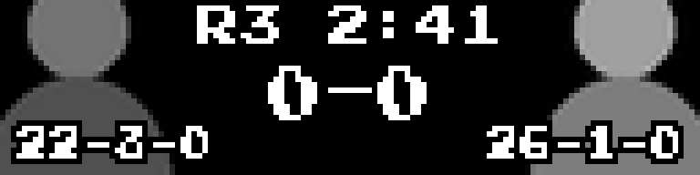
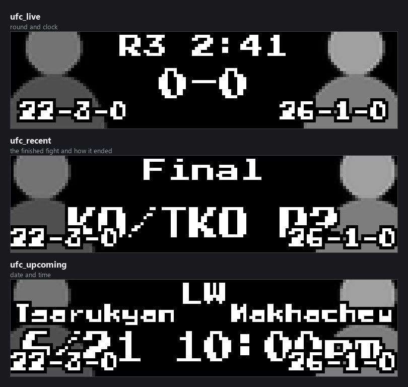
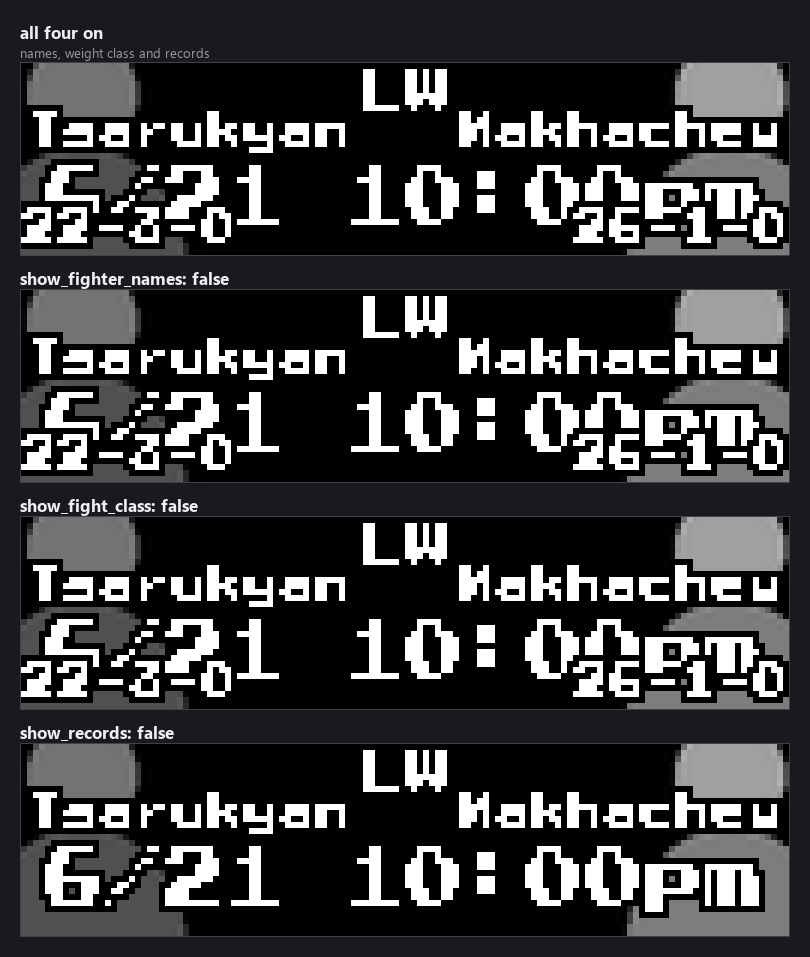
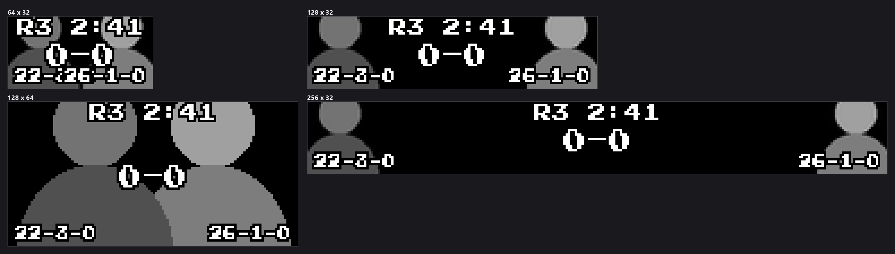

# UFC Scoreboard

Live, recent, and upcoming **UFC/MMA** fights on your LEDMatrix display, with
fighter headshots, records, odds and results. From ESPN's public MMA endpoints —
no API key required.



> Originally contributed by Alex Resnick
> ([@legoguy1000](https://github.com/legoguy1000)) — see
> [PR #137](https://github.com/ChuckBuilds/LEDMatrix/pull/137).

## Contents

- [Quick start](#quick-start)
- [Display modes](#display-modes)
- [Display options](#display-options)
- [Fighter headshots](#fighter-headshots)
- [Which fights get shown](#which-fights-get-shown)
- [Panel sizes](#panel-sizes)
- [Settings reference](#settings-reference)
- [Fonts and layout](#fonts-and-layout)
- [Vegas ticker: seeing live fights more often](#vegas-ticker-seeing-live-fights-more-often)
- [Data source](#data-source)
- [Troubleshooting](#troubleshooting)

## Quick start

1. Open the LEDMatrix web interface (`http://your-pi-ip:5000`).
2. Open the **Plugin Manager** tab, find **UFC Scoreboard** under **Plugin
   Store**, and click **Install**.
3. Open the plugin's tab in the second nav row to set favorite fighters and
   weight classes.

```json
{
  "ufc-scoreboard": {
    "enabled": true,
    "ufc": {
      "enabled": true,
      "favorite_fighters": ["Islam Makhachev", "Jon Jones"],
      "favorite_weight_classes": ["LW", "HW"],
      "filtering": { "show_favorite_fighters_only": false },
      "game_limits": {
        "recent_games_to_show": 3,
        "upcoming_games_to_show": 5
      }
    }
  }
}
```

`favorite_fighters` takes **full fighter names** as ESPN publishes them.
`favorite_weight_classes` takes abbreviations: `LW`, `HW`, `WW`, `MW`, `FW`,
`BW`, `FLW`, `LHW`, `WSW`, `WFW`, `WBW`, `WFLW`. Either one qualifies a fight,
so following a weight class picks up every bout in it.

## Display modes

Three modes, registered in `manifest.json`.



| Mode | Shows | Top line |
|---|---|---|
| `ufc_live` | Fights in progress | `R1`–`R5` and the round clock |
| `ufc_recent` | Finished fights | `Final`, with the method and round below |
| `ufc_upcoming` | Scheduled fights | Weight class, then the date and time |

Each mode renders as **switch** (one fight at a time, timed) or **scroll** (all
fights scroll horizontally at high FPS), set with
`ufc.display_modes.<mode>_display_mode`. The mode toggles use the `show_`
prefix — `show_live`, `show_recent`, `show_upcoming`.

## Display options

Four toggles control what the card carries besides the fighters themselves.



| Key | Default | What it does |
|---|---|---|
| `ufc.display_options.show_records` | `true` | Fighter records (e.g. `22-3-0`) in the bottom corners. |
| `ufc.display_options.show_fighter_names` | `true` | Short surnames beside the headshots. |
| `ufc.display_options.show_fight_class` | `true` | Weight class abbreviation, e.g. `LW`. |
| `ufc.display_options.show_odds` | `true` | Moneyline odds. |

## Fighter headshots

Headshots are downloaded from ESPN on first display and cached under the
plugin's logo directory (`assets/sports/ufc_logos/`, named by ESPN fighter id).
This needs write access to the LEDMatrix assets directory and an internet
connection.

> **A headshot that cannot be fetched blanks the whole card.** The loader
> returns nothing when the file is missing and the download fails, and the card
> then draws the text `Image Error` instead of the fight. There is no per-fighter
> placeholder fallback, unlike the team scoreboards, which generate one from the
> abbreviation. If you see `Image Error`, check network access and that the
> assets directory is writable.

The images in this document use grey stand-ins in place of real headshots, since
none ship with the plugin.

## Which fights get shown

**`upcoming_games_to_show` is not "how many cards you see".** It is the size of
a *pool*. The panel cycles through that pool one card at a time and keeps its
place between visits, so a pool of 3 means the board rotates through the same 3
fights until the card moves on. A bigger number gives you a *longer lap*, so any
one fight comes round **less** often.

Which regime you are in depends on `ufc.favorite_fighters` (or
`favorite_weight_classes`) and `ufc.filtering.show_favorite_fighters_only`:

| Favorites set? | `show_favorite_fighters_only` | What you get |
|---|---|---|
| No | either | The next N fights chronologically. Every fight is a non-favorite fight, so the `other_*` filters apply to all of them. |
| Yes | **on** | Only your fighters and weight classes. The limit is a budget **per fighter**. |
| Yes | **off** (default) | **Your fighters first, then other fights to fill.** Both limits are **totals**. |

`show_favorite_fighters_only` defaults to **off** here, unlike the team
scoreboards where the equivalent defaults on. `ufc.filtering.show_all_live`
defaults to **on**, so every live fight appears regardless of favorites.

### The selection settings

Per `ufc.game_limits`:

| Option | Default | Description |
|---|---|---|
| `recent_games_to_show` | `5` | Pool size for finished fights. |
| `upcoming_games_to_show` | `5` | The same for scheduled fights. |
| `other_recent_games_to_show` | `5` | **Advanced.** How many **non-favorite** finished fights to add. `0` gives favorites only. |
| `other_upcoming_games_to_show` | `5` | **Advanced.** The same for scheduled fights. |
| `other_rotation_interval_seconds` | `1800` | **Advanced.** How often the non-favorite slice advances. `0` pins it. |
| `other_games_min_quality` | `ranked` | **Advanced.** Inert here — see below. |
| `other_games_divisions` | `["fbs"]` | **Advanced.** Inert here — see below. |

**Your favorite fighters are never filtered by the last two** — a fighter you
follow always appears. Those settings only decide what fills the *remaining*
slots.

> **Both are inert in this plugin.** `ranked` needs a national poll and the
> division filter needs ESPN's FBS/FCS group rosters — a college *football*
> taxonomy — so every fight passes both and neither costs a request. They are
> present because the selection code is shared with the team scoreboards, which
> is also why their help text talks about teams and divisions. That text also
> offers a `broadcast` value the enum does not have; it was retired.

### Variety comes from turnover

Rather than widening the pool, the non-favorite slice **moves**: the window
advances by its own width every `other_rotation_interval_seconds`, so
consecutive windows do not overlap and the board works through the card instead
of resampling the front of it. Your favorites are not rotated — for upcoming
fights the soonest ones are the point.

Both filters **fail open**: if the data behind them cannot be fetched, the fight
is allowed through. They fail open a second time as a set — if the filters
between them leave nothing at all, the unfiltered list is used instead. Setting
`other_upcoming_games_to_show` or `other_recent_games_to_show` to `0` is the one
way to ask for an empty slate, and that is honoured.

## Panel sizes



The plugin passes the render-safety harness on all eight supported sizes. Two
headshots, two names, two records and a centre column is a lot for 128x32 — a
taller or wider panel gives the text room, and turning off
`show_fighter_names` or `show_records` helps on the smaller ones.

## Settings reference

Settings marked **Advanced** sit behind the *Advanced* toggle in the web UI.
Defaults are the schema defaults, which is what the web UI writes.

### Plugin level

| Key | Type | Default | What it does |
|---|---|---|---|
| `enabled` | boolean | `true` | Master on/off switch. |
| `display_duration` | 5–300 s | `30` | How long the display controller shows this plugin's mode before rotating to the next plugin. |
| `game_display_duration` | 3–60 s | `15` | Per-fight time within a mode, where the mode does not override it. |
| `update_interval` | 30–86400 s | `3600` | How often to fetch new data. |
| `timezone` | string | `""` | **Advanced.** IANA zone for event times, e.g. `America/Chicago`. Blank follows the LEDMatrix global timezone, then the host system's, then UTC. |
| `schedule_lookback_days` | 1–60 | `14` | **Advanced.** How far back to fetch for the Recent screen. |
| `schedule_lookahead_days` | 1–60 | `7` | **Advanced.** How far ahead to fetch for Upcoming. A card beyond this horizon is never fetched. |
| `no_data_interval_seconds` | 5–86400 s | `300` | **Advanced.** Wait between live checks when nothing is live. Backs off further the longer nothing is found. |
| `live_idle_max_interval_seconds` | 5–86400 s | `900` | **Advanced.** Ceiling for that back-off. |

### UFC

| Key | Type | Default | What it does |
|---|---|---|---|
| `ufc.enabled` | boolean | `true` | Build the UFC managers at all. |
| `ufc.favorite_fighters` | array | `[]` | Full fighter names to prioritise. |
| `ufc.favorite_weight_classes` | array | `[]` | Weight class abbreviations to prioritise. |
| `ufc.live_priority` | boolean | `true` | Let live fights interrupt the rotation and display immediately. |

### Display modes

| Key | Type | Default |
|---|---|---|
| `ufc.display_modes.show_live` | boolean | `true` |
| `ufc.display_modes.show_recent` | boolean | `true` |
| `ufc.display_modes.show_upcoming` | boolean | `true` |
| `ufc.display_modes.live_display_mode` | `switch` \| `scroll` | `switch` |
| `ufc.display_modes.recent_display_mode` | `switch` \| `scroll` | `switch` |
| `ufc.display_modes.upcoming_display_mode` | `switch` \| `scroll` | `switch` |

### Filtering

| Key | Type | Default | What it does |
|---|---|---|---|
| `ufc.filtering.show_favorite_fighters_only` | boolean | `false` | Only show fights involving a favorite fighter or weight class. |
| `ufc.filtering.show_all_live` | boolean | `true` | Show every live fight regardless of favorites. |

### Durations

| Key | Type | Default | What it does |
|---|---|---|---|
| `ufc.live_game_duration` | 10–120 s | `30` | Per-fight time for live fights. |
| `ufc.recent_game_duration` | 5–120 s | `15` | Per-fight time on the Recent screen. Falls back to `game_display_duration` when unset. |
| `ufc.upcoming_game_duration` | 5–120 s | `15` | The same for Upcoming. |

### Update intervals

| Key | Type | Default | What it does |
|---|---|---|---|
| `ufc.live_update_interval` | 5–300 s | `30` | How often live fight data refreshes. |
| `ufc.recent_update_interval` | 60–86400 s | `3600` | **Advanced.** How often the finished-fights list is rebuilt. This also sets how soon a fight that has just ended can appear. |
| `ufc.upcoming_update_interval` | 60–86400 s | `3600` | **Advanced.** How often the upcoming-fights list is rebuilt. |
| `ufc.stale_game_timeout` | 60–3600 s | `300` | **Advanced.** Drop a live fight the API has stopped updating. |

### Dynamic duration

Sizes each mode's total time from how many fights there are.

| Key | Type | Default |
|---|---|---|
| `ufc.dynamic_duration.enabled` | boolean | `false` |
| `ufc.dynamic_duration.min_duration_seconds` | 10–300 s | `30` |
| `ufc.dynamic_duration.max_duration_seconds` | 60–600 s | `300` |
| `ufc.dynamic_duration.modes.live.enabled` | boolean | `false` |
| `ufc.dynamic_duration.modes.live.min_duration_seconds` | 10–300 s | `30` |
| `ufc.dynamic_duration.modes.live.max_duration_seconds` | 60–600 s | `300` |
| `ufc.dynamic_duration.modes.recent.enabled` | boolean | `false` |
| `ufc.dynamic_duration.modes.recent.min_duration_seconds` | 10–300 s | `30` |
| `ufc.dynamic_duration.modes.recent.max_duration_seconds` | 60–600 s | `300` |
| `ufc.dynamic_duration.modes.upcoming.enabled` | boolean | `false` |
| `ufc.dynamic_duration.modes.upcoming.min_duration_seconds` | 10–300 s | `30` |
| `ufc.dynamic_duration.modes.upcoming.max_duration_seconds` | 60–600 s | `300` |

There is **no `mode_durations` block** in this plugin, unlike the team
scoreboards. Mode length comes from dynamic duration or the per-fight durations.

### Scroll settings

| Key | Type | Default | What it does |
|---|---|---|---|
| `ufc.scroll_settings.scroll_speed` | 1.0–200.0 px/s | `50.0` | **Advanced.** Higher scrolls faster. |
| `ufc.scroll_settings.scroll_delay` | 0.001–0.1 s | `0.01` | **Advanced.** Frame delay; `0.01` is 100 FPS. |
| `ufc.scroll_settings.gap_between_games` | 8–128 px | `48` | Gap between fight cards. |
| `ufc.scroll_settings.show_league_separators` | boolean | `true` | Draw the UFC icon between leagues. |
| `ufc.scroll_settings.dynamic_duration` | boolean | `true` | Size the scroll duration from the content width. |
| `ufc.scroll_settings.game_card_width` | 32–512 px | `128` | Card width. Lower it on a multi-panel chain to fit more fights on screen at once. |

## Fonts and layout

Four text elements, each with `font` and `font_size`, under
`customization.<element>`. **Unlike every other scoreboard in this repo, `font`
here takes a full file path rather than a font name.**

| Element | Default font | Default size | Draws |
|---|---|---|---|
| `customization.fighter_name_text` | `assets/fonts/4x6-font.ttf` | `6` | Fighter short names |
| `customization.status_text` | `assets/fonts/tom-thumb.bdf` | `8` | Round and status text |
| `customization.result_text` | `assets/fonts/PressStart2P-Regular.ttf` | `10` | The fight result |
| `customization.detail_text` | `assets/fonts/4x6-font.ttf` | `6` | Odds, records and other detail |

`customization` and every element under it set `additionalProperties: false`.

### Layout offsets

Nudge any element in pixels. All default to `0`, all live under
`customization.layout.<element>`, and all set `additionalProperties: false`.

| Element | Keys | Measured from |
|---|---|---|
| `fighter1_image`, `fighter2_image` | `x_offset`, `y_offset` | Default headshot position |
| `status_text` | `x_offset`, `y_offset` | Centre horizontally, top vertically |
| `result_text` | `x_offset`, `y_offset` | Panel centre |
| `fight_class` | `x_offset`, `y_offset` | Centre horizontally, default position vertically |
| `date` | `x_offset`, `y_offset` | Centre horizontally, default position vertically |
| `time` | `x_offset`, `y_offset` | Centre horizontally, the date's position vertically |
| `records` | `fighter1_x_offset`, `fighter2_x_offset`, `y_offset` | Fighter 1 from the right, fighter 2 from the left, both from the bottom |
| `fighter_names` | `fighter1_x_offset`, `fighter2_x_offset`, `y_offset` | Fighter 1 from the right, fighter 2 from the left, both from the top |
| `odds` | `x_offset`, `y_offset` | Default odds position |

## Vegas ticker: seeing live fights more often

By default a live fight **takes over** the display: the Vegas ticker stops and
this scoreboard shows full screen until the fight ends. To keep the marquee
scrolling and still see results, set this in the **core** config — not in this
plugin's settings:

```json
{
  "display": {
    "vegas_scroll": {
      "live_in_ticker": true,
      "live_weight": 3,
      "favorite_live_weight": 5
    }
  }
}
```

The ticker is otherwise a strict round robin — every plugin appears once per
cycle. These weights let this plugin claim several slots per cycle, spaced
evenly through it. `live_weight` applies whenever this scoreboard has a live
fight; `favorite_live_weight` applies when one of your `favorite_fighters` is in
a live bout. That distinction has to be made here rather than in the core, which
can tell *that* a fight is live but not *whose*.

- The weight is per **plugin**, not per fight. With four fights live this
  scoreboard still occupies one slot at a time.
- More slots make the cycle **longer**, not faster — everything else appears
  proportionally less often. And appearing more often only helps if the data is
  fresh, which is governed by `ufc.live_update_interval`.

## Data source

ESPN's public MMA endpoints. No API key required. Be mindful of
`update_interval` — the default of 3600s suits normal use.

The documentation images come from `docs/assets/ufc-scoreboard/shots.json` and
re-render with `python scripts/render_docs_assets.py --plugin ufc-scoreboard
--check`.

## Troubleshooting

**Cards show `Image Error`.** A fighter headshot could not be loaded or
downloaded. Check internet access and that the LEDMatrix assets directory is
writable — see [Fighter headshots](#fighter-headshots).

**Nothing appears.** Check that both `enabled` and `ufc.enabled` are on, and
that at least one of `show_live` / `show_recent` / `show_upcoming` is on.

**A fighter I follow never shows up.** `favorite_fighters` needs the full name
as ESPN publishes it, not a nickname or surname. Following the weight class with
`favorite_weight_classes` is a broader alternative.

**The same few fights keep repeating.** That is the pool cycling. Lower
`other_rotation_interval_seconds` for faster turnover rather than raising the
pool size — a larger pool makes the lap longer, so each fight appears less
often, not more.

**Text overlaps on a small panel.** Two headshots, two names and two records is
a lot for 128x32. Turn off `show_fighter_names` or `show_records`, or use a
taller panel.

**Start times look like UTC.** The plugin could not read your global timezone.
Set `timezone` under Advanced Settings to your IANA zone.

**A card I know about never appears.** It may be beyond
`schedule_lookahead_days` (default 7). Anything outside that horizon is never
fetched.

## License

GPL-3.0, same as the LEDMatrix project.
