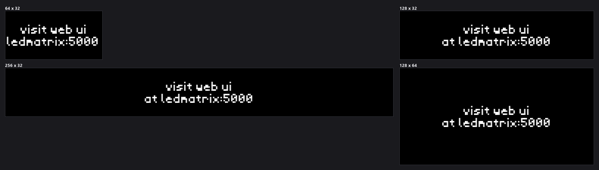
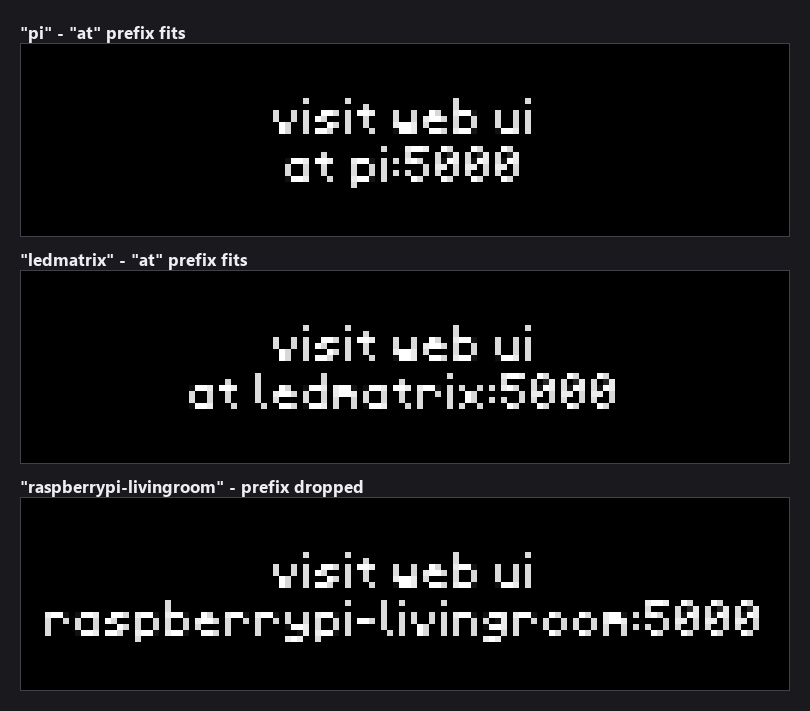
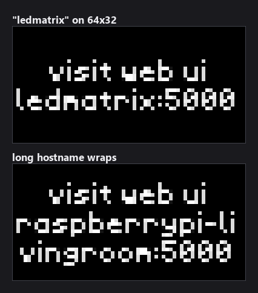

# Web UI Info

A one-screen reminder of the address your LEDMatrix web interface is on.
It alternates between the device's hostname and its IP address, so you can
read the URL off the panel instead of hunting for the Pi on your network.


No network access, no API key, no dependencies beyond what LEDMatrix already
ships — the plugin only reads local system information.

---

## What it shows

Two centred lines of white text:

```text
visit web ui
at ledmatrix:5000
```

The address on the second line **alternates every 10 seconds** between:

| Mode | Second line | Source |
|---|---|---|
| Hostname | `at ledmatrix:5000` | `socket.gethostname()` |
| IP address | `at 192.168.1.42:5000` | the first interface address that is not loopback |

Both modes are laid out identically — only the address text differs. The port
is always `5000`, the port the LEDMatrix web interface listens on; it is not
configurable from this plugin.

---

## Installation

Web UI Info ships with the default Plugin Store:

1. Open the web interface (`http://your-pi-ip:5000`)
2. Go to the **Plugin Manager** tab
3. Find **Web UI Info** under **Plugin Store** and click **Install**
4. Toggle it on, then click **Restart Display Service** on the **Overview** tab

To install from source instead, copy the directory into your LEDMatrix
plugins directory (default `plugin-repos/`):

```bash
cp -r plugins/web-ui-info ~/LEDMatrix/plugin-repos/
sudo systemctl restart ledmatrix
```

---

## Configuration

Settings live in the plugin's tab in the web UI, and are stored in
`config/config.json` under the `web-ui-info` key. The full schema is
[`config_schema.json`](config_schema.json).

| Option | Type | Default | Description |
|---|---|---|---|
| `enabled` | boolean | `true` | Master switch. When off, the plugin is skipped in the rotation. |
| `display_duration` | number | `10` | Seconds the panel holds the screen before the display rotates on (1–300). |
| `transition.enabled` | boolean | `true` | **Not implemented** — see below. |
| `transition.type` | string | `"redraw"` | **Not implemented** — see below. |
| `transition.speed` | integer | `2` | **Not implemented** — see below. |

That is the whole surface: this plugin has no colours, fonts, or layout
options. The text is always white, always centred.

```json
{
  "web-ui-info": {
    "enabled": true,
    "display_duration": 10
  }
}
```

### `display_duration` and the 10-second alternation

The swap is driven by a wall clock, not by a per-turn counter: the plugin
changes address whenever 10 seconds have passed since the last change. Two
things follow from that.

**Between turns.** The gap between one appearance in the rotation and the next
is almost always longer than 10 seconds, so the plugin swaps as it comes back
on screen. Consecutive turns alternate hostname, then IP, then hostname again —
even at the default `display_duration`.

**Within a turn.** A screen held longer than 10 seconds swaps again while you
are looking at it.

| `display_duration` | What you see |
|---|---|
| `5` – `10` (default) | One address per turn, alternating from turn to turn |
| `20` | One swap part way through the screen |
| `30` or more | A swap roughly every 10 seconds |

The default is fine for most setups. Raise it to `20` if you want both
addresses in a single turn rather than across two.

### The `transition` settings do nothing

`transition.enabled`, `transition.type`, and `transition.speed` appear in the
configuration form, but `manager.py` never reads them and the LEDMatrix core
implements no display transitions. Changing them has no effect. They are
tracked for removal in
[issue #381](https://github.com/ChuckBuilds/ledmatrix-plugins/issues/381) —
four other plugins declare the same dead block.

---

## How the address is found

### Hostname

`socket.gethostname()`, read once when the plugin loads. If that raises, the
plugin falls back to `localhost`.

### IP address

Re-read every 30 seconds, so unplugging Ethernet or switching networks is
picked up without a restart. The plugin tries these in order and takes the
first answer that is neither loopback (`127.x`) nor the AP-mode address:

1. **AP mode check.** If `hostapd` is active, or `wlan0` already holds
   `192.168.4.1`, the plugin reports `192.168.4.1` — the address the web UI is
   on when the Pi is running as its own access point.
2. **`hostname -I`** — the fastest path, and the one that normally answers on
   a Raspberry Pi.
3. **`ip -4 addr show`** — preferring wired interfaces (`eth*`, `enp*`), then
   `wlan0`.
4. **A UDP socket to `8.8.8.8`** — no packet is actually sent; this just asks
   the kernel which local address it would route from. Needs a default route.
5. **`socket.gethostbyname()`** on the hostname.

If every step fails, the second line reads `at localhost:5000`.

---

## Panel sizes

The text is drawn in the 4x6 bitmap font at a fixed size, so what changes
across panels is how much room the two lines have, not how big they are.



The block is centred both horizontally and vertically, so it sits in the
middle of a tall panel rather than against the top edge.

---

## Long hostnames

A hostname long enough to overflow the panel used to be silently sliced off at
both ends. The plugin now shortens the line in stages instead:



1. `at <address>:5000` — the normal form
2. `<address>:5000` — the `at ` prefix is dropped when it no longer fits
3. the address wraps onto extra lines when even that is too wide

On a 64x32 panel — where a 4x6 font gives you about 16 characters — both the
second and third stages come into play:



If you would rather see a short address than a wrapped one, rename the device
(`sudo hostnamectl set-hostname ledmatrix`) or wait out the 10-second swap and
read the IP instead.

---

## Verifying it loaded

Installed plugins appear under **Installed Plugins** in the **Plugin Manager**
tab. From SSH:

```bash
sudo journalctl -u ledmatrix -f | grep web-ui-info
```

You should see the hostname and IP the plugin settled on at startup:

```text
Web UI Info plugin initialized - Hostname: ledmatrix, IP: 192.168.1.42
```

---

## Troubleshooting

**The panel says `at localhost:5000`**
Every IP-detection step failed, which usually means no network interface is
up. Check `hostname -I` over SSH — if that prints nothing, the plugin has
nothing to show either.

**The IP on the panel is out of date**
It is re-read every 30 seconds, but only while the plugin's `update()` runs.
If the display rotation is long, give it a full cycle before assuming it is
stuck.

**It always shows `192.168.4.1`**
That is the AP-mode address, and it is reported whenever `hostapd` is running.
If the Pi is meant to be on your normal network, `hostapd` is still active:
`sudo systemctl stop hostapd`.

**Changing `transition.*` does nothing**
Correct — see [above](#the-transition-settings-do-nothing).

---

## Notes

- Ships with the LEDMatrix repository; no external dependencies.
- Makes no network requests. It reads the local hostname and interface
  addresses only.
- The images in this README are produced by
  [`scripts/render_docs_assets.py`](../../scripts/render_docs_assets.py) from
  [`docs/assets/web-ui-info/shots.json`](../../docs/assets/web-ui-info/shots.json),
  with the hostname pinned so they render the same on any machine.

## License

GPL-3.0, same as the LEDMatrix project.
