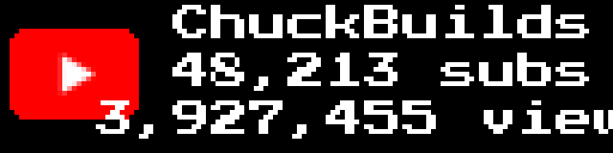
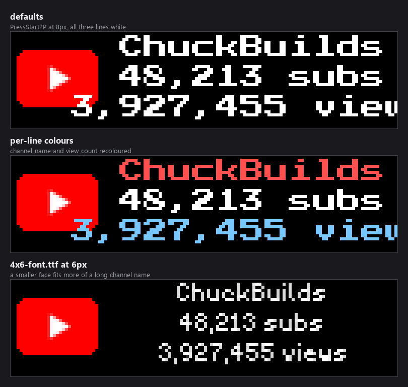
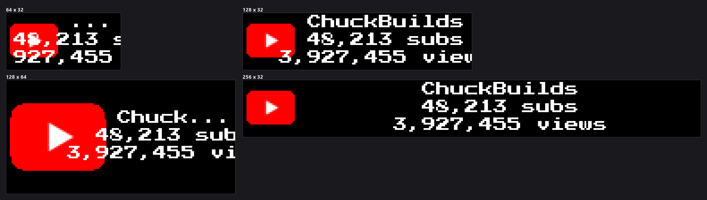

### Connect with ChuckBuilds

- Show support on YouTube: https://www.youtube.com/@ChuckBuilds
- Stay in touch on Instagram: https://www.instagram.com/ChuckBuilds/
- Want to chat or need support? Reach out on the ChuckBuilds Discord: https://discord.com/invite/uW36dVAtcT
- Feeling generous? Support the project:
  - GitHub Sponsors: https://github.com/sponsors/ChuckBuilds
  - Buy Me a Coffee: https://buymeacoffee.com/chuckbuilds
  - Ko-fi: https://ko-fi.com/chuckbuilds/

---

# YouTube Stats

Your YouTube channel's name, subscriber count and total views on your LEDMatrix
display, beside the YouTube logo.



## Contents

- [Quick start](#quick-start)
- [What's on screen](#whats-on-screen)
- [Fonts and colours](#fonts-and-colours)
- [Panel sizes](#panel-sizes)
- [Settings reference](#settings-reference)
- [API quota](#api-quota)
- [Troubleshooting](#troubleshooting)

## Quick start

**1. Get a YouTube Data API v3 key.** In the
[Google Cloud Console](https://console.cloud.google.com/), create or pick a
project, enable **YouTube Data API v3**, then create an **API key** credential.

**2. Find your channel ID.** It is shown at
[YouTube Advanced Settings](https://www.youtube.com/account_advanced) and starts
with `UC`.

**3. Configure the plugin.** The channel ID goes in the main config; the API key
goes in the secrets file so it never lands in git.

`config/config.json`:

```json
{
  "youtube-stats": {
    "enabled": true,
    "channel_id": "UCxxxxxxxxxxxxxxxxxxxxxx",
    "update_interval": 300,
    "display_duration": 15
  }
}
```

`config/config_secrets.json`:

```json
{
  "youtube-stats": {
    "api_key": "YOUR_YOUTUBE_API_KEY_HERE"
  }
}
```

The plugin is **disabled by default** — `enabled` must be set to `true`.

## What's on screen

The YouTube logo sits on the left at 60% of the panel height. Three lines of
text run down the right:

| Line | Content |
|---|---|
| Top | Channel name |
| Middle | Subscriber count, comma-formatted, followed by `subs` |
| Bottom | Total view count, comma-formatted, followed by `views` |

A channel name longer than the space available is truncated.

## Fonts and colours

Each of the three lines has its own font, size and colour under
`customization.<element>`.



| Element | Line it styles |
|---|---|
| `customization.channel_name` | The channel name |
| `customization.subscriber_count` | The subscriber line |
| `customization.view_count` | The views line |

Each takes the same three keys:

| Key | Type | Default | Notes |
|---|---|---|---|
| `font` | enum | `PressStart2P-Regular.ttf` | One of `PressStart2P-Regular.ttf`, `4x6-font.ttf`, `5by7.regular.ttf`, `5x7.bdf`, `4x6.bdf`. |
| `font_size` | integer | `8` | Pixels. The `.bdf` faces are bitmap fonts that exist at one size and do not scale. |
| `text_color` | `[r, g, b]` | `[255, 255, 255]` | |

`customization` and each element under it set `additionalProperties: false`, so
a misspelled key is rejected rather than silently ignored.

```json
{
  "youtube-stats": {
    "customization": {
      "channel_name": { "text_color": [255, 80, 80] },
      "view_count": { "text_color": [120, 200, 255] }
    }
  }
}
```

> **On a 128-wide panel the default 8px face runs out of room** once the view
> count reaches seven digits — the middle image above shows `3,927,455 view`
> with the final `s` past the edge. Dropping all three lines to
> `4x6-font.ttf` at `6` fits comfortably, as the third image shows, and a
> 256-wide panel has room for the default.

## Panel sizes



The plugin passes the render-safety harness on every supported size. 128x32 is
the natural fit; on 64x32 the logo leaves very little room for three lines of
text, so a smaller face is worth setting there.

## Settings reference

| Key | Type | Default | What it does |
|---|---|---|---|
| `enabled` | boolean | `false` | Master on/off switch. Off by default. |
| `channel_id` | string | — | **Required.** YouTube channel ID, starting `UC`. |
| `api_key` | string | — | **Required.** YouTube Data API v3 key. Put this in `config/config_secrets.json`, not the main config. |
| `update_interval` | 60–3600 s | `300` | How often to fetch fresh statistics from the API. |
| `display_duration` | 5–60 s | `15` | How long the card stays on screen per turn in the rotation. |

Plus the nine `customization` keys in [Fonts and colours](#fonts-and-colours) —
three elements with `font`, `font_size` and `text_color` each.

## API quota

The YouTube Data API v3 allows 10,000 units per day by default, and each
statistics request costs 1 unit. At the default 300-second interval that is
about 288 requests a day — comfortably inside the free quota.

To use less, raise `update_interval`. Results are cached for the interval, so
the display redraws from cache between fetches rather than re-requesting.

## Troubleshooting

**Nothing appears.** `enabled` defaults to `false`; set it to `true`. Then check
that `channel_id` is right and that the API key is present in
`config/config_secrets.json`.

**The panel shows `YT: Update API Key`.** The plugin could not authenticate.
Confirm the key is correct and unexpired, that **YouTube Data API v3** is
enabled for the project, and that any key restrictions in the Google Cloud
Console allow it.

**Channel ID not found.** It must start with `UC` — the handle (`@ChuckBuilds`)
is not a channel ID. Read it from
[YouTube Advanced Settings](https://www.youtube.com/account_advanced), and note
that a private channel may not be reachable.

**The logo is missing.** The plugin looks for `assets/youtube_logo.png`, first
relative to the process working directory and then relative to the LEDMatrix
install root. Check the file is present and readable.

**The views line is cut off.** That is the font, not a fault — see the note
under [Fonts and colours](#fonts-and-colours).

**Statistics never change.** `update_interval` has a 60-second floor. Check the
API quota has not been exhausted and that the Pi has network access; the logs
record API errors.

The documentation images come from `docs/assets/youtube-stats/shots.json` and
re-render with `python scripts/render_docs_assets.py --plugin youtube-stats
--check`.

## License

GPL-3.0 — see the main LEDMatrix repository for details.
